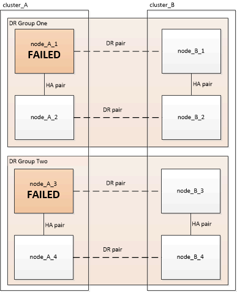
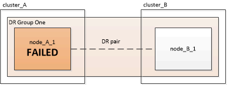

= 올바른 복구 절차 선택
:allow-uri-read: 
:icons: font
:imagesdir: ../media/

[role="lead"]
MetroCluster 구성에서 장애가 발생한 후에는 올바른 복구 절차를 선택해야 합니다. 다음 표와 예제를 사용하여 적절한 복구 절차를 선택하십시오.

이 표의 이 정보는 설치 또는 전환이 완료된 것으로 가정합니다. 즉, 가 표시됩니다 `metrocluster configure` 명령이 성공적으로 실행되었습니다.

|===

| 재해 사이트에서 장애가 발생한 범위 | 절차를 참조하십시오 

 a| 
* 컨트롤러 모듈 오류가 없습니다
* 다른 하드웨어에 장애가 발생했습니다

 a| 
link:task_recover_from_a_non_controller_failure_mcc_dr.html["컨트롤러 이외의 장애 복구"]

 a| 
* 컨트롤러 모듈 내의 단일 컨트롤러 모듈 장애 또는 FRU 구성 요소 장애
* 드라이브에 오류가 발생하지 않았습니다

 a| 
오류가 단일 컨트롤러 모듈로 제한되는 경우, 플랫폼 모델의 컨트롤러 모듈 FRU 교체 절차를 사용해야 합니다. 4노드 또는 8노드 MetroCluster 구성에서는 이러한 장애가 로컬 HA 쌍으로 격리됩니다.

* 참고: * 드라이브 또는 기타 하드웨어 장애가 없는 경우 컨트롤러 모듈 FRU 교체 절차를 2노드 MetroCluster 구성에서 사용할 수 있습니다.

https://["AFF and FAS 문서 센터 를 참조하십시오"]

 a| 
* 컨트롤러 모듈 내의 단일 컨트롤러 모듈 장애 또는 FRU 구성 요소 장애
* 드라이브에 오류가 발생했습니다

 a| 
link:task_recover_from_a_multi_controller_and_or_storage_failure.html["멀티 컨트롤러 또는 스토리지 장애로부터 복구"]

 a| 
* 컨트롤러 모듈 내의 단일 컨트롤러 모듈 장애 또는 FRU 구성 요소 장애
* 드라이브에 오류가 발생하지 않았습니다
* 컨트롤러 모듈 외부의 추가 하드웨어에 장애가 발생했습니다

 a| 
link:task_recover_from_a_multi_controller_and_or_storage_failure.html["멀티 컨트롤러 또는 스토리지 장애로부터 복구"]

드라이브 할당에 대한 모든 단계를 건너뛰어야 합니다.

 a| 
* DR 그룹 내에서 여러 컨트롤러 모듈 장애(추가 장애 포함 또는 없음)가 발생합니다

 a| 
link:task_recover_from_a_multi_controller_and_or_storage_failure.html["멀티 컨트롤러 또는 스토리지 장애로부터 복구"]

|===

== MetroCluster 설치 중 컨트롤러 모듈 장애 시나리오

MetroCluster 구성 절차 중 컨트롤러 모듈 오류에 대응하는 방법은 에 따라 다릅니다 `metrocluster configure` 명령이 완료되었습니다.

* 를 누릅니다 `metrocluster configure` 명령이 아직 실행되지 않았거나 실패했습니다. 교체 컨트롤러 모듈을 사용하여 처음부터 MetroCluster 소프트웨어 구성 절차를 다시 시작해야 합니다.
+

NOTE: 의 단계를 수행해야 합니다 link:https://docs.netapp.com/us-en/ontap-metrocluster/install-ip/task_sw_config_restore_defaults.html["컨트롤러 모듈에서 시스템 기본값을 복원합니다"] 각 컨트롤러(교체 컨트롤러 포함)에서 이전 구성이 제거되었는지 확인합니다.

* 를 누릅니다 `metrocluster configure` 명령이 성공적으로 완료된 후 컨트롤러 모듈이 실패했습니다. 이전 표를 사용하여 올바른 복구 절차를 확인하십시오.

== MetroCluster FC-to-IP 전환 중 컨트롤러 모듈 장애 시나리오

복구 절차는 전환 중에 사이트 장애가 발생할 경우 사용할 수 있습니다. 그러나 구성이 안정적인 혼합 구성인 경우에만 사용할 수 있으며 FC DR 그룹 및 IP DR 그룹이 모두 완전히 구성되어 있습니다. 'MetroCluster node show' 명령의 출력은 8개 노드를 모두 포함하는 두 DR 그룹을 모두 표시해야 합니다.

IMPORTANT: 노드를 추가하거나 제거하는 중에 전환 중에 장애가 발생한 경우 기술 지원 팀에 문의해야 합니다.

== 8노드 MetroCluster 구성의 컨트롤러 모듈 장애 시나리오

실패 시나리오:

* <<단일 DR 그룹에서 단일 컨트롤러 모듈 장애 발생>>
* <<단일 DR 그룹에서 2개의 컨트롤러 모듈 장애 발생>>
* <<별도의 DR 그룹에서 단일 컨트롤러 모듈 장애 발생>>
* <<3개의 컨트롤러 모듈 장애가 DR 그룹 전체에 분산됩니다>>

=== 단일 DR 그룹에서 단일 컨트롤러 모듈 장애 발생

이 경우 장애는 HA 쌍으로 제한됩니다.

* 교체가 필요한 스토리지가 없는 경우 플랫폼 모델의 컨트롤러 모듈 FRU 교체 절차를 사용할 수 있습니다.
+
https://["AFF and FAS 문서 센터 를 참조하십시오"^]

* 스토리지를 교체해야 하는 경우 멀티 컨트롤러 모듈 복구 절차를 사용할 수 있습니다.
+
link:task_recover_from_a_multi_controller_and_or_storage_failure.html["멀티 컨트롤러 또는 스토리지 장애로부터 복구"]

+
이 시나리오는 4노드 MetroCluster 구성에도 적용됩니다.

+
image::../media/mcc_dr_groups_8_node_with_a_single_controller_failure.gif[단일 컨트롤러 장애가 있는 MCC DR 그룹 8개 노드]

=== 단일 DR 그룹에서 2개의 컨트롤러 모듈 장애 발생

이 경우 장애가 발생하면 전환이 필요합니다. 멀티 컨트롤러 모듈 장애 복구 절차를 사용할 수 있습니다.

link:task_recover_from_a_multi_controller_and_or_storage_failure.html["멀티 컨트롤러 또는 스토리지 장애로부터 복구"]

이 시나리오는 4노드 MetroCluster 구성에도 적용됩니다.

image::../media/mcc_dr_groups_8_node_with_a_multi_controller_failure.gif[MCC DR 그룹 다중 컨트롤러 오류가 있는 8개 노드입니다]

=== 별도의 DR 그룹에서 단일 컨트롤러 모듈 장애 발생

이 경우 장애는 별도의 HA 쌍으로 제한됩니다.

* 교체가 필요한 스토리지가 없는 경우 플랫폼 모델의 컨트롤러 모듈 FRU 교체 절차를 사용할 수 있습니다.
+
FRU 교체 절차는 오류가 발생한 각 컨트롤러 모듈에 대해 한 번씩 두 번 수행됩니다.

+
https://["AFF and FAS 문서 센터 를 참조하십시오"^]

* 스토리지를 교체해야 하는 경우 멀티 컨트롤러 모듈 복구 절차를 사용할 수 있습니다.
+
link:task_recover_from_a_multi_controller_and_or_storage_failure.html["멀티 컨트롤러 또는 스토리지 장애로부터 복구"]

=== 3개의 컨트롤러 모듈 장애가 DR 그룹 전체에 분산됩니다

이 경우 장애가 발생하면 전환이 필요합니다. DR 그룹 1에 대해 다중 컨트롤러 모듈 장애 복구 절차를 사용할 수 있습니다.

link:task_recover_from_a_multi_controller_and_or_storage_failure.html["멀티 컨트롤러 또는 스토리지 장애로부터 복구"]

DR 그룹 2에 대해 플랫폼별 컨트롤러 모듈 FRU 교체 절차를 사용할 수 있습니다.

https://["AFF and FAS 문서 센터 를 참조하십시오"^]

image::../media/mcc_dr_groups_8_node_with_a_3_controller_failure.gif[MCC DR 그룹 3개 컨트롤러 장애가 있는 8개 노드]

== 2노드 MetroCluster 구성의 컨트롤러 모듈 장애 시나리오

사용하는 절차는 장애 정도에 따라 다릅니다.

* 교체가 필요한 스토리지가 없는 경우 플랫폼 모델의 컨트롤러 모듈 FRU 교체 절차를 사용할 수 있습니다.
+
https://["AFF and FAS 문서 센터 를 참조하십시오"^]

* 스토리지를 교체해야 하는 경우 멀티 컨트롤러 모듈 복구 절차를 사용할 수 있습니다.
+
link:task_recover_from_a_multi_controller_and_or_storage_failure.html["멀티 컨트롤러 또는 스토리지 장애로부터 복구"]

