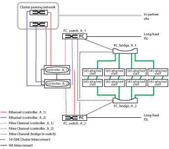
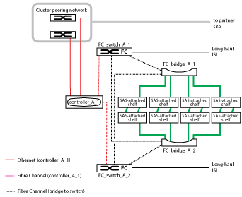

= Fabric MetroCluster 구성의 일부
:allow-uri-read: 
:icons: font
:imagesdir: ../media/

[role="lead"]
MetroCluster 구성을 계획할 때 하드웨어 구성 요소 및 상호 연결 방법을 이해해야 합니다.

== DR(재해 복구) 그룹

Fabric MetroCluster 구성은 MetroCluster 구성의 노드 수에 따라 1개 또는 2개의 DR 그룹으로 구성됩니다. 각 DR 그룹은 4개의 노드로 구성됩니다.

* 8노드 MetroCluster 구성은 2개의 DR 그룹으로 구성됩니다.
* 4노드 MetroCluster 구성은 DR 그룹 1개로 구성됩니다.

다음 그림에서는 8노드 MetroCluster 구성의 노드 구성을 보여 줍니다.

image::../media/mcc_dr_groups_8_node.gif[MCC DR 그룹 8개 노드]

다음 그림에서는 4노드 MetroCluster 구성의 노드 구성을 보여 줍니다.

image::../media/mcc_dr_groups_4_node.gif[MCC DR 그룹 4개 노드]

== 주요 하드웨어 요소

MetroCluster 구성에는 다음과 같은 주요 하드웨어 요소가 포함됩니다.

* 스토리지 컨트롤러
+
스토리지 컨트롤러는 스토리지에 직접 연결되지 않고 2개의 중복 FC 스위치 패브릭에 연결됩니다.

* FC-to-SAS 브릿지
+
FC-to-SAS 브릿지는 SAS 스토리지 스택을 FC 스위치에 연결하여 두 프로토콜을 연결합니다.

* FC 스위치
+
FC 스위치는 두 사이트 간에 장거리 백본 ISL을 제공합니다. FC 스위치는 원격 스토리지 풀에 데이터를 미러링할 수 있는 두 개의 스토리지 패브릭을 제공합니다.

* 클러스터 피어링 네트워크
+
클러스터 피어링 네트워크는 클러스터 구성의 미러링을 위한 연결성을 제공하며, 여기에는 SVM(스토리지 가상 머신) 구성이 포함됩니다. 하나의 클러스터에 있는 모든 SVM의 구성이 파트너 클러스터에 미러링됩니다.

== 8노드 패브릭 MetroCluster 구성

8노드 구성은 지리적으로 분산된 사이트에 각각 하나씩, 2개의 클러스터로 구성됩니다. Cluster_A는 첫 번째 MetroCluster 사이트에 있습니다. Cluster_B는 두 번째 MetroCluster 사이트에 있습니다. 각 사이트에는 1개의 SAS 스토리지 스택이 있습니다. 추가 스토리지 스택은 지원되지만 각 사이트에는 하나만 표시됩니다. HA 쌍이 클러스터 인터커넥트 스위치 없이 스위치가 없는 클러스터로 구성됩니다. 스위치 구성은 지원되지만 표시되지 않습니다.

8노드 구성에는 다음과 같은 연결이 포함됩니다.

* 각 컨트롤러의 HBA 및 FC-VI 어댑터에서 각 FC 스위치로의 FC 연결
* 각 FC-to-SAS 브리지에서 FC 스위치로의 FC 연결
* 각 SAS 쉘프와 각 스택의 상단 및 하단부터 FC-to-SAS 브리지 사이의 SAS 연결
* 로컬 HA 쌍의 각 컨트롤러 간 HA 인터커넥트
+
컨트롤러가 단일 섀시 HA 쌍을 지원하는 경우 HA 인터커넥트는 백플레인을 통해 발생하는 내부 구성요소로, 외부 인터커넥트가 필요하지 않습니다.

* 클러스터 피어링에 사용되는 컨트롤러에서 고객이 제공한 네트워크로 이더넷 연결
+
SVM 구성은 클러스터 피어링 네트워크를 통해 복제

* 로컬 클러스터의 각 컨트롤러 간 클러스터 인터커넥트

== 4노드 패브릭 MetroCluster 구성

다음 그림에서는 4노드 Fabric MetroCluster 구성의 단순한 뷰를 보여 줍니다. 일부 연결의 경우, 단일 선은 구성 요소 간의 여러 중복 연결을 나타냅니다. 데이터 및 관리 네트워크 연결이 표시되지 않습니다.

image::../media/mcc_hardware_architecture_both_clusters.gif[MCC 하드웨어 아키텍처 두 클러스터 모두]

다음 그림에서는 단일 MetroCluster 클러스터(두 클러스터 모두 동일한 구성)의 접속 구성을 보다 자세히 보여 줍니다.

== 2노드 패브릭 MetroCluster 구성

다음 그림에서는 2노드 Fabric MetroCluster 구성의 단순한 뷰를 보여 줍니다. 일부 연결의 경우, 단일 선은 구성 요소 간의 여러 중복 연결을 나타냅니다. 데이터 및 관리 네트워크 연결이 표시되지 않습니다.

image::../media/mcc_hardware_architecture_both_clusters_2_node_fabric.gif[MCC 하드웨어 아키텍처 두 클러스터 모두 2노드 Fabric입니다]

2노드 구성은 지리적으로 분산된 사이트에 각각 하나씩, 2개의 클러스터로 구성됩니다. Cluster_A는 첫 번째 MetroCluster 사이트에 있습니다. Cluster_B는 두 번째 MetroCluster 사이트에 있습니다. 각 사이트에는 1개의 SAS 스토리지 스택이 있습니다. 추가 스토리지 스택은 지원되지만 각 사이트에는 하나만 표시됩니다.

NOTE: 2노드 구성에서는 노드가 HA 쌍으로 구성되지 않습니다.

다음 그림에서는 단일 MetroCluster 클러스터(두 클러스터 모두 동일한 구성)의 접속 구성을 보다 자세히 보여 줍니다.

2노드 구성에는 다음과 같은 연결이 포함됩니다.

* 각 컨트롤러 모듈의 FC-VI 어댑터 간 FC 연결
* 각 컨트롤러 모듈의 HBA에서 각 SAS 쉘프 스택의 FC-to-SAS 브리지로 FC 연결
* 각 SAS 쉘프와 각 스택의 상단 및 하단부터 FC-to-SAS 브리지 사이의 SAS 연결
* 클러스터 피어링에 사용되는 컨트롤러에서 고객이 제공한 네트워크로 이더넷 연결
+
SVM 구성은 클러스터 피어링 네트워크를 통해 복제

