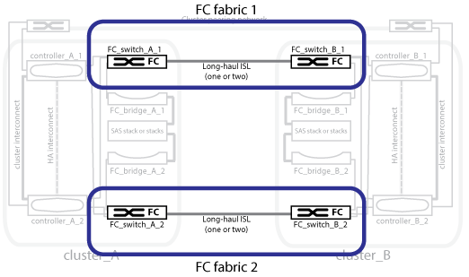

= 이중 FC 스위치 패브릭
:allow-uri-read: 
:icons: font
:imagesdir: ../media/

[role="lead"]
각 스위치 패브릭은 사이트를 연결하는 ISL(Inter-Switch Link)을 포함합니다. 데이터는 ISL을 통해 사이트 간에 복제됩니다. 이중화를 위해 각 스위치 패브릭은 서로 다른 물리적 경로에 있어야 합니다.

link:concept_illustration_of_the_local_ha_pairs_in_a_mcc_configuration.html["MetroCluster 구성의 로컬 HA 쌍 그림"]

link:concept_illustration_of_redundant_fc_to_sas_bridges.html["이중 FC-to-SAS 브리지의 그림"]

link:concept_cluster_peering_network_mcc.html["클러스터 피어링 네트워크의 그림"]
