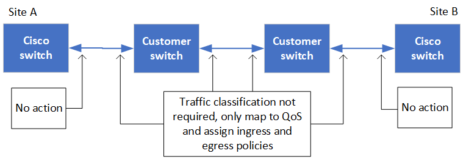

= 공유 계층 2 또는 계층 3 네트워크에서 MetroCluster를 배포할 때 고려해야 할 사항
:allow-uri-read: 

[role="lead"]
요구 사항에 따라 공유 계층 2 또는 계층 3 네트워크를 사용하여 MetroCluster를 배포할 수 있습니다.

ONTAP 9.6부터 지원되는 Cisco 스위치가 있는 MetroCluster IP 구성은 전용 MetroCluster ISL을 사용하는 대신 ISL(Inter-Switch Link)에 대해 기존 네트워크를 공유할 수 있습니다. 이 토폴로지는 _shared layer 2 networks_라고 합니다.

ONTAP 9.9.1부터 MetroCluster IP 구성은 IP 라우팅(계층 3) 백엔드 연결로 구현할 수 있습니다. 이 토폴로지는 _shared layer 3 networks_라고 합니다.

[NOTE]
====
* 네트워크 용량이 충분하고 ISL 크기가 구성에 적합한지 확인해야 합니다. MetroCluster 사이트 간 데이터 복제에는 짧은 지연 시간이 매우 중요합니다. 이러한 연결에서 지연 문제가 클라이언트 입출력에 영향을 줄 수 있습니다
* MetroCluster 백엔드 스위치에 대한 모든 참조는 NetApp 검증 스위치 또는 MetroCluster 규정을 준수하는 스위치를 지칭합니다. 을 참조하십시오 link:mcc-compliant-netapp-validated-switches.html["NetApp의 검증된 MetroCluster 호환 스위치"] 를 참조하십시오.

====

== 계층 2 및 계층 3 네트워크의 ISL 요구 사항

다음은 계층 2 및 계층 3 네트워크에 적용됩니다.

* MetroCluster 스위치와 중간 네트워크 스위치 간의 ISL의 속도와 수는 일치할 필요가 없습니다. 마찬가지로 중간 네트워크 스위치 간의 속도는 일치할 필요가 없습니다.
+
예를 들어, MetroCluster 스위치는 하나의 40Gbps ISL을 사용하여 중간 스위치에 연결할 수 있고, 중간 스위치는 두 개의 100Gbps ISL을 사용하여 서로 연결할 수 있습니다.

* 사용, 오류(삭제, 링크 플랩, 손상 등)를 모니터링하려면 중간 네트워크에서 네트워크 모니터링을 구성해야 합니다. 있습니다.
* MetroCluster 종단 간 트래픽을 전달하는 모든 포트에서 MTU 크기를 9216으로 설정해야 합니다.
* 다른 트래픽은 서비스 클래스(COS) 5보다 높은 우선 순위로 구성할 수 없습니다.
* 종단 간 MetroCluster 트래픽을 전달하는 모든 경로에 대해 명시적 정체 알림(ECN)을 구성해야 합니다.
* MetroCluster 트래픽을 전달하는 ISL은 스위치 간의 네이티브 링크여야 합니다.
+
MPLS(Multiprotocol Label Switching) 링크와 같은 링크 공유 서비스는 지원되지 않습니다.

* 레이어 2 VLAN은 기본적으로 사이트를 포괄해야 합니다. VXLAN(Virtual Extensible LAN)과 같은 VLAN 오버레이는 지원되지 않습니다.
* 중간 스위치의 수는 제한되지 않습니다. 하지만 스위치 수를 필요한 최소 수준으로 유지하는 것이 좋습니다 NetApp.
* MetroCluster 스위치의 ISL은 다음과 같이 구성됩니다.
+
** LACP 포트 채널의 일부로 포트 모드 '트렁크'를 전환합니다
** MTU 크기는 9216입니다
** 네이티브 VLAN이 구성되지 않았습니다
** 사이트 간 MetroCluster 트래픽을 전달하는 VLAN만 허용됩니다
** 스위치 기본 VLAN은 허용되지 않습니다

== 계층 2 네트워크에 대한 고려 사항

MetroCluster 백엔드 스위치가 고객 네트워크에 연결됩니다.

image::../media/MCC_layer2.png[MCC 레이어2]

고객이 제공한 중간 스위치는 다음 요구 사항을 충족해야 합니다.

* 중간 네트워크는 사이트 간에 동일한 VLAN을 제공해야 합니다. RCF 파일에 설정된 MetroCluster VLAN과 일치해야 합니다.
* RcfFileGenerator는 플랫폼에서 지원하지 않는 VLAN을 사용하여 RCF 파일을 생성할 수 없습니다.
* RcfFileGenerator는 특정 VLAN ID가 나중에 사용하도록 의도된 경우 사용을 제한할 수 있습니다. 일반적으로 예약된 VLAN은 최대 100개까지 가능합니다.
* MetroCluster VLAN ID와 일치하는 ID가 있는 계층 2 VLAN은 공유 네트워크를 포괄해야 합니다.

.ONTAP의 VLAN 구성
인터페이스 생성 중에만 VLAN을 지정할 수 있습니다. MetroCluster 인터페이스를 생성한 후에는 VLAN ID를 변경할 수 없습니다. 인터페이스 생성 중에 다른 VLAN을 구성할 수 있지만 VLAN은 10 ~ 20 범위 내에 있거나 101 ~ 4096 범위 내에 있어야 합니다(또는 스위치 공급업체에서 지원하는 수 중 더 작은 수).

NOTE: 일부 스위치 공급업체는 특정 VLAN 사용을 예약할 수 있습니다.

다음 시스템은 ONTAP 내에서 VLAN 구성이 필요하지 않습니다. VLAN은 스위치 포트 구성에 의해 지정됩니다.

* FAS8200 및 AFF A300
* AFF A320
* FAS9000 및 AFF A700
* AFF A800, ASA A800, AFF C800 및 ASA C800입니다
+

NOTE: 위에 나열된 시스템은 VLAN 100 이하를 사용하여 구성할 수 있습니다. 그러나 이 범위의 일부 VLAN은 다른 용도로 예약되거나 나중에 사용하도록 예약될 수 있습니다.

다른 모든 시스템의 경우 ONTAP에서 MetroCluster 인터페이스를 생성할 때 VLAN을 구성해야 합니다. 다음과 같은 제한 사항이 적용됩니다.

* 기본 VLAN은 10과 20입니다
* ONTAP 9.7 이하를 실행하는 경우 기본 VLAN 10 및 20만 사용할 수 있습니다.
* ONTAP 9.8 이상을 실행하는 경우 기본 VLAN 10 및 20을 사용할 수 있으며 100(101 이상)을 초과하는 VLAN도 사용할 수 있습니다.

== 계층 3 네트워크에 대한 고려 사항

MetroCluster 백엔드 스위치는 라우팅된 IP 네트워크에 직접 연결됩니다(다음 간단한 예에 표시된 것처럼). 또는 다른 개입 스위치를 통해 연결됩니다.

image::../media/mcc_layer3_backend.png[MCC layer3 백엔드]

MetroCluster 환경은 에 설명된 대로 표준 MetroCluster IP 구성으로 구성되고 케이블로 연결됩니다 link:https://docs.netapp.com/us-en/ontap-metrocluster/install-ip/concept_parts_of_an_ip_mcc_configuration_mcc_ip.html["MetroCluster 하드웨어 구성 요소를 구성합니다"]. 설치 및 케이블 연결 절차를 수행할 때 계층 3 구성에 해당하는 단계를 수행해야 합니다. 다음은 계층 3 구성에 적용됩니다.

* MetroCluster 스위치를 라우터에 직접 연결하거나 하나 이상의 중간 스위치에 연결할 수 있습니다.
* MetroCluster IP 인터페이스를 라우터 또는 중간 스위치 중 하나에 직접 연결할 수 있습니다.
* VLAN은 게이트웨이 장치로 확장되어야 합니다.
* 를 사용합니다 `-gateway parameter` IP 게이트웨이 주소를 사용하여 MetroCluster IP 인터페이스 주소를 구성합니다.
* MetroCluster VLAN의 VLAN ID는 각 사이트에서 동일해야 합니다. 그러나 서브넷은 다를 수 있습니다.
* MetroCluster 트래픽에는 동적 라우팅이 지원되지 않습니다.
* 다음 기능은 지원되지 않습니다.
+
** 8노드 MetroCluster 구성
** 4노드 MetroCluster 구성 업데이트
** MetroCluster FC에서 MetroCluster IP로 전환합니다

* 각 MetroCluster 사이트에는 각 네트워크에 하나씩 두 개의 서브넷이 필요합니다.
* 자동 IP 할당이 지원되지 않습니다.

라우터 및 게이트웨이 IP 주소를 구성할 때는 다음 요구 사항을 충족해야 합니다.

* 한 노드의 두 인터페이스에 같은 게이트웨이 IP 주소를 지정할 수 없습니다.
* 각 사이트의 HA 쌍에 대한 해당 인터페이스의 게이트웨이 IP 주소가 동일해야 합니다.
* 노드의 해당 인터페이스 및 DR 및 AUX 파트너는 동일한 게이트웨이 IP 주소를 가질 수 없습니다.
* 노드 및 해당 DR 및 AUX 파트너의 해당 인터페이스는 동일한 VLAN ID를 가져야 합니다.

== 중간 스위치에 필요한 설정입니다

MetroCluster 트래픽이 중간 네트워크에서 ISL을 통과하는 경우 중간 스위치의 구성을 통해 MetroCluster 트래픽(RDMA 및 스토리지)이 MetroCluster 사이트 간 전체 경로에서 필요한 서비스 수준을 충족하는지 확인해야 합니다.

다음 다이어그램은 NetApp 검증 Cisco 스위치를 사용할 때 필요한 설정을 간략하게 보여 줍니다.

다음 다이어그램은 외부 스위치가 Broadcom IP 스위치일 때 공유 네트워크에 필요한 설정을 간략하게 보여 줍니다.

image::../media/switch_traffic_with_broadcom_switches.png[Broadcom 스위치를 사용하여 트래픽을 전환합니다]

이 예에서는 MetroCluster 트래픽에 대해 다음 정책과 맵이 생성됩니다.

* 를 클릭합니다 `MetroClusterIP_ISL_Ingress` 정책은 MetroCluster IP 스위치에 접속하는 중간 스위치의 포트에 적용됩니다.
+
를 클릭합니다 `MetroClusterIP_ISL_Ingress` 정책은 들어오는 태그 트래픽을 중간 스위치의 적절한 큐에 매핑합니다.

* A `MetroClusterIP_ISL_Egress` 정책은 중간 스위치 간의 ISL에 연결하는 중간 스위치의 포트에 적용됩니다.
* MetroCluster IP 스위치 사이의 경로를 따라 일치하는 QoS 액세스 맵, 클래스 맵 및 정책 맵을 사용하여 중간 스위치를 구성해야 합니다. 중간 스위치는 RDMA 트래픽을 COS5에 매핑하고 스토리지 트래픽은 COS4에 매핑합니다.

다음 예는 Cisco Nexus 3232C 및 9336C-FX2 스위치용입니다. 스위치 공급업체 및 모델에 따라 중간 스위치의 구성이 적절한지 확인해야 합니다.

.중간 스위치 ISL 포트에 대한 클래스 맵을 구성합니다
다음 예제에서는 수신 시 트래픽을 분류해야 하는지 또는 일치시켜야 하는지에 따라 클래스 맵 정의를 보여 줍니다.

[role="tabbed-block"]
====
.수신 시 트래픽 분류:
--
[listing]
----
ip access-list rdma
  10 permit tcp any eq 10006 any
  20 permit tcp any any eq 10006
ip access-list storage
  10 permit tcp any eq 65200 any
  20 permit tcp any any eq 65200

class-map type qos match-all rdma
  match access-group name rdma
class-map type qos match-all storage
  match access-group name storage
----
--
.수신 시 트래픽 일치:
--
[listing]
----
class-map type qos match-any c5
  match cos 5
  match dscp 40
class-map type qos match-any c4
  match cos 4
  match dscp 32
----
--
====
.중간 스위치의 ISL 포트에 수신 정책 맵을 생성합니다.
다음 예에서는 수신 시 트래픽을 분류하거나 일치시켜야 하는지 여부에 따라 수신 정책 맵을 생성하는 방법을 보여 줍니다.

[role="tabbed-block"]
====
.수신 시 트래픽 분류:
--
[listing]
----
policy-map type qos MetroClusterIP_ISL_Ingress_Classify
  class rdma
    set dscp 40
    set cos 5
    set qos-group 5
  class storage
    set dscp 32
    set cos 4
    set qos-group 4
  class class-default
    set qos-group 0
----
--
.수신 시 트래픽 일치:
--
[listing]
----
policy-map type qos MetroClusterIP_ISL_Ingress_Match
  class c5
    set dscp 40
    set cos 5
    set qos-group 5
  class c4
    set dscp 32
    set cos 4
    set qos-group 4
  class class-default
    set qos-group 0
----
--
====
.ISL 포트에 대한 송신 큐 처리 정책을 구성합니다
다음 예에서는 송신 큐 처리 정책을 구성하는 방법을 보여 줍니다.

[listing]
----
policy-map type queuing MetroClusterIP_ISL_Egress
   class type queuing c-out-8q-q7
      priority level 1
   class type queuing c-out-8q-q6
      priority level 2
   class type queuing c-out-8q-q5
      priority level 3
      random-detect threshold burst-optimized ecn
   class type queuing c-out-8q-q4
      priority level 4
      random-detect threshold burst-optimized ecn
   class type queuing c-out-8q-q3
      priority level 5
   class type queuing c-out-8q-q2
      priority level 6
   class type queuing c-out-8q-q1
      priority level 7
   class type queuing c-out-8q-q-default
      bandwidth remaining percent 100
      random-detect threshold burst-optimized ecn
----
이러한 설정은 MetroCluster 트래픽을 전달하는 모든 스위치 및 ISL에 적용되어야 합니다.

이 예에서는 Q4 및 Q5가 로 구성되어 있습니다 `random-detect threshold burst-optimized ecn`. 구성에 따라 다음 예와 같이 최소 및 최대 임계값을 설정해야 할 수도 있습니다.

[listing]
----
class type queuing c-out-8q-q5
  priority level 3
  random-detect minimum-threshold 3000 kbytes maximum-threshold 4000 kbytes drop-probability 0 weight 0 ecn
class type queuing c-out-8q-q4
  priority level 4
  random-detect minimum-threshold 2000 kbytes maximum-threshold 3000 kbytes drop-probability 0 weight 0 ecn
----

NOTE: 최소값과 최대값은 스위치 및 요구 사항에 따라 다릅니다.

.예 1: Cisco
구성에 Cisco 스위치가 있는 경우 중간 스위치의 첫 번째 수신 포트를 분류할 필요가 없습니다. 그런 다음 다음과 같은 맵 및 정책을 구성합니다.

* `class-map type qos match-any c5`
* `class-map type qos match-any c4`
* `MetroClusterIP_ISL_Ingress_Match`

를 할당합니다 `MetroClusterIP_ISL_Ingress_Match` MetroCluster 트래픽을 전달하는 ISL 포트에 대한 정책 매핑입니다.

.예 2: Broadcom
구성에 Broadcom 스위치가 있는 경우 중간 스위치의 첫 번째 수신 포트를 분류해야 합니다. 그런 다음 다음과 같은 맵 및 정책을 구성합니다.

* `ip access-list rdma`
* `ip access-list storage`
* `class-map type qos match-all rdma`
* `class-map type qos match-all storage`
* `MetroClusterIP_ISL_Ingress_Classify`
* `MetroClusterIP_ISL_Ingress_Match`

사용자가 할당합니다 `the MetroClusterIP_ISL_Ingress_Classify` 정책 맵은 Broadcom 스위치를 연결하는 중간 스위치의 ISL 포트에 연결됩니다.

를 할당합니다 `MetroClusterIP_ISL_Ingress_Match` MetroCluster 트래픽을 전송하지만 Broadcom 스위치에 연결하지 않는 중간 스위치의 ISL 포트에 대한 정책 매핑
