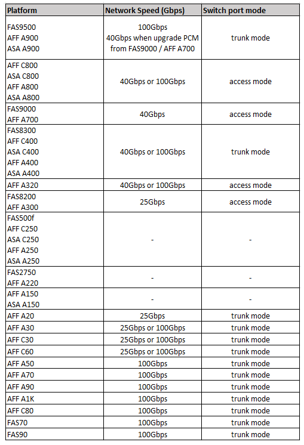

= MetroCluster 호환 스위치를 위한 플랫폼 특정 네트워크 속도 및 스위치 포트 모드
:allow-uri-read: 
:icons: font
:imagesdir: ../media/

[role="lead"]
MetroCluster 호환 스위치를 사용하는 경우 플랫폼별 네트워크 속도 및 스위치 포트 모드 요구 사항을 알고 있어야 합니다.

다음 표에는 MetroCluster 호환 스위치를 위한 플랫폼별 네트워크 속도 및 스위치 포트 모드가 나와 있습니다. 표에 따라 스위치 포트 모드를 구성해야 합니다.

NOTE: 값이 누락되면 플랫폼을 MetroCluster 호환 스위치와 함께 사용할 수 없음을 나타냅니다.

