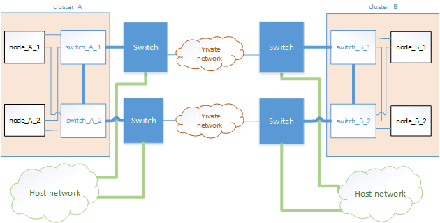

= 개인 계층 2 네트워크 공유를 위한 고려 사항
:allow-uri-read: 
:icons: font
:imagesdir: ../media/

[role="lead"]
ONTAP 9.6부터 지원되는 Cisco 스위치가 있는 MetroCluster IP 구성은 전용 MetroCluster ISL을 사용하는 대신 ISL을 위한 기존 네트워크를 공유할 수 있습니다. 이전 ONTAP 버전에는 전용 ISL이 필요합니다.

MetroCluster IP 스위치는 MetroCluster 구성 전용이며 공유할 수 없습니다. 따라서 MetroCluster IP 스위치 세트는 하나의 MetroCluster 구성만 연결할 수 있습니다. MetroCluster IP 스위치의 MetroCluster ISL 포트만 공유 스위치에 연결할 수 있습니다.

CAUTION: 공유 네트워크를 사용하는 경우 고객은 공유 네트워크의 MetroCluster 네트워크 요구 사항을 충족해야 합니다.

== ISL 요구 사항

다음 요구 사항을 충족해야 합니다.

* link:../install-ip/concept_considerations_isls.html#basic-metrocluster-isl-requirements["기본 MetroCluster ISL 요구 사항"]
* link:../install-ip/concept_considerations_isls.html#isl-requirements-in-shared-layer-2-networks["공유 계층 2 네트워크의 ISL 요구 사항"]

== 중간 스위치에 필요한 설정

공유 네트워크에서 ISL 트래픽을 공유할 때 고객이 제공하는 중간 스위치 구성은 MetroCluster 트래픽(RDMA 및 스토리지)이 MetroCluster 사이트 간 전체 경로에서 필요한 서비스 수준을 충족하는지 확인해야 합니다.

다음 예는 Cisco Nexus 3000 스위치 및 IP Broadcom 스위치에 대한 것입니다. 스위치 공급업체 및 모델에 따라 중간 스위치의 구성이 동일해야 합니다.

=== Cisco Nexus 스위치

다음 다이어그램은 외부 스위치가 Cisco 스위치일 때 공유 네트워크에 필요한 설정에 대한 개요를 제공합니다.

image::../media/switch_traffic_with_cisco_switches.png[Cisco 스위치를 사용하여 트래픽을 전환합니다]

이 예에서는 MetroCluster 트래픽에 대해 다음 정책과 맵이 생성됩니다.

* MetroCluster IP 스위치에 연결되는 중간 스위치의 포트에 MetroCluster_Ingress 정책이 적용됩니다.
+
MetroCluster_Ingress 정책은 수신 태그 지정된 트래픽을 중간 스위치의 적절한 대기열에 매핑합니다. 태깅은 ISL이 아닌 노드 포트에서 수행됩니다. ISL에서 동일한 포트를 사용하는 비 MetroCluster 트래픽은 기본 대기열에 유지됩니다.

* Intermediate 스위치 간의 ISL에 연결하는 Intermediate 스위치의 포트에 MetroCluster_Egress 정책이 적용됩니다

MetroCluster IP 스위치 사이의 경로를 따라 일치하는 QoS 액세스 맵, 클래스 맵 및 정책 맵을 사용하여 중간 스위치를 구성해야 합니다. 중간 스위치는 RDMA 트래픽을 COS5에 매핑하고 스토리지 트래픽은 COS4에 매핑합니다.

다음 예에서는 고객이 제공한 Cisco Nexus 3000 스위치에 대한 구성을 보여 줍니다. Cisco 스위치가 있는 경우 이 예제를 사용하여 쉽게 경로를 따라 스위치를 구성할 수 있습니다. Cisco 스위치가 없는 경우 중간 스위치에 해당하는 구성을 결정하고 적용해야 합니다.

다음 예제에서는 클래스 맵 정의를 보여 줍니다.

NOTE: 이 예는 Cisco MetroCluster IP 스위치를 사용하는 구성에 대한 것입니다. MetroCluster IP 스위치에 연결되지 않는 MetroCluster 트래픽을 전송하는 스위치의 스위치 유형에 관계없이 이 예제를 따를 수 있습니다.

[listing]
----
class-map type qos match-all rdma
   match cos 5
class-map type qos match-all storage
   match cos 4
----
다음 예제에서는 정책 맵 정의를 보여 줍니다.

[listing]
----
policy-map type qos MetroClusterIP_Ingress
   class rdma
      set dscp 40
      set cos 5
      set qos-group 5
   class storage
      set dscp 32
      set cos 4
      set qos-group 4
policy-map type queuing MetroClusterIP_Egress
   class type queuing c-out-8q-q7
      priority level 1
   class type queuing c-out-8q-q6
      priority level 2
   class type queuing c-out-8q-q5
      priority level 3
      random-detect threshold burst-optimized ecn
   class type queuing c-out-8q-q4
      priority level 4
      random-detect threshold burst-optimized ecn
   class type queuing c-out-8q-q3
      priority level 5
   class type queuing c-out-8q-q2
      priority level 6
   class type queuing c-out-8q-q1
      priority level 7
   class type queuing c-out-8q-q-default
      bandwidth remaining percent 100
      random-detect threshold burst-optimized ecn
----

=== MetroCluster IP Broadcom 스위치

다음 다이어그램은 외부 스위치가 IP Broadcom 스위치일 때 공유 네트워크에 필요한 설정에 대한 개요를 제공합니다.

image::../media/switch_traffic_with_broadcom_switches.png[Broadcom 스위치를 사용하여 트래픽을 전환합니다]

MetroCluster IP Broadcom 스위치를 사용하는 구성에는 추가 구성이 필요합니다.

* 외부 스위치의 경우 액세스 및 클래스 맵을 구성하여 고객 네트워크에 침투하는 트래픽을 분류해야 합니다.
+

NOTE: MetroCluster IP 스위치를 사용하는 구성에는 이 작업이 필요하지 않습니다.

+
다음 예에서는 첫 번째 및 마지막 고객 스위치에서 MetroCluster IP Broadcom 스위치 간의 ISL을 연결하는 액세스 및 클래스 맵을 구성하는 방법을 보여 줍니다.

[listing]
----
ip access-list storage
  10 permit tcp any eq 65200 any
  20 permit tcp any any eq 65200
ip access-list rdma
  10 permit tcp any eq 10006 any
  20 permit tcp any any eq 10006

class-map type qos match-all storage
  match access-group name storage
class-map type qos match-all rdma
  match access-group name rdma
----
* 첫 번째 고객 스위치의 ISL 스위치 포트에 수신 정책을 할당해야 합니다.
+
다음 예제에서는 클래스 맵 정의를 보여 줍니다.

+

NOTE: 이 예는 Cisco MetroCluster IP 스위치를 사용하는 구성에 대한 것입니다. MetroCluster IP 스위치에 연결되지 않는 MetroCluster 트래픽을 전송하는 스위치의 스위치 유형에 관계없이 이 예제를 따를 수 있습니다.

+
[listing]
----
class-map type qos match-all rdma
   match cos 5
class-map type qos match-all storage
   match cos 4
----
+
다음 예제에서는 정책 맵 정의를 보여 줍니다.

+
[listing]
----
policy-map type qos MetroClusterIP_Ingress
   class rdma
      set dscp 40
      set cos 5
      set qos-group 5
   class storage
      set dscp 32
      set cos 4
      set qos-group 4
policy-map type queuing MetroClusterIP_Egress
   class type queuing c-out-8q-q7
      priority level 1
   class type queuing c-out-8q-q6
      priority level 2
   class type queuing c-out-8q-q5
      priority level 3
      random-detect threshold burst-optimized ecn
   class type queuing c-out-8q-q4
      priority level 4
      random-detect threshold burst-optimized ecn
   class type queuing c-out-8q-q3
      priority level 5
   class type queuing c-out-8q-q2
      priority level 6
   class type queuing c-out-8q-q1
      priority level 7
   class type queuing c-out-8q-q-default
      bandwidth remaining percent 100
      random-detect threshold burst-optimized ecn
----

=== 중간 고객 스위치

* 중간 고객 스위치의 경우 ISL 스위치 포트에 송신 정책을 할당해야 합니다.
* MetroCluster 트래픽을 전달하는 경로를 따라 있는 다른 모든 내부 스위치의 경우 _Cisco Nexus 3000 스위치_ 섹션에 있는 클래스 맵 및 정책 맵 예제를 따르십시오.

== MetroCluster 네트워크 토폴로지의 예

ONTAP 9.6부터는 일부 공유 ISL 네트워크 구성이 MetroCluster IP 구성에서 지원됩니다.

=== 직접 링크가 있는 공유 네트워크 구성

이 토폴로지에서는 두 개의 개별 사이트가 직접 링크로 연결됩니다. 이러한 링크는 파장 분할 멀티플렉싱 장비(xWDM) 또는 스위치 사이에 있을 수 있습니다. ISL의 용량은 MetroCluster 트래픽 전용이 아니라 다른 트래픽과 공유됩니다.

ISL 용량은 최소 요구 사항을 충족해야 합니다. xWDM 장치 또는 스위치 사용 여부에 따라 다른 네트워크 구성 조합이 적용될 수 있습니다.

image::../media/mcc_ip_networking_with_shared_isls.gif[공유 ISL을 통한 MCC IP 네트워킹]

=== 중간 네트워크가 있는 공유 인프라

이 토폴로지에서는 MetroCluster IP 코어 스위치 트래픽과 호스트 트래픽이 NetApp에서 제공하지 않는 네트워크를 통해 전달됩니다. 네트워크 인프라 및 링크(임대 직접 링크 포함)는 MetroCluster 구성 외부에 있습니다. 네트워크는 일련의 xWDM 및 스위치로 구성될 수 있지만 직접 ISL을 사용하는 공유 구성과 달리 사이트 간에 직접 연결되는 링크는 아닙니다. 사이트 간의 인프라에 따라 네트워크 구성을 원하는 대로 조합할 수 있습니다. 중간 인프라는 "클라우드"로 표현되지만(사이트 간에 여러 장치가 존재할 수 있음), 여전히 고객의 통제 하에 있습니다. 이 중간 인프라를 통한 용량은 MetroCluster 트래픽 전용이 아니라 다른 트래픽과 공유됩니다.

VLAN 및 네트워크 xWDM 또는 스위치 구성은 최소 요구 사항을 충족해야 합니다.

=== 중간 네트워크를 공유하는 두 개의 MetroCluster 구성

이 토폴로지에서는 두 개의 별도 MetroCluster 구성이 동일한 중간 네트워크를 공유합니다. 이 예에서 MetroCluster ONE SWITCH_A_1과 MetroCluster Two SWITCH_A_1은 모두 동일한 중간 스위치에 연결됩니다.

이 예제는 이해를 돕기 위한 목적으로만 제공됩니다.

image::../media/mcc_ip_two_mccs_sharing_the_same_shared_network_sx.gif[MCC IP 동일한 공유 네트워크 SX를 공유하는 두 개의 MCC]

=== 중간 네트워크에 직접 연결되는 MetroCluster 구성 2개

이 토폴로지는 ONTAP 9.7부터 지원됩니다. 두 개의 별도 MetroCluster 구성은 동일한 중간 네트워크를 공유하며 한 개의 MetroCluster 구성 노드는 중간 스위치에 직접 연결됩니다.

MetroCluster One은 NetApp의 검증된 스위치, ONTAP 9.6 및 공유 토폴로지를 사용하는 MetroCluster 구성입니다. MetroCluster 2는 NetApp 준수 스위치와 ONTAP 9.7을 사용하는 MetroCluster 구성입니다.

NOTE: 중간 스위치는 NetApp 사양을 준수해야 합니다.

이 예제는 이해를 돕기 위한 목적으로만 제공됩니다.

image::../media/mcc_ip_unsupported_two_mccs_direct_to_shared_switches.png[MCC IP 지원되지 않는 두 개의 MCC가 공유 스위치에 직접 연결됩니다]
