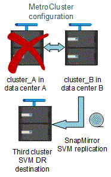

= MetroCluster 구성에서 ONTAP를 사용할 때의 고려 사항
:allow-uri-read: 
:icons: font
:imagesdir: ../media/

[role="lead"]
MetroCluster 구성에서 ONTAP를 사용할 때는 라이센스 등록, MetroCluster 구성 외부의 클러스터 피어링, 볼륨 작업 수행, NVFAIL 작업 및 기타 ONTAP 작업과 관련된 특정 고려 사항을 숙지해야 합니다.

ONTAP 기능은 전환 시 파트너의 데이터를 원활하게 지원하는 클러스터의 기능에 의존하므로, 네트워킹을 포함한 두 클러스터의 MetroCluster 구성은 동일해야 합니다.

== 라이센스 고려 사항

* 두 사이트 모두 동일한 사이트 라이센스 기능에 대해 라이센스를 받아야 합니다.
* 모든 노드는 동일한 노드 잠김 기능에 대해 라이센스가 부여되어야 합니다.

== SnapMirror 고려사항

* SnapMirror SVM 재해 복구는 ONTAP 9.5 이상의 버전을 실행 중인 MetroCluster 구성에서만 지원됩니다.

== ONTAP 시스템 관리자의 MetroCluster 작업

ONTAP 버전에 따라 ONTAP System Manager를 사용하여 일부 MetroCluster 관련 작업을 수행할 수 있습니다.

자세한 내용은 를 참조하십시오 link:https://docs.netapp.com/us-en/ontap/concept_metrocluster_manage_nodes.html["System Manager로 MetroCluster 사이트를 관리합니다"^] 문서화:

== MetroCluster 구성에서 FlexCache 지원

ONTAP 9.7부터 MetroCluster 볼륨은 FlexCache 구성에서 지원됩니다. 스위치오버 또는 스위치백 작업 후 수동 재시행을 위한 요구 사항을 숙지해야 합니다.

=== FlexCache 오리진 및 캐시가 동일한 MetroCluster 사이트 내에 있을 때 스위치오버 후 SVM이 자동으로 수행됩니다

협상된 또는 계획되지 않은 전환 후 클러스터 내의 모든 SVM FlexCache 피어링 관계를 수동으로 구성해야 합니다.

예를 들어 SVM VS1(캐시)과 VS2(원본)는 site_A에 있습니다 이러한 SVM을 자세히 들여다보았습니다.

스위치오버 후 SVM VS1-mc 및 VS2-mc가 파트너 사이트(site_B)에서 활성화됩니다. FlexCache에서 vserver peer 반복적인 명령을 사용하여 작업을 하려면 이 명령을 수동으로 철회해야 합니다.

=== FlexCache 대상이 세 번째 클러스터에 있고 연결되지 않은 모드일 때 스위치오버 또는 스위치백 후 SVM이 자동으로 수행됩니다

MetroCluster 구성 외부에서 클러스터에 대한 FlexCache 관계의 경우 전환 중에 관련 클러스터가 연결 끊김 모드에 있는 경우 전환 후에 항상 피어링을 수동으로 재구성해야 합니다.

예를 들면 다음과 같습니다.

* FlexCache(VS1의 cache_1)의 한 쪽 끝은 MetroCluster site_A에 있으며 FlexCache의 한 쪽 끝은 있습니다
* FlexCache의 다른 쪽 끝(VS2의 origin_1)은 site_C(MetroCluster 구성이 아님)에 있습니다.

절체가 트리거되고 site_A와 site_C가 연결되지 않은 경우 전환 후 vserver peer revoder 명령을 사용하여 site_B(절체 클러스터) 및 site_C에서 SVM을 수동으로 자동 해제해야 합니다.

스위치백을 수행할 때 site_a(원래 클러스터)와 site_c의 SVM을 다시 반복해야 합니다

.관련 정보
link:https://docs.netapp.com/us-en/ontap/flexcache/index.html["CLI를 사용한 FlexCache 볼륨 관리"^]

== MetroCluster 구성에서 FabricPool 지원

ONTAP 구성은 MetroCluster 9.7부터 FabricPool 스토리지 계층을 지원합니다.

FabricPool 사용에 대한 일반적인 내용은 을 참조하십시오 https://docs.netapp.com/us-en/ontap/disks-aggregates/index.html["디스크 및 계층(애그리게이트) 관리"^].

=== FabricPool을 사용할 때의 고려 사항

* 클러스터에는 용량 제한이 일치하는 FabricPool 라이센스가 있어야 합니다.
* 클러스터에 일치하는 이름을 가진 IPspace가 있어야 합니다.
+
이 IPspace는 기본 IPspace 또는 관리자가 만든 IP 공간일 수 있습니다. 이 IPspace는 FabricPool 오브젝트 저장소 구성 설정에 사용됩니다.

* 선택한 IPspace의 경우 각 클러스터에 외부 오브젝트 저장소에 연결할 수 있는 인터클러스터 LIF가 정의되어 있어야 합니다

=== 미러링된 FabricPool에서 사용하도록 애그리게이트 구성

NOTE: 애그리게이트를 구성하기 전에 의 "MetroCluster 구성에서 FabricPool에 대한 오브젝트 저장소 설정"에 설명된 대로 오브젝트 저장소를 설정해야 합니다 https://docs.netapp.com/ontap-9/topic/com.netapp.doc.dot-cm-psmg/home.html["디스크 및 애그리게이트 관리"^].

.단계
FabricPool에서 사용할 Aggregate를 구성하려면 다음을 수행합니다.

. Aggregate를 생성하거나 기존 Aggregate를 선택합니다.
. MetroCluster 구성 내에서 애그리게이트를 일반적인 미러링된 Aggregate로 미러링합니다.
. 에 설명된 대로 Aggregate를 사용하여 FabricPool 미러를 생성합니다 https://docs.netapp.com/ontap-9/topic/com.netapp.doc.dot-cm-psmg/home.html["디스크 및 애그리게이트 관리"^]
+
.. 기본 오브젝트 저장소를 연결합니다.
+
이 오브젝트 저장소는 물리적으로 클러스터에 더 가깝습니다.

.. 미러 오브젝트 저장소를 추가합니다.
+
이 오브젝트 저장소는 운영 오브젝트 저장소보다 물리적으로 클러스터에서 더 멀리 떨어져 있습니다.

== MetroCluster 구성에서 FlexGroup 지원

ONTAP 9.6 MetroCluster 구성부터 FlexGroup 볼륨을 지원합니다.

== MetroCluster 구성의 작업 스케줄

ONTAP 9.3 이상에서는 사용자가 생성한 작업 일정이 MetroCluster 구성의 클러스터 간에 자동으로 복제됩니다. 클러스터에서 작업 일정을 생성, 수정 또는 삭제하면 CRS(구성 복제 서비스)를 사용하여 파트너 클러스터에서 동일한 일정이 자동으로 생성됩니다.

NOTE: 시스템에서 생성한 일정은 복제되지 않으며, 두 클러스터의 작업 일정이 모두 동일하도록 파트너 클러스터에서 동일한 작업을 수동으로 수행해야 합니다.

== MetroCluster 사이트에서 세 번째 클러스터로 피어링

피어링 구성은 복제되지 않으므로, MetroCluster 구성의 클러스터 중 하나를 해당 구성 외부의 세 번째 클러스터로 피어링하는 경우 파트너 MetroCluster 클러스터에서 피어링을 구성해야 합니다. 이는 절체가 발생하는 경우에도 피어링을 유지할 수 있도록 하기 위한 것입니다.

비 MetroCluster 클러스터에서 ONTAP 8.3 이상이 실행되고 있어야 합니다. 그렇지 않은 경우 피어링을 두 MetroCluster 파트너에 모두 구성한 경우에도 절체가 발생하면 피어링을 잃게 됩니다.

== MetroCluster 구성에서 LDAP 클라이언트 구성 복제

로컬 클러스터의 SVM(스토리지 가상 시스템)에서 생성된 LDAP 클라이언트 구성이 원격 클러스터의 파트너 데이터 SVM에 복제됩니다. 예를 들어, LDAP 클라이언트 구성이 로컬 클러스터의 관리 SVM에서 생성된 경우 원격 클러스터의 모든 관리 데이터 SVM에 복제됩니다. 이 MetroCluster 기능은 의도적이므로 LDAP 클라이언트 구성이 원격 클러스터의 모든 파트너 SVM에서 활성화됩니다.

== MetroCluster 구성에 대한 네트워킹 및 LIF 생성 지침입니다

MetroCluster 구성에서 LIF를 생성 및 복제하는 방법을 알고 있어야 합니다. 또한 네트워크를 구성할 때 올바른 결정을 내릴 수 있도록 일관성 요구 사항에 대해서도 알아야 합니다.

.관련 정보
link:https://docs.netapp.com/us-en/ontap/network-management/index.html["네트워크 및 LIF 관리"^]

link:concept_considerations_when_using_ontap_in_a_mcc_configuration.html#ipspace-object-replication-and-subnet-configuration-requirements["IPSpace 객체 복제 및 서브넷 구성 요구 사항"]

link:concept_considerations_when_using_ontap_in_a_mcc_configuration.html#requirements-for-lif-creation-in-a-metrocluster-configuration["MetroCluster 구성에서 LIF 생성을 위한 요구사항"]

link:concept_considerations_when_using_ontap_in_a_mcc_configuration.html#lif-replication-and-placement-requirements-and-issues["LIF 복제 및 배치 요구사항 및 문제"]

=== IPSpace 객체 복제 및 서브넷 구성 요구 사항

파트너 클러스터로 IPspace 객체를 복제하고 MetroCluster 구성에서 서브넷 및 IPv6를 구성하기 위한 요구사항을 알고 있어야 합니다.

==== IPspace 복제

파트너 클러스터로 IPspace 객체를 복제할 때 다음 지침을 고려해야 합니다.

* 두 사이트의 IPspace 이름이 일치해야 합니다.
* IPSpace 객체를 파트너 클러스터에 수동으로 복제해야 합니다.
+
IPspace가 복제되기 전에 생성되고 IPspace에 할당된 SVM(스토리지 가상 머신)은 파트너 클러스터에 복제되지 않습니다.

==== 서브넷 구성

MetroCluster 구성에서 서브넷을 구성할 때 다음 지침을 고려해야 합니다.

* MetroCluster 구성의 두 클러스터는 동일한 서브넷 이름, 서브넷, 브로드캐스트 도메인 및 게이트웨이를 가진 동일한 IPspace에 서브넷을 가져야 합니다.
* 두 클러스터의 IP 범위는 달라야 합니다.
+
다음 예에서는 IP 범위가 다릅니다.

+
[listing]
----
cluster_A::> network subnet show

IPspace: Default
Subnet                     Broadcast                   Avail/
Name      Subnet           Domain    Gateway           Total    Ranges
--------- ---------------- --------- ------------      -------  ---------------
subnet1   192.168.2.0/24   Default   192.168.2.1       10/10    192.168.2.11-192.168.2.20

cluster_B::> network subnet show
 IPspace: Default
Subnet                     Broadcast                   Avail/
Name      Subnet           Domain    Gateway           Total    Ranges
--------- ---------------- --------- ------------     --------  ---------------
subnet1   192.168.2.0/24   Default   192.168.2.1       10/10    192.168.2.21-192.168.2.30
----

==== IPv6 구성

IPv6이 한 사이트에 구성되어 있는 경우 다른 사이트에서도 IPv6를 구성해야 합니다.

.관련 정보
link:concept_considerations_when_using_ontap_in_a_mcc_configuration.html#requirements-for-lif-creation-in-a-metrocluster-configuration["MetroCluster 구성에서 LIF 생성을 위한 요구사항"]

link:concept_considerations_when_using_ontap_in_a_mcc_configuration.html#lif-replication-and-placement-requirements-and-issues["LIF 복제 및 배치 요구사항 및 문제"]

=== MetroCluster 구성에서 LIF 생성을 위한 요구사항

MetroCluster 구성에서 네트워크를 구성할 때 LIF를 생성하기 위한 요구 사항을 숙지해야 합니다.

LIF를 생성할 때는 다음 지침을 고려해야 합니다.

* Fibre Channel: 확장 VSAN 또는 확장 Fabric을 사용해야 합니다
* IP/iSCSI: 계층 2 확장 네트워크를 사용해야 합니다
* ARP 브로드캐스트: 두 클러스터 간에 ARP 브로드캐스트를 활성화해야 합니다
* 중복 LIF: IPspace에서 동일한 IP 주소(중복 LIF)를 사용하여 여러 LIF를 생성할 수 없습니다
* NFS 및 SAN 구성: 미러링되지 않은 애그리게이트와 미러링된 애그리게이트 모두에 대해 서로 다른 SVM(스토리지 가상 머신)을 사용해야 합니다

==== LIF 생성을 확인합니다

MetroCluster check lif show 명령을 실행하여 MetroCluster 구성에서 LIF가 성공적으로 생성되었는지 확인할 수 있습니다. LIF를 생성하는 동안 문제가 발생하면 MetroCluster check lif repair-placement 명령을 사용하여 문제를 해결할 수 있습니다.

.관련 정보
link:concept_considerations_when_using_ontap_in_a_mcc_configuration.html#ipspace-object-replication-and-subnet-configuration-requirements["IPSpace 객체 복제 및 서브넷 구성 요구 사항"]

link:concept_considerations_when_using_ontap_in_a_mcc_configuration.html#lif-replication-and-placement-requirements-and-issues["LIF 복제 및 배치 요구사항 및 문제"]

=== LIF 복제 및 배치 요구사항 및 문제

MetroCluster 구성의 LIF 복제 요구사항을 알고 있어야 합니다. 또한 복제된 LIF가 파트너 클러스터에 배치된 방식을 알아야 하며, LIF 복제 또는 LIF 배치에 장애가 발생할 경우 발생하는 문제를 알아야 합니다.

==== 파트너 클러스터에 LIF 복제

MetroCluster 구성에서 클러스터에 LIF를 생성하면 LIF가 파트너 클러스터에 복제됩니다. LIF는 일대일 이름 기준으로 배치되지 않습니다. LIF 배치 프로세스는 전환 작업 후 LIF의 가용성을 확인하기 위해 포트의 가용성 및 포트 속성 검사를 기반으로 LIF를 호스팅할 수 있는지 확인합니다.

복제된 LIF를 파트너 클러스터에 배치하려면 시스템이 다음 조건을 충족해야 합니다.

[cols="2,5,8"]
|===

| 조건 | LIF 유형: FC | LIF 유형: IP/iSCSI 

 a| 
노드 식별
 a| 
ONTAP는 복제된 LIF를 생성된 노드의 DR(재해 복구) 파트너에 배치하려고 합니다. DR 파트너를 사용할 수 없는 경우 DR 보조 파트너가 배치에 사용됩니다.
 a| 
ONTAP는 복제된 LIF를 생성된 노드의 DR 파트너에 배치하려고 합니다. DR 파트너를 사용할 수 없는 경우 DR 보조 파트너가 배치에 사용됩니다.

 a| 
포트 식별
 a| 
ONTAP는 DR 클러스터에서 연결된 FC 타겟 포트를 식별합니다.
 a| 
소스 LIF와 동일한 IPspace에 있는 DR 클러스터의 포트는 도달 가능성 확인을 위해 선택되며, 동일한 IPspace에 DR 클러스터에 포트가 없는 경우 LIF를 배치할 수 없습니다.

동일한 IPspace 및 서브넷에서 이미 LIF를 호스팅 중인 DR 클러스터의 모든 포트는 자동으로 연결 가능으로 표시되며 배치에 사용할 수 있습니다. 이러한 포트는 도달 가능성 검사에 포함되지 않습니다.

 a| 
내 상태 확인
 a| 
내 기능은 DR 클러스터의 포트에서 소스 패브릭 WWN의 연결을 확인하여 결정됩니다. DR 사이트에 동일한 패브릭이 없으면 LIF는 DR 파트너의 랜덤 포트에 배치됩니다.
 a| 
도달 가능 여부는 DR 클러스터에서 이전에 식별된 각 포트에서 배치할 LIF의 소스 IP 주소로 브로드캐스트되는 ARP(주소 분석 프로토콜)에 대한 응답으로 결정됩니다. 재접속 가능 확인을 위해서는 두 클러스터 간에 ARP 브로드캐스트를 허용해야 합니다.

소스 LIF에서 응답을 수신하는 각 포트는 배치 가능한 한 표시가 됩니다.

 a| 
포트 선택
 a| 
ONTAP는 어댑터 유형 및 속도와 같은 특성을 기준으로 포트를 분류한 다음, 일치하는 특성을 가진 포트를 선택합니다. 일치하는 특성을 가진 포트가 없으면 DR 파트너의 랜덤 연결 포트에 LIF가 배치됩니다.
 a| 
연결 가능성 확인 중에 연결 가능한 것으로 표시된 포트에서 ONTAP에서는 LIF의 서브넷에 연결된 브로드캐스트 도메인에 있는 포트를 선호합니다. DR 클러스터에 사용할 수 있는 네트워크 포트가 LIF의 서브넷에 연결된 브로드캐스트 도메인에 있는 경우 그런 다음 ONTAP는 소스 LIF에 대한 연결 기능이 있는 포트를 선택합니다.

소스 LIF에 대한 연결 기능이 있는 포트가 없는 경우 소스 LIF의 서브넷에 연결된 브로드캐스트 도메인에서 포트가 선택되고, 이러한 브로드캐스트 도메인이 없는 경우 랜덤 포트가 선택됩니다.

ONTAP는 어댑터 유형, 인터페이스 유형 및 속도와 같은 특성을 기준으로 포트를 분류한 다음 일치하는 특성을 가진 포트를 선택합니다.

 a| 
LIF 배치
 a| 
연결 가능한 포트에서 ONTAP는 배치할 최소 로드 포트를 선택합니다.
 a| 
선택한 포트에서 ONTAP는 배치할 최소 로드 포트를 선택합니다.

|===

==== DR 파트너 노드가 다운된 경우 복제된 LIF 배치

DR 파트너가 전환된 노드에서 iSCSI 또는 FC LIF가 생성된 경우 복제된 LIF는 DR 보조 파트너 노드에 배치됩니다. 후속 반환 작업 후 LIF가 DR 파트너로 자동으로 이동되지 않습니다. 이로 인해 LIF가 파트너 클러스터의 단일 노드에 집중될 수 있습니다. MetroCluster 전환 작업 중에 SVM(스토리지 가상 머신)에 속하는 LUN을 매핑하려는 후속 시도가 실패합니다.

테이크오버 작업 또는 반환 작업 후 'MetroCluster check lif show' 명령을 실행하여 LIF 배치가 올바른지 확인해야 합니다. 오류가 있는 경우 'MetroCluster check lif repair-placement' 명령어를 실행하여 문제를 해결할 수 있다.

==== LIF 배치 오류

'MetroCluster check lif show' 명령으로 표시되는 LIF 배치 오류는 스위치오버 작업 후에도 유지됩니다. 배치 오류가 있는 LIF에 대해 네트워크 인터페이스 수정, 네트워크 인터페이스 이름 바꾸기 또는 네트워크 인터페이스 삭제 명령이 실행되면 오류가 제거되고 MetroCluster check lif show 명령의 출력에 표시되지 않습니다.

==== LIF 복제 오류입니다

'MetroCluster check lif show' 명령을 사용하여 LIF 복제가 성공했는지 여부도 확인할 수 있습니다. LIF 복제가 실패하면 EMS 메시지가 표시됩니다.

올바른 포트를 찾지 못하는 LIF에 대해 'MetroCluster check lif repair-placement' 명령을 실행하여 복제 장애를 해결할 수 있습니다. MetroCluster 전환 작업 중에 LIF의 가용성을 확인하려면 가능한 한 빨리 LIF 복제 장애를 해결해야 합니다.

NOTE: 소스 SVM이 다운되더라도 대상 SVM에서 동일한 IPspace와 네트워크를 사용하는 포트에서 다른 SVM에 속하는 LIF가 있으면 LIF 배치가 정상적으로 진행될 수 있습니다.

.관련 정보
link:concept_considerations_when_using_ontap_in_a_mcc_configuration.html#ipspace-object-replication-and-subnet-configuration-requirements["IPSpace 객체 복제 및 서브넷 구성 요구 사항"]

link:concept_considerations_when_using_ontap_in_a_mcc_configuration.html#requirements-for-lif-creation-in-a-metrocluster-configuration["MetroCluster 구성에서 LIF 생성을 위한 요구사항"]

=== 루트 애그리게이트에 볼륨 생성

이 시스템에서는 MetroCluster 구성에서 노드의 루트 애그리게이트(CFO의 HA 정책을 통한 애그리게이트)에 새 볼륨을 생성할 수 없습니다.

이러한 제한으로 인해 "vserver add-aggregate" 명령을 사용하여 SVM에 루트 애그리게이트를 추가할 수 없습니다.

== MetroCluster 구성에서 SVM 재해 복구

ONTAP 9.5부터 MetroCluster 구성의 활성 SVM(스토리지 가상 시스템)을 SnapMirror SVM 재해 복구 기능에서 소스로 사용할 수 있습니다. 대상 SVM은 MetroCluster 구성 외부의 세 번째 클러스터에 있어야 합니다.

ONTAP 9.11.1부터 MetroCluster 구성 내의 두 사이트는 다음 이미지와 같이 FAS 또는 AFF 대상 클러스터와 SVM DR 관계의 소스가 될 수 있습니다.

image:../media/svmdr_new_topology-2.png["SVM DR 새로운 토폴로지"]

SnapMirror 재해 복구와 함께 SVM을 사용할 때의 다음과 같은 요구사항과 제한 사항을 숙지해야 합니다.

* MetroCluster 구성 내의 활성 SVM만 SVM 재해 복구 관계의 소스가 될 수 있습니다.
+
전환 전 동기화 소스 SVM이나 전환 후 동기화 대상 SVM이 소스가 될 수 있습니다.

* MetroCluster 구성이 안정적인 상태인 경우 볼륨이 온라인 상태가 아니기 때문에 MetroCluster 동기화 대상 SVM이 SVM 재해 복구 관계의 소스가 될 수 없습니다.
+
다음 이미지는 SVM 재해 복구 동작이 일정한 상태를 유지함을 나타냅니다.

+
image::../media/svm_dr_normal_behavior.gif[SVM DR 정상 동작]

* SVM DR 관계의 소스가 동기화 소스 SVM인 경우 소스 SVM DR 관계 정보가 MetroCluster 파트너에게 복제됩니다.
+
이렇게 하면 다음 이미지와 같이 전환 후에도 SVM DR 업데이트를 계속할 수 있습니다.

+

* 스위치오버 및 스위치백 프로세스 중에 SVM DR 대상에 대한 복제가 실패할 수 있습니다.
+
하지만 스위치오버 또는 스위치백 프로세스가 완료된 후 다음 SVM DR 예약 업데이트를 완료합니다.

의 ""SVM 구성 복제""를 참조하십시오 http://docs.netapp.com/ontap-9/topic/com.netapp.doc.pow-dap/home.html["데이터 보호"^] SVM DR 관계 구성에 대한 자세한 내용은 를 참조하십시오.

=== 재해 복구 사이트에서 SVM 재동기화

재동기화 중에 MetroCluster 구성의 SVM(스토리지 가상 시스템) DR(재해 복구) 소스가 MetroCluster가 아닌 사이트의 대상 SVM에서 복원됩니다.

재동기화 중에 소스 SVM(cluster_a)은 다음 이미지와 같이 일시적으로 대상 SVM으로 작동합니다.

image::../media/svm_dr_resynchronization.gif[SVM DR 재동기화]

==== 재동기화 중에 계획되지 않은 전환이 발생하는 경우

재동기화 중에 발생하는 계획되지 않은 스위오버는 재동기화 전송을 중지합니다. 계획되지 않은 전환이 발생하는 경우 다음 조건이 적용됩니다.

* MetroCluster 사이트의 대상 SVM(재동기화 전의 소스 SVM)은 대상 SVM으로 유지됩니다. 파트너 클러스터의 SVM은 하위 유형을 계속 유지하고 비활성 상태를 유지합니다.
* SnapMirror 관계는 동기식-타겟 SVM을 타겟으로 사용하여 수동으로 다시 생성해야 합니다.
* SnapMirror 생성 작업이 실행되지 않으면 생존 사이트에서 스위치오버 후 SnapMirror show output에 SnapMirror 관계가 나타나지 않습니다.

==== 재동기화 중에 계획되지 않은 전환 후 스위치백을 수행합니다

스위치백 프로세스를 성공적으로 수행하려면 재동기화 관계가 끊어져 삭제되어야 합니다. MetroCluster 구성에 SnapMirror DR 대상 SVM이 있거나 클러스터에 하위 유형 "목적지" SVM이 있는 경우 스위치백을 수행할 수 없습니다.

== 스토리지 애그리게이트 plex show 명령의 출력은 MetroCluster 스위치오버 후 결정되지 않습니다

MetroCluster 스위치오버 후 스토리지 aggregate plex show 명령을 실행하면 전환된 루트 애그리게이트의 Plex0 상태가 불확정되며 실패한 것으로 표시됩니다. 이 시간 동안 전환된 루트는 업데이트되지 않습니다. 이 플렉의 실제 상태는 MetroCluster 복구 단계 이후에만 확인할 수 있습니다.

== 전환 시 NVFAIL 플래그를 설정하도록 볼륨을 수정합니다

MetroCluster 전환 시 볼륨에 NVFAIL 플래그가 설정되도록 볼륨을 수정할 수 있습니다. NVFAIL 플래그로 인해 볼륨이 수정에서 해제됩니다. 이는 전환 후 볼륨에 대한 커밋된 쓰기가 손실된 것처럼 처리해야 하는 볼륨에 필요합니다.

NOTE: 9.0 이전 버전의 ONTAP에서는 각 스위치오버에 NVFAIL 플래그가 사용됩니다. ONTAP 9.0 이상 버전에서는 USO(계획되지 않은 전환)가 사용됩니다.

.단계
. 'vol-dr-force-nvfail' 매개 변수를 'on'으로 설정하여 스위치오버 시 NVFAIL을 트리거하도록 MetroCluster 구성 활성화:
+
'vol modify -vserver vserver -name -volume volume -name -dr -force -nvfail on'

