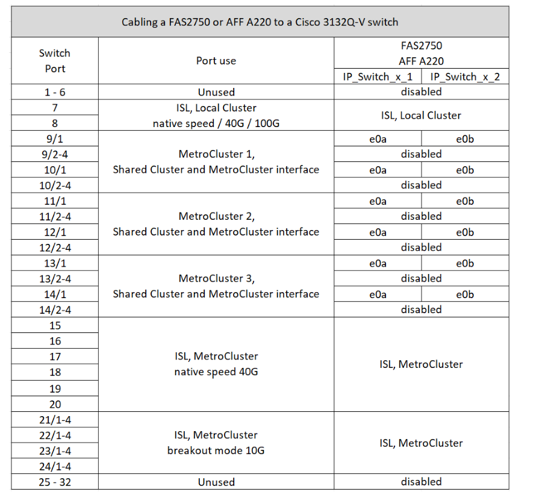
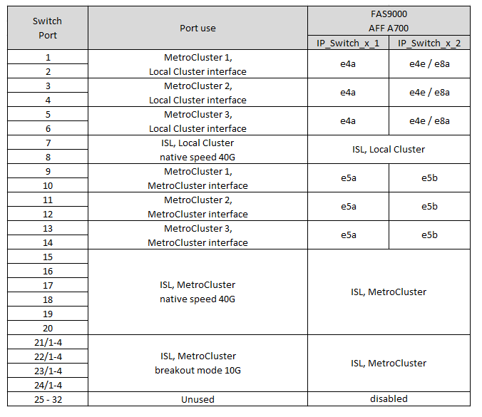

= Cisco 3132Q-V 스위치에 대한 플랫폼 포트 할당
:allow-uri-read: 
:icons: font
:imagesdir: ../media/

[role="lead"]
MetroCluster IP 구성에서 포트 사용은 스위치 모델 및 플랫폼 유형에 따라 다릅니다.

표를 사용하기 전에 다음 지침을 검토하십시오.

* MetroCluster FC에서 IP로 전환되도록 스위치를 구성하는 경우, 포트 5, 포트 6, 포트 13 또는 포트 14를 사용하여 MetroCluster FC 노드의 로컬 클러스터 인터페이스를 연결할 수 있습니다. 을 참조하십시오 link:https://mysupport.netapp.com/site/tools/tool-eula/rcffilegenerator["RcfFileGenerator 를 참조하십시오"^] 이 구성의 케이블 연결에 대한 자세한 내용은 생성된 케이블 연결 파일을 참조하십시오. 다른 모든 연결의 경우 표에 나열된 포트 사용 할당을 사용할 수 있습니다.

== 구성에 맞는 올바른 케이블 연결 표를 선택합니다

다음 표를 사용하여 따라야 할 케이블 연결 테이블을 결정합니다.

[cols="2*"]
|===
| 시스템이 다음과 같은 경우... | 케이블 연결 표 사용... 

 a| 
FAS2750, AFF A220
| <<table_1_cisco_3132q,Cisco 3132Q-V 플랫폼 포트 할당(그룹 1)>> 

| FAS9000, AFF A700 | <<table_2_cisco_3132q,Cisco 3132Q-V 플랫폼 포트 할당(그룹 2)>> 

| AFF A800, ASA A800 | <<table_3_cisco_3132q,Cisco 3132Q-V 플랫폼 포트 할당(그룹 3)>> 
|===
.Cisco 3132Q-V 플랫폼 포트 할당(그룹 1)
FAS2750 또는 AFF A220 시스템을 Cisco 3132Q-V 스위치에 케이블로 연결하기 위한 플랫폼 포트 할당을 검토합니다.

.Cisco 3132Q-V 플랫폼 포트 할당(그룹 2)
FAS9000 또는 AFF A700 시스템을 Cisco 3132Q-V 스위치에 케이블로 연결하기 위한 플랫폼 포트 할당을 검토합니다.

.Cisco 3132Q-V 플랫폼 포트 할당(그룹 3)
AFF A800 또는 ASA A800 시스템을 Cisco 3132Q-V 스위치에 연결하기 위해 플랫폼 포트 할당을 검토합니다.

image::../media/cabling-an-aff-a800-to-a-cisco-3132q-v-switch.png[은 Cisco 3132Q-V 플랫폼 포트 할당을 보여 줍니다]
