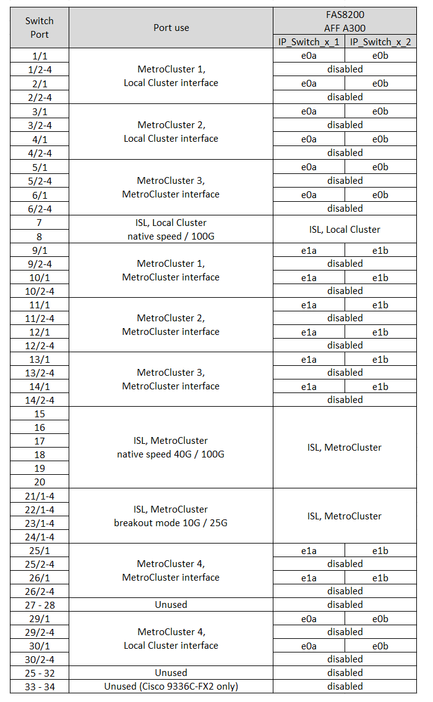
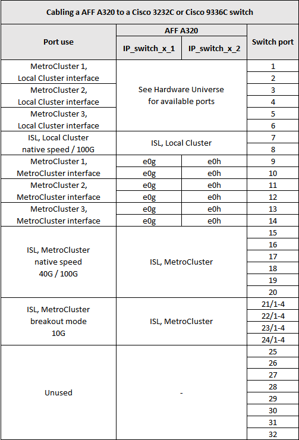
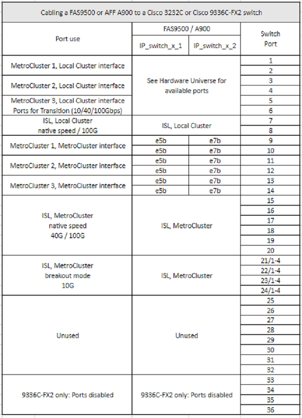

= Cisco 3232C 또는 Cisco 9336C 스위치에 대한 플랫폼 포트 할당
:allow-uri-read: 
:icons: font
:imagesdir: ../media/

[role="lead"]
MetroCluster IP 구성에서 포트 사용은 스위치 모델 및 플랫폼 유형에 따라 다릅니다.

표를 사용하기 전에 다음 사항을 검토하십시오.

* 다음 표에는 사이트 A의 포트 사용량이 나와 있습니다 사이트 B에 동일한 케이블이 사용됩니다
* 스위치는 속도가 다른 포트(예: 100Gbps 포트와 40Gbps 포트 혼합)로 구성할 수 없습니다.
* 스위치를 사용하여 단일 MetroCluster를 구성하는 경우 * MetroCluster 1 * 포트 그룹을 사용합니다.
+
MetroCluster 포트 그룹(MetroCluster 1, MetroCluster 2 또는 MetroCluster 3)을 추적합니다. 이 구성 절차의 뒷부분에 설명된 대로 RcfFileGenerator 도구를 사용할 때 이 도구가 필요합니다.

* MetroCluster IP용 RcfFileGenerator는 각 스위치에 대한 포트별 케이블 연결 개요도 제공합니다.
+
이 케이블 연결 개요를 사용하여 케이블 연결을 확인하십시오.

== 스위치에 2개의 MetroCluster 구성을 케이블로 연결합니다

둘 이상의 MetroCluster 구성을 Cisco 3132Q-V 스위치에 케이블로 연결한 다음 해당 표에 따라 각 MetroCluster에 케이블을 연결합니다. 예를 들어, FAS2750과 A700을 동일한 Cisco 3132Q-V 스위치에 케이블로 연결하는 경우 그런 다음 표 1의 'MetroCluster 1'에 따라 FAS2750을 연결하고, 표 2의 'MetroCluster 2' 또는 'MetroCluster 3'에 따라 A700을 케이블로 연결합니다. FAS2750과 A700을 'MetroCluster 1'로 물리적으로 연결할 수 없습니다.

== FAS2750 또는 AFF A220 시스템을 Cisco 3232C 또는 Cisco 9336C 스위치에 케이블로 연결합니다

image::../media/mcc_ip_cabling_an_aff_a220_or_fas2750_to_a_cisco_3232c_or_cisco_9336c_switch.png[AFF A220 또는 fas2750을 Cisco 32c 또는 Cisco 9336c 스위치에 MCC IP 케이블로 연결합니다]

== AFF A300 또는 FAS8200을 Cisco 3232C 또는 Cisco 9336C 스위치에 케이블로 연결합니다

== AFF A250 또는 FAS500f를 Cisco 3232C 또는 Cisco 9336C 스위치에 케이블로 연결합니다

image::../media/mcc_ip_cabling_an_aff_a250_or_fas500f_to_a_cisco_3232c_or_cisco_9336c_switch.png[MCC IP AFF A250 또는 fas500f를 Cisco 32c 또는 Cisco 9336c 스위치에 케이블로 연결합니다]

== AFF A320을 Cisco 3232C 또는 Cisco 9336C 스위치에 케이블로 연결합니다

== AFF A400, FAS8300 또는 FAS8700을 Cisco 3232C 또는 Cisco 9336C 스위치에 케이블로 연결합니다

image::../media/cabling_a_mcc_ip_aff_a400_fas8300_or_fas8700_to_a_cisco_3232c_or_cisco_9336c_switch.png[MCC IP AFF a400 fas8300 또는 fas8700을 Cisco 32c 또는 Cisco 9336c 스위치에 케이블로 연결합니다]

== AFF A700 또는 FAS9000을 Cisco 3232C 또는 Cisco 9336C 스위치에 케이블로 연결합니다

image::../media/mcc_ip_cabling_a_aff_a700_or_fas9000_to_a_cisco_3232c_or_cisco_9336c_switch.png[MCC IP AFF a700 또는 fas9000을 Cisco 32c 또는 Cisco 9336c 스위치에 케이블로 연결합니다]

== AFF A800을 Cisco 3232C 또는 Cisco 9336C 스위치에 케이블로 연결합니다

image::../media/cabling_an_aff_a800_to_a_cisco_3232c_or_cisco_9336c_switch.png[AFF A800을 Cisco 32c 또는 Cisco 9336c 스위치에 케이블로 연결합니다]

== AFF A900 또는 FAS9500을 Cisco 3232C 또는 Cisco 9336C 스위치에 케이블로 연결합니다

NOTE: MetroCluster IP 구성에서 포트 e5a 및 e7a를 인터클러스터 LIF로 사용할 수 있습니다.

== AFF A320, AFF A400, AFF A700 또는 AFF A800을 Cisco 9336C-FX2 공유 스위치에 케이블로 연결합니다

image::../media/mcc_ip_cabling_aff_a320_a400_a700_a800_to_cisco_9336c_shared_switch.png[MCC IP 케이블 연결 AFF A320 a400 a700 A800 to Cisco 9336c 공유 스위치]

image::../media/mcc_interfaces_per_platform_9336-shared.png[공유 플랫폼 9336당 MCC 인터페이스]
