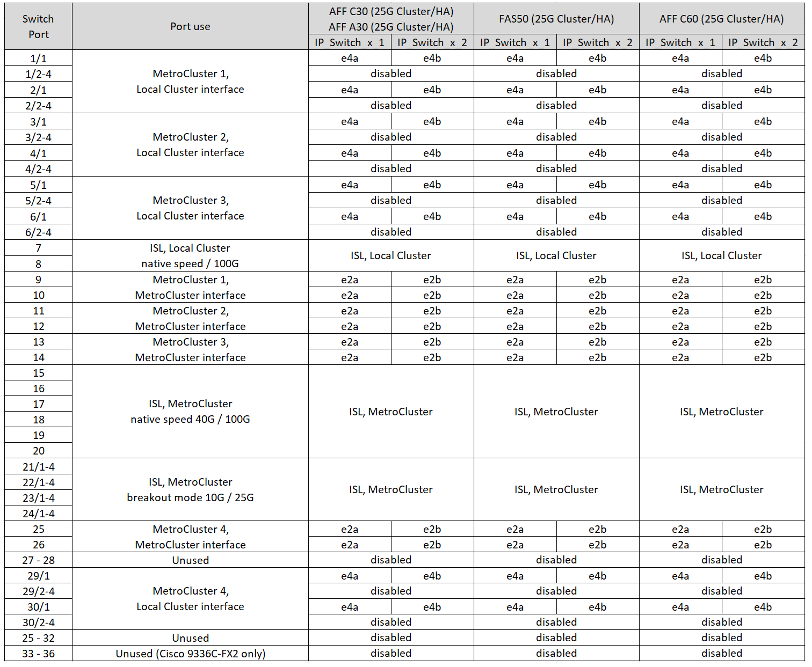

= Cisco 3232C 또는 Cisco 9336C-FX2 스위치에 대한 플랫폼 포트 할당
:allow-uri-read: 
:icons: font
:imagesdir: ../media/

[role="lead"]
MetroCluster IP 구성에서 포트 사용은 스위치 모델 및 플랫폼 유형에 따라 다릅니다.

구성 테이블을 사용하기 전에 다음 고려 사항을 검토하십시오.

* 다음 표에는 사이트 A의 포트 사용량이 나와 있습니다 사이트 B에 동일한 케이블이 사용됩니다
* 스위치는 속도가 다른 포트(예: 100Gbps 포트와 40Gbps 포트 혼합)로 구성할 수 없습니다.
* 스위치를 사용하여 단일 MetroCluster를 구성하는 경우 * MetroCluster 1 * 포트 그룹을 사용합니다.
+
MetroCluster 포트 그룹(MetroCluster 1, MetroCluster 2, MetroCluster 3 또는 MetroCluster 4)을 추적합니다. 이 구성 절차의 뒷부분에 설명된 대로 RcfFileGenerator 도구를 사용할 때 이 도구가 필요합니다.

* MetroCluster IP용 RcfFileGenerator는 각 스위치에 대한 포트별 케이블 연결 개요도 제공합니다.
+
이 케이블 연결 개요를 사용하여 케이블 연결을 확인하십시오.

* MetroCluster ISL의 25G 브레이크아웃 모드를 사용하려면 RCF 파일 버전 v2.10 이상이 필요합니다.
* "MetroCluster 4" 그룹에서 FAS8200 또는 AFF A300 이외의 플랫폼을 사용하려면 ONTAP 9.13.1 이상 및 RCF 파일 버전 2.00이 필요합니다.

NOTE: RCF 파일 버전은 파일을 생성하는 데 사용되는 RCFfilegenerator 도구의 버전과 다릅니다. 예를 들어 RCFfilegenerator v1.6c를 사용하여 RCF 파일 버전 2.00을 생성할 수 있습니다.

== 스위치에 2개의 MetroCluster 구성을 케이블로 연결합니다

둘 이상의 MetroCluster 구성을 Cisco 3132Q-V 스위치에 케이블로 연결할 경우, 해당 표에 따라 각 MetroCluster에 케이블을 연결해야 합니다. 예를 들어, FAS2750과 AFF A700을 동일한 Cisco 3132Q-V 스위치에 케이블로 연결하는 경우 그런 다음 표 1의 "MetroCluster 1"에 따라 FAS2750과 표 2의 "MetroCluster 2" 또는 "MetroCluster 3"에 따라 AFF A700을 케이블로 연결합니다. FAS2750과 AFF A700을 "MetroCluster 1"로 물리적으로 연결할 수 없습니다.

== 구성에 맞는 올바른 케이블 연결 표를 선택합니다

다음 표를 사용하여 따라야 할 케이블 연결 테이블을 결정합니다.

[cols="25,75"]
|===
| 시스템이 다음과 같은 경우... | 케이블 연결 표 사용... 

| AFF A150, ASA A150 FAS2750, AFF A220 FAS500f, AFF C250, ASA C250 AFF A250, ASA A250 | <<table_1_cisco_3232c_9336c,Cisco 3232C 또는 Cisco 9336C-FX2 플랫폼 포트 할당(그룹 1)>> 

| AFF A20 를 참조하십시오 | <<table_2_cisco_3232c_9336c,Cisco 3232C 또는 Cisco 9336C-FX2 플랫폼 포트 할당(그룹 2)>> 

| AFF A30, AFF C30 FAS50 AFF C60  a| 
따르는 표는 25G(그룹 3a) 또는 100G(그룹 3b) 이더넷 카드를 사용하는지 여부에 따라 다릅니다.

* <<table_3a_cisco_3232c_9336c,Cisco 3232C 또는 Cisco 9336C-FX2 플랫폼 포트 할당(그룹 3a-25G)>>
* <<table_3b_cisco_3232c_9336c,Cisco 3232C 또는 Cisco 9336C-FX2 플랫폼 포트 할당(그룹 3b-100G)>>

| FAS8200, AFF A300 | <<table_4_cisco_3232c_9336c,Cisco 3232C 또는 Cisco 9336C-FX2 플랫폼 포트 할당(그룹 4)>> 

| AFF A320 FAS8300, AFF C400, ASA C400, FAS8700 AFF A400, ASA A400 | <<table_5_cisco_3232c_9336c,Cisco 3232C 또는 Cisco 9336C-FX2 플랫폼 포트 할당(그룹 5)>> 

| AFF A50 를 참조하십시오 | <<table_6_cisco_3232c_9336c,Cisco 3232C 또는 Cisco 9336C-FX2 플랫폼 포트 할당(그룹 6)>> 

| FAS9000, AFF A700 AFF C800, ASA C800, AFF A800, ASA A800 FAS9500, AFF A900, ASA A900 탑재 | <<table_7_cisco_3232c_9336c,Cisco 3232C 또는 Cisco 9336C-FX2 플랫폼 포트 할당(그룹 7)>> 

| FAS70, AFF A70 AFF C80 FAS90, AFF A90 AFF A1K | <<table_8_cisco_3232c_9336c,Cisco 3232C 또는 Cisco 9336C-FX2 플랫폼 포트 할당(그룹 8)>> 
|===
.Cisco 3232C 또는 Cisco 9336C-FX2 플랫폼 포트 할당(그룹 1)
AFF A150, ASA A150, FAS2750, AFF A220, FAS500f, AFF C250, ASA C250, AFF A250 또는 ASA A250 시스템에서 Cisco 3232C 또는 9336C-FX2 스위치로 연결하는 경우:

image:../media/mcc-ip-cabling-a150-a220-a250-to-a-cisco-3232c-or-cisco-9336c-switch-9161.png["에는 Cisco 3232C 또는 Cisco 9336C-FX2 플랫폼 포트 할당이 나와 있습니다"]

.Cisco 3232C 또는 Cisco 9336C-FX2 플랫폼 포트 할당(그룹 2)
AFF A20 시스템을 Cisco 3232C 또는 9336C-FX2 스위치에 케이블로 연결하기 위한 플랫폼 포트 할당을 검토합니다.

image:../media/mcc-ip-cabling-aff-a20-9161.png["에는 Cisco 3232C 또는 Cisco 9336C-FX2 플랫폼 포트 할당이 나와 있습니다"]

.Cisco 3232C 또는 Cisco 9336C-FX2 플랫폼 포트 할당(그룹 3a)
4포트 25G 이더넷 카드를 사용하여 AFF A30, AFF C30, AFF C60 또는 FAS50 시스템을 Cisco 3232C 또는 9336C-FX2 스위치에 케이블로 연결하기 위한 플랫폼 포트 할당을 검토합니다.

NOTE: 이 구성에서는 로컬 클러스터와 HA 인터페이스를 연결하기 위해 슬롯 4에 4포트 25G 이더넷 카드가 필요합니다.

.Cisco 3232C 또는 Cisco 9336C-FX2 플랫폼 포트 할당(그룹 3b)
2포트 100G 이더넷 카드를 사용하여 AFF A30, AFF C30, AFF C60 또는 FAS50 시스템을 Cisco 3232C 또는 9336C-FX2 스위치에 케이블로 연결하기 위한 플랫폼 포트 할당을 검토합니다.

NOTE: 이 구성에서는 로컬 클러스터와 HA 인터페이스를 연결하기 위해 슬롯 4에 2포트 100G 이더넷 카드가 필요합니다.

image:../media/mccip-cabling-a30-c30-fas50-c60-100G.png["에는 Cisco 3232C 또는 Cisco 9336C-FX2 플랫폼 포트 할당이 나와 있습니다"]

.Cisco 3232C 또는 Cisco 9336C-FX2 플랫폼 포트 할당(그룹 4)
FAS8200 또는 AFF A300 시스템을 Cisco 32C 또는 9336C-FX2 스위치에 케이블로 연결하기 위한 플랫폼 포트 할당을 검토합니다.

image::../media/mccip-cabling-fas8200-a300-updated.png[에는 Cisco 3232C 또는 Cisco 9336C-FX2 플랫폼 포트 할당이 나와 있습니다]

이전 RCF 파일에서 업그레이드하는 경우 케이블 연결 구성에서 "MetroCluster 4" 그룹(포트 25/26 및 29/30)의 포트를 사용하고 있을 수 있습니다.

.Cisco 3232C 또는 Cisco 9336C-FX2 플랫폼 포트 할당(그룹 5)
AFF A320, FAS8300, AFF C400, ASA C400, FAS8700, AFF A400, 또는 ASA A400 시스템에서 Cisco 3232C 또는 9336C-FX2 스위치로:

image::../media/mcc_ip_cabling_a320_a400_cisco_3232C_or_9336c_switch.png[에는 Cisco 3232C 또는 Cisco 9336C-FX2 플랫폼 포트 할당이 나와 있습니다]

NOTE: "MetroCluster 4" 그룹의 포트를 사용하려면 ONTAP 9.13.1 이상이 필요합니다.

.Cisco 3232C 또는 Cisco 9336C-FX2 플랫폼 포트 할당(그룹 6)
AFF A50 시스템을 Cisco 3232C 또는 9336C-FX2 스위치에 케이블로 연결하기 위한 플랫폼 포트 할당을 검토합니다.

image::../media/mcc-ip-cabling-aff-a50-cisco-3232c-9336c-9161.png[에는 Cisco 3232C 또는 Cisco 9336C-FX2 플랫폼 포트 할당이 나와 있습니다]

.Cisco 3232C 또는 Cisco 9336C-FX2 플랫폼 포트 할당(그룹 7)
FAS9000, AFF A700, AFF C800, ASA C800, AFF A800, ASA A800, FAS9500, AFF A900 또는 ASA A900 시스템에서 Cisco 3232C 또는 9336C-FX2 스위치로 이동하는 방법:

image::../media/mcc_ip_cabling_fas9000_a700_fas9500_a800_a900_cisco_3232C_or_9336c_switch.png[에는 Cisco 3232C 또는 Cisco 9336C-FX2 플랫폼 포트 할당이 나와 있습니다]

*참고 1*: X91440A 어댑터(40Gbps)를 사용하는 경우 e4a 및 e4e 또는 e4a 및 e8a를 사용합니다. X91153A 어댑터(100Gbps)를 사용하는 경우 포트 e4a 및 e4b 또는 e4a 및 e8a를 사용합니다.

NOTE: "MetroCluster 4" 그룹의 포트를 사용하려면 ONTAP 9.13.1 이상이 필요합니다.

.Cisco 3232C 또는 Cisco 9336C-FX2 플랫폼 포트 할당(그룹 8)
AFF A70, FAS70, AFF C80, FAS90, AFF A90 또는 AFF A1K 시스템을 Cisco 3232C 또는 9336C-FX2 스위치에 케이블로 연결하기 위한 플랫폼 포트 할당을 검토합니다.

image:../media/mccip-cabling-a70-fas70-a90-c80-fas90-a1k-updated.png["에는 Cisco 3232C 또는 Cisco 9336C-FX2 플랫폼 포트 할당이 나와 있습니다"]
