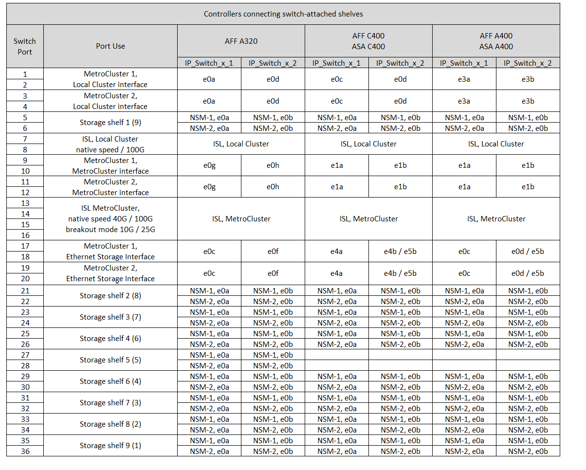
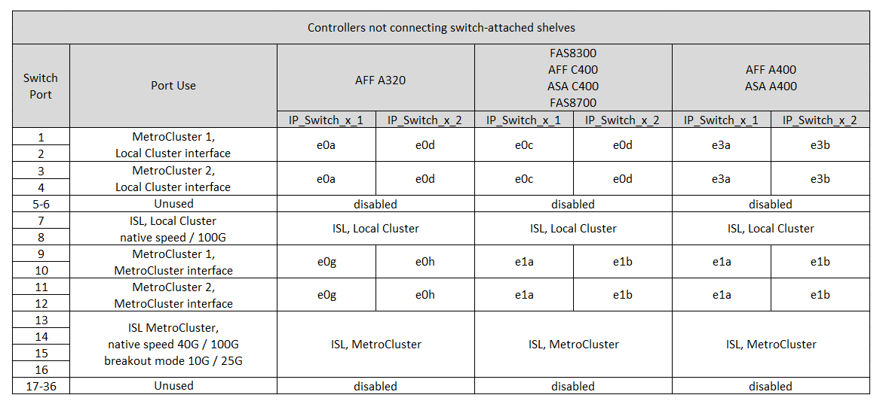

= NS224 스토리지를 연결하는 36포트 Cisco 9336C-FX2 스위치의 플랫폼 포트 할당
:allow-uri-read: 
:icons: font
:imagesdir: ../media/

[role="lead"]
MetroCluster IP 구성에서 포트 사용은 스위치 모델 및 플랫폼 유형에 따라 다릅니다.

구성 테이블을 사용하기 전에 다음 고려 사항을 검토하십시오.

* 이 섹션의 표는 최소한 하나의 MetroCluster 구성 또는 DR 그룹이 NS224 셸프를 MetroCluster 스위치에 연결할 때 사용되는 36포트 Cisco 9336C-FX2 스위치에 대한 것입니다.
+
NS224 스토리지를 연결하지 않는 36포트 Cisco 9336C-FX2 스위치가 있는 경우 다음 표를 사용하십시오. link:port_usage_3232c_9336c.html["Cisco 3232C 또는 36포트 Cisco 9336C-FX2 스위치에 대한 플랫폼 포트 할당"] .

+
12포트 Cisco 9336C-FX2 스위치가 있는 경우 다음 표를 사용하십시오. link:port-usage-9336c-fx-2-12-port.html["12포트 Cisco 9336C-FX2 스위치에 대한 플랫폼 포트 할당"] .

+

NOTE: 12포트 Cisco 9336C-FX2 스위치는 NS224 셸프를 MetroCluster 스위치에 연결하는 것을 지원하지 않습니다.

* NS224 스토리지를 연결하는 Cisco 9336C-FX2 스위치를 케이블로 연결할 때 MetroCluster 구성 또는 DR 그룹은 최대 두 개까지만 사용할 수 있습니다. 최소 하나의 MetroCluster 구성 또는 DR 그룹이 NS224 셸프를 MetroCluster 스위치에 연결해야 합니다. 스위치에 연결된 NS224 셸프를 연결하지 않는 플랫폼만 두 번째 MetroCluster 구성 또는 두 번째 DR 그룹으로 연결할 수 있습니다.
+
두 번째 MetroCluster 또는 DR 그룹이 NS224 셸프를 MetroCluster 스위치에 연결하지 않으면 다음을 따르십시오. <<tables_not_connecting_ns224,스위치 부착 NS224 선반을 연결하지 않는 컨트롤러용 케이블링 테이블>> .

* RcfFileGenerator는 첫 번째 플랫폼을 선택한 경우에만 적합한 플랫폼을 표시합니다.
* 1개의 8노드 또는 2개의 4노드 MetroCluster 구성을 연결하려면 ONTAP 9.14.1 이상이 필요합니다.

== 구성에 맞는 올바른 케이블 연결 표를 선택합니다

구성에 대한 올바른 포트 할당 표를 검토합니다. 이 섹션에는 두 가지 케이블 연결 테이블 세트가 있습니다.

* <<tables_connecting_ns224,스위치 연결 NS224 쉘프를 연결하는 컨트롤러의 케이블 테이블>>
* <<tables_not_connecting_ns224,스위치 연결 NS224 쉘프가 연결되지 않은 컨트롤러의 케이블 연결 테이블>>

=== 컨트롤러가 스위치 연결 NS224 쉘프를 연결합니다

스위치가 연결된 NS224 쉘프를 연결하는 컨트롤러의 포트 할당 표를 결정합니다.

[cols="25,75"]
|===
| 플랫폼 | 케이블 연결 표 사용... 

| AFF C30, AFF A30 AFF C60  a| 
따르는 표는 25G(그룹 1a) 또는 100G(그룹 1b) 이더넷 카드를 사용하는지 여부에 따라 다릅니다.

* <<table_1a_cisco_9336c_fx2,NS224 스토리지 플랫폼 포트 할당을 연결하는 Cisco 9336C-FX2 스위치(그룹 1a-25G)>>
* <<table_1b_cisco_9336c_fx2,NS224 스토리지 플랫폼 포트 할당을 연결하는 Cisco 9336C-FX2 스위치(그룹 1b-100G)>>

| AFF A320 AFF C400, ASA C400 AFF A400, ASA A400 | <<table_2_cisco_9336c_fx2,NS224 스토리지 플랫폼 포트 할당을 연결하는 Cisco 9336C-FX2 스위치(그룹 2)>> 

| AFF A50 를 참조하십시오 | <<table_3_cisco_9336c_fx2,NS224 스토리지 플랫폼 포트 할당을 연결하는 Cisco 9336C-FX2 스위치(그룹 3)>> 

| AFF A700 AFF C800, ASA C800, AFF A800 AFF A900, ASA A900 | <<table_4_cisco_9336c_fx2,NS224 스토리지 플랫폼 포트 할당을 연결하는 Cisco 9336C-FX2 스위치(그룹 4)>> 

| AFF A70 AFF C80 AFF A90 AFF A1K 를 참조하십시오 | <<table_5_cisco_9336c_fx2,NS224 스토리지 플랫폼 포트 할당을 연결하는 Cisco 9336C-FX2 스위치(그룹 5)>> 
|===
.NS224 스토리지 플랫폼 포트 할당을 연결하는 Cisco 9336C-FX2 스위치(그룹 1a)
4포트 25G 이더넷 카드를 사용하여 스위치 연결 NSS24 쉘프를 Cisco 9336C-FX2 스위치에 연결하는 AFF A30, AFF C30 또는 AFF C60 시스템에 케이블을 연결하기 위한 플랫폼 포트 할당을 검토합니다.

NOTE: 이 구성에서는 로컬 클러스터와 HA 인터페이스를 연결하기 위해 슬롯 4에 4포트 25G 이더넷 카드가 필요합니다.

image:../media/mccip-cabling-greeley-connecting-a30-c30-fas50-c60-25G.png["에서는 NS224 스토리지 플랫폼 포트 할당을 연결하는 Cisco 9336C-FX2 스위치를 보여 줍니다"]

.NS224 스토리지 플랫폼 포트 할당을 연결하는 Cisco 9336C-FX2 스위치(그룹 1b)
2포트 100G 이더넷 카드를 사용하여 스위치 연결 NSS24 쉘프를 Cisco 9336C-FX2 스위치에 연결하는 AFF A30, AFF C30 또는 AFF C60 시스템에 케이블을 연결하기 위한 플랫폼 포트 할당을 검토합니다.

NOTE: 이 구성에서는 로컬 클러스터와 HA 인터페이스를 연결하기 위해 슬롯 4에 2포트 100G 이더넷 카드가 필요합니다.

image:../media/mccip-cabling-greeley-connecting-a30-c30-fas50-c60-100G.png["에서는 NS224 스토리지 플랫폼 포트 할당을 연결하는 Cisco 9336C-FX2 스위치를 보여 줍니다"]

.NS224 스토리지 플랫폼 포트 할당을 연결하는 Cisco 9336C-FX2 스위치(그룹 2)
스위치 연결 NSS24 쉘프를 Cisco 9336C-FX2 스위치에 연결하는 AFF A320, AFF C400, ASA C400, AFF A400 또는 ASA A400 시스템에 케이블을 연결하기 위한 플랫폼 포트 할당을 검토합니다.

.NS224 스토리지 플랫폼 포트 할당을 연결하는 Cisco 9336C-FX2 스위치(그룹 3)
스위치 연결 NSS24 쉘프를 Cisco 9336C-FX2 스위치에 연결하는 AFF A50 시스템에 케이블을 연결하기 위한 플랫폼 포트 할당을 검토합니다.

image:../media/mccip-cabling-greeley-connecting-a50-updated.png["에서는 NS224 스토리지 플랫폼 포트 할당을 연결하는 Cisco 9336C-FX2 스위치를 보여 줍니다"]

.NS224 스토리지 플랫폼 포트 할당을 연결하는 Cisco 9336C-FX2 스위치(그룹 4)
스위치 연결 NSS24 쉘프를 Cisco 9336C-FX2 스위치에 연결하는 AFF A700, AFF C800, ASA C800, AFF A800, AFF A900 또는 ASA A900 시스템에 케이블을 연결하기 위한 플랫폼 포트 할당을 검토합니다.

image:../media/mcc_ip_cabling_a700_c800_a800_a900_to_cisco_9336c_shared_switch.png["에서는 NS224 스토리지 플랫폼 포트 할당을 연결하는 Cisco 9336C-FX2 스위치를 보여 줍니다"]

*참고 1*: X91440A 어댑터(40Gbps)를 사용하는 경우 e4a 및 e4e 또는 e4a 및 e8a를 사용합니다. X91153A 어댑터(100Gbps)를 사용하는 경우 포트 e4a 및 e4b 또는 e4a 및 e8a를 사용합니다.

.NS224 스토리지 플랫폼 포트 할당을 연결하는 Cisco 9336C-FX2 스위치(그룹 5)
스위치 연결 NSS24 쉘프를 Cisco 9336C-FX2 스위치에 연결하는 AFF A70, AFF C80, AFF A90 또는 AFF A1K 시스템에 케이블을 연결하기 위한 플랫폼 포트 할당을 검토합니다.

image::../media/mccip-cabling-greeley-connecting-a70-c80-a-90-fas90-a1k.png[에서는 NS224 스토리지 플랫폼 포트 할당을 연결하는 Cisco 9336C-FX2 스위치를 보여 줍니다]

=== 컨트롤러가 스위치 연결 NS224 쉘프를 연결하지 않음

스위치 연결 NS224 쉘프에 연결되지 않은 컨트롤러에 대해 따라야 하는 포트 할당 표를 결정합니다.

[cols="25,75"]
|===
| 플랫폼 | 케이블 연결 표 사용... 

| AFF A150, ASA A150 FAS2750, AFF A220 | <<table_6_cisco_9336c_fx2,Cisco 9336C-FX2 스위치가 NS224 스토리지 플랫폼 포트 할당을 연결하지 않음(그룹 6)>> 

| AFF A20 를 참조하십시오 | <<table_7_cisco_9336c_fx2,Cisco 9336C-FX2 스위치가 NS224 스토리지 플랫폼 포트 할당을 연결하지 않음(그룹 7)>> 

| FAS500f AFF C250, ASA C250 AFF A250, ASA A250 | <<table_8_cisco_9336c_fx2,Cisco 9336C-FX2 스위치가 NS224 스토리지 플랫폼 포트 할당을 연결하지 않음(그룹 8)>> 

| AFF C30, AFF A30 FAS50 AFF C60  a| 
따르는 표는 25G(그룹 9a) 또는 100G(그룹 9b) 이더넷 카드를 사용하는지 여부에 따라 다릅니다.

* <<table_9a_cisco_9336c_fx2,Cisco 9336C-FX2 스위치가 NS224 스토리지 플랫폼 포트 할당을 연결하지 않음(그룹 9a)>>
* <<table_9b_cisco_9336c_fx2,Cisco 9336C-FX2 스위치가 NS224 스토리지 플랫폼 포트 할당을 연결하지 않음(그룹 9b)>>

| FAS8200, AFF A300 | <<table_10_cisco_9336c_fx2,Cisco 9336C-FX2 스위치가 NS224 스토리지 플랫폼 포트 할당을 연결하지 않음(그룹 10)>> 

| AFF A320 FAS8300, AFF C400, ASA C400, FAS8700 AFF A400, ASA A400 | <<table_11_cisco_9336c_fx2,Cisco 9336C-FX2 스위치가 NS224 스토리지 플랫폼 포트 할당을 연결하지 않음(그룹 11)>> 

| AFF A50 를 참조하십시오 | <<table_12_cisco_9336c_fx2,Cisco 9336C-FX2 스위치가 NS224 스토리지 플랫폼 포트 할당을 연결하지 않음(그룹 12)>> 

| FAS9000, AFF A700 AFF C800, ASA C800, AFF A800, ASA A800 FAS9500, AFF A900, ASA A900 탑재 | <<table_13_cisco_9336c_fx2,Cisco 9336C-FX2 스위치가 NS224 스토리지 플랫폼 포트 할당을 연결하지 않음(그룹 13)>> 

| FAS70, AFF A70 AFF C80 FAS90, AFF A90 AFF A1K | <<table_14_cisco_9336c_fx2,Cisco 9336C-FX2 스위치가 NS224 스토리지 플랫폼 포트 할당을 연결하지 않음(그룹 14)>> 
|===
.Cisco 9336C-FX2 스위치가 NS224 스토리지 플랫폼 포트 할당을 연결하지 않음(그룹 6)
스위치 연결 NSS24 쉘프를 Cisco 9336C-FX2 스위치에 연결하지 않는 AFF A150, ASA A150, FAS2750 또는 AFF A220 시스템에 케이블을 연결하기 위한 플랫폼 포트 할당을 검토합니다.

image::../media/mcc-ip-cabling-a-aff-a150-asa-a150-fas2750-aff-a220-to-a-cisco-9336c-shared-switch.png[은 Cisco 9336C-FX2 스위치가 NS224 스토리지 플랫폼 포트 할당을 연결하지 않음을 보여 줍니다]

.Cisco 9336C-FX2 스위치가 NS224 스토리지 플랫폼 포트 할당을 연결하지 않음(그룹 7)
스위치 연결 NSS24 쉘프를 Cisco 9336C-FX2 스위치에 연결하지 않는 AFF A20 시스템에 케이블을 연결하기 위한 플랫폼 포트 할당을 검토합니다.

image:../media/mcc-ip-aff-a20-to-a-cisco-9336c-shared-switch-not-connecting.png["은 Cisco 9336C-FX2 스위치가 NS224 스토리지 플랫폼 포트 할당을 연결하지 않음을 보여 줍니다"]

.Cisco 9336C-FX2 스위치가 NS224 스토리지 플랫폼 포트 할당을 연결하지 않음(그룹 8)
스위치 연결 NSS24 쉘프를 Cisco 9336C-FX2 스위치에 연결하지 않는 FAS500f, AFF C250, ASA C250, AFF A250 또는 ASA A250 시스템에 케이블을 연결하기 위한 플랫폼 포트 할당을 검토합니다.

image::../media/mcc-ip-cabling-c250-asa-c250-a250-asa-a250-to-cisco-9336c-shared-switch.png[은 Cisco 9336C-FX2 스위치가 NS224 스토리지 플랫폼 포트 할당을 연결하지 않음을 보여 줍니다]

.Cisco 9336C-FX2 스위치가 NS224 스토리지 플랫폼 포트 할당을 연결하지 않음(그룹 9a)
4포트 25G 이더넷 카드를 사용하여 스위치 연결 NSS24 쉘프를 Cisco 9336C-FX2 스위치에 연결하지 않는 AFF A30, AFF C30, AFF C60 또는 FAS50 시스템에 케이블을 연결하기 위한 플랫폼 포트 할당을 검토합니다.

NOTE: 이 구성에서는 로컬 클러스터와 HA 인터페이스를 연결하기 위해 슬롯 4에 4포트 25G 이더넷 카드가 필요합니다.

image:../media/mccip-cabling-greeley-not-connecting-a30-c30-fas50-c60-25G.png["은 Cisco 9336C-FX2 스위치가 NS224 스토리지 플랫폼 포트 할당을 연결하지 않음을 보여 줍니다"]

.Cisco 9336C-FX2 스위치가 NS224 스토리지 플랫폼 포트 할당을 연결하지 않음(그룹 9b)
2포트 100G 이더넷 카드를 사용하여 스위치 연결 NSS24 쉘프를 Cisco 9336C-FX2 스위치에 연결하지 않는 AFF A30, AFF C30, AFF C60 또는 FAS50 시스템에 케이블을 연결하기 위한 플랫폼 포트 할당을 검토합니다.

NOTE: 이 구성에서는 로컬 클러스터와 HA 인터페이스를 연결하기 위해 슬롯 4에 2포트 100G 이더넷 카드가 필요합니다.

image:../media/mccip-cabling-greeley-not-connecting-a30-c30-fas50-c60-100G.png["에서는 NS224 스토리지 플랫폼 포트 할당을 연결하는 Cisco 9336C-FX2 스위치를 보여 줍니다"]

.Cisco 9336C-FX2 스위치가 NS224 스토리지 플랫폼 포트 할당을 연결하지 않음(그룹 10)
스위치 연결 NSS24 쉘프를 Cisco 9336C-FX2 스위치에 연결하지 않는 FAS8200 또는 AFF A300 시스템에 케이블을 연결하기 위한 플랫폼 포트 할당을 검토합니다.

image::../media/mcc-ip-cabling-fas8200-affa300-to-cisco-9336c-shared-switch.png[에서는 NS224 스토리지 플랫폼 포트 할당을 연결하는 Cisco 9336C-FX2 스위치를 보여 줍니다]

.Cisco 9336C-FX2 스위치가 NS224 스토리지 플랫폼 포트 할당을 연결하지 않음(그룹 11)
스위치 연결 NSS24 쉘프를 FAS8300 Cisco 9336C-FX2 스위치에 연결하지 않는 AFF A320 ASA A400, FAS8700, AFF C400 AFF A400, ASA C400 시스템에 케이블을 연결하기 위한 플랫폼 포트 할당을 검토합니다.

.Cisco 9336C-FX2 스위치가 NS224 스토리지 플랫폼 포트 할당을 연결하지 않음(그룹 12)
스위치 연결 NSS24 쉘프를 Cisco 9336C-FX2 스위치에 연결하지 않는 AFF A50 시스템에 케이블을 연결하기 위한 플랫폼 포트 할당을 검토합니다.

image::../media/mcc-ip-cabling-aff-a50-cisco-9336c-shared-switch-not-connecting.png[은 Cisco 9336C-FX2 스위치가 NS224 스토리지 플랫폼 포트 할당을 연결하지 않음을 보여 줍니다]

.Cisco 9336C-FX2 스위치가 NS224 스토리지 플랫폼 포트 할당을 연결하지 않음(그룹 13)
스위치 연결 NSS24 쉘프를 ASA C800 Cisco 9336C-FX2 스위치에 연결하지 않는 FAS9000, AFF A800, ASA A800, AFF A700, AFF C800, FAS9500, AFF A900 또는 ASA A900 시스템에 케이블을 연결하기 위한 플랫폼 포트 할당을 검토합니다.

image::../media/mcc_ip_cabling_a700_a800_fas9000_fas9500_to_cisco_9336c_shared_switch.png[은 Cisco 9336C-FX2 스위치가 NS224 스토리지 플랫폼 포트 할당을 연결하지 않음을 보여 줍니다]

*참고 1*: X91440A 어댑터(40Gbps)를 사용하는 경우 e4a 및 e4e 또는 e4a 및 e8a를 사용합니다. X91153A 어댑터(100Gbps)를 사용하는 경우 포트 e4a 및 e4b 또는 e4a 및 e8a를 사용합니다.

.Cisco 9336C-FX2 스위치가 NS224 스토리지 플랫폼 포트 할당을 연결하지 않음(그룹 14)
스위치 연결 NSS24 쉘프를 Cisco 9336C-FX2 스위치에 연결하지 않는 AFF A70, FAS70, AFF C80, FAS90, AFF A90 또는 AFF A1K 시스템에 케이블을 연결하기 위한 플랫폼 포트 할당을 검토합니다.

image::../media/mccip-cabling-greeley-not-connecting-a70-c80-a-90-fas90-a1k.png[은 Cisco 9336C-FX2 스위치가 NS224 스토리지 플랫폼 포트 할당을 연결하지 않음을 보여 줍니다]
