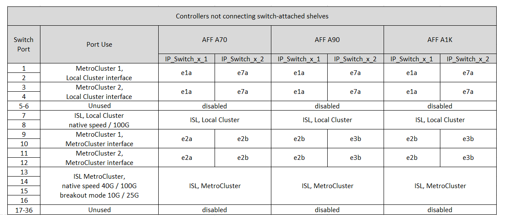

= Cisco 9336C-FX2 공유 스위치에 대한 플랫폼 포트 할당
:allow-uri-read: 
:icons: font
:imagesdir: ../media/

[role="lead"]
MetroCluster IP 구성에서 포트 사용은 스위치 모델 및 플랫폼 유형에 따라 다릅니다.

표를 사용하기 전에 다음 사항을 검토하십시오.

* 하나 이상의 MetroCluster 구성 또는 DR 그룹이 스위치 연결 NS224 쉘프를 지원해야 합니다.
* 스위치 연결 NS224 쉘프를 지원하지 않는 플랫폼은 2차 MetroCluster 구성으로만 연결하거나 2차 DR 그룹으로 연결할 수 있습니다.
* RcfFileGenerator는 첫 번째 플랫폼을 선택한 경우에만 적합한 플랫폼을 표시합니다.
* 1개의 8노드 또는 2개의 4노드 MetroCluster 구성을 연결하려면 ONTAP 9.14.1 이상이 필요합니다.

== 구성에 맞는 올바른 케이블 연결 표를 선택합니다

구성에 대한 올바른 포트 할당 표를 검토합니다. 이 섹션에는 두 가지 케이블 연결 테이블 세트가 있습니다.

* <<tables_connecting_ns224,스위치 연결 NS224 쉘프에 연결하는 컨트롤러의 케이블 연결 테이블>>
* <<tables_not_connecting_ns224,스위치 연결 NS224 쉘프에 연결되지 않은 컨트롤러의 케이블 연결 테이블>>

=== 스위치 연결 NS224 쉘프에 연결하는 컨트롤러

스위치 연결 NS224 쉘프에 연결하는 컨트롤러에 대해 따라야 할 포트 할당 표를 결정합니다.

[cols="2*"]
|===
| 플랫폼 | 케이블 연결 표 사용... 

| AFF A320 AFF C400, ASA C400 AFF A400, ASA A400 | <<table_1_cisco_9336c_fx2,Cisco 9336C-FX2 공유 스위치 플랫폼 포트 할당(그룹 1)>> 

| AFF A700 AFF C800, ASA C800, AFF A800 AFF A900, ASA A900 | <<table_2_cisco_9336c_fx2,Cisco 9336C-FX2 공유 스위치 플랫폼 포트 할당(그룹 2)>> 

| AFF A90 AFF A70 AFF A1K * 참고: * 이러한 시스템에는 ONTAP 9.15.1 이상이 필요합니다. | <<table_3_cisco_9336c_fx2,Cisco 9336C-FX2 공유 스위치 플랫폼 포트 할당(그룹 3)>> 
|===
.Cisco 9336C-FX2 공유 스위치 플랫폼 포트 할당(그룹 1)
스위치 연결 NSS24 쉘프를 Cisco 9336C-FX2 공유 스위치에 연결하는 AFF A320, AFF C400, ASA C400, AFF A400 또는 ASA A400 시스템에 케이블을 연결하기 위한 플랫폼 포트 할당을 검토합니다.

image::../media/mcc_ip_cabling_a320_c400_a400_to_cisco_9336c_shared_switch.png[에는 Cisco 9336C-FX2 공유 스위치 플랫폼 포트 할당이 나와 있습니다]

*참고 1*: X91440A 어댑터(40Gbps)를 사용하는 경우 e4a 및 e4e 또는 e4a 및 e8a 포트를 사용합니다. X91153A 어댑터(100Gbps)를 사용하는 경우 e4a 및 e4b 또는 e4a 및 e8a 포트를 사용합니다.

.Cisco 9336C-FX2 공유 스위치 플랫폼 포트 할당(그룹 2)
AFF A700, AFF C800, ASA C800, AFF A800, AFF A900 및 또는 스위치 연결 NSS24 쉘프를 Cisco 9336C-FX2 공유 스위치에 연결하는 ASA A900 시스템:

image::../media/mcc_ip_cabling_a700_c800_a800_a900_to_cisco_9336c_shared_switch.png[에는 Cisco 9336C-FX2 공유 스위치 플랫폼 포트 할당이 나와 있습니다]

*참고 1*: X91440A 어댑터(40Gbps)를 사용하는 경우 e4a 및 e4e 또는 e4a 및 e8a 포트를 사용합니다. X91153A 어댑터(100Gbps)를 사용하는 경우 e4a 및 e4b 또는 e4a 및 e8a 포트를 사용합니다.

.Cisco 9336C-FX2 공유 스위치 플랫폼 포트 할당(그룹 3)
스위치 연결 NSS24 쉘프를 Cisco 9336C-FX2 공유 스위치에 연결하는 AFF A90, AFF A70 또는 AFF A1K 시스템에 케이블을 연결하기 위한 플랫폼 포트 할당을 검토합니다.

NOTE: 이 표의 시스템에는 ONTAP 9.15.1 이상이 필요합니다.

image::../media/mcc_ip_cabling_a70_a90_a1k_to_cisco_9336c_shared_switch.png[에는 Cisco 9336C-FX2 공유 스위치 플랫폼 포트 할당이 나와 있습니다]

스위치가 연결된 클러스터의 경우 AFF A90 또는 AFF A70 노드의 동일한 클러스터 포트가 동일한 스위치에 있어야 합니다. 예를 들어, 노드1의 E1A와 노드2의 E1A는 하나의 클러스터 스위치에 연결되어야 합니다. 마찬가지로, 양쪽 노드의 두 번째 클러스터 포트를 두 번째 클러스터 스위치에 연결해야 합니다. 노드1의 E1A가 IP_Switch_x_1에 연결되고 노드2의 E1A가 IP_Switch_x_2에 연결된 공유 클러스터 HA 포트의 교차 연결은 HA 통신 실패를 방지합니다.

=== 컨트롤러가 스위치 연결 NS224 쉘프에 연결되지 않음

스위치 연결 NS224 쉘프에 연결되지 않은 컨트롤러에 대해 따라야 하는 포트 할당 표를 결정합니다.

[cols="2*"]
|===
| 플랫폼 | 케이블 연결 표 사용... 

| AFF A150, ASA A150 FAS2750, AFF A220 | <<table_4_cisco_9336c_fx2,Cisco 9336C-FX2 공유 스위치 플랫폼 포트 할당(그룹 4)>> 

| FAS500f AFF C250, ASA C250 AFF A250, ASA A250 | <<table_5_cisco_9336c_fx2,Cisco 9336C-FX2 공유 스위치 플랫폼 포트 할당(그룹 5)>> 

| FAS8200, AFF A300 | <<table_6_cisco_9336c_fx2,Cisco 9336C-FX2 공유 스위치 플랫폼 포트 할당(그룹 6)>> 

| AFF A320 FAS8300, AFF C400, ASA C400, FAS8700 AFF A400, ASA A400 | <<table_7_cisco_9336c_fx2,Cisco 9336C-FX2 공유 스위치 플랫폼 포트 할당(그룹 7)>> 

| FAS9000, AFF A700 AFF C800, ASA C800, AFF A800, ASA A800 FAS9500, AFF A900, ASA A900 탑재 | <<table_8_cisco_9336c_fx2,Cisco 9336C-FX2 공유 스위치 플랫폼 포트 할당(그룹 8)>> 

| AFF A70 AFF A90 AFF A1K * 참고: * 이러한 시스템에는 ONTAP 9.15.1 이상이 필요합니다. | <<table_9_cisco_9336c_fx2,Cisco 9336C-FX2 공유 스위치 플랫폼 포트 할당(그룹 9)>> 
|===
.Cisco 9336C-FX2 공유 스위치 플랫폼 포트 할당(그룹 4)
스위치가 연결된 NSS24 쉘프를 Cisco 9336C-FX2 공유 스위치에 연결하지 않는 AFF A150, ASA A150, FAS2750 또는 AFF A220 시스템에 케이블을 연결하기 위한 플랫폼 포트 할당을 검토합니다.

image::../media/mcc-ip-cabling-a-aff-a150-asa-a150-fas2750-aff-a220-to-a-cisco-9336c-shared-switch.png[에는 Cisco 9336C-FX2 공유 스위치 플랫폼 포트 할당이 나와 있습니다]

.Cisco 9336C-FX2 공유 스위치 플랫폼 포트 할당(그룹 5)
스위치 연결 NSS24 쉘프를 Cisco 9336C-FX2 공유 스위치에 연결하지 않는 FAS500f, AFF C250, ASA C250, AFF A250 또는 ASA A250 시스템에 케이블을 연결하기 위한 플랫폼 포트 할당을 검토합니다.

image::../media/mcc-ip-cabling-c250-asa-c250-a250-asa-a250-to-cisco-9336c-shared-switch.png[에는 Cisco 9336C-FX2 공유 스위치 플랫폼 포트 할당이 나와 있습니다]

.Cisco 9336C-FX2 공유 스위치 플랫폼 포트 할당(그룹 6)
스위치 연결 NSS24 쉘프를 Cisco 9336C-FX2 공유 스위치에 연결하지 않는 FAS8200 또는 AFF A300 시스템의 케이블을 연결하기 위한 플랫폼 포트 할당을 검토합니다.

image::../media/mcc-ip-cabling-fas8200-affa300-to-cisco-9336c-shared-switch.png[에는 Cisco 9336C-FX2 공유 스위치 플랫폼 포트 할당이 나와 있습니다]

.Cisco 9336C-FX2 공유 스위치 플랫폼 포트 할당(그룹 7)
AFF A320, FAS8300, AFF C400, ASA C400, FAS8700, 스위치 연결 NSS24 쉘프를 Cisco 9336C-FX2 공유 스위치에 연결하지 않는 AFF A400 또는 ASA A400 시스템:

image::../media/mcc_ip_cabling_a320_fas8300_a400_fas8700_to_a_cisco_9336c_shared_switch.png[에는 Cisco 9336C-FX2 공유 스위치 플랫폼 포트 할당이 나와 있습니다]

*참고 1*: X91440A 어댑터(40Gbps)를 사용하는 경우 e4a 및 e4e 또는 e4a 및 e8a 포트를 사용합니다. X91153A 어댑터(100Gbps)를 사용하는 경우 e4a 및 e4b 또는 e4a 및 e8a 포트를 사용합니다.

.Cisco 9336C-FX2 공유 스위치 플랫폼 포트 할당(그룹 8)
FAS9000, AFF A700, AFF C800, ASA C800, AFF A800, 스위치 연결 NSS24 쉘프를 Cisco 9336C-FX2 공유 스위치에 연결하지 않는 ASA A800, FAS9500, AFF A900 또는 ASA A900 시스템:

image::../media/mcc_ip_cabling_a700_a800_fas9000_fas9500_to_cisco_9336c_shared_switch.png[에는 Cisco 9336C-FX2 공유 스위치 플랫폼 포트 할당이 나와 있습니다]

*참고 1*: X91440A 어댑터(40Gbps)를 사용하는 경우 e4a 및 e4e 또는 e4a 및 e8a 포트를 사용합니다. X91153A 어댑터(100Gbps)를 사용하는 경우 e4a 및 e4b 또는 e4a 및 e8a 포트를 사용합니다.

.Cisco 9336C-FX2 공유 스위치 플랫폼 포트 할당(그룹 9)
스위치 연결 NSS24 쉘프를 Cisco 9336C-FX2 공유 스위치에 연결하지 않는 AFF A70, AFF A90 또는 AFF A1K 시스템에 케이블을 연결하기 위한 플랫폼 포트 할당을 검토합니다.

NOTE: 이 표의 시스템에는 ONTAP 9.15.1 이상이 필요합니다.

