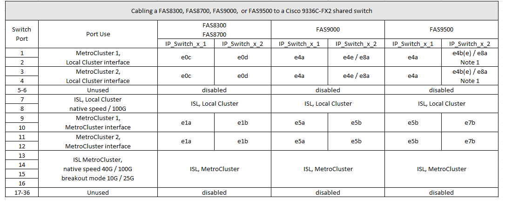

= Cisco 9336C-FX2 공유 스위치에 대한 플랫폼 포트 할당
:allow-uri-read: 
:icons: font
:imagesdir: ../media/

[role="lead"]
MetroCluster IP 구성에서 포트 사용은 스위치 모델 및 플랫폼 유형에 따라 다릅니다.

표를 사용하기 전에 다음 사항을 검토하십시오.

* 하나 이상의 MetroCluster 구성 또는 DR 그룹이 스위치 연결 NS224 쉘프를 지원해야 합니다.
* 스위치 연결 NS224 쉘프를 지원하지 않는 플랫폼은 2차 MetroCluster 구성으로만 연결하거나 2차 DR 그룹으로 연결할 수 있습니다.
* RcfFileGenerator는 첫 번째 플랫폼을 선택한 경우에만 적합한 플랫폼을 표시합니다.
* 1개의 8노드 또는 2개의 4노드 MetroCluster 구성을 연결하려면 ONTAP 9.14.1 이상이 필요합니다.

== AFF A320, AFF C400, ASA C400, AFF A400, ASA A400, AFF A700, AFF C800, ASA C800, AFF A800, AFF A900, 또는 ASA A900 시스템에서 Cisco 9336C-FX2 공유 스위치로 이동할 수 있습니다

image::../media/mcc_ip_cabling_a320_c400_a400_a700_c800_a800_a900_to_cisco_9336c_shared_switch.png[MCC IP 케이블 A320 C400 a400 a700 C800 A800 a900에서 Cisco 9336c 공유 스위치에 연결합니다]

*참고 1*: X91440A 어댑터(40Gbps)를 사용하는 경우 e4a 및 e4e 또는 e4a 및 e8a 포트를 사용합니다. X91153A 어댑터(100Gbps)를 사용하는 경우 e4a 및 e4b 또는 e4a 및 e8a 포트를 사용합니다.

== AFF A150, ASA A150, FAS2750 또는 AFF A220 시스템을 Cisco 9336C-FX2 공유 스위치에 케이블 연결합니다

image::../media/mcc_ip_cabling_a_aff_a150_asa_a150_fas27500_aff_a220_to_a_cisco_9336c_shared_switch.png[AFF a150 ASA a150 fas27500 AFF A220을 Cisco 9336c 공유 스위치에 MCC IP 케이블로 연결합니다]

== FAS500f, AFF C250, ASA C250, AFF A250 또는 ASA A250 시스템을 Cisco 9336C-FX2 공유 스위치에 케이블 연결합니다

image::../media/mcc_ip_cabling_c250_asa_c250_a250_asa_a250_to_cisco_9336c_shared_switch.png[MCC IP 케이블 연결 c250 ASA c250 A250 ASA A250 - Cisco 9336c 공유 스위치]

== FAS8200 또는 AFF A300 시스템을 Cisco 9336C-FX2 공유 스위치에 케이블 연결

image::../media/mcc_ip_cabling_fas8200_affa300_to_cisco_9336c_shared_switch.png[Cisco 9336c 공유 스위치에 대한 MCC IP 케이블 연결 fas8200 affa300입니다]

== FAS8300, FAS8700, FAS9000 또는 FAS9500 시스템을 Cisco 9336C-FX2 공유 스위치에 케이블로 연결합니다

*참고 1*: X91440A 어댑터(40Gbps)를 사용하는 경우 e4a 및 e4e 또는 e4a 및 e8a 포트를 사용합니다. X91153A 어댑터(100Gbps)를 사용하는 경우 e4a 및 e4b 또는 e4a 및 e8a 포트를 사용합니다.
