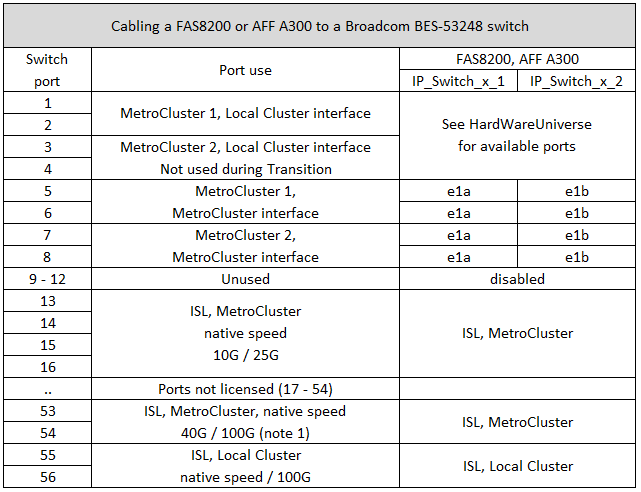

= Broadcom 지원 BES-53248 IP 스위치에 대한 플랫폼 포트 할당
:icons: font
:imagesdir: ../media/

[role="lead"]
MetroCluster IP 구성에서 포트 사용은 스위치 모델 및 플랫폼 유형에 따라 다릅니다.

스위치는 속도가 다른 원격 ISL 포트(예: 10Gbps ISL 포트에 연결된 25Gbps 포트)와 함께 사용할 수 없습니다.

.아래 표에 대한 참고 사항:
. 일부 플랫폼의 경우 MetroCluster ISL 또는 MetroCluster 인터페이스 연결에 포트 49-54를 사용할 수 있습니다.
+
이러한 포트에는 추가 라이센스가 필요합니다.

. A320을 사용하는 단일 4노드 MetroCluster만 스위치에 연결할 수 있습니다.
+
MetroCluster FC에서 IP로의 전환 및 기술 업데이트 절차를 포함하여 스위치 클러스터가 필요한 기능은 이 구성에서 지원되지 않습니다.

. Broadcom BES-53248 스위치로 구성된 AFF A320 시스템은 일부 기능을 지원하지 않을 수 있습니다.
+
로컬 클러스터 연결이 스위치에 연결되어야 하는 구성 또는 기능은 지원되지 않습니다. 예를 들어 다음 구성 및 절차는 지원되지 않습니다.

+
** 8노드 MetroCluster 구성
** MetroCluster FC에서 MetroCluster IP 구성으로 전환
** 4노드 MetroCluster IP 구성 업데이트(ONTAP 9.8 이상)

== AFF A220 또는 FAS2750 시스템의 스위치 포트 사용

image::../media/mcc_ip_cabling_a_aff_a220_or_fas2750_to_a_broadcom_bes_53248_switch.png[MCC IP 케이블 연결: AFF A220 또는 fas2750을 Broadcom의 53248 스위치에 연결합니다]

== AFF A250 또는 FAS500f 시스템의 스위치 포트 사용

image::../media/mcc_ip_cabling_a_aff_a250_or_fas500f_to_a_broadcom_bes_53248_switch.png[MCC IP 케이블 AFF A250 또는 fas500f를 Broadcom의 53248 스위치에 연결합니다]

== AFF A300 또는 FAS8200 시스템에 대한 스위치 포트 사용

image::../media/mcc_ip_cabling_a_aff_a320_to_a_broadcom_bes_53248_switch.png[MCC IP Broadcom의 53248 스위치에 AFF A320 케이블 연결]

== AFF A400, FAS8300 또는 FAS8700 시스템의 스위치 포트 사용량

image::../media/mcc_ip_cabling_a_fas8300_a400_or_fas8700_to_a_broadcom_bes_53248_switch.png[MCC IP 케이블 연결 fas8300 a400 또는 fas8700에서 Broadcom bes 53248 스위치에 연결합니다]
