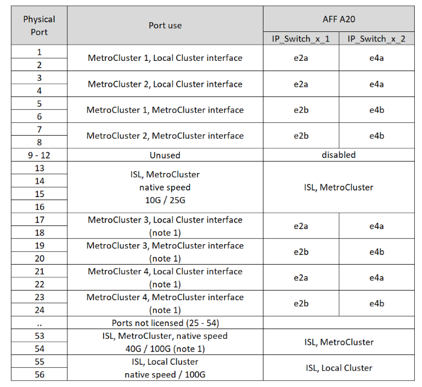

= Broadcom 지원 BES-53248 IP 스위치에 대한 플랫폼 포트 할당
:allow-uri-read: 
:icons: font
:imagesdir: ../media/

[role="lead"]
MetroCluster IP 구성에서 포트 사용은 스위치 모델 및 플랫폼 유형에 따라 다릅니다.

구성 테이블을 사용하기 전에 다음 고려 사항을 검토하십시오.

* 속도가 다른 원격 ISL 포트(예: 10Gbps ISL 포트에 연결된 25Gbps 포트)에서는 스위치를 사용할 수 없습니다.
* MetroCluster FC에서 IP로의 전환을 위해 스위치를 구성하는 경우 선택하는 타겟 플랫폼에 따라 다음 포트가 사용됩니다.
+
[cols="75,25"]
|===
| 대상 플랫폼 | 포트 

| FAS500f, AFF C250, ASA C250, AFF A250, ASA A250, FAS8300, AFF C400, ASA C400, AFF A400, ASA A400, 또는 FAS8700 플랫폼을 지원합니다 | 포트 1-6, 10Gbps 

| FAS8200 또는 AFF A300 플랫폼 | 포트 3-4 및 9-12, 10Gbps 
|===
* Broadcom BES-53248 스위치로 구성된 AFF A320 시스템은 일부 기능을 지원하지 않을 수 있습니다.
+
로컬 클러스터 연결이 스위치에 연결되어야 하는 구성 또는 기능은 지원되지 않습니다. 예를 들어 다음 구성 및 절차는 지원되지 않습니다.

+
** 8노드 MetroCluster 구성
** MetroCluster FC에서 MetroCluster IP 구성으로 전환
** 4노드 MetroCluster IP 구성 업데이트(ONTAP 9.8 이상)

== 구성에 맞는 올바른 케이블 연결 표를 선택합니다

다음 표를 사용하여 따라야 할 케이블 연결 테이블을 결정합니다.

[cols="25,75"]
|===
| 시스템이 다음과 같은 경우... | 케이블 연결 표 사용... 

 a| 
AFF A150, ASA A150

FAS2750

AFF A220
| <<table_1_bes_53248,Broadcom BES-53248 플랫폼 포트 할당(그룹 1)>> 

| FAS500f AFF C250, ASA C250 AFF A250, ASA A250 | <<table_2_bes_53248,Broadcom BES-53248 플랫폼 포트 할당(그룹 2)>> 

| AFF A20 를 참조하십시오 | <<table_3_bes_53248,Broadcom BES-53248 플랫폼 포트 할당(그룹 3)>> 

| AFF C30, AFF A30 FAS50 AFF C60 | <<table_4_bes_53248,Broadcom BES-53248 플랫폼 포트 할당(그룹 4)>> 

| FAS8200, AFF A300 | <<table_5_bes_53248,Broadcom BES-53248 플랫폼 포트 할당(그룹 5)>> 

| AFF A320 | <<table_6_bes_53248,Broadcom BES-53248 플랫폼 포트 할당(그룹 6)>> 

| FAS8300 AFF C400, ASA C400 AFF A400, ASA A400 FAS8700 | <<table_7_bes_53248,Broadcom BES-53248 플랫폼 포트 할당(그룹 7)>> 
|===
.Broadcom BES-53248 플랫폼 포트 할당(그룹 1)
AFF A150, ASA A150, FAS2750 또는 AFF A220 시스템을 Broadcom BES-53248 스위치에 케이블로 연결하기 위한 플랫폼 포트 할당을 검토합니다.

image::../media/mcc_ip_cabling_a_aff_asa_a150_a220_fas2750_to_a_broadcom_bes_53248_switch.png[에서는 Broadcom BES-53248 플랫폼 포트 할당을 보여 줍니다]

* *참고 1*: 이 포트를 사용하려면 추가 라이센스가 필요합니다.
* 두 MetroCluster 구성이 동일한 플랫폼을 사용하는 경우 NetApp는 하나의 구성에 대해 그룹 "MetroCluster 3"을 선택하고 다른 구성에 대해 그룹 "MetroCluster 4"를 선택하는 것이 좋습니다. 플랫폼이 다른 경우 첫 번째 구성은 "MetroCluster 3" 또는 "MetroCluster 4"를, 두 번째 구성은 "MetroCluster 1" 또는 "MetroCluster 2"를 선택해야 합니다.

.Broadcom BES-53248 플랫폼 포트 할당(그룹 2)
FAS500f, AFF C250, ASA C250, AFF A250 또는 ASA A250 시스템을 Broadcom BES-53248 스위치에 케이블로 연결하기 위한 플랫폼 포트 할당을 검토합니다.

image::../media/mcc_ip_cabling_a_aff_asa_c250_a250_fas500f_to_a_broadcom_bes_53248_switch.png[에서는 Broadcom BES-53248 플랫폼 포트 할당을 보여 줍니다]

* *참고 1*: 이 포트를 사용하려면 추가 라이센스가 필요합니다.
* 두 MetroCluster 구성이 동일한 플랫폼을 사용하는 경우 NetApp는 하나의 구성에 대해 그룹 "MetroCluster 3"을 선택하고 다른 구성에 대해 그룹 "MetroCluster 4"를 선택하는 것이 좋습니다. 플랫폼이 다른 경우 첫 번째 구성은 "MetroCluster 3" 또는 "MetroCluster 4"를, 두 번째 구성은 "MetroCluster 1" 또는 "MetroCluster 2"를 선택해야 합니다.

.Broadcom BES-53248 플랫폼 포트 할당(그룹 3)
AFF A20 시스템을 Broadcom BES-53248 스위치에 케이블로 연결하기 위한 플랫폼 포트 할당을 검토합니다.

* *참고 1*: 이 포트를 사용하려면 추가 라이센스가 필요합니다.

.Broadcom BES-53248 플랫폼 포트 할당(그룹 4)
4포트 25G 이더넷 카드를 사용하여 AFF A30, AFF C30, AFF C60 또는 FAS50 시스템을 Broadcom BES-53248 스위치에 케이블로 연결하는 플랫폼 포트 할당을 검토합니다.

[NOTE]
====
* 이 구성에서는 로컬 클러스터와 HA 인터페이스를 연결하기 위해 슬롯 4에 4포트 25G 이더넷 카드가 필요합니다.
* 이 구성에서는 25Gbps 네트워크 속도를 지원하려면 컨트롤러의 카드에 QSFP-SFP+ 어댑터가 필요합니다.

====
image:../media/mccip-cabling-bes-a30-c30-fas50-c60-25G.png["에서는 Broadcom BES-53248 플랫폼 포트 할당을 보여 줍니다"]

* *참고 1*: 이 포트를 사용하려면 추가 라이센스가 필요합니다.

.Broadcom BES-53248 플랫폼 포트 할당(그룹 5)
FAS8200 또는 AFF A300 시스템을 Broadcom BES-53248 스위치에 케이블로 연결하기 위한 플랫폼 포트 할당을 검토합니다.

image::../media/mcc-ip-cabling-a-aff-a300-or-fas8200-to-a-broadcom-bes-53248-switch-9161.png[에서는 Broadcom BES-53248 플랫폼 포트 할당을 보여 줍니다]

* *참고 1*: 이 포트를 사용하려면 추가 라이센스가 필요합니다.

.Broadcom BES-53248 플랫폼 포트 할당(그룹 6)
AFF A320 시스템을 Broadcom BES-53248 스위치에 케이블로 연결하기 위한 플랫폼 포트 할당을 검토합니다.

image::../media/mcc-ip-cabling-a-aff-a320-to-a-broadcom-bes-53248-switch.png[에서는 Broadcom BES-53248 플랫폼 포트 할당을 보여 줍니다]

* *참고 1*: 이 포트를 사용하려면 추가 라이센스가 필요합니다.
* *참고 2*: AFF A320 시스템을 사용하는 단일 4-노드 MetroCluster만 스위치에 연결할 수 있습니다.
+
스위치 클러스터가 필요한 기능은 이 구성에서 지원되지 않습니다. MetroCluster FC에서 IP로의 전환 및 기술 업데이트 절차가 포함됩니다.

.Broadcom BES-53248 플랫폼 포트 할당(그룹 7)
FAS8300, AFF C400, ASA C400, AFF A400, ASA A400, 케이블 연결을 위한 플랫폼 포트 할당 검토 또는 FAS8700 시스템에서 Broadcom BES-53248 스위치로 마이그레이션합니다.

image::../media/mcc-ip-cabling-a-fas8300-a400-c400-or-fas8700-to-a-broadcom-bes-53248-switch.png[에서는 Broadcom BES-53248 플랫폼 포트 할당을 보여 줍니다]

* *참고 1*: 이 포트를 사용하려면 추가 라이센스가 필요합니다.
* *참고 2*: AFF A320 시스템을 사용하는 단일 4-노드 MetroCluster만 스위치에 연결할 수 있습니다.
+
스위치 클러스터가 필요한 기능은 이 구성에서 지원되지 않습니다. MetroCluster FC에서 IP로의 전환 및 기술 업데이트 절차가 포함됩니다.

