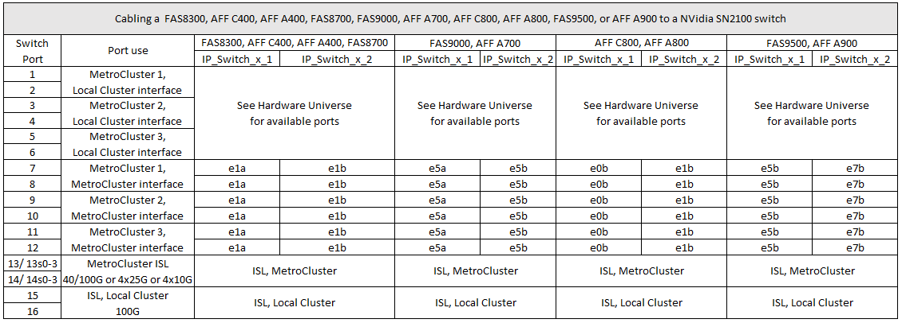

= NVIDIA 지원 SN2100 IP 스위치를 위한 플랫폼 포트 할당
:allow-uri-read: 
:icons: font
:imagesdir: ../media/

[role="lead"]
MetroCluster IP 구성에서 포트 사용은 스위치 모델 및 플랫폼 유형에 따라 다릅니다.

== 지원되는 구성

현재 지원되는 플랫폼은 다음과 같습니다.

* FAS500f/AFF C250/AFF A250
* FAS8300/AFF C400/AFF A400
* FAS8700
* FAS9000/AFF A700
* AFF C800/AFF A800

다음 플랫폼 및 구성은 현재 지원되지 않습니다.

* MetroCluster FC-to-IP 전환
* 8노드 MetroCluster 구성

.구성 테이블을 사용하기 전에 이러한 고려 사항을 검토하십시오
여러 MetroCluster 구성에 케이블을 연결하는 경우 해당 표를 따르십시오. 예를 들면 다음과 같습니다.

* AFF A700 유형의 4노드 MetroCluster 구성 2개를 케이블로 연결한 경우 첫 번째 MetroCluster를 "MetroCluster 1"로 연결하고 두 번째 MetroCluster를 AFF A700 표에서 "MetroCluster 2"로 연결합니다.

NOTE: 포트 13 및 14는 40Gbps 및 100Gbps를 지원하는 기본 속도 모드 또는 4 × 25Gbps 또는 4 × 10Gbps 지원을 위한 브레이크아웃 모드에서 사용할 수 있습니다. 기본 속도 모드를 사용하는 경우 포트 13과 14로 표시됩니다. 브레이크아웃 모드(4×25Gbps 또는 4×10Gbps)를 사용하는 경우 포트 13s0-3 및 14s0-3으로 표시됩니다.

다음 섹션에서는 물리적 케이블 연결 개요에 대해 설명합니다. 를 참조할 수도 있습니다 https://["RcfFileGenerator 를 참조하십시오"] 케이블 연결에 대한 자세한 내용은 을 참조하십시오.

== FAS500f, AFF C250 또는 AFF A250의 스위치 포트 사용

image::../media/mcc_ip_cabling_A250_C250_MSN2100.png[MCC IP 케이블 A250 C250 MSN2100]

== AFF C400, AFF A400, AFF A700 또는 FAS9000, FAS8300 또는 FAS8700 AFF A800의 스위치 포트 사용

