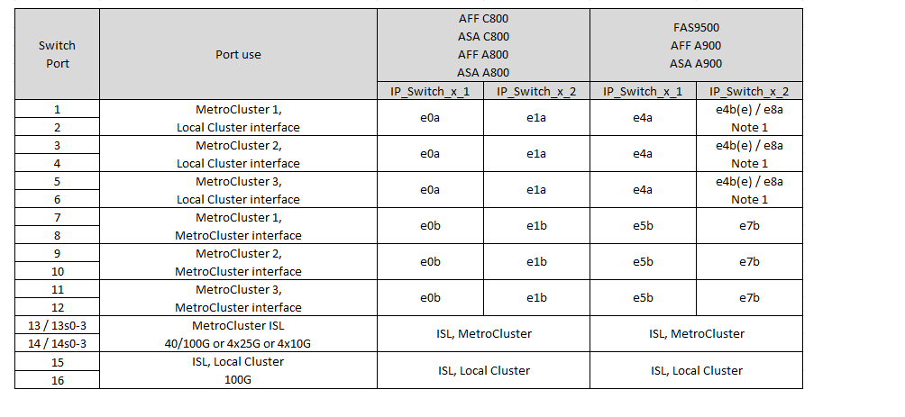

= NVIDIA 지원 SN2100 IP 스위치를 위한 플랫폼 포트 할당
:allow-uri-read: 
:icons: font
:imagesdir: ../media/

[role="lead"]
MetroCluster IP 구성에서 포트 사용은 스위치 모델 및 플랫폼 유형에 따라 다릅니다.

구성 테이블을 사용하기 전에 다음 고려 사항을 검토하십시오.

* 8노드 또는 2개의 4노드 MetroCluster 구성을 연결하려면 ONTAP 9.14.1 이상 및 RCF 파일 버전 2.00 이상이 필요합니다.
+

NOTE: RCF 파일 버전은 파일을 생성하는 데 사용되는 RCFfilegenerator 도구의 버전과 다릅니다. 예를 들어 RCFfilegenerator v1.6c를 사용하여 RCF 파일 버전 2.00을 생성할 수 있습니다.

* 여러 MetroCluster 구성에 케이블을 연결하는 경우 해당 표를 따르십시오. 예를 들면 다음과 같습니다.
+
** AFF A700 유형의 4노드 MetroCluster 구성 2개를 케이블로 연결한 경우 첫 번째 MetroCluster를 "MetroCluster 1"로 연결하고 두 번째 MetroCluster를 AFF A700 표에서 "MetroCluster 2"로 연결합니다.

NOTE: 포트 13 및 14는 40Gbps 및 100Gbps를 지원하는 기본 속도 모드 또는 4 × 25Gbps 또는 4 × 10Gbps 지원을 위한 브레이크아웃 모드에서 사용할 수 있습니다. 기본 속도 모드를 사용하는 경우 포트 13과 14로 표시됩니다. 브레이크아웃 모드(4×25Gbps 또는 4×10Gbps)를 사용하는 경우 포트 13s0-3 및 14s0-3으로 표시됩니다.

다음 섹션에서는 물리적 케이블 연결 개요에 대해 설명합니다. 를 참조할 수도 있습니다 https://mysupport.netapp.com/site/tools/tool-eula/rcffilegenerator["RcfFileGenerator 를 참조하십시오"] 케이블 연결에 대한 자세한 내용은 을 참조하십시오.

== 구성에 맞는 올바른 케이블 연결 표를 선택합니다

다음 표를 사용하여 따라야 할 케이블 연결 테이블을 결정합니다.

[cols="2*"]
|===
| 시스템이 다음과 같은 경우... | 케이블 연결 표 사용... 

 a| 
AFF A150, ASA A150

500f로 설정합니다

AFF C250, ASA C250

AFF A250, ASA A250
| <<table_1_nvidia_sn2100,NVIDIA SN2100 플랫폼 포트 할당(그룹 1)>> 

| AFF A20 를 참조하십시오 | <<table_2_nvidia_sn2100,NVIDIA SN2100 플랫폼 포트 할당(그룹 2)>> 

| AFF C30, AFF A30 AFF C60 | <<table_3_nvidia_sn2100,NVIDIA SN2100 플랫폼 포트 할당(그룹 3)>> 

| FAS8300 AFF C400, ASA C400 AFF A400, ASA A400 FAS8700 FAS9000, AFF A700 | <<table_4_nvidia_sn2100,NVIDIA SN2100 플랫폼 포트 할당(그룹 4)>> 

| AFF A50 를 참조하십시오 | <<table_5_nvidia_sn2100,NVIDIA SN2100 플랫폼 포트 할당(그룹 5)>> 

| AFF C800, ASA C800 AFF A800, ASA A800 FAS9500 AFF A900, ASA A900 | <<table_6_nvidia_sn2100,NVIDIA SN2100 플랫폼 포트 할당(그룹 6)>> 

| FAS70, AFF A70 AFF C80 FAS90, AFF A90 AFF A1K | <<table_7_nvidia_sn2100,NVIDIA SN2100 플랫폼 포트 할당(그룹 7)>> 
|===
.NVIDIA SN2100 플랫폼 포트 할당(그룹 1)
AFF A150, ASA A150, FAS500f, AFF C250, ASA C250, AFF A250 또는 ASA A250 시스템에서 NVIDIA SN2100 스위치로 연결:

[#table_1_nvidia_sn2100]
image::../media/mcc-ip-cabling-aff-asa-a150-fas500f-a25-c250-MSN2100.png[에는 NVIDIA SN2100 플랫폼 포트 할당이 나와 있습니다]

.NVIDIA SN2100 플랫폼 포트 할당(그룹 2)
AFF A20 시스템을 NVIDIA SN2100 스위치에 케이블로 연결하기 위한 플랫폼 포트 할당을 검토합니다.

[#table_2_nvidia_sn2100]
image::../media/mccip-cabling-aff-a20-nvidia-sn2100.png[에는 NVIDIA SN2100 플랫폼 포트 할당이 나와 있습니다]

.NVIDIA SN2100 플랫폼 포트 할당(그룹 3)
플랫폼 포트 할당을 검토하여 AFF C30, AFF A30 또는 AFF C60 시스템을 NVIDIA SN2100 스위치에 연결합니다.

[#table_3_nvidia_sn2100]
image::../media/mccip-cabling-aff-a30-c30-c60-nvidia-sn2100.png[에는 NVIDIA SN2100 플랫폼 포트 할당이 나와 있습니다]

.NVIDIA SN2100 플랫폼 포트 할당(그룹 4)
FAS8300, AFF C400, ASA C400, AFF A400, ASA A400, 케이블 연결을 위한 플랫폼 포트 할당 검토 FAS8700, FAS9000 또는 AFF A700 시스템에서 NVIDIA SN2100 스위치로 연결:

image::../media/mccip-cabling-fas8300-aff-a400-c400-a700-fas900-nvidaia-sn2100.png[에는 NVIDIA SN2100 플랫폼 포트 할당이 나와 있습니다]

*참고 1*: X91440A 어댑터(40Gbps)를 사용하는 경우 e4a 및 e4e 또는 e4a 및 e8a를 사용합니다. X91153A 어댑터(100Gbps)를 사용하는 경우 포트 e4a 및 e4b 또는 e4a 및 e8a를 사용합니다.

.NVIDIA SN2100 플랫폼 포트 할당(그룹 5)
AFF A50 시스템을 NVIDIA SN2100 스위치에 케이블로 연결하기 위한 플랫폼 포트 할당을 검토합니다.

[#table_5_nvidia_sn2100]
image::../media/mccip-cabling-aff-a50-nvidia-sn2100.png[에는 NVIDIA SN2100 플랫폼 포트 할당이 나와 있습니다]

.NVIDIA SN2100 플랫폼 포트 할당(그룹 6)
AFF C800, ASA C800, AFF A800, ASA A800, FAS9500, AFF A900 또는 ASA A900 시스템에서 NVIDIA SN2100 스위치로 연결:

*참고 1*: X91440A 어댑터(40Gbps)를 사용하는 경우 e4a 및 e4e 또는 e4a 및 e8a를 사용합니다. X91153A 어댑터(100Gbps)를 사용하는 경우 포트 e4a 및 e4b 또는 e4a 및 e8a를 사용합니다.

.NVIDIA SN2100 플랫폼 포트 할당(그룹 7)
FAS70, AFF A70, AFF C80, FAS90, AFF A90 또는 AFF A1K 시스템을 NVIDIA SN2100 스위치에 케이블로 연결하기 위한 플랫폼 포트 할당을 검토합니다.

image::../media/mccip-cabling-fas90-fas70-aff-a70--a90-c80-a1k-nvidia-sn2100-updated.png[에는 NVIDIA SN2100 플랫폼 포트 할당이 나와 있습니다]
