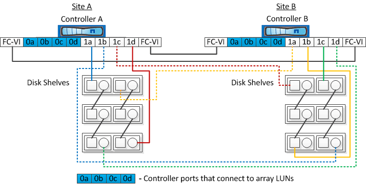

= 디스크 및 어레이 LUN이 있는 2노드 스트레치 MetroCluster 구성의 예
:allow-uri-read: 
:icons: font
:imagesdir: ../media/

[role="lead"]
기본 디스크 및 어레이 LUN을 사용하여 확장 MetroCluster 구성을 설정하려면 FC-to-SAS 브릿지 또는 SAS 광 케이블을 사용하여 ONTAP 시스템을 디스크 쉘프에 연결해야 합니다. 또한 FC 스위치를 사용하여 스토리지 LUN을 ONTAP 시스템에 접속해야 합니다.

ONTAP 시스템이 기본 디스크와 스토리지 LUN 모두에 접속하려면 최소 8개의 HBA 포트가 필요합니다.

디스크 및 어레이 LUN이 있는 2노드 스트레치 MetroCluster 구성을 나타내는 다음 예에서는 스토리지 LUN에 연결하는 데 HBA 포트 0a에서 0d를 사용합니다. HBA 포트 1a~1d는 기본 디스크와의 연결에 사용됩니다.

다음 그림에서는 SAS 광 케이블을 사용하여 기본 디스크를 ONTAP 시스템에 연결하는 2노드 스트레치 MetroCluster 구성을 보여 줍니다.

다음 그림에서는 네이티브 디스크가 FC-to-SAS 브리지를 사용하여 ONTAP 시스템에 연결되는 2노드 스트레치 MetroCluster 구성을 보여 줍니다.

image::../media/two_node_mcc_combined_armadillo.gif[2노드 MCC Combined armadillo]

다음 그림에서는 스토리지 LUN 연결이 있는 2노드 스트레치 MetroCluster 구성을 보여 줍니다.

image::../media/two_node_mcc_combined_array_luns.gif[2노드 MCC가 결합된 스토리지 LUN]

NOTE: 필요한 경우 동일한 FC 스위치를 사용하여 MetroCluster 구성의 컨트롤러에 기본 디스크와 어레이 LUN을 모두 연결할 수도 있습니다.

https://["패브릭 연결 MetroCluster 설치 및 구성"]
