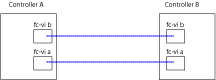

= 컨트롤러를 서로 및 스토리지 쉘프에 케이블로 연결합니다
:allow-uri-read: 
:icons: font
:imagesdir: ../media/

[role="lead"]
컨트롤러 FC-VI 어댑터는 서로 직접 케이블로 연결되어야 합니다. 컨트롤러 SAS 포트는 원격 및 로컬 스토리지 스택 모두에 케이블로 연결되어야 합니다.

이 작업은 두 MetroCluster 사이트 모두에서 수행해야 합니다.

.단계
. FC-VI 포트에 케이블을 연결합니다.
+

+
위 그림은 대표적인 케이블 연결입니다. 특정 FC-VI 포트는 컨트롤러 모듈에 따라 다릅니다.

+
** FAS8200 및 AFF A300 컨트롤러 모듈은 FC-VI 연결을 위한 2가지 옵션 중 하나와 함께 주문할 수 있습니다.
+
*** 온보드 포트 0e 및 0f는 FC-VI 모드로 구성됩니다.
*** FC-VI 카드의 포트 1a 및 1b는 슬롯 1에 있습니다.

** AFF A700 및 FAS9000 스토리지 시스템 컨트롤러 모듈은 각각 4개의 FC-VI 포트를 사용합니다.
** AFF A400 및 FAS8300 스토리지 시스템 컨트롤러 모듈은 FC-VI 포트 2a 및 2b를 사용합니다.

. SAS 포트에 케이블을 연결합니다.
+
다음 그림에서는 연결을 보여 줍니다. 포트 사용은 컨트롤러 모듈에서 사용 가능한 SAS 및 FC-VI 포트에 따라 다를 수 있습니다.

+
image::../media/mcc_two_node_optical_sas_space_configuration.png[MCC 2노드 광 SAS 공간 구성]

