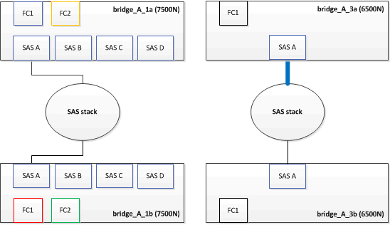
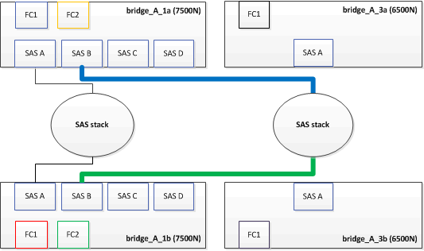
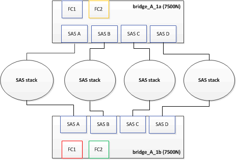
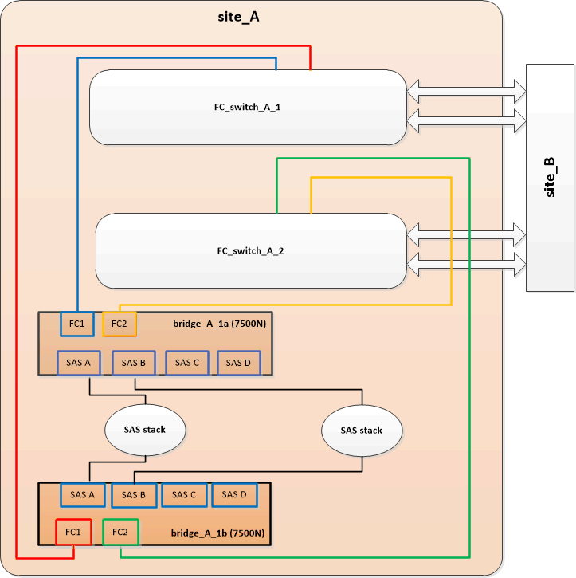

= FiberBridge 6500N 브리지 쌍을 7600N 또는 7500N 브리지로 교체
:allow-uri-read: 
:icons: font
:imagesdir: ../media/

[role="lead"]
FiberBridge 7600N 또는 7500N 브리지의 추가 FC2 포트를 활용하고 랙 사용률을 줄이기 위해 6500N 브리지를 중단 없이 교체하고 FiberBridge 7600N 또는 7500N 브리지 한 쌍 뒤에 최대 4개의 스토리지 스택을 통합할 수 있습니다.

.시작하기 전에
FTP 또는 SCP 서버에 대한 액세스 및 관리자 암호가 필요합니다.

.이 작업에 대해
다음과 같은 경우 이 절차를 사용해야 합니다.

* FiberBridge 6500N 브리지를 FiberBridge 7600N 또는 7500N 브리지로 교체하려는 경우
+
교체 후 쌍의 두 브리지는 모두 동일한 모델이어야 합니다.

* 이전에는 단일 FiberBridge 6500N 브리지를 7600N 또는 7500N 브리지로 교체했으며, 이제는 페어의 두 번째 브리지를 교체하고 있습니다.
* 사용 가능한 SAS 포트가 있는 FiberBridge 7600N 또는 7500N 브리지 쌍이 있으며, 현재 FiberBridge 6500N 브리지를 사용하여 연결된 SAS 스토리지 스택을 통합하고 있습니다.

이 절차는 무중단으로 진행되며 완료까지 약 2시간이 소요됩니다.

.관련 정보
link:task_replace_a_sle_fc_to_sas_bridge.html["단일 FC-to-SAS 브릿지 교체"]

== 스토리지 접속을 확인하는 중입니다

브리지를 교체하기 전에 브리지 및 스토리지 연결을 확인해야 합니다. 명령 출력에 익숙해질 경우 구성을 변경한 후 나중에 연결을 확인할 수 있습니다.

유지보수 중인 사이트의 MetroCluster 구성에 있는 컨트롤러 모듈의 admin 프롬프트에서 이러한 명령을 실행할 수 있습니다.

. MetroCluster 노드 중 하나에 다음 명령을 입력하여 디스크 연결을 확인합니다.
+
로컬 sysconfig -v를 실행합니다

+
이 출력에서는 컨트롤러의 이니시에이터 포트에 연결된 디스크를 표시하고 FC-to-SAS 브리지에 연결된 쉘프를 식별합니다.

+
[listing]
----

node_A_1> run local sysconfig -v
NetApp Release 9.3.2X18: Sun Dec 13 01:23:24 PST 2017
System ID: 4068741258 (node_A_1); partner ID: 4068741260 (node_B_1)
System Serial Number: 940001025471 (node_A_1)
System Rev: 70
System Storage Configuration: Multi-Path HA**<=== Configuration should be multi-path HA**
.
.
.
slot 0: FC Host Adapter 0g (QLogic 8324 rev. 2, N-port, <UP>)**<=== Initiator port**
		Firmware rev:      7.5.0
		Flash rev:         0.0.0
		Host Port Id:      0x60130
		FC Node Name:      5:00a:098201:bae312
		FC Port Name:      5:00a:098201:bae312
		SFP Vendor:        UTILITIES CORP.
		SFP Part Number:   FTLF8529P3BCVAN1
		SFP Serial Number: URQ0Q9R
		SFP Capabilities:  4, 8 or 16 Gbit
		Link Data Rate:    16 Gbit
		Switch Port:       brcd6505-fcs40:1
  **<List of disks visible to port\>**
		 ID     Vendor   Model            FW    Size
		brcd6505-fcs29:12.126L1527     : NETAPP   X302_HJUPI01TSSM NA04 847.5GB (1953525168 512B/sect)
		brcd6505-fcs29:12.126L1528     : NETAPP   X302_HJUPI01TSSA NA02 847.5GB (1953525168 512B/sect)
		.
		.
		.
		**<List of FC-to-SAS bridges visible to port\>**
		FC-to-SAS Bridge:
		brcd6505-fcs40:12.126L0        : ATTO     FibreBridge6500N 1.61  FB6500N102980
		brcd6505-fcs42:13.126L0        : ATTO     FibreBridge6500N 1.61  FB6500N102980
		brcd6505-fcs42:6.126L0         : ATTO     FibreBridge6500N 1.61  FB6500N101167
		brcd6505-fcs42:7.126L0         : ATTO     FibreBridge6500N 1.61  FB6500N102974
		.
		.
		.
  **<List of storage shelves visible to port\>**
		brcd6505-fcs40:12.shelf6: DS4243  Firmware rev. IOM3 A: 0200  IOM3 B: 0200
		brcd6505-fcs40:12.shelf8: DS4243  Firmware rev. IOM3 A: 0200  IOM3 B: 0200
		.
		.
		.
----

== FiberBridge 6500N 브리지를 핫 스왑하여 FiberBridge 7600N 또는 7500N 브리지 쌍을 생성합니다

FiberBridge 7600N 또는 7500N 브리지 쌍을 사용하여 구성을 만들려면 브리지를 한 번에 하나씩 교체하고 올바른 케이블 연결 절차를 따라야 합니다. 새 케이블은 원래 케이블과 다릅니다.

.이 작업에 대해
다음 조건이 참인 경우에도 이 절차를 사용할 수 있습니다.

* 두 브리지 모두 동일한 SAS 스토리지 스택에 연결된 FiberBridge 6500N 브리지 쌍을 교체하고 있습니다.
* 이전에 페어에서 FiberBridge 6500N 브리지 하나를 교체했으며, 스토리지 스택은 FiberBridge 6500N 브리지 1개와 FiberBridge 7600N 브리지 1개 또는 7500N 브리지로 구성됩니다.
+
이 경우 FiberBridge 7600N 또는 7500N 브리지를 사용하여 ""하단"" FiberBridge 6500N 브리지를 핫 스왑하려면 아래 단계부터 시작해야 합니다.

다음 다이어그램은 FiberBridge 6500N 브리지 4개가 SAS 스토리지 스택 2개를 연결하는 초기 구성의 예를 보여 줍니다.

image::../media/consolidating_stacks_before.gif[이전 스택 통합]

.단계
. 다음 지침에 따라 의 절차에 따라 FiberBridge 7600N 또는 7500N 브리지와 ""상단" FiberBridge 6500N 브리지를 핫 스왑합니다 link:task_replace_a_sle_fc_to_sas_bridge.html["FiberBridge 7600N 브리지를 FiberBridge 7600N 또는 7500N 브리지로 핫 스와핑합니다"]:
+
** FiberBridge 7600N 또는 7500N 브리지 FC1 포트를 스위치 또는 컨트롤러에 연결합니다.
+
이는 FiberBridge 6500N 브리지 FC1 포트와 동일한 연결입니다.

** 이때 FiberBridge 7600N 또는 7500N 브리지 FC2 포트를 연결하지 마십시오. 다음 다이어그램에서는 bridge_a_1a가 교체되었으며 현재 FiberBridge 7600N 또는 7500N 브리지임을 보여 줍니다.

+
image::../media/consolidating_stacks_1st_7500n_in_place.gif[스택 첫 번째 7500n을 제자리에 통합]

. 브리지 연결 디스크에 대한 연결을 확인하고 새 FiberBridge 7500N이 구성에 표시되는지 확인합니다.
+
로컬 sysconfig -v를 실행합니다

+
[listing]
----

node_A_1> run local sysconfig -v
NetApp Release 9.3.2X18: Sun Dec 13 01:23:24 PST 2015
System ID: 0536872165 (node_A_1); partner ID: 0536872141 (node_B_1)
System Serial Number: 940001025465 (node_A_1)
System Rev: 70
System Storage Configuration: Multi-Path HA**<=== Configuration should be multi-path HA**
.
.
.
slot 0: FC Host Adapter 0g (QLogic 8324 rev. 2, N-port, <UP>)**<=== Initiator port**
		Firmware rev:      7.5.0
		Flash rev:         0.0.0
		Host Port Id:      0x60100
		FC Node Name:      5:00a:098201:bae312
		FC Port Name:      5:00a:098201:bae312
		SFP Vendor:        FINISAR CORP.
		SFP Part Number:   FTLF8529P3BCVAN1
		SFP Serial Number: URQ0R1R
		SFP Capabilities:  4, 8 or 16 Gbit
		Link Data Rate:    16 Gbit
		Switch Port:       brcd6505-fcs40:1
  **<List of disks visible to port\>**
		 ID     Vendor   Model            FW    Size
		brcd6505-fcs40:12.126L1527     : NETAPP   X302_HJUPI01TSSM NA04 847.5GB (1953525168 512B/sect)
		brcd6505-fcs40:12.126L1528     : NETAPP   X302_HJUPI01TSSA NA02 847.5GB (1953525168 512B/sect)
		.
		.
		.
		**<List of FC-to-SAS bridges visible to port\>**
		FC-to-SAS Bridge:
		brcd6505-fcs40:12.126L0        : ATTO     FibreBridge7500N A30H  FB7500N100104**<===**
		brcd6505-fcs42:13.126L0        : ATTO     FibreBridge6500N 1.61  FB6500N102980
		brcd6505-fcs42:6.126L0         : ATTO     FibreBridge6500N 1.61  FB6500N101167
		brcd6505-fcs42:7.126L0         : ATTO     FibreBridge6500N 1.61  FB6500N102974
		.
		.
		.
  **<List of storage shelves visible to port\>**
		brcd6505-fcs40:12.shelf6: DS4243  Firmware rev. IOM3 A: 0200  IOM3 B: 0200
		brcd6505-fcs40:12.shelf8: DS4243  Firmware rev. IOM3 A: 0200  IOM3 B: 0200
		.
		.
		.
----
. 다음 지침에 따라 의 절차에 따라 FiberBridge 7600N 또는 7500N 브리지로 ""하단" FiberBridge 6500N 브리지를 핫 스왑합니다 link:task_replace_a_sle_fc_to_sas_bridge.html["FiberBridge 7600N 브리지를 FiberBridge 7600N 또는 7500N 브리지로 핫 스와핑합니다"]:
+
** FiberBridge 7600N 또는 7500N 브리지 FC2 포트를 스위치 또는 컨트롤러에 연결합니다.
+
이는 FiberBridge 6500N 브리지 FC1 포트와 동일한 연결입니다.

** 이때 FiberBridge 7600N 또는 7500N 브리지 FC1 포트를 연결하지 마십시오.

. 브리지 연결 디스크에 대한 연결을 확인합니다.
+
로컬 sysconfig -v를 실행합니다

+
이 출력에서는 컨트롤러의 이니시에이터 포트에 연결된 디스크를 표시하고 FC-to-SAS 브리지에 연결된 쉘프를 식별합니다.

+
[listing]
----

node_A_1> run local sysconfig -v
NetApp Release 9.3.2X18: Sun Dec 13 01:23:24 PST 2015
System ID: 0536872165 (node_A_1); partner ID: 0536872141 (node_B_1)
System Serial Number: 940001025465 (node_A_1)
System Rev: 70
System Storage Configuration: Multi-Path HA**<=== Configuration should be multi-path HA**
.
.
.
slot 0: FC Host Adapter 0g (QLogic 8324 rev. 2, N-port, <UP>)**<=== Initiator port**
		Firmware rev:      7.5.0
		Flash rev:         0.0.0
		Host Port Id:      0x60100
		FC Node Name:      5:00a:098201:bae312
		FC Port Name:      5:00a:098201:bae312
		SFP Vendor:        FINISAR CORP.
		SFP Part Number:   FTLF8529P3BCVAN1
		SFP Serial Number: URQ0R1R
		SFP Capabilities:  4, 8 or 16 Gbit
		Link Data Rate:    16 Gbit
		Switch Port:       brcd6505-fcs40:1
  **<List of disks visible to port\>**
		 ID     Vendor   Model            FW    Size
		brcd6505-fcs40:12.126L1527     : NETAPP   X302_HJUPI01TSSM NA04 847.5GB (1953525168 512B/sect)
		brcd6505-fcs40:12.126L1528     : NETAPP   X302_HJUPI01TSSA NA02 847.5GB (1953525168 512B/sect)
		.
		.
		.
		**<List of FC-to-SAS bridges visible to port\>**
		FC-to-SAS Bridge:
		brcd6505-fcs40:12.126L0        : ATTO     FibreBridge7500N A30H  FB7500N100104
		brcd6505-fcs42:13.126L0        : ATTO     FibreBridge7500N A30H  FB7500N100104
		.
		.
		.
  **<List of storage shelves visible to port\>**
		brcd6505-fcs40:12.shelf6: DS4243  Firmware rev. IOM3 A: 0200  IOM3 B: 0200
		brcd6505-fcs40:12.shelf8: DS4243  Firmware rev. IOM3 A: 0200  IOM3 B: 0200
		.
		.
		.
----

== FiberBridge 7600N 또는 7500N 브리지 뒤에 스토리지를 통합할 때 브리지 SAS 포트에 케이블 연결

사용 가능한 SAS 포트가 있는 단일 쌍의 FiberBridge 7600N 또는 7500N 브리지 뒤에 여러 SAS 스토리지 스택을 통합하는 경우, 상단 및 하단 SAS 케이블을 새 브리지로 이동해야 합니다.

.이 작업에 대해
FiberBridge 6500N 브리지 SAS 포트는 QSFP 커넥터를 사용합니다. FiberBridge 7600N 또는 7500N 브리지 SAS 포트는 미니 SAS 커넥터를 사용합니다.

IMPORTANT: SAS 케이블을 잘못된 포트에 삽입한 경우 SAS 포트에서 케이블을 분리할 때 다른 SAS 포트에 케이블을 연결하기 전에 최소 120초 정도 기다려야 합니다. 그렇지 않으면 시스템이 케이블이 다른 포트로 이동되었음을 인식하지 못합니다.

NOTE: 포트를 연결하기 전에 10초 이상 기다립니다. SAS 케이블 커넥터는 SAS 포트에 올바르게 연결되었을 때 딸깍 소리가 나면서 제자리에 끼며 디스크 쉘프 SAS 포트 LNK LED가 녹색으로 켜집니다. 디스크 쉘프의 경우 당김 탭을 아래로 향하게 하여(커넥터 아래쪽에 있음) SAS 케이블 커넥터를 삽입합니다.

.단계
. 상단 FiberBridge 6500N 브리지의 SAS A 포트를 상단 SAS 쉘프에 연결하는 케이블을 분리합니다. 이 때 연결되는 스토리지 쉘프에 있는 SAS 포트를 반드시 확인해야 합니다.
+
다음 예에서는 케이블이 파란색으로 표시됩니다.

+

. 미니 SAS 커넥터가 있는 케이블을 사용하여 스토리지 쉘프의 동일한 SAS 포트를 상단 FiberBridge 7600N 또는 7500N 브리지의 SAS B 포트에 연결합니다.
+
다음 예에서는 케이블이 파란색으로 표시됩니다.

+
image::../media/consolidating_stacks_sas_top_after.gif[이후 SAS 상단을 통합하는 중입니다]

. 하단 FiberBridge 6500N 브리지의 SAS A 포트를 상단 SAS 쉘프에 연결하는 케이블을 분리합니다. 이 때 연결되는 스토리지 쉘프에 있는 SAS 포트를 반드시 확인하십시오.
+
이 케이블은 다음 예에서 녹색으로 표시됩니다.

+
image::../media/consolidating_stacks_sas_bottom_before.gif[이전 스택 SAS 하단 통합]

. 미니 SAS 커넥터가 있는 케이블을 사용하여 스토리지 쉘프의 동일한 SAS 포트를 하단 FiberBridge 7600N 또는 7500N 브리지의 SAS B 포트에 연결합니다.
+
이 케이블은 다음 예에서 녹색으로 표시됩니다.

+

. 브리지 연결 디스크에 대한 연결을 확인합니다.
+
로컬 sysconfig -v를 실행합니다

+
이 출력에서는 컨트롤러의 이니시에이터 포트에 연결된 디스크를 표시하고 FC-to-SAS 브리지에 연결된 쉘프를 식별합니다.

+
[listing]
----

node_A_1> run local sysconfig -v
NetApp Release 9.3.2X18: Sun Dec 13 01:23:24 PST 2015
System ID: 0536872165 (node_A_1); partner ID: 0536872141 (node_B_1)
System Serial Number: 940001025465 (node_A_1)
System Rev: 70
System Storage Configuration: Multi-Path HA**<=== Configuration should be multi-path HA**
.
.
.
slot 0: FC Host Adapter 0g (QLogic 8324 rev. 2, N-port, <UP>)**<=== Initiator port**
		Firmware rev:      7.5.0
		Flash rev:         0.0.0
		Host Port Id:      0x60100
		FC Node Name:      5:00a:098201:bae312
		FC Port Name:      5:00a:098201:bae312
		SFP Vendor:        FINISAR CORP.
		SFP Part Number:   FTLF8529P3BCVAN1
		SFP Serial Number: URQ0R1R
		SFP Capabilities:  4, 8 or 16 Gbit
		Link Data Rate:    16 Gbit
		Switch Port:       brcd6505-fcs40:1
  **<List of disks visible to port\>**
		 ID     Vendor   Model            FW    Size
		brcd6505-fcs40:12.126L1527     : NETAPP   X302_HJUPI01TSSM NA04 847.5GB (1953525168 512B/sect)
		brcd6505-fcs40:12.126L1528     : NETAPP   X302_HJUPI01TSSA NA02 847.5GB (1953525168 512B/sect)
		.
		.
		.
		**<List of FC-to-SAS bridges visible to port\>**
		FC-to-SAS Bridge:
		brcd6505-fcs40:12.126L0        : ATTO     FibreBridge7500N A30H  FB7500N100104
		brcd6505-fcs42:13.126L0        : ATTO     FibreBridge7500N A30H  FB7500N100104
		.
		.
		.
  **<List of storage shelves visible to port\>**
		brcd6505-fcs40:12.shelf6: DS4243  Firmware rev. IOM3 A: 0200  IOM3 B: 0200
		brcd6505-fcs40:12.shelf8: DS4243  Firmware rev. IOM3 A: 0200  IOM3 B: 0200
		.
		.
		.
----
. SAS 스토리지에 더 이상 연결되지 않은 기존 FiberBridge 6500N 브리지를 제거합니다.
. 시스템이 변경 사항을 인식할 때까지 2분 정도 기다립니다.
. 시스템 케이블이 잘못 연결된 경우 케이블을 분리하고 케이블을 올바로 연결시킨 다음 올바른 케이블을 다시 연결합니다.
. 필요한 경우, SAS 포트 C와 D를 사용하여 새로운 FiberBridge 7600N 또는 7500N 브리지 뒤로 최대 2개의 추가 SAS 스택을 이동하려면 위의 단계를 반복합니다
+
각 SAS 스택은 상단 및 하단 브리지의 동일한 SAS 포트에 연결해야 합니다. 예를 들어, 스택의 상단 연결이 상단 브리지 SAS B 포트에 연결된 경우 하단 연결을 하단 브리지의 SAS B 포트에 연결해야 합니다.

+

== FiberBridge 7600N 또는 7500N 브리지를 구성에 추가할 때 조닝을 업데이트하는 중입니다

FiberBridge 6500N 브리지를 FiberBridge 7600N 또는 7500N 브리지로 교체하고 FiberBridge 7600N 또는 7500N 브리지의 두 FC 포트를 모두 사용하는 경우 조닝을 변경해야 합니다. 필요한 변경 사항은 ONTAP 9.1 또는 9.1 이상 버전을 실행 중인지 여부에 따라 다릅니다.

=== FiberBridge 7500N 브리지를 구성에 추가할 때 조닝 업데이트(Zoning)(ONTAP 9.1 이전)

FiberBridge 6500N 브리지를 FiberBridge 7500N 브리지로 교체하고 FiberBridge 7500N 브리지에서 두 FC 포트를 모두 사용하는 경우 조닝을 변경해야 합니다. 각 존에는 이니시에이터 포트가 4개 이상 있을 수 없습니다. 사용하는 조닝은 ONTAP 9.1 이전 버전 또는 9.1 이상을 실행 중인지 여부에 따라 다릅니다

.이 작업에 대해
이 작업의 특정 영역 지정은 버전 9.1 이전의 ONTAP 버전에 대한 것입니다.

ONTAP의 문제를 방지하려면 조닝(zoning)을 변경해야 합니다. 이를 위해서는 4개 이상의 FC Initiator 포트를 통해 디스크에 경로를 지정할 수 없습니다. 셸프를 통합할 수 있게 되면 기존 조닝을 통해 8개의 FC 포트를 통해 각 디스크에 연결할 수 있게 됩니다. 각 존의 이니시에이터 포트를 4개로 줄이려면 조닝을 변경해야 합니다.

다음 다이어그램은 변경 전 site_a의 조닝을 보여줍니다.

image::../media/zoning_consolidation_site_a_before.gif[전에 통합 사이트 A를 조닝(zoning)하십시오]

.단계
. 각 기존 존에서 이니시에이터 포트의 절반을 제거하고 FiberBridge 7500N FC2 포트에 대한 새 영역을 만들어 FC 스위치의 스토리지 영역을 업데이트합니다.
+
새 FC2 포트 영역에는 기존 존에서 제거된 이니시에이터 포트가 포함됩니다. 다이어그램에서 이러한 영역은 점선으로 표시됩니다.

+
조닝 명령에 대한 자세한 내용은 의 FC 스위치 섹션을 참조하십시오 link:../install-fc/index.html["패브릭 연결 MetroCluster 설치 및 구성"] 또는 link:../install-stretch/concept_considerations_differences.html["스트레치 MetroCluster 설치 및 구성"].

+
다음 예에서는 통합 전후에 스토리지 영역 및 각 영역의 포트를 보여 줍니다. 포트는 _domain, port_pair로 식별됩니다.

+
** 도메인 5는 스위치 FC_SWITCH_A_1로 구성됩니다.
** 도메인 6은 스위치 FC_SWITCH_A_2로 구성됩니다.
** 도메인 7은 스위치 FC_SWITCH_B_1로 구성됩니다.
** 도메인 8은 스위치 FC_SWITCH_B_2로 구성됩니다.

|===

| 통합 전 또는 후 | Zone(영역) | 도메인 및 포트 | 다이어그램의 색상(다이어그램에는 사이트 A만 표시됨) 

 a| 
통합 전 구역 FiberBridge 6500N 브리지 4개에 각 FC 포트에 대한 존이 있습니다.
 a| 
STOR_A_1a-FC1
 a| 
5,1; 5,2; 5,4; 5,5; 7,1; 7,2; 7,4; 7,5; 5,6
 a| 
자주색 + 점선 자주색 + 파란색

 a| 
STOR_A_1b-FC1
 a| 
6,1; 6,2; 6,4; 6,5; 8,1; 8,2, 8,4, 8,5, 6,6
 a| 
갈색 + 갈색 점선 + 녹색

 a| 
STOR_A_2a-FC1
 a| 
5,1; 5,2; 5,4; 5,5; 7,1; 7,2; 7,4; 7,5; 5,7
 a| 
보라색 + 자주색 점선 + 빨간색

 a| 
STOR_A_2b-FC1
 a| 
6,1; 6,2; 6,4; 6,5; 8,1; 8,2, 8,4, 8,5, 6,7
 a| 
갈색 + 갈색 점선 + 주황색

 a| 
통합 후 구역 FiberBridge 7500N 브리지 2개에 각 FC 포트에 대한 존이 있습니다.
 a| 
STOR_A_1a-FC1
 a| 
7,1; 7,4; 5,1; 5,4; 5,6
 a| 
보라색 + 파란색

 a| 
STOR_A_1b-FC1
 a| 
7,2; 7,5; 5,2; 5,5; 5,7
 a| 
보라색 점선 + 빨간색

 a| 
STOR_A_1a-FC2
 a| 
8,1, 8,4, 6,1, 6,4, 6,6
 a| 
갈색 + 녹색

 a| 
STOR_A_1b-FC2
 a| 
8,2, 8,5, 6,2, 6,5, 6,7
 a| 
갈색 점선 + 주황색

|===
다음 다이어그램은 통합 후 site_a의 조닝을 보여줍니다.

image::../media/zoning_consolidation_site_a_after.gif[그 후 통합 사이트 A를 조닝(Zoning)합니다]

=== FiberBridge 7600N 또는 7500N 브리지를 구성에 추가할 때 조닝 업데이트(Zoning)(ONTAP 9.1 이상)

FiberBridge 6500N 브리지를 FiberBridge 7600N 또는 7500N 브리지로 교체하고 FiberBridge 7600N 또는 7500N 브리지의 두 FC 포트를 모두 사용하는 경우 조닝을 변경해야 합니다. 각 존에는 이니시에이터 포트가 4개 이상 있을 수 없습니다.

.이 작업에 대해
* 이 작업은 ONTAP 9.1 이상에 적용됩니다.
* FiberBridge 7600N 브리지는 ONTAP 9.6 이상에서 지원됩니다.
* 이 작업의 특정 조닝은 ONTAP 9.1 이상에만 적용됩니다.
* ONTAP의 문제를 방지하려면 조닝(zoning)을 변경해야 합니다. 이를 위해서는 4개 이상의 FC Initiator 포트를 통해 디스크에 경로를 지정할 수 없습니다.
+
셸프를 통합할 수 있게 되면 기존 조닝을 통해 8개의 FC 포트를 통해 각 디스크에 연결할 수 있게 됩니다. 각 존의 이니시에이터 포트를 4개로 줄이려면 조닝을 변경해야 합니다.

.단계
. 각 기존 영역에서 이니시에이터 포트의 절반을 제거하고 FiberBridge 7600N 또는 7500N FC2 포트에 대한 새 영역을 만들어 FC 스위치의 스토리지 영역을 업데이트합니다.
+
새 FC2 포트 영역에는 기존 존에서 제거된 이니시에이터 포트가 포함됩니다.

+
의 FC 스위치 섹션을 참조하십시오 link:../install-fc/index.html["패브릭 연결 MetroCluster 설치 및 구성"] 조닝 명령에 대한 자세한 내용은 를 참조하십시오.

== FiberBridge 7600N 또는 7500N 브리지를 구성에 추가할 때 두 번째 브리지 FC 포트 케이블 연결

스토리지 스택에 대한 다중 경로를 제공하기 위해 FiberBridge 7600N 또는 7500N 브리지를 구성에 추가할 때 각 FiberBridge 7600N 또는 7500N 브리지의 두 번째 FC 포트에 케이블을 연결할 수 있습니다.

.시작하기 전에
두 번째 FC 포트에 대한 영역을 제공하도록 조닝을 조정해야 합니다.

.단계
. 상단 브리지의 FC2 포트를 FC_SWITCH_A_2의 올바른 포트에 연결합니다.
+
image::../media/consolidating_stacks_sas_ports_recabled.gif[스택 SAS 포트 통합이 필요합니다]

. 하단 브리지의 FC1 포트를 FC_SWITCH_A_1의 올바른 포트에 연결합니다.
+

. 브리지 연결 디스크에 대한 연결을 확인합니다.
+
로컬 sysconfig -v를 실행합니다

+
이 출력에서는 컨트롤러의 이니시에이터 포트에 연결된 디스크를 표시하고 FC-to-SAS 브리지에 연결된 쉘프를 식별합니다.

+
[listing]
----

node_A_1> run local sysconfig -v
NetApp Release 9.3.2X18: Sun Dec 13 01:23:24 PST 2015
System ID: 0536872165 (node_A_1); partner ID: 0536872141 (node_B_1)
System Serial Number: 940001025465 (node_A_1)
System Rev: 70
System Storage Configuration: Multi-Path HA**<=== Configuration should be multi-path HA**
.
.
.
slot 0: FC Host Adapter 0g (QLogic 8324 rev. 2, N-port, <UP>)**<=== Initiator port**
		Firmware rev:      7.5.0
		Flash rev:         0.0.0
		Host Port Id:      0x60100
		FC Node Name:      5:00a:098201:bae312
		FC Port Name:      5:00a:098201:bae312
		SFP Vendor:        FINISAR CORP.
		SFP Part Number:   FTLF8529P3BCVAN1
		SFP Serial Number: URQ0R1R
		SFP Capabilities:  4, 8 or 16 Gbit
		Link Data Rate:    16 Gbit
		Switch Port:       brcd6505-fcs40:1
  **<List of disks visible to port\>**
		 ID     Vendor   Model            FW    Size
		brcd6505-fcs40:12.126L1527     : NETAPP   X302_HJUPI01TSSM NA04 847.5GB (1953525168 512B/sect)
		brcd6505-fcs40:12.126L1528     : NETAPP   X302_HJUPI01TSSA NA02 847.5GB (1953525168 512B/sect)
		.
		.
		.
		**<List of FC-to-SAS bridges visible to port\>**
		FC-to-SAS Bridge:
		brcd6505-fcs40:12.126L0        : ATTO     FibreBridge7500N A30H  FB7500N100104
		brcd6505-fcs42:13.126L0        : ATTO     FibreBridge7500N A30H  FB7500N100104
		.
		.
		.
  **<List of storage shelves visible to port\>**
		brcd6505-fcs40:12.shelf6: DS4243  Firmware rev. IOM3 A: 0200  IOM3 B: 0200
		brcd6505-fcs40:12.shelf8: DS4243  Firmware rev. IOM3 A: 0200  IOM3 B: 0200
		.
		.
		.
----

== FC-to-SAS 브리지에서 사용하지 않는 SAS 포트 비활성화

브리지의 케이블을 변경한 후에는 FC-to-SAS 브리지에서 사용되지 않는 SAS 포트를 비활성화해야 미사용 포트와 관련된 상태 모니터 경고를 피할 수 있습니다.

.단계
. 상단 FC-to-SAS 브리지에서 사용하지 않는 SAS 포트 비활성화:
+
.. bridge CLI에 로그인합니다.
.. 사용하지 않는 포트를 비활성화합니다.
+
[NOTE]
====
ATTO 7500N 브리지를 구성한 경우 기본적으로 모든 SAS 포트(A ~ D)가 활성화되고 사용되지 않는 SAS 포트는 다음과 같이 비활성화해야 합니다.

'SASPortDisable_SAS port_'를 선택합니다

====
+
SAS 포트 A와 B를 사용하는 경우 SAS 포트 C와 D를 비활성화해야 합니다. 다음 예에서는 사용되지 않는 SAS 포트 C 및 D가 비활성화됩니다.

+
[listing]
----
Ready. *
SASPortDisable C

SAS Port C has been disabled.

Ready. *
SASPortDisable D

SAS Port D has been disabled.

Ready. *
----
.. 브리지 설정: + 'SaveConfiguration'을 저장합니다
+
다음 예는 SAS 포트 C와 D가 비활성화되어 있음을 보여줍니다. 별표가 더 이상 나타나지 않으면 구성이 저장되었음을 나타냅니다.

+
[listing]
----
Ready. *
SaveConfiguration

Ready.
----

. 하단 FC-to-SAS 브리지에서 이전 단계를 반복합니다.

