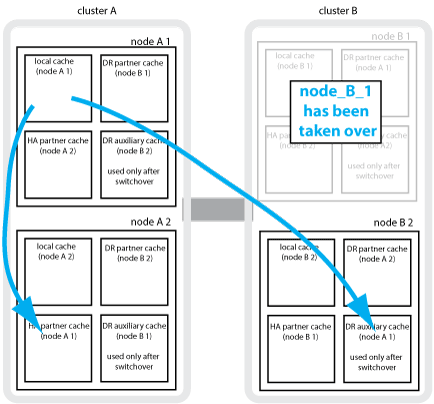

= MetroCluster 데이터 보호 및 재해 복구 이해
:allow-uri-read: 
:icons: font
:imagesdir: ../media/

[role="lead"]
MetroCluster가 데이터를 보호하고 장애로부터 투명하게 복구를 제공하므로 스위치오버 및 스위치백 활동을 쉽고 효율적으로 관리할 수 있는 방법을 이해하는 데 도움이 됩니다.

MetroCluster은 미러링을 통해 클러스터의 데이터를 보호합니다. 재해 복구 기능은 단일 MetroCluster 명령을 통해 재해 복구를 제공합니다. 이 명령은 생존자 사이트의 2차 명령을 활성화하여 재해로 인해 영향을 받은 운영 사이트에서 원래 소유했던 미러링된 데이터를 제공합니다.

== 8노드 및 4노드 MetroCluster 구성이 로컬 페일오버 및 전환을 제공하는 방법

8노드 및 4노드 MetroCluster 구성으로 로컬 레벨 및 클러스터 레벨 모두에서 데이터를 보호합니다. MetroCluster 구성을 설정하는 경우 MetroCluster 구성이 데이터를 어떻게 보호하는지 알아야 합니다.

MetroCluster 구성은 물리적으로 분리된 두 개의 미러링된 클러스터를 사용하여 데이터를 보호합니다. 각 클러스터는 다른 클러스터의 SVM(스토리지 가상 시스템) 구성과 데이터를 동기식으로 미러링합니다. 한 사이트에서 재해가 발생하면 관리자는 미러링된 SVM을 활성화하고 정상적인 사이트에서 미러링된 데이터를 제공할 수 있습니다. 또한 각 클러스터의 노드는 HA 쌍으로 구성되어 로컬 페일오버 수준을 제공합니다.

=== MetroCluster 구성에서 로컬 HA 데이터 보호의 작동 방식

MetroCluster 구성에서 HA 쌍이 작동하는 방식을 이해해야 합니다.

피어링된 네트워크에 있는 두 클러스터는 양방향 재해 복구 기능을 제공하여 각 클러스터가 다른 클러스터의 소스 및 백업이 될 수 있도록 합니다. 각 클러스터에는 HA 쌍으로 구성된 2개의 노드가 있습니다. 단일 노드의 구성 내에서 장애가 발생하거나 유지 관리가 필요한 경우 스토리지 페일오버를 통해 해당 노드의 작업을 로컬 HA 파트너로 이전할 수 있습니다.

다음 그림에서는 MetroCluster FC 구성을 보여 줍니다. HA 인터커넥트는 클러스터 스위치를 통해 제공되는 경우를 제외하고 MetroCluster IP 구성에서는 HA 기능이 동일합니다.

image::../media/mcc_hw_architecture_local_ha.gif[MCC HW 아키텍처 로컬 ha]

.관련 정보
link:https://docs.netapp.com/us-en/ontap/high-availability/index.html["고가용성 구성"^]

== MetroCluster 구성에서 데이터 및 구성 복제를 제공하는 방법

MetroCluster 구성에서는 다양한 ONTAP 기능을 사용하여 두 MetroCluster 사이트 간에 동기식 데이터 및 구성 복제를 제공합니다.

=== 구성 복제 서비스를 통한 구성 보호

CRS(ONTAP 구성 복제 서비스)는 DR 파트너에 정보를 자동으로 복제하여 MetroCluster 구성을 보호합니다.

CRS에서는 로컬 노드 구성을 파트너 클러스터의 DR 파트너에 동기식으로 복제합니다. 이 복제는 클러스터 피어링 네트워크를 통해 수행됩니다.

복제된 정보에는 클러스터 구성 및 SVM 구성이 포함됩니다.

=== MetroCluster 운영 중에 SVM 복제

ONTAP CRS(구성 복제 서비스)는 SVM에 속한 데이터 볼륨의 이중화 데이터 서버 구성 및 미러링을 제공합니다. 스위치오버가 발생하면 소스 SVM이 중단되며 정상적인 클러스터에 있는 타겟 SVM이 활성화됩니다.

NOTE: MetroCluster 구성의 타겟 SVM에는 이름에 ""-mc" 접미사가 자동으로 추가되어 식별이 가능합니다. MetroCluster 구성에서는 대상 SVM 이름에 ""-mc" 접미사가 붙습니다. SVM 이름에 마침표가 있으면 첫 번째 마침표 앞에 접미사 ""-mc"가 적용됩니다. 예를 들어, SVM 이름이 SVM.dns.name이면 접미사 ""-mc"가 SVM-mc.dns.name 으로 추가됩니다.

다음 예에서는 MetroCluster 구성의 SVM을 보여 줍니다. 여기서 "sVM_cluster_a"는 소스 사이트의 SVM이고 "sVM_cluster_a-mc"는 재해 복구 사이트의 동기화 대상 애그리게이트입니다.

* SVM_cluster_A는 클러스터 A에서 데이터를 제공합니다
+
SVM에 속한 볼륨의 데이터와 SVM 구성(LIF, 프로토콜 및 서비스)을 나타내는 동기화 소스 SVM입니다. 구성 및 데이터는 클러스터 B에 있는 동기화 대상 SVM, SVM_cluster_a-mc에 복제됩니다

* SVM_cluster_B는 클러스터 B에서 데이터를 제공합니다
+
클러스터 A에 있는 SVM_cluster_B-mc에 구성 및 데이터를 나타내는 동기화 소스 SVM입니다

* SVM_cluster_B-mc는 MetroCluster 구성이 정상적으로 작동하는 동안 중지되는 동기화 대상 SVM입니다.
+
클러스터 B에서 클러스터 A로 성공적으로 전환하면 SVM_cluster_B가 중지되고 SVM_cluster_B-mc가 활성화되며 클러스터 A에서 데이터를 제공합니다

* SVM_cluster_a-mc는 MetroCluster 구성이 정상적으로 작동하는 동안 중지되는 동기화 대상 SVM입니다.
+
클러스터 A에서 클러스터 B로 성공적으로 전환하면 SVM_cluster_A가 중지되고 SVM_cluster_a-mc가 활성화되며 클러스터 B에서 데이터를 제공합니다

image::../media/mcc_mirroring_of_svms.gif[MCC SVM 미러링]

스위치오버가 발생하면 작동하는 클러스터의 원격 플렉스에서 온라인 상태가 되고 보조 SVM에서 데이터 서비스를 시작합니다.

image::../media/mcc_svms_after_switchover.gif[스위치오버 이후 MCC SVM]

스위치오버 후 원격 플렉스의 가용성은 MetroCluster 구성 유형에 따라 다릅니다.

* MetroCluster FC 구성의 경우 ISL을 통해 재해 사이트 스토리지를 액세스할 수 있는 경우 전환 후 로컬 및 원격 플렉스가 모두 온라인 상태로 유지됩니다.
+
ISL에 장애가 발생했고 재해 사이트 스토리지를 사용할 수 없는 경우 동기화 대상 SVM이 정상 사이트에서 데이터 제공을 시작합니다.

* MetroCluster IP 구성의 경우 원격 플렉스의 가용성은 ONTAP 버전에 따라 다릅니다.
+
** ONTAP 9.5부터 재해 사이트 노드가 부팅된 상태로 유지되면 로컬 및 원격 플렉스가 모두 온라인 상태로 유지됩니다.
** ONTAP 9.5 이전에는 남아 있는 사이트의 로컬 플렉스에서 스토리지를 사용할 수 있습니다.
+
동기화 대상 SVM은 정상적인 사이트에서 데이터 제공을 시작합니다.

.관련 정보
https://docs.netapp.com/ontap-9/topic/com.netapp.doc.dot-cm-sag/home.html["시스템 관리"^]

=== MetroCluster 구성에서 SyncMirror를 사용하여 데이터 이중화를 제공하는 방법

SyncMirror 기능을 사용하는 미러링된 애그리게이트는 데이터 이중화를 제공하며 소스 및 타겟 SVM(스토리지 가상 머신)이 소유한 볼륨을 포함합니다. 데이터는 파트너 클러스터의 디스크 풀에 복제됩니다. 미러링되지 않은 애그리게이트도 지원됩니다.

다음 표에는 전환 후 미러링되지 않은 애그리게이트의 상태(온라인 또는 오프라인)가 나와 있습니다.

|===

| 전환 유형입니다 | 상태 

 a| 
협상된 전환(NSO)
 a| 
온라인

 a| 
자동 비계획 전환(AUSO)
 a| 
온라인

 a| 
계획되지 않은 전환(USO)
 a| 
* 스토리지를 사용할 수 없는 경우: 오프라인
* 스토리지를 사용할 수 있는 경우 온라인으로 설정합니다

|===

NOTE: 스위치오버 후 미러링되지 않은 애그리게이트는 DR 파트너 노드에 있고 ISL(Inter-Switch Link) 장애가 발생할 경우 해당 로컬 노드에 장애가 발생할 수 있습니다.

다음 그림에서는 파트너 클러스터 간에 디스크 풀이 미러링되는 방식을 보여 줍니다. 로컬 플렉스의 데이터(pool0)가 원격 플렉스에 복제됩니다(pool1).

IMPORTANT: 하이브리드 애그리게이트를 사용하는 경우, SSD(Solid-State Disk) 계층 충진으로 인해 SyncMirror plex가 장애가 발생한 이후에 성능 저하가 발생할 수 있습니다.

image::../media/mcc_mirroring_of_pools.gif[풀의 MCC 미러링]

=== NVRAM 또는 NVMEM 캐시 미러링 및 동적 미러링이 MetroCluster 구성에서 작동하는 방식

스토리지 컨트롤러의 비휘발성 메모리(플랫폼 모델에 따라 NVRAM 또는 NVMEM)는 로컬 HA 파트너에 로컬로 미러링되며 파트너 사이트의 원격 DR(재해 복구) 파트너에 원격으로 미러링됩니다. 로컬 페일오버 또는 스위치오버가 발생하는 경우 이 구성을 사용하면 비휘발성 캐시의 데이터를 보존할 수 있습니다.

MetroCluster 구성에 포함되지 않은 HA 쌍에서는 각 스토리지 컨트롤러가 두 개의 비휘발성 캐시 파티션(자체 파티션 1개, HA 파트너에 대한 파티션 1개)을 유지합니다.

4노드 MetroCluster 구성에서는 각 스토리지 컨트롤러의 비휘발성 캐시가 4개의 파티션으로 분할됩니다. 2노드 MetroCluster 구성에서는 스토리지 컨트롤러가 HA 쌍으로 구성되지 않으므로 HA 파트너 파티션과 DR 보조 파티션이 사용되지 않습니다.

|===

2+| 스토리지 컨트롤러의 비휘발성 캐시 

| MetroCluster 구성에서 | 비 MetroCluster HA 2노드에 대해 설명합니다 

 a| 
image:../media/mcc_nvram_quartering.gif[""]
 a| 
image:../media/mcc_nvram_split_in_non_mcc_ha_pair.gif[""]

|===
비휘발성 캐시는 다음 내용을 저장합니다.

* 로컬 파티션에는 스토리지 컨트롤러가 아직 디스크에 쓰지 않은 데이터가 들어 있습니다.
* HA 파트너 파티션은 스토리지 컨트롤러의 HA 파트너에 대한 로컬 캐시의 복사본을 보유합니다.
+
2노드 MetroCluster 구성에서는 스토리지 컨트롤러가 HA 쌍으로 구성되지 않으므로 HA 파트너 파티션이 없습니다.

* DR 파트너 파티션은 스토리지 컨트롤러의 DR 파트너에 대한 로컬 캐시의 복사본을 보유합니다.
+
DR 파트너는 파트너 클러스터의 노드로, 로컬 노드와 쌍을 이룹니다.

* DR 보조 파트너 파티션에는 스토리지 컨트롤러의 DR 보조 파트너의 로컬 캐시 사본이 들어 있습니다.
+
DR 보조 파트너는 로컬 노드의 DR 파트너의 HA 파트너입니다. HA 테이크오버(구성이 정상 작동 중이거나 MetroCluster 스위치오버 후)가 있는 경우 이 캐시가 필요합니다.

+
2노드 MetroCluster 구성에서는 스토리지 컨트롤러가 HA 쌍으로 구성되지 않으므로 DR 보조 파트너 파티션이 없습니다.

예를 들어, 노드의 로컬 캐시(node_a_1)는 MetroCluster 사이트에서 로컬 및 원격으로 미러링됩니다. 다음 그림에서는 node_A_1의 로컬 캐시가 HA 파트너(node_A_2) 및 DR 파트너(node_B_1)에 미러링됨을 보여 줍니다.

image::../media/mcc_nvram_mirroring_example.gif[MCC NVRAM 미러링의 예]

==== 로컬 HA 테이크오버 시 동적 미러링

4노드 MetroCluster 구성에서 로컬 HA 테이크오버 발생하면 페일오버된 노드가 DR 파트너의 미러 역할을 할 수 없습니다. DR 미러링을 계속하려면 미러링이 DR 보조 파트너로 자동 전환됩니다. 반환이 성공적으로 완료되면 미러링이 DR 파트너에게 자동으로 반환됩니다.

예를 들어, node_B_1이 실패하고 node_B_2에 의해 인계됩니다. node_A_1의 로컬 캐시는 더 이상 node_B_1에 미러링될 수 없습니다. 미러링이 DR 보조 파트너인 node_B_2로 전환됩니다.

== 재해 유형 및 복구 방법

MetroCluster 구성을 사용하여 적절하게 대응할 수 있도록 다양한 유형의 장애 및 재해에 대해 잘 알아야 합니다.

* 단일 노드 장애
+
로컬 HA 쌍의 단일 구성 요소에 장애가 발생합니다.

+
4노드 MetroCluster 구성에서는 장애가 발생한 구성요소에 따라 이 장애가 발생하면 장애가 발생한 노드가 자동 또는 협상된 테이크오버 상태로 될 수 있습니다. 데이터 복구에 대한 설명은 에 나와 있습니다 link:https://docs.netapp.com/us-en/ontap/high-availability/index.html["고가용성 쌍 관리"^] .

+
2노드 MetroCluster 구성에서 이 장애는 자동 계획되지 않은 전환(AUSO)으로 이어집니다.

* 사이트 전체 컨트롤러 장애
+
전원 손실, 장비 교체 또는 재해 등으로 인해 모든 컨트롤러 모듈이 사이트에서 장애가 발생합니다. 일반적으로 MetroCluster 구성은 실패와 재해를 구분할 수 없습니다. 그러나 MetroCluster Tiebreaker 소프트웨어와 같은 감시 소프트웨어는 이러한 소프트웨어를 구분할 수 있습니다. ISL(Inter-Switch Link) 링크 및 스위치가 가동되고 스토리지에 액세스할 수 있는 경우 사이트 전체 컨트롤러 장애가 발생하면 자동 스위치오버가 발생할 수 있습니다.

+
link:https://docs.netapp.com/us-en/ontap/high-availability/index.html["고가용성 쌍 관리"^] 컨트롤러 장애가 아닌 사이트 전체 컨트롤러 장애로부터 복구하는 방법에 대한 자세한 내용은 컨트롤러 하나 이상의 컨트롤러를 포함합니다.

* ISL 장애
+
사이트 간의 연결이 실패합니다. MetroCluster 구성은 아무런 작업도 수행하지 않습니다. 각 노드가 정상적으로 데이터를 제공하지만 해당 재해 복구 사이트에 대한 액세스가 손실되므로 미러는 해당 재해 복구 사이트에 기록되지 않습니다.

* 순차적인 다중 장애
+
여러 부품이 순서대로 실패합니다. 예를 들어 컨트롤러 모듈, 스위치 패브릭 및 쉘프가 순차적으로 실패하여 스토리지 페일오버, 패브릭 이중화 및 SyncMirror가 차례로 중단시간 및 데이터 손실을 방지합니다.

다음 표에는 장애 유형과 해당 DR(재해 복구) 메커니즘 및 복구 방법이 나와 있습니다.

NOTE: AUSO(자동 비계획 전환)는 MetroCluster IP 구성에서 지원되지 않습니다.

|===

.2+| 실패 유형 2+| DR 메커니즘 2+| 복구 방법 요약 

| 4노드 구성 | 2노드 구성 | 4노드 구성 | 2노드 구성 

| 단일 노드 장애 | 로컬 HA 페일오버 | 아오 | 자동 페일오버 및 반환이 설정된 경우 필요하지 않습니다. | 노드 복원 후 MetroCluster 수정 단계 애그리게이트 MetroCluster 수정 단계 루트 애그리게이트 MetroCluster 스위치백 명령을 사용하여 수동으로 복구 및 스위치백을 수행해야 합니다. 참고: ONTAP 9.5 이상을 실행하는 MetroCluster IP 구성에는 MetroCluster 환원 명령이 필요하지 않습니다. 

| 사이트 장애 2+| MetroCluster 전환 2.3+| 노드 복원 후 MetroCluster restoring과 MetroCluster 스위치백 명령을 사용하여 수동 복구 및 스위치백을 수행해야 합니다. ONTAP 9.5를 실행하는 MetroCluster IP 구성에는 MetroCluster 환원 명령이 필요하지 않습니다. 

| 사이트 전체 컨트롤러 장애 | 재해 사이트의 스토리지에 액세스할 수 있는 경우에만 AUSO를 사용합니다. | AUSO(단일 노드 장애와 동일) 

| 순차적인 다중 장애 | MetroCluster switchover-forced-on-disaster 명령을 사용하여 로컬 HA 페일오버 후 MetroCluster 강제 전환을 수행합니다. 참고: 장애가 발생한 구성 요소에 따라 강제 전환이 필요하지 않을 수 있습니다. | MetroCluster는 MetroCluster switchover-forced-on-disaster 명령을 사용하여 강제 절체를 했습니다. 

| ISL 장애 2+| MetroCluster 스위치오버가 없으며 2개의 클러스터가 독립적으로 데이터를 제공합니다 2+| 이 유형의 오류에는 필요하지 않습니다. 접속 구성을 복구하면 스토리지가 자동으로 재동기화됩니다. 
|===

== 8노드 또는 4노드 MetroCluster 구성에서 무중단 운영을 제공하는 방법

단일 노드에만 문제가 발생하는 경우 로컬 HA 쌍 내의 페일오버 및 기브백은 무중단 운영을 지원합니다. 이 경우 MetroCluster 구성에 원격 사이트로 전환할 필요가 없습니다.

8노드 또는 4노드 MetroCluster 구성은 각 사이트에 1개 이상의 HA 쌍으로 구성되므로, 각 사이트는 로컬 장애를 감당하며 파트너 사이트로 전환하지 않고도 무중단 운영을 수행할 수 있습니다. HA 쌍 작업은 비 MetroCluster 구성에서 HA 쌍과 동일합니다.

4노드 및 8노드 MetroCluster 구성의 경우 패닉 또는 정전 때문에 노드 장애가 발생하면 자동 스위치오버가 발생할 수 있습니다.

link:https://docs.netapp.com/us-en/ontap/high-availability/index.html["고가용성 쌍 관리"^]

로컬 페일오버 후 두 번째 장애가 발생할 경우 MetroCluster 전환 이벤트를 통해 무중단 운영이 계속 제공됩니다. 마찬가지로, 스위치오버 작업이 끝난 후 정상적인 노드 중 하나에서 두 번째 장애가 발생하면 로컬 페일오버 이벤트가 중단 없이 계속 작동합니다. 이 경우 정상적인 단일 노드에서 DR 그룹의 다른 3개 노드에 대한 데이터를 제공합니다.

=== MetroCluster 전환 중 스위치오버 및 스위치백

MetroCluster FC-to-IP 전환에는 MetroCluster IP 노드 및 IP 스위치를 기존 MetroCluster FC 구성에 추가한 다음 MetroCluster FC 노드를 폐기하는 작업이 포함됩니다. 전환 프로세스의 단계에 따라 MetroCluster 전환, 복구 및 스위치백 작업에서 서로 다른 워크플로우를 사용합니다.

을 참조하십시오 http://docs.netapp.com/ontap-9/topic/com.netapp.doc.dot-mcc-upgrade/GUID-1870FDC4-1774-4604-86A7-5C979C297ADA.html["전환 중 전환, 복구, 스위치백 작업"^].

=== 스위치오버 후 로컬 페일오버의 결과

MetroCluster 전환이 발생하고 정상적인 사이트에서 문제가 발생하는 경우 로컬 페일오버를 통해 무중단 운영을 계속할 수 있습니다. 하지만 시스템이 중복 구성에 더 이상 없으므로 위험합니다.

스위치오버가 발생한 후 로컬 페일오버가 발생하면 단일 컨트롤러가 MetroCluster 구성의 모든 스토리지 시스템에 데이터를 제공하고 리소스 문제가 발생할 수 있으며 추가 장애에 취약합니다.

== 2노드 MetroCluster 구성으로 무중단 운영을 제공하는 방법

두 사이트 중 하나에서 패닉이 발생하여 문제가 발생하는 경우 MetroCluster 전환을 통해 무중단 운영이 계속 수행됩니다. 정전 시 노드 및 스토리지에 모두 영향을 미치면 절체가 자동으로 수행되지 않고 MetroCluster switchover 명령이 실행될 때까지 운영이 중단됩니다.

모든 스토리지가 미러링되므로 사이트 장애가 발생할 경우 노드 장애가 발생할 경우 HA 쌍의 스토리지 페일오버와 비슷한 수준의 무중단 복원력을 제공하는 데 전환 작업을 사용할 수 있습니다.

2노드 구성의 경우, HA 쌍에서 자동 스토리지 페일오버를 트리거하는 동일한 이벤트가 자동 UNPLANNED 스위치오버(AUSO)를 트리거합니다. 즉, 2노드 MetroCluster 구성에서는 HA Pair와 동일한 보호 수준을 사용합니다.

.관련 정보
link:concept_understanding_mcc_data_protection_and_disaster_recovery.html["MetroCluster FC 구성에서 계획되지 않은 자동 스위치오버"]

== 전환 프로세스 개요

MetroCluster 전환 작업을 사용하면 소스 클러스터에서 원격 사이트로 스토리지 및 클라이언트 액세스를 이동하여 재해 발생 후 서비스를 즉시 재개할 수 있습니다. 어떤 변화가 예상되는지, 전환이 발생할 경우 어떤 작업을 수행해야 하는지 알고 있어야 합니다.

전환 작업 중에 시스템은 다음 작업을 수행합니다.

* 재해 사이트에 속한 디스크의 소유권이 DR(재해 복구) 파트너로 변경됩니다.
+
이는 고가용성(HA) 쌍의 로컬 페일오버와 유사하며, 파트너에 속한 디스크의 소유권이 정상 파트너로 변경됩니다.

* 정상적인 사이트에 있지만 재해 클러스터의 노드에 속한 남아 있는 플렉스는 정상적인 사이트의 클러스터에서 온라인 상태로 전환됩니다.
* 재해 사이트에 속하는 동기화 소스 스토리지 가상 시스템(SVM)은 협상된 전환 중에만 영향을 줍니다.
+

NOTE: 이는 협상된 전환에만 해당됩니다.

* 재해 사이트에 속하는 동기화 대상 SVM이 표시됩니다.

DR 파트너의 루트 애그리게이트는 전환 중에 온라인 상태로 전환되지 않습니다.

MetroCluster switchover 명령은 MetroCluster 구성에서 모든 DR 그룹의 노드를 전환합니다. 예를 들어, 8노드 MetroCluster 구성에서는 두 DR 그룹 모두에서 노드를 전환합니다.

원격 사이트로 서비스만 전환하는 경우 사이트 펜싱 없이 협상된 전환을 수행해야 합니다. 스토리지 또는 장비를 신뢰할 수 없는 경우 재해 사이트를 울타리로 만든 다음 계획되지 않은 전환을 수행해야 합니다. 펜싱은 디스크가 지그재그로 가동될 때 RAID 재구성을 방지합니다.

NOTE: 이 절차는 다른 사이트가 안정적이고 오프라인으로 전환하지 않는 경우에만 사용해야 합니다.

=== 전환 중 명령의 가용성

다음 표에는 전환 중 명령을 사용할 수 있는 상태가 나와 있습니다.

|===

| 명령 | 가용성 

 a| 
'스토리지 애그리게이트 생성'
 a| 
다음과 같이 Aggregate를 생성할 수 있습니다.

* 작동하는 클러스터의 일부인 노드에 의해 소유된 경우

Aggregate는 생성할 수 없습니다.

* 재해 사이트의 노드
* 정상적인 클러스터에 속하는 노드의 경우

 a| 
'저장소 집계 삭제'
 a| 
데이터 집계를 삭제할 수 있습니다.

 a| 
'스토리지 애그리게이트 미러'
 a| 
미러링되지 않은 집계에 대한 플렉스를 생성할 수 있습니다.

 a| 
'스토리지 집계 플렉스 삭제'
 a| 
미러링된 Aggregate에 대한 플렉스를 삭제할 수 있습니다.

 a| 
'vserver create
 a| 
SVM을 생성할 수 있습니다.

* 루트 볼륨이 나머지 클러스터가 소유한 데이터 애그리게이트에 상주하는 경우

SVM은 생성할 수 없습니다.

* 루트 볼륨이 재해 사이트 클러스터가 소유한 데이터 애그리게이트에 상주하는 경우

 a| 
'vserver delete'(가상 서버 삭제)
 a| 
동기식-소스 및 동기식-타겟 SVM을 모두 삭제할 수 있습니다.

 a| 
네트워크 인터페이스 만들기
 a| 
동기화 소스 및 동기화 대상 SVM을 모두 위한 데이터 SVM LIF를 생성할 수 있습니다.

 a| 
네트워크 인터페이스 삭제 lif
 a| 
동기화 소스 및 동기화 대상 SVM 모두에서 데이터 SVM LIF를 삭제할 수 있습니다.

 a| 
'볼륨 생성'
 a| 
동기화 소스 및 동기화 대상 SVM을 위한 볼륨을 생성할 수 있습니다.

* 동기화 소스 SVM의 경우 볼륨은 정상적인 클러스터에서 소유한 데이터 애그리게이트에 있어야 합니다
* 동기화 대상 SVM의 경우 볼륨은 재해 사이트 클러스터가 소유한 데이터 애그리게이트에 있어야 합니다

 a| 
'볼륨 삭제'
 a| 
동기식 및 동기식-타겟 SVM에서 볼륨을 삭제할 수 있습니다.

 a| 
'볼륨 이동'
 a| 
동기화 소스 및 동기화 대상 SVM 모두에 대한 볼륨을 이동할 수 있습니다.

* 동기화 소스 SVM의 경우 정상적인 클러스터에서 타겟 애그리게이트를 소유해야 합니다
* 동기식-타겟 SVM의 경우 재해 사이트 클러스터에서 타겟 애그리게이트를 소유해야 합니다

 a| 
스냅미러 브레이크
 a| 
데이터 보호 미러의 소스 엔드포인트와 타겟 엔드포인트 간에 SnapMirror 관계를 분리할 수 있습니다.

|===

=== MetroCluster FC와 IP 구성 간 전환 차이점

MetroCluster IP 구성에서는 원격 디스크가 iSCSI 타겟 역할을 하는 원격 DR 파트너 노드를 통해 액세스되므로 전환 작업에서 원격 노드가 다운될 때 원격 디스크에 액세스할 수 없습니다. 그 결과 MetroCluster FC 구성의 차이가 발생합니다.

* 로컬 클러스터가 소유한 미러링된 애그리게이트는 성능이 저하됩니다.
* 원격 클러스터에서 전환된 미러링된 Aggregate의 성능이 저하됩니다.

NOTE: MetroCluster IP 구성에서 미러링되지 않은 애그리게이트를 지원할 경우, 원격 클러스터에서 전환할 수 없는 미러링되지 않은 애그리게이트는 액세스할 수 없습니다.

=== 4노드 MetroCluster 구성에서 HA 테이크오버 및 MetroCluster 스위치오버 중에 디스크 소유권이 변경됩니다

고가용성 및 MetroCluster 작업 중에 디스크 소유권이 일시적으로 변경됩니다. 시스템이 어떤 노드가 어떤 디스크를 소유하고 있는지 추적하는 방법을 알면 도움이 됩니다.

ONTAP에서 컨트롤러 모듈의 고유 시스템 ID(노드의 NVRAM 카드 또는 NVMEM 보드에서 획득)를 사용하여 특정 디스크가 있는 노드를 식별합니다. 시스템의 HA 또는 DR 상태에 따라 디스크 소유권이 일시적으로 변경될 수 있습니다. HA 테이크오버 또는 DR 스위치오버로 인해 소유권이 변경될 경우 시스템은 디스크의 원래 소유자("홈")인 노드를 기록하여 HA 기브백이나 DR 스위치백 후 소유권을 반환할 수 있습니다. 시스템은 다음 필드를 사용하여 디스크 소유권을 추적합니다.

* 소유자
* 홈 소유자
* DR 홈 소유자

MetroCluster 구성에서 스위치오버 시 노드는 파트너 클러스터의 노드가 원래 소유한 애그리게이트의 소유권을 가져올 수 있습니다. 이러한 애그리게이트를 클러스터 외부 애그리게이트라고도 합니다. 클러스터의 외부 집계는 현재 클러스터에 알려지지 않은 집계이므로 DR 홈 소유자 필드는 파트너 클러스터의 노드가 소유한다는 것을 표시하는 데 사용됩니다. HA 쌍 내의 기존 외부 집계는 소유자 및 홈 소유자 값이 서로 다르지만 소유자 및 홈 소유자 값은 클러스터 외부 집계와 동일하므로 DR 홈 소유자 값으로 클러스터 외부 집계를 식별할 수 있습니다.

시스템 상태가 변경되면 다음 표와 같이 필드 값이 변경됩니다.

|===

.2+| 필드에 입력합니다 4+| 값 중... 

| 정상 작동 | 로컬 HA 테이크오버 | MetroCluster 전환 | 테이크오버가 수행되는 동안 

 a| 
소유자
 a| 
디스크에 대한 액세스 권한이 있는 노드의 ID입니다.
 a| 
디스크에 일시적으로 액세스할 수 있는 HA 파트너의 ID입니다.
 a| 
디스크에 일시적으로 액세스할 수 있는 DR 파트너의 ID입니다.
 a| 
디스크에 일시적으로 액세스할 수 있는 DR 보조 파트너의 ID입니다.

 a| 
홈 소유자
 a| 
HA 쌍 내의 디스크 원래 소유자의 ID입니다.
 a| 
HA 쌍 내의 디스크 원래 소유자의 ID입니다.
 a| 
전환 중 HA 쌍의 홈 소유자인 DR 파트너의 ID입니다.
 a| 
전환 중 HA 쌍의 홈 소유자인 DR 파트너의 ID입니다.

 a| 
DR 홈 소유자
 a| 
비어 있습니다
 a| 
비어 있습니다
 a| 
MetroCluster 구성 내에서 디스크의 원래 소유자의 ID입니다.
 a| 
MetroCluster 구성 내에서 디스크의 원래 소유자의 ID입니다.

|===
다음 그림 및 표에는 cluster_B에 물리적으로 위치한 node_A_1의 디스크 풀 1의 디스크에 대한 소유권이 변경되는 방법의 예가 나와 있습니다

image::../media/mcc_disk_ownership.gif[MCC 디스크 소유권]

|===

| MetroCluster 상태입니다 | 소유자 | 홈 소유자 | DR 홈 소유자 | 참고 

 a| 
정상 - 모든 노드가 완전히 작동
 a| 
노드_A_1
 a| 
노드_A_1
 a| 
해당 없음
 a| 

 a| 
로컬 HA 테이크오버, node_A_2가 HA 파트너 노드_A_1에 속하는 디스크를 인수했습니다.
 a| 
노드_A_2
 a| 
노드_A_1
 a| 
해당 없음
 a| 

 a| 
DR 절체, node_B_1이(가) 디스크를 DR 파트너인 node_A_1에 속하게 되었습니다.
 a| 
노드_B_1
 a| 
노드_B_1
 a| 
노드_A_1
 a| 
원래 홈 노드 ID가 DR 홈 소유자 필드로 이동합니다. Aggregate 스위치백 또는 복구 후 소유권이 node_A_1로 돌아갑니다.

 a| 
DR 전환 및 로컬 HA 테이크오버(이중 장애)에서 node_B_2가 HA 노드_B_1에 속하는 디스크를 넘겨받습니다.
 a| 
노드_B_2
 a| 
노드_B_1
 a| 
노드_A_1
 a| 
반환 후 소유권이 node_B_1로 돌아갑니다. 스위치백 또는 복구 후 소유권이 node_a_1로 돌아갑니다.

 a| 
HA 기브백 및 DR 스위치백 후, 모든 노드가 완전히 작동합니다.
 a| 
노드_A_1
 a| 
노드_A_1
 a| 
해당 없음
 a| 

|===

=== 미러링되지 않은 애그리게이트를 사용할 때의 고려 사항

구성에 미러링되지 않은 애그리게이트가 포함된 경우, 전환 작업 후 잠재적 액세스 문제를 알고 있어야 합니다.

==== 전원 종료가 필요한 유지 관리 수행 시 미러링되지 않은 애그리게이트의 고려 사항

사이트 전체의 전원을 차단해야 하는 유지 관리 이유로 협상된 전환을 수행하는 경우, 먼저 재해 사이트에서 소유한 미러링되지 않은 애그리게이트를 수동으로 오프라인으로 전환해야 합니다.

그렇지 않으면 다중 디스크 패닉이 발생하여 정상적인 사이트의 노드가 다운될 수 있습니다. 이 문제는 전원 종료 또는 ISL 손실로 인해 재해 사이트에서 스토리지에 대한 연결이 손실되어 전환용 미러링되지 않은 애그리게이트가 오프라인 상태가 되거나 누락되는 경우에 발생할 수 있습니다.

==== 미러링되지 않은 애그리게이트 및 계층적 네임스페이스에 대한 고려 사항

계층적 네임스페이스를 사용하는 경우 해당 경로의 모든 볼륨이 미러링된 애그리게이트에만 있거나 미러링되지 않은 애그리게이트에만 있도록 접합 경로를 구성해야 합니다. 접합 경로에 미러링되지 않은 애그리게이트와 미러링된 애그리게이트를 혼합하여 구성할 경우, 전환 작업 후 미러링되지 않은 애그리게이트에 액세스하지 못할 수 있습니다.

==== 미러링되지 않은 애그리게이트 및 CRS 메타데이터 볼륨과 데이터 SVM 루트 볼륨의 고려 사항

CRS(구성 복제 서비스) 메타데이터 볼륨 및 데이터 SVM 루트 볼륨은 미러링된 Aggregate에 있어야 합니다. 이러한 볼륨을 미러링되지 않은 애그리게이트로 이동할 수 없습니다. 미러링되지 않은 애그리게이트에 있는 경우 협상된 전환 및 스위치백 작업이 거부됩니다. 이 경우 MetroCluster check 명령이 경고를 표시합니다.

==== 미러링되지 않은 애그리게이트 및 SVM에 대한 고려사항

SVM은 미러링된 애그리게이트에만 구성하거나 미러링되지 않은 애그리게이트에만 구성해야 합니다. 미러링되지 않은 애그리게이트와 미러링된 애그리게이트를 혼합하여 구성하면 스위치오버 작업이 120초 이상 수행되어 미러링되지 않은 애그리게이트가 온라인 상태가 아닌 경우 데이터 중단이 발생할 수 있습니다.

==== 미러링되지 않은 애그리게이트 및 SAN에 대한 고려사항

LUN은 미러링되지 않은 애그리게이트에 있어서는 안 됩니다. 미러링되지 않은 애그리게이트에 LUN을 구성하면 스위치오버 작업이 120초를 초과하고 데이터 중단이 발생할 수 있습니다.

=== MetroCluster FC 구성에서 계획되지 않은 자동 스위치오버

MetroCluster FC 구성에서 사이트 전체 컨트롤러 장애가 무중단 운영을 제공하지 못할 경우 특정 시나리오에서 자동 계획되지 않은 스위치오버(AUSO)를 트리거할 수 있습니다. 필요한 경우 AUSO를 비활성화할 수 있습니다.

NOTE: MetroCluster IP 구성에서는 예기치 않은 자동 전환이 지원되지 않습니다.

MetroCluster FC 구성에서는 다음과 같은 이유로 사이트의 모든 노드에 장애가 발생할 경우 AUSO가 트리거될 수 있습니다.

* 전원을 끕니다
* 전원 손실
* 패닉

NOTE: 8노드 MetroCluster FC 구성에서는 HA 쌍의 두 노드에 장애가 발생할 경우 AUSO를 트리거하는 옵션을 설정할 수 있습니다.

2노드 MetroCluster 구성에서는 로컬 HA 페일오버를 사용할 수 없기 때문에, 시스템은 컨트롤러 장애 후에도 지속적인 운영을 제공하기 위해 AUSO를 수행합니다. 이 기능은 HA 쌍의 HA 테이크오버 기능과 유사합니다. 2노드 MetroCluster 구성에서는 다음과 같은 경우에 AUSO가 트리거될 수 있습니다.

* 노드 전원이 꺼졌습니다
* 노드 전원 손실
* 노드 패닉
* 노드 재부팅

AUSO가 발생하면 장애가 발생한 노드의 pool0 및 pool1 디스크에 대한 디스크 소유권이 DR(재해 복구) 파트너로 변경됩니다. 이 소유권 변경으로 인해 전환 후 애그리게이트가 성능 저하 상태로 전환되지 않습니다.

자동 스위치오버 후에는 복구 및 스위치백 작업을 수동으로 진행하여 컨트롤러를 정상 작동 상태로 되돌리십시오.

==== 2노드 MetroCluster 구성의 하드웨어 지원 AUSO

2노드 MetroCluster 구성에서는 컨트롤러 모듈의 서비스 프로세서(SP)가 구성을 모니터링합니다. 일부 시나리오에서는 SP가 ONTAP 소프트웨어보다 빠르게 장애를 감지할 수 있습니다. 이 경우 SP가 AUSO를 트리거합니다. 이 기능은 자동으로 활성화됩니다.

SP는 상태를 모니터링하기 위해 DR 파트너와 SNMP 트래픽을 보내고 받습니다.

==== MetroCluster FC 구성에서 AUSO 설정 변경

AUSO는 기본적으로 "클러스터 내 재해"로 설정되어 있습니다. 상태는 에서 볼 수 있습니다 `metrocluster show` 명령.

NOTE: AUSO 설정은 MetroCluster IP 구성에 적용되지 않습니다.

MetroCluster modify-auto-switchover-failure-domain auto-disabled 명령으로 AUSO를 비활성화할 수 있습니다. 이 명령은 DR 사이트 전체 컨트롤러 장애 시 AUSO를 트리거하지 않도록 합니다. 두 사이트에서 AUSO를 비활성화하려면 두 사이트에서 모두 실행해야 합니다.

AUSO는 MetroCluster modify-auto-switchover-failure-domain auso-on-cluster-disaster 명령을 사용하여 다시 활성화할 수 있습니다.

AUSO는 또한 "'우소온 DR-그룹-재난'으로 설정될 수 있습니다. 이 고급 수준 명령은 한 사이트에서 HA 페일오버에 AUSO를 트리거합니다. MetroCluster modify-auto-switchover-failure-domain auso-on-dr-group-disaster 명령을 사용하여 두 사이트에서 모두 실행해야 합니다.

==== 전환 중 AUSO 설정

스위치오버가 발생하면 사이트가 스위치오버에 있는 경우 자동으로 전환할 수 없기 때문에 AUSO 설정이 내부적으로 비활성화됩니다.

==== AUSO에서 복구 중

AUSO에서 복구하려면 계획된 전환 단계와 동일한 단계를 수행합니다.

link:task_perform_switchover_for_tests_or_maintenance.html["테스트 또는 유지 관리를 위한 전환 수행"]

=== MetroCluster IP 구성에서 중재자를 통한 자동 비계획 전환

MetroCluster IP 구성에서 시스템은 ONTAP 중재자를 사용하여 오류를 감지하고 중재자를 통한 자동 계획되지 않은 전환(MAUSO)을 수행할 수 있습니다.

ONTAP 9.13.1 부터는 MetroCluster IP 구성에서 AUSO 상태에 대한 기본값이 "auso-on-dr-group"으로 설정됩니다. ONTAP 9.12.1 이전 버전의 경우 기본값은 "auso-on-cluster-disaster"로 설정됩니다. 8노드 MetroCluster IP 구성에서 이 옵션은 HA 쌍의 두 노드에 장애가 발생할 경우 AUSO를 트리거합니다.

을 사용하여 AUSO 도메인을 "클러스터 내 클러스터 내 재해" 도메인으로 변경할 수 있습니다 `metrocluster modify -auto-switchover-failure-domain auso-on-cluster-disaster` 명령.

NOTE: MAUSO는 MetroCluster FC 구성에서 지원되지 않습니다.

ONTAP 중재자가 MetroCluster IP 노드에 대한 메일박스 LUN을 제공합니다. 이러한 LUN은 ONTAP 사이트와 물리적으로 분리된 Linux 호스트에서 실행되는 MetroCluster 중재자의 공동 위치입니다.

MetroCluster 노드는 사서함 정보를 사용하여 MAUSO가 필요한지 여부를 확인합니다. 스토리지 컨트롤러의 비휘발성 메모리(플랫폼 모델에 따라 NVRAM 또는 NVMEM)가 파트너 사이트의 원격 DR(재해 복구) 파트너에 미러링되지 않는 경우 MAUSO가 시작되지 않습니다

== 복구 중 수행되는 작업(MetroCluster FC 구성)

MetroCluster FC 구성에서 복구 중에 미러링된 애그리게이트의 재동기화는 스위치백을 위해 복구된 재해 사이트의 노드를 준비하는 단계별 프로세스에서 수행됩니다. 계획된 이벤트이므로 각 단계를 완벽하게 제어하여 다운타임을 최소화할 수 있습니다. 복구는 스토리지 및 컨트롤러 구성 요소에서 발생하는 2단계 프로세스입니다.

=== 데이터 애그리게이트 복구

재해 사이트에서 문제가 해결된 후 스토리지 복구 단계를 시작합니다.

. 모든 노드가 정상 작동하는 사이트에서 실행 중인지 확인합니다.
. 루트 애그리게이트를 포함하여 재해 사이트에서 모든 풀 0 디스크의 소유권을 변경합니다.

이 복구 단계에서는 RAID 서브시스템이 미러링된 애그리게이트를 재동기화하며, WAFL 서브시스템은 전환 시 풀 1 플렉스에 장애가 발생한 미러링된 애그리게이트의 nvsave 파일을 재생합니다.

일부 소스 스토리지 구성 요소에 장애가 발생한 경우 명령은 스토리지, 산고유 또는 RAID 등 해당 레벨의 오류를 보고합니다.

보고된 오류가 없으면 애그리게이트가 성공적으로 재동기화됩니다. 이 프로세스를 완료하는 데 몇 시간이 걸릴 수 있습니다.

link:../manage/task_verifiy_that_your_system_is_ready_for_a_switchover.html["구성을 복구했습니다"]

=== 루트 애그리게이트 복구

애그리게이트를 동기화한 후, CFO 애그리게이트 및 루트 애그리게이트를 각 DR 파트너에게 제공하여 컨트롤러 복구 단계를 시작합니다.

link:../manage/task_verifiy_that_your_system_is_ready_for_a_switchover.html["구성을 복구했습니다"]

== 복구 중 수행되는 작업(MetroCluster IP 구성)

MetroCluster IP 구성에서 복구를 수행하는 동안, 복구된 재해 사이트에서 스위치백을 준비할 수 있도록 단계적으로 미러링된 애그리게이트를 재동기화할 수 있습니다. 계획된 이벤트이므로 각 단계를 완벽하게 제어하여 다운타임을 최소화할 수 있습니다. 복구는 스토리지 및 컨트롤러 구성 요소에서 발생하는 2단계 프로세스입니다.

=== MetroCluster FC 구성의 차이점

MetroCluster IP 구성에서는 복구 작업을 수행하기 전에 재해 사이트 클러스터의 노드를 부팅해야 합니다.

애그리게이트를 재동기화할 때 원격 iSCSI 디스크에 액세스할 수 있도록 재해 사이트 클러스터의 노드를 실행해야 합니다.

재해 사이트 노드가 실행되고 있지 않으면 재해 노드에서 필요한 디스크 소유권 변경을 수행할 수 없기 때문에 복구 작업이 실패합니다.

=== 데이터 애그리게이트 복구

재해 사이트에서 문제가 해결된 후 스토리지 복구 단계를 시작합니다.

. 모든 노드가 정상 작동하는 사이트에서 실행 중인지 확인합니다.
. 루트 애그리게이트를 포함하여 재해 사이트에서 모든 풀 0 디스크의 소유권을 변경합니다.

이 복구 단계에서는 RAID 서브시스템이 미러링된 애그리게이트를 재동기화하며, WAFL 서브시스템은 전환 시 풀 1 플렉스에 장애가 발생한 미러링된 애그리게이트의 nvsave 파일을 재생합니다.

일부 소스 스토리지 구성 요소에 장애가 발생한 경우 명령은 스토리지, 산고유 또는 RAID 등 해당 레벨의 오류를 보고합니다.

보고된 오류가 없으면 애그리게이트가 성공적으로 재동기화됩니다. 이 프로세스를 완료하는 데 몇 시간이 걸릴 수 있습니다.

link:../manage/task_verifiy_that_your_system_is_ready_for_a_switchover.html["구성을 복구했습니다"]

=== 루트 애그리게이트 복구

애그리게이트가 동기화된 후에는 루트 애그리게이트 복구 단계를 수행할 수 있습니다. MetroCluster IP 구성에서 이 단계는 애그리게이트가 복구되었음을 확인합니다.

link:../manage/task_verifiy_that_your_system_is_ready_for_a_switchover.html["구성을 복구했습니다"]

== 전환 후 MetroCluster IP 구성에서 애그리게이트 자동 복구

ONTAP 9.5부터 MetroCluster IP 구성에서 협상된 전환 작업 중에 복구가 자동화됩니다. ONTAP 9.6부터 예정되지 않은 스위치오버 후 자동 복구가 지원됩니다. 이렇게 하면 MetroCluster 환원 명령을 실행할 필요가 없어집니다.

=== 협상된 전환 후 자동 복구(ONTAP 9.5부터 시작)

협상된 전환(forced-on-disaster true 옵션 없이 실행되는 스위치오버 명령)을 수행한 후 자동 복구 기능은 시스템을 정상 작동 상태로 되돌리는 데 필요한 단계를 단순화합니다. 자동 복구 기능이 있는 시스템에서는 전환 후에 다음이 발생합니다.

* 재해 사이트 노드는 계속 가동되고 있습니다.
+
전환 상태이기 때문에 로컬 미러링된 Plex에서 데이터를 제공하지 않습니다.

* 재해지역 노드는 "스위치백 대기 중" 상태로 전환된다.
+
MetroCluster operation show 명령을 사용하여 재해 사이트 노드의 상태를 확인할 수 있습니다.

* 복구 명령을 실행하지 않고 스위치백 작업을 수행할 수 있습니다.

이 기능은 ONTAP 9.5 이상을 실행하는 MetroCluster IP 구성에 적용됩니다. MetroCluster FC 구성에는 적용되지 않습니다.

ONTAP 9.4 이하를 실행하는 MetroCluster IP 구성에는 여전히 수동 복구 명령이 필요합니다.

image::../media/mcc_so_sb_with_autoheal.gif[MCC가 누구를 사치아로 만다]

=== 예정되지 않은 스위치오버 후 자동 복구(ONTAP 9.6부터 시작)

MetroCluster 9.6부터 시작되는 ONTAP IP 구성에서 예정되지 않은 스위치오버 후 자동 복구가 지원됩니다. 예정되지 않은 절체는 '-forced-on-disaster true' 옵션을 사용하여 'witchover' 명령을 실행하는 스위치오버입니다.

MetroCluster FC 구성에서는 예정되지 않은 전환 후 자동 복구가 지원되지 않으며, ONTAP 9.5 이하 버전을 실행하는 MetroCluster IP 구성에서 예정되지 않은 전환 후에도 수동 복구 명령이 여전히 필요합니다.

ONTAP 9.6 이상을 실행하는 시스템에서는 예정되지 않은 스위치오버 이후 다음 상황이 발생합니다.

* 재해 범위에 따라 재해 사이트 노드가 다운될 수 있습니다.
+
전환 상태이기 때문에 로컬 미러링된 Plex의 전원이 켜져 있어도 데이터를 제공하지 않습니다.

* 재해 사이트가 다운된 경우 부팅 시 재해 사이트 노드가 ""스위치백 대기 중" 상태로 전환됩니다.
+
재해지역 가동이 계속된다면 곧바로 ''스위치백 대기'' 상태로 옮겨집니다.

* 복구 작업은 자동으로 수행됩니다.
+
MetroCluster operation show 명령을 사용하여 재해 사이트 노드의 상태와 복구 작업이 성공했는지 확인할 수 있습니다.

image::../media/mcc_uso_with_autoheal.gif[자동 복구 기능이 있는 MCC USO]

=== 자동 복구 실패 시

어떤 이유로든 자동 복구 작업이 실패하면 ONTAP 9.6 이전의 ONTAP 버전에서 했던 것처럼 'MetroCluster 환원' 명령을 수동으로 실행해야 합니다. MetroCluster operation show와 MetroCluster operation history show-instance 명령을 사용하여 복구 상태를 모니터링하고 장애 원인을 확인할 수 있습니다.

== MetroCluster 구성을 위한 SVM 생성

MetroCluster 구성을 위한 SVM을 생성하여 MetroCluster 구성을 위해 설정된 클러스터에서 동기식 재해 복구 및 높은 데이터 가용성을 제공할 수 있습니다.

* 두 클러스터는 MetroCluster 구성에 있어야 합니다.
* 애그리게이트는 두 클러스터 모두에서 사용 가능하고 온라인 상태여야 합니다.
* 필요한 경우 두 클러스터에서 이름이 같은 IPspace를 생성해야 합니다.
* 스위치오버를 사용하지 않고 MetroCluster 구성을 구성하는 클러스터 중 하나를 재부팅하면 동기화 소스 SVM이 "시작" 대신 "시작" 상태로 온라인 상태가 될 수 있습니다.

MetroCluster 구성에서 클러스터 중 하나에서 SVM을 생성하면 SVM이 소스 SVM으로 생성되고, 파트너 SVM은 파트너 클러스터에서 ""-mc" 접미사로 자동으로 생성됩니다. SVM 이름에 마침표가 있으면 첫 번째 마침표 앞에 ""-mc" 접미사가 적용됩니다(예: SVM-MC.dns.name).

MetroCluster 구성에서는 클러스터에 64개의 SVM을 생성할 수 있습니다. MetroCluster 구성은 128개의 SVM을 지원합니다.

. 'vserver create' 명령을 사용합니다.
+
다음 예에서는 로컬 사이트에 서브유형 "동기화 소스"가 있는 SVM과 파트너 사이트에 서브유형 "동기화 대상"이 있는 SVM을 보여 줍니다.

+
[listing]
----
cluster_A::>vserver create -vserver vs4 -rootvolume vs4_root -aggregate aggr1
-rootvolume-security-style mixed
[Job 196] Job succeeded:
Vserver creation completed
----
+
SVM ""VS4" 가 로컬 사이트에 생성되고 SVM " VS4-mc " 가 파트너 사이트에 생성됩니다.

. 새로 생성된 SVM을 확인합니다.
+
** 로컬 클러스터에서 SVM의 구성 상태를 확인합니다.
+
'MetroCluster vserver show'

+
다음 예에서는 파트너 SVM 및 해당 구성 상태를 보여 줍니다.

+
[listing]
----
cluster_A::> metrocluster vserver show

                      Partner    Configuration
Cluster     Vserver   Vserver    State
---------  --------  --------- -----------------
cluster_A   vs4       vs4-mc     healthy
cluster_B   vs1       vs1-mc     healthy
----
** 로컬 및 파트너 클러스터에서 새로 구성된 SVM의 상태를 확인합니다.
+
'vserver show 명령'입니다

+
다음 예에서는 SVM의 관리 및 운영 상태를 표시합니다.

+
[listing]
----
cluster_A::> vserver show

                             Admin   Operational Root
Vserver Type  Subtype        State   State       Volume     Aggregate
------- ----- -------       ------- --------    ----------- ----------
vs4     data  sync-source   running   running    vs4_root   aggr1

cluster_B::> vserver show

                               Admin   Operational  Root
Vserver Type  Subtype          State   State        Volume      Aggregate
------- ----- -------          ------  ---------    ----------- ----------
vs4-mc  data  sync-destination running stopped      vs4_root    aggr1
----

+
루트 볼륨 생성 등의 중간 작업이 실패하고 SVM이 ""초기화 중" 상태인 경우 SVM 생성이 실패할 수 있습니다. SVM을 삭제하고 다시 생성해야 합니다.

MetroCluster 구성을 위한 SVM은 루트 볼륨 크기 1GB로 생성됩니다. SYNC의 SVM은 "Running" 상태에 있고, SYNC의 Destination SVM은 "STATION" 상태에 있습니다.

== 스위치백 도중 수행되는 작업

재해 사이트가 복구되고 애그리게이트가 복구되면 MetroCluster 스위치백 프로세스가 재해 복구 사이트에서 홈 클러스터로 스토리지 및 클라이언트 액세스를 반환합니다.

'MetroCluster 스위치백' 명령은 운영 사이트를 전체 일반 MetroCluster 작업으로 되돌립니다. 모든 구성 변경 사항이 원래 SVM에 전파됩니다. 그런 다음 데이터 서버 작업이 재해 사이트의 동기화 소스 SVM으로 반환되고 정상 사이트에서 작동 중인 가장 동기화 가능한 SVM이 비활성화됩니다.

MetroCluster 구성이 전환 상태에 있는 동안 남아 있는 사이트에서 SVM을 삭제한 경우 스위치백 프로세스를 통해 다음을 수행할 수 있습니다.

* 이 명령어는 파트너 사이트(이전의 재해 사이트)에서 해당하는 SVM을 삭제합니다.
* 삭제된 SVM의 모든 피어링 관계를 삭제합니다.

