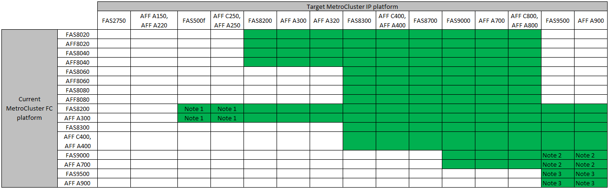

= 전환 절차 선택
:allow-uri-read: 
:icons: font
:imagesdir: ../media/

[role="lead"]
MetroCluster IP 구성으로 전환할 때는 지원되는 플랫폼 모델을 조합하여 사용해야 합니다. 또한 MetroCluster IP 플랫폼이 MetroCluster FC 구성에서 MetroCluster IP 구성으로 전환하려는 로드에 적합한 크기인지 확인해야 합니다.

다음 표에서는 지원되는 플랫폼 조합을 보여 줍니다. 색이 지정된 표 셀에 표시된 대로 왼쪽 열의 플랫폼에서 오른쪽 열의 지원되는 대로 나열된 플랫폼으로 전환할 수 있습니다.

예를 들어 AFF8060 컨트롤러 모듈로 구성된 MetroCluster FC 구성에서 AFF A400 컨트롤러 모듈로 구성된 IP 구성으로 전환할 수 있습니다.

* 참고 1: 이 플랫폼 조합에는 ONTAP 9.11.1 이상이 필요합니다.
* 참고 2: FC 노드의 로컬 클러스터 인터페이스에 대해 40GbE 인터페이스가 있어야 합니다. 이 플랫폼 조합에는 ONTAP 9.12.1 이상이 필요합니다.
* 참고 3: FC 노드의 로컬 클러스터 인터페이스를 위해 100GbE 인터페이스가 있어야 합니다. 이 플랫폼 조합에는 ONTAP 9.12.1 이상이 필요합니다.
* 전환 절차는 모두 ONTAP 9.8 이상이 필요합니다. 단, 참고 사항에 별도로 명시되어 있거나 개별 플랫폼에서 요구하는 경우는 예외입니다.

NOTE: 이 조합을 사용하는 플랫폼의 '아래쪽'에 대한 오브젝트 제한을 초과하지 마십시오. 두 플랫폼의 객체 하한값을 적용합니다. 을 참조하십시오 link:https://hwu.netapp.html["Hardware Universe"^] 플랫폼 제한.

기존 MetroCluster FC 구성에 따라 전환 절차를 선택해야 합니다.

전환 절차로 백엔드 FC 스위치 패브릭 또는 FC-VI 연결을 IP 스위치 네트워크로 바꿉니다. 정확한 절차는 시작 구성에 따라 다릅니다.

전환 절차가 끝나면 원래 플랫폼과 FC 스위치(있는 경우)가 폐기됩니다.

[cols="20,20,20,40"]
|===

| 구성을 시작하는 중입니다 | 중단 또는 무중단 | 요구 사항 | 절차를 참조하십시오 

 a| 
4개 노드
 a| 
무중단
 a| 
새로운 스토리지 쉘프가 새로운 플랫폼에서 지원됩니다.
 a| 
link:concept_requirements_for_fc_to_ip_transition_mcc.html["절차 링크"]

 a| 
2개 노드
 a| 
성능
 a| 
새로운 스토리지 쉘프는 원래 플랫폼과 새 플랫폼 모두에서 지원됩니다.
 a| 
link:task_disruptively_transition_from_a_two_node_mcc_fc_to_a_four_node_mcc_ip_configuration.html["절차 링크"]

 a| 
2개 노드
 a| 
성능
 a| 
새로운 스토리지 쉘프는 원래 플랫폼과 새 플랫폼 모두에서 지원됩니다. 이전 스토리지 쉘프는 폐기되어야 합니다.
 a| 
link:task_disruptively_transition_while_move_volumes_from_old_shelves_to_new_shelves.html["절차 링크"]

 a| 
2개 노드
 a| 
성능
 a| 
이전 스토리지 쉘프는 새 플랫폼에서 지원되지 않습니다. 이전 스토리지 쉘프는 폐기되어야 합니다.
 a| 
link:task_disruptively_transition_when_exist_shelves_are_not_supported_on_new_controllers.html["절차 링크"]

|===

=== Cisco 9336C-FX2 공유 스위치 구성으로 전환

Cisco 9336C-FX2 공유 스위치 구성으로의 전환은 지원되지 않습니다. 공유 스위치 구성 _ 은(는) 스위치가 MetroCluster 연결과 스토리지 쉘프 연결을 모두 제공하는 구성입니다.

Cisco 9336C-FX2 스위치가 MetroCluster 연결만 제공하는 구성은 지원됩니다.
