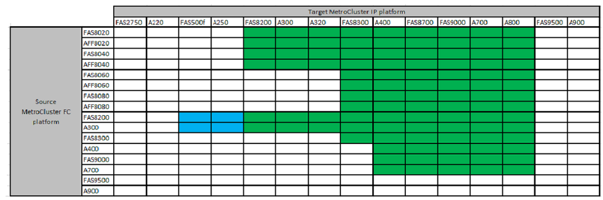

= 무중단 전환을 지원하는 플랫폼
:allow-uri-read: 
:icons: font
:imagesdir: ../media/

[role="lead"]
MetroCluster IP 구성으로 전환할 때는 지원되는 플랫폼 모델을 조합하여 사용해야 합니다.

다음 표에서는 지원되는 플랫폼 조합을 보여 줍니다. 녹색 표 셀에 표시된 대로 왼쪽 열의 플랫폼에서 오른쪽 열의 지원되는 대로 나열된 플랫폼으로 전환할 수 있습니다.

* 녹색 셀은 조합이 지원된다는 것을 나타냅니다.
* 흰색(빈) 셀은 조합이 지원되지 않음을 나타냅니다.
* 파란색 셀은 ONTAP 9.11.1부터 조합이 지원된다는 것을 나타냅니다.

예를 들어 AFF8060 컨트롤러 모듈로 구성된 MetroCluster FC 구성에서 AFF A400 컨트롤러 모듈로 구성된 IP 구성으로 전환할 수 있습니다.

== Cisco 9336C-FX2 공유 스위치 구성으로 전환

Cisco 9336C-FX2 공유 스위치 구성으로의 전환은 지원되지 않습니다. 공유 스위치 구성 _ 은(는) 스위치가 MetroCluster 연결과 스토리지 쉘프 연결을 모두 제공하는 구성입니다.

Cisco 9336C-FX2 스위치가 MetroCluster 연결만 제공하는 구성은 지원됩니다.
