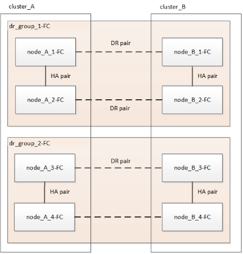
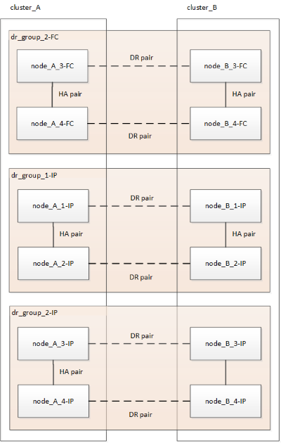

= 무중단 MetroCluster 전환을 위한 워크플로우
:allow-uri-read: 
:icons: font
:imagesdir: ../media/

[role="lead"]
무중단 전환이 성공하려면 특정 워크플로우를 따라야 합니다. 구성에 대한 워크플로우를 선택합니다.

* <<4노드 FC 구성 전환 워크플로우>>
* <<8노드 FC 구성 전환 워크플로우>>

== 4노드 FC 구성 전환 워크플로우

전환 프로세스는 정상 상태의 4노드 MetroCluster FC 구성으로 시작됩니다.

image::../media/transition_dr_group_1_fc_nodes.png[DR 그룹 1의 전환 FC 노드]

새 MetroCluster IP 노드가 두 번째 DR 그룹으로 추가됩니다.

image::../media/transition_dr_groups_fc_and_ip.png[FC 및 IP 노드가 모두 있는 전환 DR 그룹]

데이터가 이전 DR 그룹에서 새 DR 그룹으로 전송된 후 이전 노드와 해당 스토리지가 구성에서 제거되고 폐기됩니다. 이 프로세스는 4노드 MetroCluster IP 구성으로 끝납니다.

image::../media/transition_dr_group_2_ip.png[DR 그룹 2 IP 노드 전환]

== 8노드 FC 구성 전환 워크플로우

전환 프로세스는 양호한 8노드 MetroCluster FC 구성으로 시작됩니다.

새 MetroCluster IP 노드가 세 번째 DR 그룹으로 추가됩니다.

image::../media/mcc_dr_group_c2.png[IP 노드를 세 번째 DR 그룹으로 추가한 8노드 구성]

데이터가 DR_GROUP_1-FC에서 DR_GROUP_1-IP로 전송된 후 이전 노드와 해당 스토리지가 구성에서 제거되고 폐기됩니다.

NOTE: 8노드 FC 구성에서 4노드 IP 구성으로 전환하려는 경우 DR_GROUP_1-FC 및 DR_GROUP_2-FC의 모든 데이터를 새 IP DR 그룹(DR_GROUP_1-IP)으로 전환해야 합니다. 그런 다음 두 FC DR 그룹을 모두 중단할 수 있습니다. FC DR 그룹을 제거한 후 4노드 MetroCluster IP 구성으로 프로세스가 종료됩니다.

image::../media/mcc_dr_group_c8.png[첫 번째 DR 그룹 전환 후 8노드 구성]

기존 MetroCluster 구성에 나머지 MetroCluster IP 노드를 추가합니다. 이 프로세스를 반복하여 DR_GROUP_2-FC 노드에서 DR_GROUP_2-IP 노드로 데이터를 전송합니다.

dr_group_2-FC를 제거한 후 8노드 MetroCluster IP 구성으로 프로세스가 종료됩니다.

image::../media/mcc_dr_group_c6.png[전환 후 8노드 MetroCluster IP 구성]

== 전환 프로세스 워크플로우

다음 워크플로를 사용하여 MetroCluster 구성을 전환합니다.

image::../media/workflow_4n_transition_nondisruptive.png[중단 없는 4노드 전환을 위한 워크플로]
