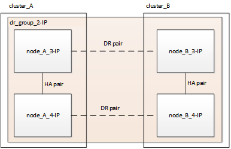

= 무중단 MetroCluster 전환을 위한 워크플로우
:allow-uri-read: 
:icons: font
:imagesdir: ../media/

[role="lead"]
무중단 전환이 성공하려면 특정 워크플로우를 따라야 합니다.

전환 프로세스는 정상 상태의 4노드 MetroCluster FC 구성으로 시작됩니다.

image::../media/transition_dr_group_1_fc_nodes.png[전환 DR 그룹 1 FC 노드]

새 MetroCluster IP 노드가 두 번째 DR 그룹으로 추가됩니다.

image::../media/transition_dr_groups_fc_and_ip.png[전환 DR 그룹 FC 및 IP]

데이터가 이전 DR 그룹에서 새 DR 그룹으로 전송된 후 이전 노드와 해당 스토리지가 구성에서 제거되고 폐기됩니다. 이 프로세스는 4노드 MetroCluster IP 구성으로 끝납니다.

다음 워크플로를 사용하여 MetroCluster 구성을 전환합니다.

image::../media/workflow_4n_transition_nondisruptive.png[워크플로우 4N 무중단 전환]
