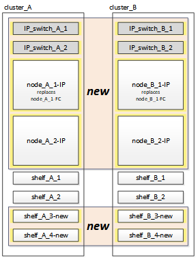

= MetroCluster IP 컨트롤러 모듈 연결
:allow-uri-read: 
:icons: font
:imagesdir: ../media/

[role="lead"]
구성에 새 컨트롤러 모듈 4개와 추가 스토리지 쉘프를 추가해야 합니다. 새 컨트롤러 모듈은 한 번에 두 개씩 추가됩니다.

== 새 컨트롤러 설정

새로운 MetroCluster IP 컨트롤러를 이전에 MetroCluster FC 컨트롤러에 연결된 스토리지 쉘프에 연결하고 케이블을 연결해야 합니다.

.이 작업에 대해
이러한 단계는 각 MetroCluster IP 노드에서 수행해야 합니다.

* Node_A_1 - IP
* Node_A_2 - IP
* Node_B_1 - IP
* Node_B_2 - IP

다음 예에서는 새 컨트롤러 모듈을 수용하기 위한 스토리지를 제공하기 위해 각 사이트에 2개의 추가 스토리지 쉘프를 추가합니다.

.단계
. 필요에 따라 새 컨트롤러 모듈 및 스토리지 쉘프를 포지셔닝합니다.
+
랙 공간은 컨트롤러 모듈의 플랫폼 모델, 스위치 유형 및 구성의 스토리지 쉘프 수에 따라 다릅니다.

. 적절하게 접지합니다.
. 컨트롤러, 스토리지 쉘프 및 IP 스위치 같은 새 장비를 랙에 장착
+
이때 스토리지 쉘프 또는 IP 스위치에 케이블을 연결하지 마십시오.

. 전원 케이블 및 관리 콘솔 연결을 컨트롤러에 연결합니다.
. 모든 스토리지 쉘프의 전원이 꺼져 있는지 확인합니다.
. 4개 노드 모두에서 다음 단계를 수행하여 연결된 드라이브가 없는지 확인합니다.
+
.. LOADER 프롬프트에서 부팅 메뉴를 시작합니다.
+
boot_ONTAP maint를 선택합니다

.. 연결된 드라이브가 없는지 확인합니다.
+
'디스크 쇼-v'

+
출력에는 드라이브가 표시되지 않아야 합니다.

.. 노드 중단:
+
"중지"

. 부팅 메뉴의 9a 옵션을 사용하여 4개 노드를 모두 부팅합니다.
+
.. LOADER 프롬프트에서 부팅 메뉴를 시작합니다.
+
boot_ontap 메뉴

.. 부팅 메뉴에서 ""9a"" 옵션을 선택하여 컨트롤러를 재부팅합니다.
.. 다음 컨트롤러 모듈로 이동하기 전에 컨트롤러 모듈이 부팅을 완료하게 하십시오.

+
""9a""가 완료되면 노드는 자동으로 부팅 메뉴로 돌아갑니다.

. 스토리지 쉘프에 케이블을 연결합니다.
+
케이블 연결 정보는 해당 모델의 컨트롤러 설치 및 설정 절차를 참조하십시오.

+
https://docs.netapp.com/platstor/index.jsp["ONTAP 하드웨어 시스템 설명서"^]

. 에 설명된 대로 컨트롤러를 IP 스위치에 연결합니다 link:../install-ip/using_rcf_generator.html["IP 스위치 케이블 연결"].
. 새로운 RCF 파일 적용을 위한 IP 스위치를 준비합니다.
+
스위치 공급업체의 단계를 따르십시오.

+
** link:../install-ip/task_switch_config_broadcom.html#resetting-the-broadcom-ip-switch-to-factory-defaults["Broadcom IP 스위치를 출하 시 기본값으로 재설정합니다"]
** link:../install-ip/task_switch_config_cisco.html#resetting-the-cisco-ip-switch-to-factory-defaults["Cisco IP 스위치를 출하 시 기본값으로 재설정합니다"]
** link:../install-ip/task_switch_config_nvidia.html#reset-the-nvidia-ip-sn2100-switch-to-factory-defaults["NVIDIA IP SN2100 스위치를 출하 시 기본값으로 재설정합니다"]

. RCF 파일을 다운로드하고 설치합니다.
+
스위치 공급업체의 단계를 따르십시오.

+
** link:../install-ip/task_switch_config_broadcom.html["Broadcom IP RCF 파일을 다운로드하여 설치합니다"]
** link:../install-ip/task_switch_config_cisco.html["Cisco IP RCF 파일을 다운로드하고 설치합니다"]
** link:../install-ip/task_switch_config_nvidia.html#download-and-install-the-nvidia-rcf-files["NVIDIA RCF 파일을 다운로드하고 설치합니다"] ]

. 첫 번째 새 컨트롤러(node_a_1-IP)의 전원을 켜고 Ctrl-C를 눌러 부팅 프로세스를 중단하고 로더 프롬프트를 표시합니다.
. 컨트롤러를 유지보수 모드로 부팅합니다.
+
boot_ontap_maint를 선택합니다

. 컨트롤러의 시스템 ID를 표시합니다.
+
'Sysconfig-v'입니다

. 기존 구성의 쉘프가 새 MetroCluster IP 노드에서 표시되는지 확인합니다.
+
'Storage show shelf''Disk show-v

. 노드 중단:
+
"중지"

. 파트너 사이트(site_B)의 다른 노드에서 위의 단계를 반복합니다.

== node_A_1-IP 및 node_B_1-IP 연결 및 부팅

MetroCluster IP 컨트롤러와 IP 스위치를 연결한 후 node_A_1-IP 및 node_B_1-IP를 전환하고 부팅합니다.

=== node_A_1-IP를 가져오는 중입니다

노드를 올바른 전환 옵션으로 부팅해야 합니다.

.단계
. 부트 노드_A_1-IP를 부트 메뉴로
+
boot_ontap 메뉴

. 부팅 메뉴 프롬프트에서 다음 명령을 실행하여 전환을 시작합니다.
+
BOOT_after_MCC_transition

+
** 이 명령은 node_A_1-FC가 소유한 모든 디스크를 node_A_1-IP에 다시 할당합니다.
+
*** node_A_1 - FC 디스크가 node_A_1-IP에 할당됩니다
*** node_B_1 - FC 디스크가 node_B_1-IP에 할당됩니다

** 또한 명령은 MetroCluster IP 노드가 ONTAP 프롬프트로 부팅될 수 있도록 다른 필요한 시스템 ID를 자동으로 재할당합니다.
** 어떤 이유로든 boot_after_MCC_transition 명령이 실패하면 부팅 메뉴에서 다시 실행해야 합니다.
+
[NOTE]
====
*** 다음 프롬프트가 표시되면 Ctrl-C를 입력하여 계속합니다. MCC DR 상태 확인 중... [Ctrl-C(resume), S(status), L(link) 입력] _
*** 루트 볼륨이 암호화된 경우 노드는 다음 메시지와 함께 중지됩니다. 루트 볼륨이 암호화되어 있고(NetApp Volume Encryption) 키 가져오기에 실패하여 시스템을 중지합니다. 이 클러스터에 외부(KMIP) 키 관리자를 구성한 경우 키 서버의 상태를 확인하십시오.

====
+
[listing]
----

Please choose one of the following:
(1) Normal Boot.
(2) Boot without /etc/rc.
(3) Change password.
(4) Clean configuration and initialize all disks.
(5) Maintenance mode boot.
(6) Update flash from backup config.
(7) Install new software first.
(8) Reboot node.
(9) Configure Advanced Drive Partitioning. Selection (1-9)? `boot_after_mcc_transition`
This will replace all flash-based configuration with the last backup to disks. Are you sure you want to continue?: yes

MetroCluster Transition: Name of the MetroCluster FC node: `node_A_1-FC`
MetroCluster Transition: Please confirm if this is the correct value [yes|no]:? y
MetroCluster Transition: Disaster Recovery partner sysid of MetroCluster FC node node_A_1-FC: `systemID-of-node_B_1-FC`
MetroCluster Transition: Please confirm if this is the correct value [yes|no]:? y
MetroCluster Transition: Disaster Recovery partner sysid of local MetroCluster IP node: `systemID-of-node_B_1-IP`
MetroCluster Transition: Please confirm if this is the correct value [yes|no]:? y
----

. 데이터 볼륨이 암호화된 경우 키 관리 구성에 맞는 명령을 사용하여 키를 복원합니다.
+
[cols="1,2"]
|===

| 사용 중인 경우... | 이 명령 사용... 

 a| 
* 온보드 키 관리 *
 a| 
보안 키매니저 온보드 동기화

자세한 내용은 을 참조하십시오 https://docs.netapp.com/ontap-9/topic/com.netapp.doc.pow-nve/GUID-E4AB2ED4-9227-4974-A311-13036EB43A3D.html["온보드 키 관리 암호화 키를 복원하는 중입니다"^].

 a| 
* 외부 키 관리 *
 a| 
'보안 키 관리자 키 쿼리 노드 이름'

자세한 내용은 을 참조하십시오 https://docs.netapp.com/ontap-9/topic/com.netapp.doc.pow-nve/GUID-32DA96C3-9B04-4401-92B8-EAF323C3C863.html["외부 키 관리 암호화 키 복원"^].

|===
. 루트 볼륨이 암호화된 경우 의 절차를 사용합니다 link:../transition/task_connect_the_mcc_ip_controller_modules_2n_mcc_transition_supertask.html#recovering-key-management-if-the-root-volume-is-encrypted["루트 볼륨이 암호화된 경우 키 관리 복구"].

=== 루트 볼륨이 암호화된 경우 키 관리 복구

루트 볼륨이 암호화된 경우 특수 부팅 명령을 사용하여 키 관리를 복원해야 합니다.

.시작하기 전에
이전에 수집한 암호 문구를 가지고 있어야 합니다.

.단계
. 온보드 키 관리를 사용하는 경우 다음 하위 단계를 수행하여 구성을 복원합니다.
+
.. LOADER 프롬프트에서 부팅 메뉴를 표시합니다.
+
boot_ontap 메뉴

.. 부팅 메뉴에서 ""(10) 온보드 키 관리 복구 암호 설정" 옵션을 선택합니다.
+
프롬프트에 따라 적절히 응답합니다.

+
[listing]
----
This option must be used only in disaster recovery procedures. Are you sure? (y or n): y
Enter the passphrase for onboard key management: passphrase
Enter the passphrase again to confirm: passphrase

Enter the backup data: backup-key
----
+
시스템이 부팅 메뉴로 부팅됩니다.

.. 부팅 메뉴에서 옵션 ""6""을 입력합니다.
+
프롬프트에 따라 적절히 응답합니다.

+
[listing]
----
This will replace all flash-based configuration with the last backup to
disks. Are you sure you want to continue?: y

Following this, the system will reboot a few times and the following prompt will be available continue by saying y

WARNING: System ID mismatch. This usually occurs when replacing a boot device or NVRAM cards!
Override system ID? {y|n} y
----
+
재부팅 후 시스템에 LOADER 메시지가 표시됩니다.

.. LOADER 프롬프트에서 부팅 메뉴를 표시합니다.
+
boot_ontap 메뉴

.. 부팅 메뉴에서 ""(10) 온보드 키 관리 복구 암호 설정" 옵션을 다시 선택합니다.
+
프롬프트에 따라 적절히 응답합니다.

+
[listing]
----
This option must be used only in disaster recovery procedures. Are you sure? (y or n): `y`
Enter the passphrase for onboard key management: `passphrase`
Enter the passphrase again to confirm:`passphrase`

Enter the backup data:`backup-key`
----
+
시스템이 부팅 메뉴로 부팅됩니다.

.. 부팅 메뉴에서 ""1"" 옵션을 입력합니다.
+
다음 프롬프트가 표시되면 Ctrl+C를 눌러 프로세스를 다시 시작할 수 있습니다.

+
....
 Checking MCC DR state... [enter Ctrl-C(resume), S(status), L(link)]
....
+
시스템이 ONTAP 프롬프트로 부팅됩니다.

.. 온보드 키 관리 복원:
+
보안 키매니저 온보드 동기화

+
이전에 수집한 암호를 사용하여 프롬프트에 적절하게 응답합니다.

+
[listing]
----
cluster_A::> security key-manager onboard sync
Enter the cluster-wide passphrase for onboard key management in Vserver "cluster_A":: passphrase
----

. 외부 키 관리를 사용하는 경우 다음 하위 단계를 수행하여 구성을 복원합니다.
+
.. 필요한 boots를 설정합니다.
+
'bootarg.kmip.init.ipaddr ip-address'

+
'셋틴 bootarg.kmip.init.netmask 넷마스크'

+
'bootarg.kmip.init.gateway gateway-address'

+
'셋틴 bootarg.kmip.init.interface interface-id'

.. LOADER 프롬프트에서 부팅 메뉴를 표시합니다.
+
boot_ontap 메뉴

.. 부팅 메뉴에서 ""(11) Configure node for external key management" 옵션을 선택합니다.
+
시스템이 부팅 메뉴로 부팅됩니다.

.. 부팅 메뉴에서 옵션 ""6""을 입력합니다.
+
시스템이 여러 번 부팅됩니다. 부팅 프로세스를 계속하라는 메시지가 표시되면 긍정적으로 응답할 수 있습니다.

+
재부팅 후 시스템에 LOADER 메시지가 표시됩니다.

.. 필요한 boots를 설정합니다.
+
'bootarg.kmip.init.ipaddr ip-address'

+
'셋틴 bootarg.kmip.init.netmask 넷마스크'

+
'bootarg.kmip.init.gateway gateway-address'

+
'셋틴 bootarg.kmip.init.interface interface-id'

.. LOADER 프롬프트에서 부팅 메뉴를 표시합니다.
+
boot_ontap 메뉴

.. 부팅 메뉴에서 ""(11) Configure node for external key management" 옵션을 다시 선택하고 필요에 따라 프롬프트에 응답합니다.
+
시스템이 부팅 메뉴로 부팅됩니다.

.. 외부 키 관리 복원:
+
보안 키 관리자 외부 복원

=== 네트워크 구성을 만드는 중입니다

FC 노드의 구성과 일치하는 네트워크 구성을 생성해야 합니다. 이는 MetroCluster IP 노드가 부팅될 때 동일한 구성을 재생하므로, node_A_1-IP 및 node_B_1-IP 부팅에서 ONTAP은 각각 node_A_1-FC 및 node_B_1-FC에서 사용된 동일한 포트에 LIF를 호스팅하려고 하기 때문입니다.

.이 작업에 대해
네트워크 구성을 만들 때 에서 만든 계획을 사용합니다 link:concept_requirements_for_fc_to_ip_transition_2n_mcc_transition.html["MetroCluster FC 노드의 포트를 MetroCluster IP 노드로 매핑"] 도움을 드립니다.

NOTE: MetroCluster IP 노드를 구성한 후 데이터 LIF를 가져오려면 추가 구성이 필요할 수 있습니다.

.단계
. 모든 클러스터 포트가 적절한 브로드캐스트 도메인에 있는지 확인합니다.
+
클러스터 LIF를 생성하려면 클러스터 IPspace 및 클러스터 브로드캐스트 도메인이 필요합니다

+
.. IP 공간 보기:
+
네트워크 IPspace 쇼

.. IP 공간을 생성하고 필요에 따라 클러스터 포트를 할당합니다.
+
http://docs.netapp.com/ontap-9/topic/com.netapp.doc.dot-cm-nmg/GUID-69120CF0-F188-434F-913E-33ACB8751A5D.html["IPspace 구성(클러스터 관리자만 해당)"^]

.. 브로드캐스트 도메인 보기:
+
네트워크 포트 브로드캐스트 도메인 쇼

.. 필요에 따라 브로드캐스트 도메인에 클러스터 포트를 추가합니다.
+
https://docs.netapp.com/ontap-9/topic/com.netapp.doc.dot-cm-nmg/GUID-003BDFCD-58A3-46C9-BF0C-BA1D1D1475F9.html["브로드캐스트 도메인에서 포트 추가 또는 제거"^]

.. 필요에 따라 VLAN 및 인터페이스 그룹을 다시 생성합니다.
+
VLAN 및 인터페이스 그룹 멤버쉽은 이전 노드의 멤버쉽과 다를 수 있습니다.

+
https://docs.netapp.com/ontap-9/topic/com.netapp.doc.dot-cm-nmg/GUID-8929FCE2-5888-4051-B8C0-E27CAF3F2A63.html["VLAN을 생성하는 중입니다"^]

+
https://docs.netapp.com/ontap-9/topic/com.netapp.doc.dot-cm-nmg/GUID-DBC9DEE2-EAB7-430A-A773-4E3420EE2AA1.html["물리적 포트를 결합하여 인터페이스 그룹을 생성합니다"^]

. 포트 및 브로드캐스트 도메인에 대해 MTU 설정이 올바르게 설정되어 있는지 확인하고 다음 명령을 사용하여 변경합니다.
+
네트워크 포트 브로드캐스트 도메인 쇼

+
'network port broadcast-domain modify -broadcast -domain_bcastdomainname_-MTU_MTU -value_'

=== 클러스터 포트 및 클러스터 LIF 설정

클러스터 포트 및 LIF를 설정해야 합니다. 루트 애그리게이트로 부팅된 사이트 A 노드에서 다음 단계를 수행해야 합니다.

.단계
. 원하는 클러스터 포트를 사용하여 LIF 목록 식별:
+
네트워크 인터페이스 show-curr-port portname

+
네트워크 인터페이스 show-home-port portname

. 각 클러스터 포트에 대해 해당 포트에 있는 LIF의 홈 포트를 다른 포트로 변경합니다.
+
.. 고급 권한 모드로 진입하고 계속하라는 메시지가 나타나면 ""y""를 입력합니다.
+
'et priv advanced'

.. 수정되는 LIF가 데이터 LIF인 경우:
+
'vserver config override -command' network interface modify -lif_lifname_-vserver_vservername_-home-port_new-datahomport_'

.. LIF가 데이터 LIF가 아닌 경우:
+
'network interface modify -lif_lifname_-vserver_vservername_-home-port_new-datahomport_'

.. 수정된 LIF를 홈 포트로 되돌리기:
+
'네트워크 인터페이스 되돌리기 * - vserver_vserver_name_'

.. 클러스터 포트에 LIF가 없는지 확인합니다.
+
네트워크 인터페이스 show-curr-port_portname _

+
네트워크 인터페이스 show-home-port_portname _

.. 현재 브로드캐스트 도메인에서 포트를 제거합니다.
+
'network port broadcast-domain remove-ports-IPSpace_ipspacename_-broadcast-domain_bcastdomainname_-ports_node_name:port_name_'

.. 클러스터 IPspace 및 브로드캐스트 도메인에 포트 추가:
+
'network port broadcast-domain add-ports-IPSpace Cluster-broadcast-domain Cluster-ports_node_name:port_name_'

.. 포트의 역할이 변경되었는지 확인합니다. 'network port show'
.. 각 클러스터 포트에 대해 이러한 하위 단계를 반복합니다.
.. 관리자 모드로 돌아가기:
+
'et priv admin'

. 새 클러스터 포트에 클러스터 LIF 생성:
+
.. 클러스터 LIF에 대한 링크 로컬 주소를 사용하여 자동 구성하려면 다음 명령을 사용하십시오.
+
'network interface create-vserver cluster-lif_cluster_lifname_-service-policy_default-cluster_-home-node_a1name_-home-port clusterport-auto true'

.. 클러스터 LIF에 정적 IP 주소를 할당하려면 다음 명령을 사용합니다.
+
'network interface create-vserver Cluster-lif_cluster_lifname_-service-policy default-cluster-home-node_a1name_-home-port_clusterport_-address_netmask_-status-admin up'을 선택합니다

=== LIF 구성을 확인하는 중입니다

이전 컨트롤러에서 스토리지를 이동하면 노드 관리 LIF, 클러스터 관리 LIF 및 인터클러스터 LIF가 계속 표시됩니다. 필요한 경우 LIF를 적절한 포트로 이동해야 합니다.

.단계
. 관리 LIF 및 클러스터 관리 LIF가 이미 원하는 포트에 있는지 확인합니다.
+
네트워크 인터페이스 show-service-policy default-management

+
네트워크 인터페이스 show-service-policy default-인터클러스터

+
LIF가 원하는 포트에 있는 경우 이 작업의 나머지 단계를 건너뛰고 다음 작업으로 진행할 수 있습니다.

. 원하는 포트에 없는 각 노드, 클러스터 관리 또는 인터클러스터 LIF의 경우 해당 포트에 있는 LIF의 홈 포트를 다른 포트로 변경하십시오.
+
.. 원하는 포트에 호스팅된 LIF를 다른 포트로 이동하여 원하는 포트를 재활용합니다.
+
'vserver config override -command' network interface modify -lif_lifname_-vserver_vservername_-home-port_new-datahomport_'

.. 수정한 LIF를 새 홈 포트로 되돌리기:
+
'vserver config override -command 'network interface revert-lif_lifname_-vserver_vservername'

.. 원하는 포트가 오른쪽 IPspace 및 브로드캐스트 도메인에 없는 경우 현재 IPspace 및 브로드캐스트 도메인에서 포트를 제거합니다.
+
'network port broadcast-domain remove-ports-IPSpace_current-IPSpace_-broadcast-domain_current-broadcast-domain_-ports_controller-name:current-port_'

.. 원하는 포트를 오른쪽 IPspace 및 브로드캐스트 도메인으로 이동:
+
'network port broadcast-domain add-ports-IPSpace_new-IPSpace_-broadcast-domain_new-broadcast-domain_-ports_controller-name:new-port_'

.. 포트의 역할이 변경되었는지 확인합니다.
+
네트워크 포트 쇼

.. 각 포트에 대해 이러한 하위 단계를 반복합니다.

. 노드, 클러스터 관리 LIF 및 인터클러스터 LIF를 원하는 포트로 이동합니다.
+
.. LIF의 홈 포트를 변경합니다.
+
'network interface modify -vserver_vserver_-lif_node_mgmt_-home-port_port_-home-node_homenode_'

.. LIF를 새로운 홈 포트로 되돌립니다.
+
'network interface revert-lif_node_mgmt_-vserver_vservername_'

.. 클러스터 관리 LIF의 홈 포트를 변경합니다.
+
'network interface modify -vserver_vserver_-lif_cluster-mgmt-LIF-name_-home-port_port_-home-node_homenode_'

.. 클러스터 관리 LIF를 새로운 홈 포트로 되돌리기:
+
'네트워크 인터페이스 revert-lif_cluster-mgmt-LIF-name_-vserver_vservername_'

.. 인터클러스터 LIF의 홈 포트를 변경합니다.
+
'network interface modify -vserver_vserver_-lif_인터클러스터 -lif-name_-home-node_nodename_-home-port_port_'

.. 인터클러스터 LIF를 새 홈 포트로 되돌리기:
+
'network interface revert-lif_인터클러스터-lif-name_-vserver_vservername_'

== node_A_2-IP 및 node_B_2-IP를 가져오는 중입니다

각 사이트에서 새로운 MetroCluster IP 노드를 구성하여 각 사이트에 HA 쌍을 생성해야 합니다.

=== node_A_2-IP 및 node_B_2-IP를 가져오는 중입니다

부팅 메뉴에서 올바른 옵션을 사용하여 한 번에 하나씩 새 컨트롤러 모듈을 부팅해야 합니다.

.이 작업에 대해
이 단계에서는 2노드 구성으로 있던 것을 4노드 구성으로 확장하여 새로운 2노드 구성으로 실행합니다.

이러한 단계는 다음 노드에서 수행됩니다.

* Node_A_2 - IP
* Node_B_2 - IP

image::../media/transition_2n_booting_a_2_and_b_2.png[전환 중 새 IP 노드 부팅]

.단계
. 부팅 옵션 ""9c""를 사용하여 새 노드를 부팅합니다.
+
[listing]
----
Please choose one of the following:
(1) Normal Boot.
(2) Boot without /etc/rc.
(3) Change password.
(4) Clean configuration and initialize all disks.
(5) Maintenance mode boot.
(6) Update flash from backup config.
(7) Install new software first.
(8) Reboot node.
(9) Configure Advanced Drive Partitioning. Selection (1-9)? 9c
----
+
노드가 초기화되고 다음과 유사한 노드 설정 마법사로 부팅됩니다.

+
[listing]
----
Welcome to node setup
You can enter the following commands at any time:
"help" or "?" - if you want to have a question clarified,
"back" - if you want to change previously answered questions, and
"exit" or "quit" - if you want to quit the setup wizard.
Any changes you made before quitting will be saved.
To accept a default or omit a question, do not enter a value. .
.
.
----
+
""9c"" 옵션이 성공하지 못할 경우 다음 단계를 수행하여 데이터 손실을 방지하십시오.

+
** 옵션 9a를 실행하지 마십시오.
** 데이터가 포함된 기존 쉘프를 원래 MetroCluster FC 구성(shelf_A_1, shelf_A_2, shelf_B_1, shelf_B_2)에서 물리적으로 분리합니다.
** 기술 지원 부서에 문의하여 KB 문서를 참조하십시오 https://kb.netapp.com/Advice_and_Troubleshooting/Data_Protection_and_Security/MetroCluster/MetroCluster_FC_to_IP_transition_-_Option_9c_Failing["MetroCluster FC에서 IP로의 전환 - 옵션 9c 실패"^].
+
https://mysupport.netapp.com/site/global/dashboard["NetApp 지원"^]

. 마법사에서 제공하는 지침에 따라 AutoSupport 도구를 활성화합니다.
. 프롬프트에 응답하여 노드 관리 인터페이스를 구성합니다.
+
[listing]
----
Enter the node management interface port: [e0M]:
Enter the node management interface IP address: 10.228.160.229
Enter the node management interface netmask: 225.225.252.0
Enter the node management interface default gateway: 10.228.160.1
----
. 스토리지 페일오버 모드가 HA로 설정되었는지 확인합니다.
+
'스토리지 페일오버 표시 필드 모드'

+
HA 모드가 아닌 경우 다음과 같이 설정합니다.

+
'Storage failover modify -mode ha-node_localhost_'

+
그런 다음 노드를 재부팅하여 변경 사항을 적용해야 합니다.

. 클러스터의 포트 나열:
+
네트워크 포트 쇼

+
전체 명령 구문은 man 페이지를 참조하십시오.

+
다음 예는 cluster01의 네트워크 포트를 보여줍니다.

+
[listing]
----

cluster01::> network port show
                                                             Speed (Mbps)
Node   Port      IPspace      Broadcast Domain Link   MTU    Admin/Oper
------ --------- ------------ ---------------- ----- ------- ------------
cluster01-01
       e0a       Cluster      Cluster          up     1500   auto/1000
       e0b       Cluster      Cluster          up     1500   auto/1000
       e0c       Default      Default          up     1500   auto/1000
       e0d       Default      Default          up     1500   auto/1000
       e0e       Default      Default          up     1500   auto/1000
       e0f       Default      Default          up     1500   auto/1000
cluster01-02
       e0a       Cluster      Cluster          up     1500   auto/1000
       e0b       Cluster      Cluster          up     1500   auto/1000
       e0c       Default      Default          up     1500   auto/1000
       e0d       Default      Default          up     1500   auto/1000
       e0e       Default      Default          up     1500   auto/1000
       e0f       Default      Default          up     1500   auto/1000
----
. 노드 설정 마법사를 종료합니다.
+
종료

. admin 사용자 이름을 사용하여 admin 계정에 로그인합니다.
. 클러스터 설정 마법사를 사용하여 기존 클러스터를 결합합니다.
+
[listing]
----
:> cluster setup
Welcome to the cluster setup wizard.
You can enter the following commands at any time:
"help" or "?" - if you want to have a question clarified,
"back" - if you want to change previously answered questions, and "exit" or "quit" - if you want to quit the cluster setup wizard.
Any changes you made before quitting will be saved.
You can return to cluster setup at any time by typing "cluster setup". To accept a default or omit a question, do not enter a value.
Do you want to create a new cluster or join an existing cluster?
{create, join}:
join
----
. 클러스터 설정 마법사를 완료하고 종료한 후 클러스터가 활성 상태이고 노드가 정상 상태인지 확인합니다.
+
'클러스터 쇼'

. 디스크 자동 할당 해제:
+
'storage disk option modify -autostassign off-node_a_2-ip'이 있습니다

. 암호화가 사용되는 경우 키 관리 구성에 맞는 명령을 사용하여 키를 복원합니다.
+
[cols="1,2"]
|===

| 사용 중인 경우... | 이 명령 사용... 

 a| 
* 온보드 키 관리 *
 a| 
보안 키매니저 온보드 동기화

자세한 내용은 을 참조하십시오 https://docs.netapp.com/ontap-9/topic/com.netapp.doc.pow-nve/GUID-E4AB2ED4-9227-4974-A311-13036EB43A3D.html["온보드 키 관리 암호화 키를 복원하는 중입니다"].

 a| 
* 외부 키 관리 *
 a| 
'Security key-manager key query-node_node-name_'

자세한 내용은 을 참조하십시오 https://docs.netapp.com/ontap-9/topic/com.netapp.doc.pow-nve/GUID-32DA96C3-9B04-4401-92B8-EAF323C3C863.html["외부 키 관리 암호화 키 복원"^].

|===
. 두 번째 새 컨트롤러 모듈(node_B_2-IP)에서 위의 단계를 반복합니다.

=== MTU 설정을 확인하는 중입니다

포트 및 브로드캐스트 도메인에 대해 MTU 설정이 올바르게 설정되어 있는지 확인하고 변경합니다.

.단계
. 클러스터 브로드캐스트 도메인에서 사용되는 MTU 크기를 확인합니다.
+
네트워크 포트 브로드캐스트 도메인 쇼

. 필요한 경우 필요에 따라 MTU 크기를 업데이트합니다.
+
'network port broadcast-domain modify -broadcast -domain_bcast-domain -name_-mtu_mtu -size _'

=== 인터클러스터 LIF 구성

클러스터 피어링을 위해 필요한 인터클러스터 LIF를 구성합니다.

이 작업은 node_A_2-IP와 node_B_2-IP 두 노드에서 모두 수행해야 합니다.

.단계
. 인터클러스터 LIF를 구성합니다. 을 참조하십시오 link:../install-ip/task_sw_config_configure_clusters.html#configuring-intercluster-lifs-for-cluster-peering["인터클러스터 LIF 구성"]

=== 클러스터 피어링을 확인하는 중입니다

cluster_A와 cluster_B가 피어링되었으며 각 클러스터의 노드가 서로 통신할 수 있는지 확인합니다.

.단계
. 클러스터 피어링 관계를 확인합니다.
+
클러스터 피어 상태 쇼

+
[listing]
----
cluster01::> cluster peer health show
Node       cluster-Name                Node-Name
             Ping-Status               RDB-Health Cluster-Health  Avail…
---------- --------------------------- ---------  --------------- --------
node_A_1-IP
           cluster_B                   node_B_1-IP
             Data: interface_reachable
             ICMP: interface_reachable true       true            true
                                       node_B_2-IP
             Data: interface_reachable
             ICMP: interface_reachable true       true            true
node_A_2-IP

image::../media/transition_2n_booting_a_2_and_b_2.png["Booting new IP nodes during transition"]
             Data: interface_reachable
             ICMP: interface_reachable true       true            true
                                       node_B_2-IP
             Data: interface_reachable
             ICMP: interface_reachable true       true            true
----
. Ping을 통해 피어 주소에 연결할 수 있는지 확인합니다.
+
'cluster peer ping-Originating-node_local-node_-destination-cluster_remote-cluster-name_'

