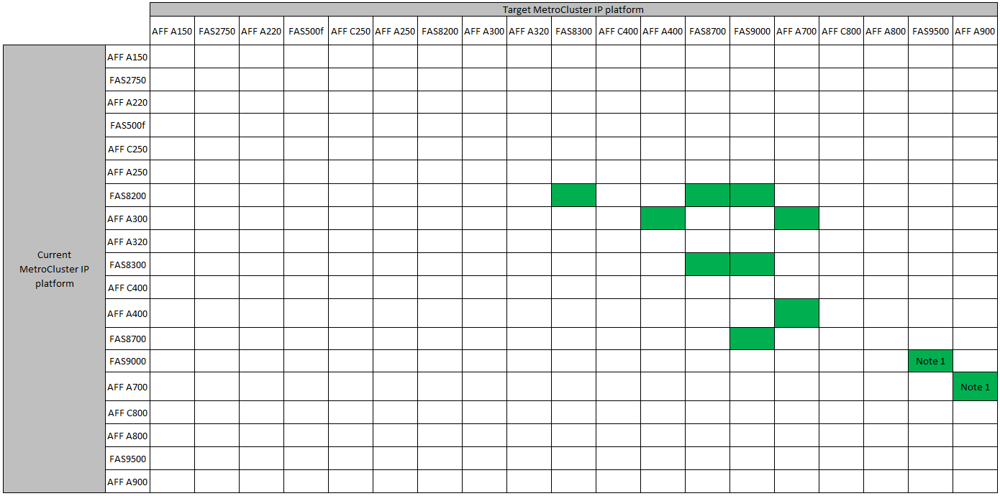
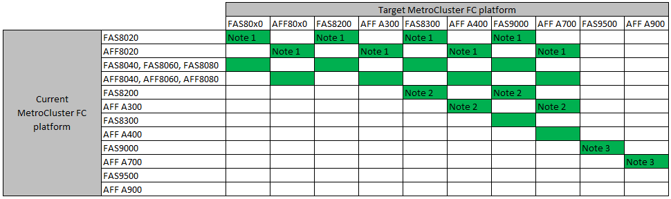

= 컨트롤러 업그레이드 절차를 선택합니다
:allow-uri-read: 
:icons: font
:imagesdir: ../media/

[role="lead"]
사용하는 컨트롤러 업그레이드 절차는 플랫폼 모델 및 MetroCluster 구성 유형에 따라 다릅니다.

업그레이드 절차에서는 컨트롤러가 새 컨트롤러 모델로 교체됩니다. 스토리지 쉘프 모델은 업그레이드되지 않습니다.

* 스위치오버 및 스위치백 절차에서 MetroCluster 스위치오버 작동은 파트너 클러스터의 컨트롤러 모듈이 업그레이드되는 동안 클라이언트에 무중단 서비스를 제공하는 데 사용됩니다.
* ARL 기반 컨트롤러 업그레이드 절차에서는 애그리게이트 재배치 작업을 사용하여 데이터를 이전 구성에서 업그레이드된 새 구성으로 중단 없이 이동할 수 있습니다.

== 스위치오버 및 스위치백 프로세스를 사용하는 절차 선택

아래 FC 또는 IP 표에서 현재 플랫폼을 선택합니다. 현재 플랫폼 행과 대상 플랫폼 열이 교차하는 부분이 비어 있으면 업그레이드가 지원되지 않습니다.

=== MetroCluster IP 컨트롤러 업그레이드가 지원됩니다

* 참고 1: 이 업그레이드의 경우 절차를 사용하십시오 link:task_upgrade_A700_to_A900_in_a_four_node_mcc_ip_us_switchover_and_switchback.html["스위치오버 및 스위치백을 사용하여 MetroCluster IP 구성에서 AFF A700/FAS9000을 AFF A900/FAS9500으로 컨트롤러 업그레이드(ONTAP 9.10.1 이상)"]

=== 지원되는 MetroCluster FC 컨트롤러 업그레이드

* 참고 1: 기존 FAS8020 또는 AFF8020 노드에서 FCVI 연결이 포트 1c 및 1d를 사용할 때 컨트롤러를 업그레이드하려면 다음을 참조하십시오https://kb.netapp.com/Advice_and_Troubleshooting/Data_Protection_and_Security/MetroCluster/Upgrading_controllers_when_FCVI_connections_on_existing_FAS8020_or_AFF8020_nodes_use_ports_1c_and_1d["기술 자료 문서"^].
* 참고 2: 온보드 포트 0e 및 0f를 FC-VI 연결로 AFF A300 또는 FAS8200 플랫폼에서 컨트롤러 업그레이드는 ONTAP 9.9.1을 실행하는 시스템에서만 지원됩니다. 또는 그 이전 버전. 자세한 내용은 를 참조하십시오 link:https://mysupport.netapp.com/site/bugs-online/product/ONTAP/BURT/1507088["공개 보고서"^].
* 참고 3: 이 업그레이드에 대해서는 을 참조하십시오 link:task_upgrade_A700_to_A900_in_a_four_node_mcc_fc_us_switchover_and_switchback.html["스위치오버 및 스위치백을 사용하여 MetroCluster FC 구성에서 AFF A700/FAS9000을 AFF A900/FAS9500으로 컨트롤러 업그레이드(ONTAP 9.10.1 이상)"]

[cols="2,1,1,2"]
|===

| MetroCluster 형식입니다 | 업그레이드 방법 | ONTAP 버전입니다 | 절차를 참조하십시오 

 a| 
FC
 a| 
'시스템 컨트롤러 교체' 명령으로 업그레이드하십시오
 a| 
9.10.1 이상
 a| 
link:task_upgrade_controllers_system_control_commands_in_a_four_node_mcc_fc.html["절차 링크"]

 a| 
FC
 a| 
CLI 명령을 사용한 수동 업그레이드(AFF A700/FAS9000에서 AFF A900/FAS9500으로 업그레이드)
 a| 
9.10.1 이상
 a| 
link:task_upgrade_A700_to_A900_in_a_four_node_mcc_fc_us_switchover_and_switchback.html["절차 링크"]

 a| 
IP
 a| 
CLI 명령을 사용한 수동 업그레이드(AFF A700/FAS9000에서 AFF A900/FAS9500으로 업그레이드)
 a| 
9.10.1 이상
 a| 
link:task_upgrade_A700_to_A900_in_a_four_node_mcc_ip_us_switchover_and_switchback.html["절차 링크"]

 a| 
FC
 a| 
CLI 명령을 사용한 수동 업그레이드
 a| 
9.8 이상
 a| 
link:task_upgrade_controllers_in_a_four_node_fc_mcc_us_switchover_and_switchback_mcc_fc_4n_cu.html["절차 링크"]

 a| 
IP
 a| 
CLI 명령을 사용한 수동 업그레이드
 a| 
9.8 이상
 a| 
link:task_upgrade_controllers_in_a_four_node_ip_mcc_us_switchover_and_switchback_mcc_ip.html["절차 링크"]

|===

== 집계 재배치를 사용하여 프로시저 선택

ARL 기반 컨트롤러 업그레이드 절차에서는 애그리게이트 재배치 작업을 사용하여 데이터를 이전 구성에서 업그레이드된 새 구성으로 중단 없이 이동할 수 있습니다.

|===
| MetroCluster 형식입니다 | 애그리게이트 재배치 | ONTAP 버전입니다 | 절차를 참조하십시오 

 a| 
FC
 a| 
사용 `system controller replace` 컨트롤러 모듈 및 NVM 교체(AFF A700에서 AFF A900으로 업그레이드)
 a| 
9.10.1 이상
 a| 
https://docs.netapp.com/us-en/ontap-systems-upgrade/upgrade-arl-auto-affa900/index.html["절차 링크"^]

 a| 
FC
 a| 
'시스템 컨트롤러 교체' 명령 사용
 a| 
9.8 이상
 a| 
https://docs.netapp.com/us-en/ontap-systems-upgrade/upgrade-arl-auto-app/index.html["절차 링크"^]

 a| 
FC
 a| 
'시스템 컨트롤러 교체' 명령 사용
 a| 
9.5에서 9.7
 a| 
https://docs.netapp.com/us-en/ontap-systems-upgrade/upgrade-arl-auto/index.html["절차 링크"^]

 a| 
FC
 a| 
수동 ARL 명령 사용
 a| 
9.8
 a| 
https://docs.netapp.com/us-en/ontap-systems-upgrade/upgrade-arl-manual-app/index.html["절차 링크"^]

 a| 
FC
 a| 
수동 ARL 명령 사용
 a| 
9.7 이하
 a| 
https://docs.netapp.com/us-en/ontap-systems-upgrade/upgrade-arl-manual/index.html["절차 링크"^]

|===