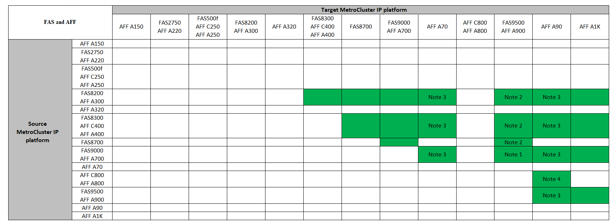
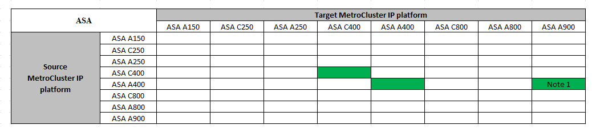
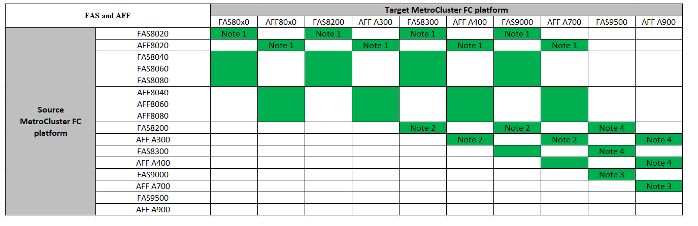

= 컨트롤러 업그레이드 절차를 선택합니다
:allow-uri-read: 
:icons: font
:imagesdir: ../media/

[role="lead"]
사용하는 컨트롤러 업그레이드 절차는 플랫폼 모델 및 MetroCluster 구성 유형에 따라 다릅니다.

업그레이드 절차에서는 컨트롤러가 새 컨트롤러 모델로 교체됩니다. 스토리지 쉘프 모델은 업그레이드되지 않습니다.

* 스위치오버 및 스위치백 절차에서 MetroCluster 스위치오버 작동은 파트너 클러스터의 컨트롤러 모듈이 업그레이드되는 동안 클라이언트에 무중단 서비스를 제공하는 데 사용됩니다.
* ARL 기반 컨트롤러 업그레이드 절차에서는 애그리게이트 재배치 작업을 사용하여 데이터를 이전 구성에서 업그레이드된 새 구성으로 중단 없이 이동할 수 있습니다.

== 컨트롤러 업그레이드를 지원했습니다

아래 FC 또는 IP 표에서 현재 플랫폼을 선택합니다. 현재 플랫폼 행과 대상 플랫폼 열이 교차하는 부분이 비어 있으면 업그레이드가 지원되지 않습니다.

NOTE: 4노드 MetroCluster IP 구성에서 명령을 사용하여 지원되는 업그레이드는 `system controller replace` 의 표를 참조하십시오 link:task_upgrade_controllers_system_control_commands_in_a_four_node_mcc_ip.html["스위치오버 및 스위치백을 사용하여 4노드 MetroCluster IP 구성에서 "시스템 컨트롤러 교체" 명령(ONTAP 9.13.1 이상)으로 컨트롤러 업그레이드"]

=== MetroCluster IP 컨트롤러 업그레이드가 지원됩니다

* 플랫폼이 나열되지 않은 경우 지원되는 컨트롤러 업그레이드 조합이 없습니다.
* 컨트롤러 업그레이드를 수행할 때 이전 플랫폼과 새 플랫폼 유형 * 이 다음과 일치해야 합니다 *.
+
** FAS 시스템을 FAS 시스템으로 업그레이드하거나 AFF A-Series를 AFF A-Series로 업그레이드할 수 있습니다.
** FAS 시스템을 AFF A-Series로 또는 AFF A-Series를 AFF C-Series로 업그레이드할 수 없습니다.
+
예를 들어, 업그레이드하려는 플랫폼이 FAS8200인 경우 FAS9000으로 업그레이드할 수 있습니다. FAS8200 시스템을 AFF A700 시스템으로 업그레이드할 수 없습니다.

* MetroCluster 구성의 모든 노드(이전 노드 및 새 노드)에서 동일한 ONTAP 버전을 실행해야 합니다.

.AFF 및 FAS MetroCluster IP 컨트롤러 업그레이드를 지원했습니다
다음 표는 MetroCluster IP 구성에서 AFF 또는 FAS 시스템을 업그레이드하기 위해 지원되는 플랫폼 조합을 보여줍니다.

NOTE: AFF A90, AFF A70 및 AFF A1K 시스템에는 ONTAP 9.15.1 이상이 필요합니다.

* 참고 1: 이 업그레이드의 경우 절차를 사용하십시오 link:task_upgrade_A700_to_A900_in_a_four_node_mcc_ip_us_switchover_and_switchback.html["스위치오버 및 스위치백을 사용하여 MetroCluster IP 구성에서 AFF A700/FAS9000을 AFF A900/FAS9500으로 컨트롤러 업그레이드(ONTAP 9.10.1 이상)"]
* 참고 2: 컨트롤러 업그레이드는 ONTAP 9.13.1 이상을 실행하는 시스템에서 지원됩니다.
* 참고 3: 컨트롤러 업그레이드가 완료될 때까지 대상 플랫폼에 내부 드라이브를 가질 수 없습니다. 업그레이드 후에 내부 드라이브를 추가할 수 있습니다.
* 참고 4: 컨트롤러 모듈을 교체해야 합니다.

.ASA MetroCluster IP 컨트롤러 업그레이드가 지원됩니다
다음 표는 MetroCluster IP 구성에서 ASA 시스템을 업그레이드하기 위해 지원되는 플랫폼 조합을 보여 줍니다.

* 참고 1: 컨트롤러 업그레이드는 ONTAP 9.13.1 이상을 실행하는 시스템에서 지원됩니다.

=== 지원되는 MetroCluster FC 컨트롤러 업그레이드

* 플랫폼이 나열되지 않은 경우 지원되는 컨트롤러 업그레이드 조합이 없습니다.
* 컨트롤러 업그레이드를 수행할 때 이전 플랫폼과 새 플랫폼 유형 * 이 다음과 일치해야 합니다 *.
+
** FAS 시스템을 FAS 시스템으로 업그레이드하거나 AFF A-Series를 AFF A-Series로 업그레이드할 수 있습니다.
** FAS 시스템을 AFF A-Series로 또는 AFF A-Series를 AFF C-Series로 업그레이드할 수 없습니다.
+
예를 들어, 업그레이드하려는 플랫폼이 FAS8200인 경우 FAS9000으로 업그레이드할 수 있습니다. FAS8200 시스템을 AFF A700 시스템으로 업그레이드할 수 없습니다.

* MetroCluster 구성의 모든 노드(이전 노드 및 새 노드)에서 동일한 ONTAP 버전을 실행해야 합니다.

.AFF 및 FAS MetroCluster FC 컨트롤러 업그레이드를 지원했습니다
다음 표는 MetroCluster FC 구성에서 AFF 또는 FAS 시스템 업그레이드에 지원되는 플랫폼 조합을 보여줍니다.

* 참고 1: 기존 FAS8020 또는 AFF8020 노드에서 FCVI 연결이 포트 1c 및 1d를 사용할 때 컨트롤러를 업그레이드하려면 다음을 참조하십시오https://kb.netapp.com/Advice_and_Troubleshooting/Data_Protection_and_Security/MetroCluster/Upgrading_controllers_when_FCVI_connections_on_existing_FAS8020_or_AFF8020_nodes_use_ports_1c_and_1d["기술 자료 문서"^].
* 참고 2: 온보드 포트 0e 및 0f 를 FC-VI 연결로 사용하는 AFF A300 또는 FAS8200 플랫폼에서 컨트롤러 업그레이드는 다음 시스템에서만 지원됩니다.
+
** ONTAP 9.9.1 이하
** ONTAP 9.10.1P9
** ONTAP 9.11.1P5
** ONTAP 9.12.1GA
** ONTAP 9.13.1 이상
+
자세한 내용은 를 참조하십시오 link:https://mysupport.netapp.com/site/bugs-online/product/ONTAP/BURT/1507088["공개 보고서"^].

* 참고 3: 이 업그레이드에 대해서는 을 참조하십시오 link:task_upgrade_A700_to_A900_in_a_four_node_mcc_fc_us_switchover_and_switchback.html["스위치오버 및 스위치백을 사용하여 MetroCluster FC 구성에서 AFF A700/FAS9000을 AFF A900/FAS9500으로 컨트롤러 업그레이드(ONTAP 9.10.1 이상)"]
* 참고 4: 컨트롤러 업그레이드는 ONTAP 9.13.1 이상을 실행하는 시스템에서 지원됩니다.

.ASA MetroCluster FC 컨트롤러 업그레이드를 지원했습니다
다음 표는 MetroCluster FC 구성에서 ASA 시스템 업그레이드에 지원되는 플랫폼 조합을 보여줍니다.

[cols="3*"]
|===
| 소스 MetroCluster FC 플랫폼 | 대상 MetroCluster FC 플랫폼 | 지원 여부 

.2+| ASA A400 를 참조하십시오 | ASA A400 를 참조하십시오 | 예 

| ASA A900 를 참조하십시오 | 아니요 

.2+| ASA A900 를 참조하십시오 | ASA A400 를 참조하십시오 | 아니요 

| ASA A900 를 참조하십시오 | 예(참고 1 참조) 
|===
* 참고 1: 컨트롤러 업그레이드는 ONTAP 9.14.1 이상을 실행하는 시스템에서 지원됩니다.

== 스위치오버 및 스위치백 프로세스를 사용하는 절차를 선택합니다

지원되는 업그레이드 조합을 검토한 후 구성에 맞는 올바른 컨트롤러 업그레이드 절차를 선택하십시오.

[cols="2,1,1,2"]
|===

| MetroCluster 형식입니다 | 업그레이드 방법 | ONTAP 버전입니다 | 절차를 참조하십시오 

 a| 
IP
 a| 
'시스템 컨트롤러 교체' 명령으로 업그레이드하십시오
 a| 
9.13.1 이상
 a| 
link:task_upgrade_controllers_system_control_commands_in_a_four_node_mcc_ip.html["절차 링크"]

 a| 
FC
 a| 
'시스템 컨트롤러 교체' 명령으로 업그레이드하십시오
 a| 
9.10.1 이상
 a| 
link:task_upgrade_controllers_system_control_commands_in_a_four_node_mcc_fc.html["절차 링크"]

 a| 
FC
 a| 
CLI 명령을 사용한 수동 업그레이드(AFF A700/FAS9000에서 AFF A900/FAS9500으로 업그레이드)
 a| 
9.10.1 이상
 a| 
link:task_upgrade_A700_to_A900_in_a_four_node_mcc_fc_us_switchover_and_switchback.html["절차 링크"]

 a| 
IP
 a| 
CLI 명령을 사용한 수동 업그레이드(AFF A700/FAS9000에서 AFF A900/FAS9500으로 업그레이드)
 a| 
9.10.1 이상
 a| 
link:task_upgrade_A700_to_A900_in_a_four_node_mcc_ip_us_switchover_and_switchback.html["절차 링크"]

 a| 
FC
 a| 
CLI 명령을 사용한 수동 업그레이드
 a| 
9.8 이상
 a| 
link:task_upgrade_controllers_in_a_four_node_fc_mcc_us_switchover_and_switchback_mcc_fc_4n_cu.html["절차 링크"]

 a| 
IP
 a| 
CLI 명령을 사용한 수동 업그레이드
 a| 
9.8 이상
 a| 
link:task_upgrade_controllers_in_a_four_node_ip_mcc_us_switchover_and_switchback_mcc_ip.html["절차 링크"]

|===

== 집계 재배치를 사용하여 프로시저 선택

ARL 기반 컨트롤러 업그레이드 절차에서는 애그리게이트 재배치 작업을 사용하여 데이터를 이전 구성에서 업그레이드된 새 구성으로 중단 없이 이동할 수 있습니다.

|===
| MetroCluster 형식입니다 | 애그리게이트 재배치 | ONTAP 버전입니다 | 절차를 참조하십시오 

 a| 
FC
 a| 
"system controller replace" 명령을 사용하여 동일한 섀시의 컨트롤러 모델을 업그레이드합니다
 a| 
9.10.1 이상
 a| 
https://docs.netapp.com/us-en/ontap-systems-upgrade/upgrade-arl-auto-affa900/index.html["절차 링크"^]

 a| 
FC
 a| 
'시스템 컨트롤러 교체' 명령 사용
 a| 
9.8 이상
 a| 
https://docs.netapp.com/us-en/ontap-systems-upgrade/upgrade-arl-auto-app/index.html["절차 링크"^]

 a| 
FC
 a| 
'시스템 컨트롤러 교체' 명령 사용
 a| 
9.5에서 9.7
 a| 
https://docs.netapp.com/us-en/ontap-systems-upgrade/upgrade-arl-auto/index.html["절차 링크"^]

 a| 
FC
 a| 
수동 ARL 명령 사용
 a| 
9.8
 a| 
https://docs.netapp.com/us-en/ontap-systems-upgrade/upgrade-arl-manual-app/index.html["절차 링크"^]

 a| 
FC
 a| 
수동 ARL 명령 사용
 a| 
9.7 이하
 a| 
https://docs.netapp.com/us-en/ontap-systems-upgrade/upgrade-arl-manual/index.html["절차 링크"^]

|===