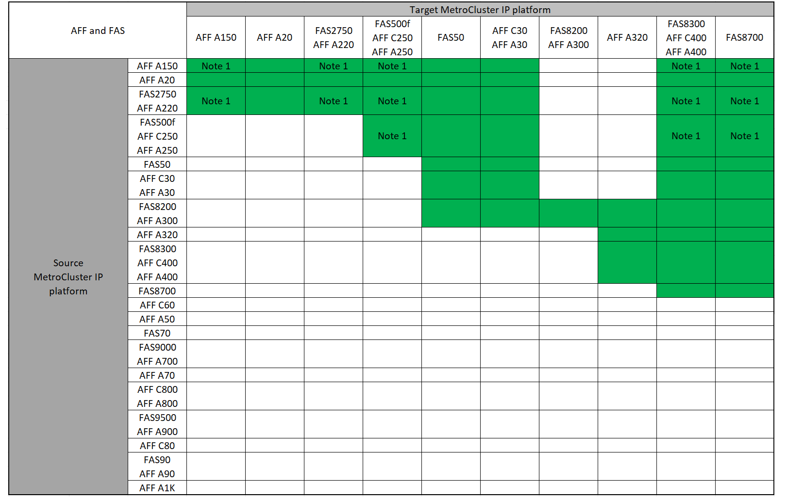

= 시스템 새로 고침 방법 선택
:allow-uri-read: 
:icons: font
:imagesdir: ../media/

[role="lead"]
사용하는 시스템 새로 고침 절차는 플랫폼 모델 및 MetroCluster 구성 유형에 따라 다릅니다. 업데이트 절차는 컨트롤러 및 스토리지 쉘프에 적용됩니다. 새로 고침 절차에서는 MetroCluster 구성에 새 컨트롤러와 쉘프를 추가하여 두 번째 DR 그룹을 생성한 다음, 데이터가 새 노드로 중단 없이 마이그레이션됩니다. 그러면 원래 컨트롤러가 폐기됩니다.

== 지원되는 MetroCluster IP 기술 업데이트 조합

* 새 로드를 추가하기 전에 기술 업데이트 절차를 완료해야 합니다.
* MetroCluster 구성의 모든 노드에서 동일한 ONTAP 버전을 실행해야 합니다. 예를 들어, 8노드 구성의 경우 8노드 모두에서 동일한 ONTAP 버전을 실행해야 합니다. 해당 조합에 대해 지원되는 최소 ONTAP 버전은 를 link:https://hwu.netapp.com["Hardware Universe"^]참조하십시오.
* 이 조합을 사용하는 플랫폼의 '아래쪽'에 대한 오브젝트 제한을 초과하지 마십시오. 두 플랫폼의 객체 하한값을 적용합니다.
* 타겟 플랫폼 제한이 MetroCluster 제한보다 낮은 경우 새 노드를 추가하기 전에 MetroCluster를 타겟 플랫폼 제한값 이하로 재구성해야 합니다.
* 을 참조하십시오 link:https://hwu.netapp.com["Hardware Universe"^] 플랫폼 제한.

=== 지원되는 AFF 및 FAS MetroCluster IP 기술 업데이트 조합

다음 표는 MetroCluster IP 구성에서 AFF 또는 FAS 시스템을 새로 고치는 데 지원되는 플랫폼 조합을 보여 줍니다. 테이블은 두 그룹으로 나뉩니다.

* * 그룹 1 * 은 AFF A150, AFF A20, FAS2750, AFF A220, FAS500f, AFF C250, FAS8200, FAS50, AFF C30, AFF A400 A30, AFF A250, AFF C400, AFF A320, FAS8300, AFF A300, AFF 및 FAS8700 시스템의 조합을 보여줍니다.
* * 그룹 2 * 는 AFF C60, AFF A50, FAS70, FAS9000, AFF A700, FAS9500, AFF A900, AFF, AFF A70, AFF C800, AFF A800 C80, FAS90, AFF A90 및 AFF A1K 시스템의 조합을 보여줍니다.

다음 참고 사항은 두 그룹에 모두 적용됩니다.

* 참고 1: 이 조합을 사용하려면 ONTAP 9.13.1 이상이 필요합니다.

[role="tabbed-block"]
====
.AFF 및 FAS 조합 그룹 1
--
FAS8700, AFF A20, FAS2750, AFF A220, FAS500f, AFF C250, AFF A250, FAS50, AFF C400 C30, AFF A400 A30, FAS8200, AFF A300, AFF A320, FAS8300, AFF, AFF, AFF A150 시스템에 대한 시스템 업데이트 조합을 검토합니다.

--
.AFF 및 FAS 조합 그룹 2
--
AFF C60, AFF A50, FAS70, FAS9000, AFF A700, AFF A70, AFF C800, AFF, FAS9500, AFF A900, AFF A800 C80, FAS90, AFF A90 및 AFF A1K 시스템에 대한 시스템 업데이트 조합을 검토합니다.

image:../media/tech-refresh-ip-group-2-updated.png[""]

--
====

=== 지원되는 ASA MetroCluster IP 기술 업데이트 조합

다음 표는 MetroCluster IP 구성에서 ASA 시스템을 새로 고치는 데 지원되는 플랫폼 조합을 보여 줍니다.

image::../media/mcc-ip-techrefresh-asa-9161.png[MetroCluster IP ASA 기술 업데이트 조합]

== 지원되는 MetroCluster FC 기술 업데이트 조합

* 새 로드를 추가하기 전에 기술 업데이트 절차를 완료해야 합니다.
* MetroCluster 구성의 모든 노드에서 동일한 ONTAP 버전을 실행해야 합니다. 예를 들어, 8노드 구성의 경우 8노드 모두에서 동일한 ONTAP 버전을 실행해야 합니다. 해당 조합에 대해 지원되는 최소 ONTAP 버전은 를 link:https://hwu.netapp.com["Hardware Universe"^]참조하십시오.
* 이 조합을 사용하는 플랫폼의 '아래쪽'에 대한 오브젝트 제한을 초과하지 마십시오. 두 플랫폼의 객체 하한값을 적용합니다.
* 타겟 플랫폼 제한값이 MetroCluster 제한보다 낮을 경우 새 노드를 추가하기 전에 MetroCluster를 타겟 플랫폼 제한보다 낮거나 같은 상태로 다시 구성해야 합니다.
* 을 참조하십시오 link:https://hwu.netapp.com["Hardware Universe"^] 플랫폼 제한.

=== 지원되는 AFF 및 FAS MetroCluster FC 기술 업데이트 조합

다음 표는 MetroCluster FC 구성에서 AFF 또는 FAS 시스템을 업데이트하기 위해 지원되는 플랫폼 조합을 보여줍니다.

image::../media/metrocluster_fc_tech_refresh.png[MetroCluster FC 기술 업데이트]

=== 지원되는 ASA MetroCluster FC 기술 업데이트 조합

다음 표는 MetroCluster FC 구성에서 ASA 시스템을 업데이트하기 위해 지원되는 플랫폼 조합을 보여줍니다.

[cols="3*"]
|===
| 소스 MetroCluster FC 플랫폼 | 대상 MetroCluster FC 플랫폼 | 지원 여부 

.2+| ASA A400 를 참조하십시오 | ASA A400 를 참조하십시오 | 예 

| ASA A900 를 참조하십시오 | 아니요 

.2+| ASA A900 를 참조하십시오 | ASA A400 를 참조하십시오 | 아니요 

| ASA A900 를 참조하십시오 | 예 
|===

== 새로 고침 절차를 선택합니다

다음 표에서 구성에 대한 새로 고침 절차를 선택합니다.

[cols="2,1,1,2"]
|===
| 새로 고침 방법 | 구성 유형 | ONTAP 버전입니다 | 절차를 참조하십시오 

 a| 
* 방법: MetroCluster 구성을 확장한 다음 이전 노드를 제거합니다

 a| 
4노드 FC
 a| 
9.6 이상
 a| 
link:task_refresh_4n_mcc_fc.html["절차 링크"]

 a| 
* 방법: MetroCluster 구성을 확장한 다음 이전 노드를 제거합니다

 a| 
4노드 IP
 a| 
9.8 이상
 a| 
link:task_refresh_4n_mcc_ip.html["절차 링크"]

|===