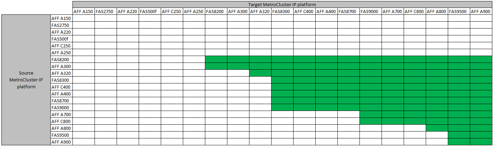

= 시스템 새로 고침 방법 선택
:allow-uri-read: 
:icons: font
:imagesdir: ../media/

[role="lead"]
사용하는 시스템 새로 고침 절차는 플랫폼 모델 및 MetroCluster 구성 유형에 따라 다릅니다. 업데이트 절차는 컨트롤러 및 스토리지 쉘프에 적용됩니다. 새로 고침 절차에서는 MetroCluster 구성에 새 컨트롤러와 쉘프를 추가하여 두 번째 DR 그룹을 생성한 다음, 데이터가 새 노드로 중단 없이 마이그레이션됩니다. 그러면 원래 컨트롤러가 폐기됩니다.

=== 지원되는 MetroCluster FC 기술 업데이트 조합

image::../media/metrocluster_fc_tech_refresh.png[MetroCluster FC 기술 업데이트]

* 새 로드를 추가하기 전에 기술 업데이트 절차를 완료해야 합니다.

NOTE: 이 조합을 사용하는 플랫폼의 '아래쪽'에 대한 오브젝트 제한을 초과하지 마십시오. 두 플랫폼의 객체 하한값을 적용합니다. 을 참조하십시오 link:https://hwu.netapp.html["Hardware Universe"^] 플랫폼 제한.

=== 지원되는 MetroCluster IP 기술 업데이트 조합

* 새 로드를 추가하기 전에 기술 업데이트 절차를 완료해야 합니다.

NOTE: 이 조합을 사용하는 플랫폼의 '아래쪽'에 대한 오브젝트 제한을 초과하지 마십시오. 두 플랫폼의 객체 하한값을 적용합니다. 을 참조하십시오 link:https://hwu.netapp.html["Hardware Universe"^] 플랫폼 제한.

[cols="2,1,1,2"]
|===
| 새로 고침 방법 | 구성 유형 | ONTAP 버전입니다 | 절차를 참조하십시오 

 a| 
* 방법: MetroCluster 구성을 확장한 다음 이전 노드를 제거합니다

 a| 
4노드 FC
 a| 
9.6 이상
 a| 
link:task_refresh_4n_mcc_fc.html["절차 링크"]

 a| 
* 방법: MetroCluster 구성을 확장한 다음 이전 노드를 제거합니다

 a| 
4노드 IP
 a| 
9.8 이상
 a| 
link:task_refresh_4n_mcc_ip.html["절차 링크"]

|===