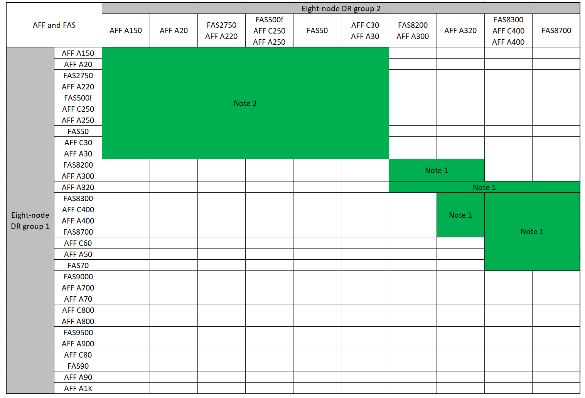

= MetroCluster IP 구성을 확장합니다
:allow-uri-read: 
:icons: font
:imagesdir: ../media/

[role="lead"]
ONTAP 버전에 따라 4개의 새 노드를 새 DR 그룹으로 추가하여 MetroCluster IP 구성을 확장할 수 있습니다.

ONTAP 9.13.1부터 8노드 MetroCluster 구성을 임시로 확장하여 컨트롤러 및 스토리지를 업데이트할 수 있습니다. 을 참조하십시오 link:task_refresh_4n_mcc_ip.html["4노드 또는 8노드 MetroCluster IP 구성 업데이트(ONTAP 9.8 이상)"] 를 참조하십시오.

ONTAP 9.9.1부터 MetroCluster IP 구성에 새 노드 4개를 두 번째 DR 그룹으로 추가할 수 있습니다. 그러면 8노드 MetroCluster 구성이 생성됩니다.

.이전 플랫폼 모델을 추가하는 경우 중요한 정보
다음 지침은 ONTAP 9.15.1 이전에 출시된 플랫폼인 이전 플랫폼 모델을 ONTAP 9.15.1 이상에서 출시된 최신 플랫폼 모델이 포함된 기존 MetroCluster 구성에 추가해야 하는 흔하지 않은 시나리오를 위한 것입니다.

기존 MetroCluster 구성에 *공유 클러스터/HA 포트*( ONTAP 9.15.1 이상에서 출시된 플랫폼)를 사용하는 플랫폼이 포함된 경우, 구성의 모든 노드를 ONTAP 9.15.1P11 또는 ONTAP 9.16.1P4 이상으로 업그레이드하지 않고는 *공유 MetroCluster/HA 포트*( ONTAP 9.15.1 이전에 출시된 플랫폼)를 사용하는 플랫폼을 추가할 수 없습니다.

[CAUTION]
====
*공유/ MetroCluster HA 포트*를 사용하는 이전 플랫폼 모델을 *공유 클러스터/HA 포트*를 사용하는 최신 플랫폼 모델이 포함된 MetroCluster 에 추가하는 것은 흔하지 않은 시나리오이며 대부분의 조합에는 영향을 미치지 않습니다.

====
다음 표를 사용하여 해당 조합이 영향을 받는지 확인하세요.  기존 플랫폼이 첫 번째 열에 나열되어 있고, 구성에 추가하려는 플랫폼이 두 번째 열에 나열되어 있는 경우, 새 DR 그룹을 추가하려면 구성의 모든 노드가 ONTAP 9.15.1P11 또는 ONTAP 9.16.1P4 이상을 실행해야 합니다.

[cols="20,20,20,20,20"]
|===
2+| 기존 MetroCluster에 다음이 포함되어 있는 경우.. 2+| 그리고 당신이 추가하는 플랫폼은... | 그러면... 

 a| 
*공유 클러스터/HA 포트*를 사용하는 AFF 시스템:

* AFF A20 를 참조하십시오
* AFF A30
* AFF C30
* AFF A50 를 참조하십시오
* AFF C60
* AFF C80 를 참조하십시오
* AFF A70 를 참조하십시오
* AFF A90 를 참조하십시오
* AFF A1K 를 참조하십시오

 a| 
*공유 클러스터/HA 포트*를 사용하는 FAS 시스템:

* FAS50를 참조하십시오
* FAS70를 참조하십시오
* FAS90를 참조하십시오

 a| 
*공유 MetroCluster/HA 포트*를 사용하는 AFF 시스템:

* AFF A150, ASA A150
* AFF A220
* AFF C250, ASA C250
* AFF A250, ASA A250
* AFF A300
* AFF A320
* AFF C400, ASA C400
* AFF A400, ASA A400
* AFF A700
* AFF C800, ASA C800
* AFF A800, ASA A800
* AFF A900, ASA A900

 a| 
*공유 MetroCluster/HA 포트*를 사용하는 FAS 시스템:

* FAS2750
* 500f로 설정합니다
* FAS8200
* FAS8300
* FAS8700
* FAS9000
* FAS9500

| 기존 MetroCluster 구성에 새 플랫폼을 추가하기 전에 기존 및 새 구성의 모든 노드를 ONTAP 9.15.1P11 또는 ONTAP 9.16.1P4 이상으로 업그레이드하세요. 
|===
.시작하기 전에
* 이전 노드와 새 노드에서 동일한 버전의 ONTAP를 실행해야 합니다.
* 이 절차는 4노드 DR 그룹 하나를 기존 MetroCluster IP 구성에 추가하는 데 필요한 단계를 설명합니다. 8노드 구성을 업데이트하는 경우 각 DR 그룹에 대해 전체 절차를 반복하면서 한 번에 하나씩 추가해야 합니다.
* 플랫폼 혼합에 대해 기존 플랫폼 모델과 새 플랫폼 모델이 지원되는지 확인합니다.
+
https://hwu.netapp.com["NetApp Hardware Universe를 참조하십시오"^]

* 이전 플랫폼 모델과 새 플랫폼 모델이 모두 IP 스위치에서 지원되는지 확인합니다.
+
https://hwu.netapp.com["NetApp Hardware Universe를 참조하십시오"^]

* 있는 경우 link:task_refresh_4n_mcc_ip.html["4노드 또는 8노드 MetroCluster IP 구성 업데이트"]새로운 노드에는 루트 애그리게이트 및 예비 디스크를 위한 적절한 디스크와 함께 이전 노드의 데이터를 수용할 수 있는 충분한 스토리지가 필요합니다.
* 이전 노드에 생성된 기본 브로드캐스트 도메인이 있는지 확인합니다.
+
기본 브로드캐스트 도메인 없이 기존 클러스터에 새 노드를 추가할 경우, 예상 이름 대신 UUID(Universal Unique Identifier)를 사용하여 새 노드에 대한 노드 관리 LIF가 생성됩니다. 자세한 내용은 기술 자료 문서를 참조하십시오 https://kb.netapp.com/onprem/ontap/os/Node_management_LIFs_on_newly-added_nodes_generated_with_UUID_names["UUID 이름으로 새로 추가된 노드의 노드 관리 LIF"^].

== 콘솔 로깅을 활성화합니다

NetApp은 사용 중인 장치에서 콘솔 로깅을 사용하도록 설정하고 이 절차를 수행할 때 다음 작업을 수행할 것을 적극 권장합니다.

* 유지 관리 중에는 AutoSupport를 활성화된 상태로 둡니다.
* 유지 관리 전후에 유지 관리 AutoSupport 메시지를 트리거하여 유지 관리 활동 기간 동안 케이스 생성을 비활성화합니다.
+
기술 자료 문서를 link:https://kb.netapp.com/Support_Bulletins/Customer_Bulletins/SU92["예약된 유지 보수 기간 동안 자동 케이스 생성을 억제하는 방법"^]참조하십시오.

* 모든 CLI 세션에 대해 세션 로깅을 설정합니다. 세션 로깅을 활성화하는 방법에 대한 지침은 기술 자료 문서의 "로깅 세션 출력" 섹션을 link:https://kb.netapp.com/on-prem/ontap/Ontap_OS/OS-KBs/How_to_configure_PuTTY_for_optimal_connectivity_to_ONTAP_systems["ONTAP 시스템에 대한 최적의 연결을 위해 PuTTY를 구성하는 방법"^]참조하십시오.

== 이 절차의 이름 지정 예

이 절차에서는 전체 예제 이름을 사용하여 관련된 DR 그룹, 노드 및 스위치를 식별합니다.

|===

| DR 그룹 | 사이트_A의 클러스터_A | site_B의 cluster_B입니다 

 a| 
dr_group_1 - 이전
 a| 
* 노드_A_1 - 이전
* 노드_A_2 - 이전

 a| 
* 노드_B_1 - 이전
* 노드_B_2 - 이전

 a| 
dr_group_2 - 신규
 a| 
* 노드_A_3 - 신규
* Node_A_4 - 신규

 a| 
* Node_B_3 - 신규
* Node_B_4 - 신규

|===

== 두 번째 DR 그룹을 추가할 때 지원되는 플랫폼 조합

다음 표에서는 8노드 MetroCluster IP 구성에서 지원되는 플랫폼 조합을 보여 줍니다.

[IMPORTANT]
====
* MetroCluster 구성의 모든 노드에서 동일한 ONTAP 버전을 실행해야 합니다. 예를 들어, 8노드 구성의 경우 8노드 모두에서 동일한 ONTAP 버전을 실행해야 합니다. 해당 조합에 대해 지원되는 최소 ONTAP 버전은 를 link:https://hwu.netapp.com["Hardware Universe"^]참조하십시오.
* 이 표의 조합은 일반 또는 영구 8노드 구성에만 적용됩니다.
* 이 표에 표시된 플랫폼 조합은 전환 또는 새로 고침 절차를 사용하는 경우 * 적용되지 않습니다 *.
* 하나의 DR 그룹에 있는 모든 노드의 유형과 구성이 동일해야 합니다.

====

=== 지원되는 AFF 및 FAS MetroCluster IP 확장 조합

다음 표에서는 MetroCluster IP 구성에서 AFF 또는 FAS 시스템을 확장하는 데 지원되는 플랫폼 조합을 보여 줍니다. 테이블은 두 그룹으로 나뉩니다.

* * 그룹 1 * 은 AFF A150, AFF A20, FAS2750, AFF A220, FAS500f, AFF C250, FAS8200, FAS50, AFF C30, AFF A400 A30, AFF A250, AFF C400, AFF A320, FAS8300, AFF A300, AFF 및 FAS8700 시스템의 조합을 보여줍니다.
* * 그룹 2 * 는 AFF C60, AFF A50, FAS70, FAS9000, AFF A700, FAS9500, AFF A900, AFF, AFF A70, AFF C800, AFF A800 C80, FAS90, AFF A90 및 AFF A1K 시스템의 조합을 보여줍니다.

다음 참고 사항은 두 그룹에 모두 적용됩니다.

* 참고 1: 이러한 조합을 사용하려면 ONTAP 9.9.1 이상(또는 플랫폼에서 지원되는 최소 ONTAP 버전)이 필요합니다.
* 참고 2: 이러한 조합을 사용하려면 ONTAP 9.13.1 이상(또는 플랫폼에서 지원되는 최소 ONTAP 버전)이 필요합니다.

[role="tabbed-block"]
====
.AFF 및 FAS 조합 그룹 1
--
AFF A150, AFF A20, FAS2750, AFF A220, FAS500f, AFF C250, FAS8200, FAS50, AFF A300 C30, AFF A400 A30, AFF A250, AFF, AFF A320, FAS8300, AFF C400, AFF 및 FAS8700 시스템에 대한 확장 조합을 검토합니다.

--
.AFF 및 FAS 조합 그룹 2
--
AFF C60, AFF A50, FAS70, FAS9000, AFF A700, AFF A70, AFF C800, AFF, FAS9500, AFF A900, AFF A800 C80, FAS90, AFF A90 및 AFF A1K 시스템에 대한 확장 조합을 검토합니다.

image:../media/expand-ip-group-2-updated.png["MetroCluster IP의 AFF 및 FAS 그룹 2 플랫폼에 대한 확장 조합"]

--
====

=== 지원되는 ASA MetroCluster IP 확장 조합

다음 표는 MetroCluster IP 구성에서 ASA 시스템을 확장하는 데 지원되는 플랫폼 조합을 보여줍니다.

image::../media/8node_comb_ip_asa.png[8노드 구성을 위한 플랫폼 조합]

== 유지 관리 전에 사용자 지정 AutoSupport 메시지를 보냅니다

유지보수를 수행하기 전에 AutoSupport 메시지를 발행하여 NetApp 기술 지원 팀에 유지보수 진행 중임을 알려야 합니다. 유지 관리가 진행 중임을 기술 지원 부서에 알리는 것은 운영 중단이 발생했다는 가정 하에 사례가 열리지 않도록 방지합니다.

.이 작업에 대해
이 작업은 각 MetroCluster 사이트에서 수행해야 합니다.

.단계
. 자동 지원 케이스 생성을 방지하려면 업그레이드가 진행 중임을 알리는 AutoSupport 메시지를 보내십시오.
+
.. 다음 명령을 실행합니다.
+
`system node autosupport invoke -node * -type all -message "MAINT=10h Upgrading <old-model> to <new-model>`

+
이 예에서는 10시간의 유지 보수 기간을 지정합니다. 계획에 따라 추가 시간을 허용할 수 있습니다.

+
시간이 경과하기 전에 유지 관리가 완료된 경우 유지 보수 기간이 종료되었음을 나타내는 AutoSupport 메시지를 호출할 수 있습니다.

+
'System node AutoSupport invoke-node * -type all-message maINT=end'

.. 파트너 클러스터에서 명령을 반복합니다.

== 새 DR 그룹을 추가할 때 VLAN에 대한 고려 사항

* MetroCluster IP 구성을 확장할 때 다음 VLAN 고려 사항이 적용됩니다.
+
특정 플랫폼은 MetroCluster IP 인터페이스에 VLAN을 사용합니다. 기본적으로 두 포트 각각은 서로 다른 VLAN을 사용합니다(10 및 20).

+
지원되는 경우 명령에서 매개 변수를 사용하여 100보다 큰(101에서 4095 사이) 다른(기본값이 아닌) VLAN을 지정할 수도 있습니다 `-vlan-id` `metrocluster configuration-settings interface create` .

+
다음 플랫폼에서는 매개 변수를 지원하지 * 않습니다 `-vlan-id` .

+
** FAS8200 및 AFF A300
** AFF A320
** FAS9000 및 AFF A700
** AFF C800, ASA C800, AFF A800 및 ASA A800
+
다른 모든 플랫폼은 `-vlan-id` 매개 변수를 지원합니다.

+
기본 및 유효한 VLAN 할당은 플랫폼에서 매개 변수를 지원하는지 여부에 따라 `-vlan-id` 달라집니다.

+
[role="tabbed-block"]
====
.<code>-vlan-id </code>를 지원하는 플랫폼입니다
--
기본 VLAN:

***  `-vlan-id`매개 변수를 지정하지 않으면 "A" 포트의 경우 VLAN 10과 "B" 포트의 경우 VLAN 20을 사용하여 인터페이스가 생성됩니다.
*** 지정된 VLAN은 RCF에서 선택한 VLAN과 일치해야 합니다.

유효한 VLAN 범위:

*** 기본 VLAN 10 및 20
*** VLAN 101 이상(101과 4095 사이)

--
.<code>-vlan-id </code>를 지원하지 않는 플랫폼
--
기본 VLAN:

*** 해당 없음. 인터페이스를 위해 MetroCluster 인터페이스에 VLAN을 지정할 필요가 없습니다. 스위치 포트는 사용되는 VLAN을 정의합니다.

유효한 VLAN 범위:

*** RCF를 생성할 때 모든 VLAN이 명시적으로 제외되지 않았습니다. RCF는 VLAN이 유효하지 않은 경우 사용자에게 경고합니다.

--
====

* 4노드에서 8노드 MetroCluster 구성으로 확장하는 경우 두 DR 그룹 모두 동일한 VLAN을 사용합니다.
* 두 DR 그룹을 동일한 VLAN을 사용하여 구성할 수 없는 경우 매개 변수를 지원하지 않는 DR 그룹을 업그레이드하여 다른 DR 그룹에서 지원하는 VLAN을 사용해야 `vlan-id` 합니다.

== MetroCluster 구성 상태 확인

확장을 수행하기 전에 MetroCluster 구성의 상태 및 연결을 확인해야 합니다.

.단계
. ONTAP에서 MetroCluster 구성 작동을 확인합니다.
+
.. 시스템에 다중 경로 가 있는지 확인합니다.
+
`node run -node <node-name> sysconfig -a`

.. 두 클러스터 모두에서 상태 알림을 확인합니다.
+
'시스템 상태 경고 표시

.. MetroCluster 구성을 확인하고 운영 모드가 정상인지 확인합니다.
+
MetroCluster 쇼

.. MetroCluster 검사를 수행합니다.
+
'MetroCluster check run

.. MetroCluster 검사 결과를 표시합니다.
+
MetroCluster 체크 쇼

.. Config Advisor를 실행합니다.
+
https://mysupport.netapp.com/site/tools/tool-eula/activeiq-configadvisor["NetApp 다운로드: Config Advisor"]

.. Config Advisor를 실행한 후 도구의 출력을 검토하고 출력에서 권장 사항을 따라 발견된 문제를 해결하십시오.

. 클러스터가 정상 상태인지 확인합니다.
+
'클러스터 쇼'

+
[listing]
----
cluster_A::> cluster show
Node           Health  Eligibility
-------------- ------  -----------
node_A_1       true    true
node_A_2       true    true

cluster_A::>
----
. 모든 클러스터 포트가 작동하는지 확인합니다.
+
네트워크 포트 표시 - IPSpace 클러스터

+
[listing]
----
cluster_A::> network port show -ipspace Cluster

Node: node_A_1-old

                                                  Speed(Mbps) Health
Port      IPspace      Broadcast Domain Link MTU  Admin/Oper  Status
--------- ------------ ---------------- ---- ---- ----------- --------
e0a       Cluster      Cluster          up   9000  auto/10000 healthy
e0b       Cluster      Cluster          up   9000  auto/10000 healthy

Node: node_A_2-old

                                                  Speed(Mbps) Health
Port      IPspace      Broadcast Domain Link MTU  Admin/Oper  Status
--------- ------------ ---------------- ---- ---- ----------- --------
e0a       Cluster      Cluster          up   9000  auto/10000 healthy
e0b       Cluster      Cluster          up   9000  auto/10000 healthy

4 entries were displayed.

cluster_A::>
----
. 모든 클러스터 LIF가 작동 중인지 확인합니다.
+
'network interface show-vserver cluster'

+
각 클러스터 LIF는 홈에 대해 TRUE로 표시되고 상태 관리자/작업 이 UP/UP로 표시되어야 합니다

+
[listing]
----
cluster_A::> network interface show -vserver cluster

            Logical      Status     Network          Current       Current Is
Vserver     Interface  Admin/Oper Address/Mask       Node          Port    Home
----------- ---------- ---------- ------------------ ------------- ------- -----
Cluster
            node_A_1-old_clus1
                       up/up      169.254.209.69/16  node_A_1   e0a     true
            node_A_1-old_clus2
                       up/up      169.254.49.125/16  node_A_1   e0b     true
            node_A_2-old_clus1
                       up/up      169.254.47.194/16  node_A_2   e0a     true
            node_A_2-old_clus2
                       up/up      169.254.19.183/16  node_A_2   e0b     true

4 entries were displayed.

cluster_A::>
----
. 모든 클러스터 LIF에서 자동 복구가 설정되었는지 확인합니다.
+
'network interface show-vserver Cluster-fields auto-revert'

+
[listing]
----
cluster_A::> network interface show -vserver Cluster -fields auto-revert

          Logical
Vserver   Interface     Auto-revert
--------- ------------- ------------
Cluster
           node_A_1-old_clus1
                        true
           node_A_1-old_clus2
                        true
           node_A_2-old_clus1
                        true
           node_A_2-old_clus2
                        true

    4 entries were displayed.

cluster_A::>
----

== 모니터링 응용 프로그램에서 구성 제거

전환을 시작할 수 있는 MetroCluster Tiebreaker 소프트웨어, ONTAP 중재자 또는 기타 타사 애플리케이션(예: ClusterLion)을 사용하여 기존 구성을 모니터링하는 경우 업그레이드하기 전에 모니터링 소프트웨어에서 MetroCluster 구성을 제거해야 합니다.

.단계
. 전환을 시작할 수 있는 Tiebreaker, 중재자 또는 기타 소프트웨어에서 기존 MetroCluster 구성을 제거합니다.
+
[cols="2*"]
|===

| 사용 중인 경우... | 다음 절차를 사용하십시오. 

 a| 
Tiebreaker입니다
 a| 
link:../tiebreaker/concept_configuring_the_tiebreaker_software.html#commands-for-modifying-metrocluster-tiebreaker-configurations["MetroCluster 구성 제거"].

 a| 
중재자
 a| 
ONTAP 프롬프트에서 다음 명령을 실행합니다.

'MetroCluster configuration-settings 중재자 제거

 a| 
타사 응용 프로그램
 a| 
제품 설명서를 참조하십시오.

|===
. 전환을 시작할 수 있는 타사 애플리케이션에서 기존 MetroCluster 구성을 제거합니다.
+
응용 프로그램 설명서를 참조하십시오.

== 새 컨트롤러 모듈 준비

4개의 새 MetroCluster 노드를 준비하고 올바른 ONTAP 버전을 설치해야 합니다.

.이 작업에 대해
이 작업은 새 노드 각각에 대해 수행해야 합니다.

* 노드_A_3 - 신규
* Node_A_4 - 신규
* Node_B_3 - 신규
* Node_B_4 - 신규

다음 단계에서는 노드의 구성을 지우고 새 드라이브의 메일박스 영역을 지웁니다.

.단계
. 새 컨트롤러를 랙에 장착하십시오.
. 에서와 같이 새 MetroCluster IP 노드를 IP 스위치에 link:../install-ip/using_rcf_generator.html["IP 스위치를 케이블로 연결합니다"]연결합니다.
. 다음 절차를 사용하여 MetroCluster IP 노드를 구성합니다.
+
.. link:../install-ip/task_sw_config_gather_info.html["필요한 정보를 수집합니다"]
.. link:../install-ip/task_sw_config_restore_defaults.html["컨트롤러 모듈에서 시스템 기본값을 복원합니다"]
.. link:../install-ip/task_sw_config_verify_haconfig.html["구성 요소의 ha-config 상태를 확인합니다"]
.. link:../install-ip/task_sw_config_assign_pool0.html#manually-assigning-drives-for-pool-0-ontap-9-4-and-later["풀 0에 대해 수동으로 드라이브 할당(ONTAP 9.4 이상)"]

. 유지보수 모드에서 halt 명령을 실행하여 유지보수 모드를 종료한 다음 boot_ONTAP 명령을 실행하여 시스템을 부팅하고 클러스터 설정으로 이동합니다.
+
지금은 클러스터 마법사 또는 노드 마법사를 완료하지 마십시오.

== RCF 파일을 업그레이드합니다

새로운 스위치 펌웨어를 설치하는 경우 RCF 파일을 업그레이드하기 전에 스위치 펌웨어를 설치해야 합니다.

.이 작업에 대해
이 절차는 RCF 파일이 업그레이드된 스위치의 트래픽을 중단시킵니다. 새 RCF 파일이 적용되면 트래픽이 재개됩니다.

.단계
. 구성 상태를 확인합니다.
+
.. MetroCluster 구성 요소가 정상인지 확인합니다.
+
'MetroCluster check run

+
[listing]
----
cluster_A::*> metrocluster check run

----

+
작업은 백그라운드에서 실행됩니다.

+
.. MetroCluster check run 작업이 완료되면 MetroCluster check show를 실행하여 결과를 확인한다.
+
약 5분 후 다음 결과가 표시됩니다.

+
[listing]
----
-----------
::*> metrocluster check show

Component           Result
------------------- ---------
nodes               ok
lifs                ok
config-replication  ok
aggregates          ok
clusters            ok
connections         not-applicable
volumes             ok
7 entries were displayed.
----
.. 실행 중인 MetroCluster 점검 작업의 상태를 점검한다.
+
MetroCluster 운용사 show-job-id 38

.. 상태 경고가 없는지 확인합니다.
+
'시스템 상태 경고 표시

. 새로운 RCF 파일 적용을 위한 IP 스위치를 준비합니다.
+
스위치 공급업체의 단계를 따르십시오.

+
** link:../install-ip/task_switch_config_broadcom.html["Broadcom IP 스위치를 출하 시 기본값으로 재설정합니다"]
** link:../install-ip/task_switch_config_cisco.html["Cisco IP 스위치를 출하 시 기본값으로 재설정합니다"]
** link:../install-ip/task_switch_config_nvidia.html["NVIDIA IP SN2100 스위치를 출하 시 기본값으로 재설정합니다"]

. 스위치 공급업체에 따라 IP RCF 파일을 다운로드하여 설치합니다.
+

NOTE: 스위치_A_1, 스위치_B_1, 스위치_A_2, 스위치_B_2 순서로 스위치를 업데이트합니다

+
** link:../install-ip/task_switch_config_broadcom.html["Broadcom IP RCF 파일을 다운로드하여 설치합니다"]
** link:../install-ip/task_switch_config_cisco.html["Cisco IP RCF 파일을 다운로드하고 설치합니다"]
** link:../install-ip/task_switch_config_nvidia.html["NVIDIA IP RCF 파일을 다운로드하고 설치합니다"]
+

NOTE: L2 공유 또는 L3 네트워크 구성이 있는 경우 중간/고객 스위치의 ISL 포트를 조정해야 할 수 있습니다. 스위치 포트 모드가 '액세스'에서 '트렁크' 모드로 변경될 수 있습니다. 스위치 A_1과 B_1 사이의 네트워크 연결이 완전히 작동하고 네트워크가 정상 상태인 경우 두 번째 스위치 쌍(A_2, B_2)만 업그레이드를 진행하십시오.

== 새 노드를 클러스터에 가입합니다

4개의 새 MetroCluster IP 노드를 기존 MetroCluster 구성에 추가해야 합니다.

.이 작업에 대해
두 클러스터 모두에서 이 작업을 수행해야 합니다.

.단계
. 새 MetroCluster IP 노드를 기존 MetroCluster 구성에 추가합니다.
+
.. 첫 번째 새 MetroCluster IP 노드(node_a_1-new)를 기존 MetroCluster IP 구성에 연결합니다.
+
[listing]
----

Welcome to the cluster setup wizard.

You can enter the following commands at any time:
  "help" or "?" - if you want to have a question clarified,
  "back" - if you want to change previously answered questions, and
  "exit" or "quit" - if you want to quit the cluster setup wizard.
     Any changes you made before quitting will be saved.

You can return to cluster setup at any time by typing "cluster setup".
To accept a default or omit a question, do not enter a value.

This system will send event messages and periodic reports to NetApp Technical
Support. To disable this feature, enter
autosupport modify -support disable
within 24 hours.

Enabling AutoSupport can significantly speed problem determination and
resolution, should a problem occur on your system.
For further information on AutoSupport, see:
http://support.netapp.com/autosupport/

Type yes to confirm and continue {yes}: yes

Enter the node management interface port [e0M]: 172.17.8.93

172.17.8.93 is not a valid port.

The physical port that is connected to the node management network. Examples of
node management ports are "e4a" or "e0M".

You can type "back", "exit", or "help" at any question.

Enter the node management interface port [e0M]:
Enter the node management interface IP address: 172.17.8.93
Enter the node management interface netmask: 255.255.254.0
Enter the node management interface default gateway: 172.17.8.1
A node management interface on port e0M with IP address 172.17.8.93 has been created.

Use your web browser to complete cluster setup by accessing https://172.17.8.93

Otherwise, press Enter to complete cluster setup using the command line
interface:

Do you want to create a new cluster or join an existing cluster? {create, join}:
join

Existing cluster interface configuration found:

Port    MTU     IP              Netmask
e0c     9000    169.254.148.217 255.255.0.0
e0d     9000    169.254.144.238 255.255.0.0

Do you want to use this configuration? {yes, no} [yes]: yes
.
.
.
----
.. 두 번째 새 MetroCluster IP 노드(node_a_2-new)를 기존 MetroCluster IP 구성에 연결합니다.

. 이 단계를 반복하여 node_B_1-new 및 node_B_2-new를 cluster_B에 결합합니다

== 인터클러스터 LIF 구성, MetroCluster 인터페이스 만들기 및 루트 애그리게이트 미러링

클러스터 피어링 LIF를 생성하고, 새로운 MetroCluster IP 노드에 MetroCluster 인터페이스를 생성해야 합니다.

.이 작업에 대해
* 예제에 사용된 홈 포트는 플랫폼별로 다릅니다. MetroCluster IP 노드 플랫폼별 홈 포트를 사용해야 합니다.
* 이 작업을 수행하기 전에 의 정보를 <<새 DR 그룹을 추가할 때 VLAN에 대한 고려 사항>> 검토하십시오.

.단계
. 새 MetroCluster IP 노드에서 다음 절차를 사용하여 인터클러스터 LIF를 구성합니다.
+
link:../install-ip/task_sw_config_configure_clusters.html#peering-the-clusters["전용 포트에 대한 인터클러스터 LIF 구성"]

+
link:../install-ip/task_sw_config_configure_clusters.html#peering-the-clusters["공유 데이터 포트에 대한 인터클러스터 LIF 구성"]

. 각 사이트에서 클러스터 피어링이 구성되었는지 확인합니다.
+
클러스터 피어 쇼

+
다음 예는 cluster_A의 클러스터 피어링 구성을 보여줍니다.

+
[listing]
----
cluster_A:> cluster peer show
Peer Cluster Name         Cluster Serial Number Availability   Authentication
------------------------- --------------------- -------------- --------------
cluster_B                 1-80-000011           Available      ok
----
+
다음 예에서는 cluster_B의 클러스터 피어링 구성을 보여 줍니다.

+
[listing]
----
cluster_B:> cluster peer show
Peer Cluster Name         Cluster Serial Number Availability   Authentication
------------------------- --------------------- -------------- --------------
cluster_A                 1-80-000011           Available      ok
cluster_B::>
----
. MetroCluster IP 노드에 대한 DR 그룹을 생성합니다.
+
'MetroCluster configuration-settings dr-group create-partner-cluster

+
MetroCluster 구성 설정 및 연결에 대한 자세한 내용은 다음을 참조하십시오.

+
link:../install-ip/concept_considerations_mcip.html["MetroCluster IP 구성을 위한 고려 사항"]

+
link:../install-ip/task_sw_config_configure_clusters.html#creating-the-dr-group["DR 그룹 생성"]

+
[listing]
----
cluster_A::> metrocluster configuration-settings dr-group create -partner-cluster
cluster_B -local-node node_A_1-new -remote-node node_B_1-new
[Job 259] Job succeeded: DR Group Create is successful.
cluster_A::>
----
. DR 그룹이 생성되었는지 확인합니다.
+
'MetroCluster configuration-settings dr-group show'를 선택합니다

+
[listing]
----
cluster_A::> metrocluster configuration-settings dr-group show

DR Group ID Cluster                    Node               DR Partner Node
----------- -------------------------- ------------------ ------------------
1           cluster_A
                                       node_A_1-old        node_B_1-old
                                       node_A_2-old        node_B_2-old
            cluster_B
                                       node_B_1-old        node_A_1-old
                                       node_B_2-old        node_A_2-old
2           cluster_A
                                       node_A_1-new        node_B_1-new
                                       node_A_2-new        node_B_2-new
            cluster_B
                                       node_B_1-new        node_A_1-new
                                       node_B_2-new        node_A_2-new
8 entries were displayed.

cluster_A::>
----
. 새로 가입된 MetroCluster IP 노드에 대해 MetroCluster IP 인터페이스를 구성합니다.
+
[NOTE]
====
** 동일한 범위의 시스템 자동 생성 인터페이스 IP 주소와 충돌을 피하기 위해 MetroCluster IP 인터페이스를 생성할 때 169.254.17.x 또는 169.254.18.x IP 주소를 사용하지 마십시오.
** 지원되는 경우 명령에서 매개 변수를 사용하여 100보다 큰(101에서 4095 사이) 다른(기본값이 아닌) VLAN을 지정할 수 있습니다 `-vlan-id` `metrocluster configuration-settings interface create` . 지원되는 플랫폼 정보는 을 <<새 DR 그룹을 추가할 때 VLAN에 대한 고려 사항>> 참조하십시오.
** 두 클러스터 중 하나에서 MetroCluster IP 인터페이스를 구성할 수 있습니다.

====
+
'MetroCluster configuration-settings interface create-cluster-name'입니다

+
[listing]
----
cluster_A::> metrocluster configuration-settings interface create -cluster-name cluster_A -home-node node_A_1-new -home-port e1a -address 172.17.26.10 -netmask 255.255.255.0
[Job 260] Job succeeded: Interface Create is successful.

cluster_A::> metrocluster configuration-settings interface create -cluster-name cluster_A -home-node node_A_1-new -home-port e1b -address 172.17.27.10 -netmask 255.255.255.0
[Job 261] Job succeeded: Interface Create is successful.

cluster_A::> metrocluster configuration-settings interface create -cluster-name cluster_A -home-node node_A_2-new -home-port e1a -address 172.17.26.11 -netmask 255.255.255.0
[Job 262] Job succeeded: Interface Create is successful.

cluster_A::> :metrocluster configuration-settings interface create -cluster-name cluster_A -home-node node_A_2-new -home-port e1b -address 172.17.27.11 -netmask 255.255.255.0
[Job 263] Job succeeded: Interface Create is successful.

cluster_A::> metrocluster configuration-settings interface create -cluster-name cluster_B -home-node node_B_1-new -home-port e1a -address 172.17.26.12 -netmask 255.255.255.0
[Job 264] Job succeeded: Interface Create is successful.

cluster_A::> metrocluster configuration-settings interface create -cluster-name cluster_B -home-node node_B_1-new -home-port e1b -address 172.17.27.12 -netmask 255.255.255.0
[Job 265] Job succeeded: Interface Create is successful.

cluster_A::> metrocluster configuration-settings interface create -cluster-name cluster_B -home-node node_B_2-new -home-port e1a -address 172.17.26.13 -netmask 255.255.255.0
[Job 266] Job succeeded: Interface Create is successful.

cluster_A::> metrocluster configuration-settings interface create -cluster-name cluster_B -home-node node_B_2-new -home-port e1b -address 172.17.27.13 -netmask 255.255.255.0
[Job 267] Job succeeded: Interface Create is successful.
----

. MetroCluster IP 인터페이스가 생성되었는지 확인합니다.
+
'MetroCluster configuration-settings interface show'를 선택합니다

+
[listing]
----
cluster_A::>metrocluster configuration-settings interface show

DR                                                                    Config
Group Cluster Node    Network Address Netmask         Gateway         State
----- ------- ------- --------------- --------------- --------------- ---------
1     cluster_A
             node_A_1-old
                 Home Port: e1a
                      172.17.26.10    255.255.255.0   -               completed
                 Home Port: e1b
                      172.17.27.10    255.255.255.0   -               completed
              node_A_2-old
                 Home Port: e1a
                      172.17.26.11    255.255.255.0   -               completed
                 Home Port: e1b
                      172.17.27.11    255.255.255.0   -               completed
      cluster_B
             node_B_1-old
                 Home Port: e1a
                      172.17.26.13    255.255.255.0   -               completed
                 Home Port: e1b
                      172.17.27.13    255.255.255.0   -               completed
              node_B_1-old
                 Home Port: e1a
                      172.17.26.12    255.255.255.0   -               completed
                 Home Port: e1b
                      172.17.27.12    255.255.255.0   -               completed
2     cluster_A
             node_A_3-new
                 Home Port: e1a
                      172.17.28.10    255.255.255.0   -               completed
                 Home Port: e1b
                      172.17.29.10    255.255.255.0   -               completed
              node_A_3-new
                 Home Port: e1a
                      172.17.28.11    255.255.255.0   -               completed
                 Home Port: e1b
                      172.17.29.11    255.255.255.0   -               completed
      cluster_B
             node_B_3-new
                 Home Port: e1a
                      172.17.28.13    255.255.255.0   -               completed
                 Home Port: e1b
                      172.17.29.13    255.255.255.0   -               completed
              node_B_3-new
                 Home Port: e1a
                      172.17.28.12    255.255.255.0   -               completed
                 Home Port: e1b
                      172.17.29.12    255.255.255.0   -               completed
8 entries were displayed.

cluster_A>
----
. MetroCluster IP 인터페이스를 연결합니다.
+
'MetroCluster configuration-settings connection connect'를 선택합니다

+

NOTE: 이 명령을 완료하는 데 몇 분 정도 걸릴 수 있습니다.

+
[listing]
----
cluster_A::> metrocluster configuration-settings connection connect

cluster_A::>
----
. MetroCluster configuration-settings connection show( 구성 설정 연결 표시) 가 올바르게 연결되었는지 확인합니다
+
[listing]
----
cluster_A::> metrocluster configuration-settings connection show

DR                    Source          Destination
Group Cluster Node    Network Address Network Address Partner Type Config State
----- ------- ------- --------------- --------------- ------------ ------------
1     cluster_A
              node_A_1-old
                 Home Port: e1a
                      172.17.28.10    172.17.28.11    HA Partner   completed
                 Home Port: e1a
                      172.17.28.10    172.17.28.12    DR Partner   completed
                 Home Port: e1a
                      172.17.28.10    172.17.28.13    DR Auxiliary completed
                 Home Port: e1b
                      172.17.29.10    172.17.29.11    HA Partner   completed
                 Home Port: e1b
                      172.17.29.10    172.17.29.12    DR Partner   completed
                 Home Port: e1b
                      172.17.29.10    172.17.29.13    DR Auxiliary completed
              node_A_2-old
                 Home Port: e1a
                      172.17.28.11    172.17.28.10    HA Partner   completed
                 Home Port: e1a
                      172.17.28.11    172.17.28.13    DR Partner   completed
                 Home Port: e1a
                      172.17.28.11    172.17.28.12    DR Auxiliary completed
                 Home Port: e1b
                      172.17.29.11    172.17.29.10    HA Partner   completed
                 Home Port: e1b
                      172.17.29.11    172.17.29.13    DR Partner   completed
                 Home Port: e1b
                      172.17.29.11    172.17.29.12    DR Auxiliary completed

DR                    Source          Destination
Group Cluster Node    Network Address Network Address Partner Type Config State
----- ------- ------- --------------- --------------- ------------ ------------
1     cluster_B
              node_B_2-old
                 Home Port: e1a
                      172.17.28.13    172.17.28.12    HA Partner   completed
                 Home Port: e1a
                      172.17.28.13    172.17.28.11    DR Partner   completed
                 Home Port: e1a
                      172.17.28.13    172.17.28.10    DR Auxiliary completed
                 Home Port: e1b
                      172.17.29.13    172.17.29.12    HA Partner   completed
                 Home Port: e1b
                      172.17.29.13    172.17.29.11    DR Partner   completed
                 Home Port: e1b
                      172.17.29.13    172.17.29.10    DR Auxiliary completed
              node_B_1-old
                 Home Port: e1a
                      172.17.28.12    172.17.28.13    HA Partner   completed
                 Home Port: e1a
                      172.17.28.12    172.17.28.10    DR Partner   completed
                 Home Port: e1a
                      172.17.28.12    172.17.28.11    DR Auxiliary completed
                 Home Port: e1b
                      172.17.29.12    172.17.29.13    HA Partner   completed
                 Home Port: e1b
                      172.17.29.12    172.17.29.10    DR Partner   completed
                 Home Port: e1b
                      172.17.29.12    172.17.29.11    DR Auxiliary completed

DR                    Source          Destination
Group Cluster Node    Network Address Network Address Partner Type Config State
----- ------- ------- --------------- --------------- ------------ ------------
2     cluster_A
              node_A_1-new**
                 Home Port: e1a
                      172.17.26.10    172.17.26.11    HA Partner   completed
                 Home Port: e1a
                      172.17.26.10    172.17.26.12    DR Partner   completed
                 Home Port: e1a
                      172.17.26.10    172.17.26.13    DR Auxiliary completed
                 Home Port: e1b
                      172.17.27.10    172.17.27.11    HA Partner   completed
                 Home Port: e1b
                      172.17.27.10    172.17.27.12    DR Partner   completed
                 Home Port: e1b
                      172.17.27.10    172.17.27.13    DR Auxiliary completed
              node_A_2-new
                 Home Port: e1a
                      172.17.26.11    172.17.26.10    HA Partner   completed
                 Home Port: e1a
                      172.17.26.11    172.17.26.13    DR Partner   completed
                 Home Port: e1a
                      172.17.26.11    172.17.26.12    DR Auxiliary completed
                 Home Port: e1b
                      172.17.27.11    172.17.27.10    HA Partner   completed
                 Home Port: e1b
                      172.17.27.11    172.17.27.13    DR Partner   completed
                 Home Port: e1b
                      172.17.27.11    172.17.27.12    DR Auxiliary completed

DR                    Source          Destination
Group Cluster Node    Network Address Network Address Partner Type Config State
----- ------- ------- --------------- --------------- ------------ ------------
2     cluster_B
              node_B_2-new
                 Home Port: e1a
                      172.17.26.13    172.17.26.12    HA Partner   completed
                 Home Port: e1a
                      172.17.26.13    172.17.26.11    DR Partner   completed
                 Home Port: e1a
                      172.17.26.13    172.17.26.10    DR Auxiliary completed
                 Home Port: e1b
                      172.17.27.13    172.17.27.12    HA Partner   completed
                 Home Port: e1b
                      172.17.27.13    172.17.27.11    DR Partner   completed
                 Home Port: e1b
                      172.17.27.13    172.17.27.10    DR Auxiliary completed
              node_B_1-new
                 Home Port: e1a
                      172.17.26.12    172.17.26.13    HA Partner   completed
                 Home Port: e1a
                      172.17.26.12    172.17.26.10    DR Partner   completed
                 Home Port: e1a
                      172.17.26.12    172.17.26.11    DR Auxiliary completed
                 Home Port: e1b
                      172.17.27.12    172.17.27.13    HA Partner   completed
                 Home Port: e1b
                      172.17.27.12    172.17.27.10    DR Partner   completed
                 Home Port: e1b
                      172.17.27.12    172.17.27.11    DR Auxiliary completed
48 entries were displayed.

cluster_A::>
----
. 디스크 자동 할당 및 파티셔닝 확인:
+
디스크 쇼 풀1

+
[listing]
----
cluster_A::> disk show -pool Pool1
                     Usable           Disk    Container   Container
Disk                   Size Shelf Bay Type    Type        Name      Owner
---------------- ---------- ----- --- ------- ----------- --------- --------
1.10.4                    -    10   4 SAS     remote      -         node_B_2
1.10.13                   -    10  13 SAS     remote      -         node_B_2
1.10.14                   -    10  14 SAS     remote      -         node_B_1
1.10.15                   -    10  15 SAS     remote      -         node_B_1
1.10.16                   -    10  16 SAS     remote      -         node_B_1
1.10.18                   -    10  18 SAS     remote      -         node_B_2
...
2.20.0              546.9GB    20   0 SAS     aggregate   aggr0_rha1_a1 node_a_1
2.20.3              546.9GB    20   3 SAS     aggregate   aggr0_rha1_a2 node_a_2
2.20.5              546.9GB    20   5 SAS     aggregate   rha1_a1_aggr1 node_a_1
2.20.6              546.9GB    20   6 SAS     aggregate   rha1_a1_aggr1 node_a_1
2.20.7              546.9GB    20   7 SAS     aggregate   rha1_a2_aggr1 node_a_2
2.20.10             546.9GB    20  10 SAS     aggregate   rha1_a1_aggr1 node_a_1
...
43 entries were displayed.

cluster_A::>
----
. 루트 애그리게이트 미러링:
+
'Storage aggregate mirror-aggregate aggr0_node_A_1 - new'

+

NOTE: 각 MetroCluster IP 노드에서 이 단계를 완료해야 합니다.

+
[listing]
----
cluster_A::> aggr mirror -aggregate aggr0_node_A_1-new

Info: Disks would be added to aggregate "aggr0_node_A_1-new"on node "node_A_1-new"
      in the following manner:

      Second Plex

        RAID Group rg0, 3 disks (block checksum, raid_dp)
                                                            Usable Physical
          Position   Disk                      Type           Size     Size
          ---------- ------------------------- ---------- -------- --------
          dparity    4.20.0                    SAS               -        -
          parity     4.20.3                    SAS               -        -
          data       4.20.1                    SAS         546.9GB  558.9GB

      Aggregate capacity available forvolume use would be 467.6GB.

Do you want to continue? {y|n}: y

cluster_A::>
----
. 루트 애그리게이트가 미러링되었는지 확인:
+
'스토리지 집계 쇼'

+
[listing]
----
cluster_A::> aggr show

Aggregate     Size Available Used% State   #Vols  Nodes            RAID Status
--------- -------- --------- ----- ------- ------ ---------------- ------------
aggr0_node_A_1-old
           349.0GB   16.84GB   95% online       1 node_A_1-old      raid_dp,
                                                                   mirrored,
                                                                   normal
aggr0_node_A_2-old
           349.0GB   16.84GB   95% online       1 node_A_2-old      raid_dp,
                                                                   mirrored,
                                                                   normal
aggr0_node_A_1-new
           467.6GB   22.63GB   95% online       1 node_A_1-new      raid_dp,
                                                                   mirrored,
                                                                   normal
aggr0_node_A_2-new
           467.6GB   22.62GB   95% online       1 node_A_2-new      raid_dp,
                                                                   mirrored,
                                                                   normal
aggr_data_a1
            1.02TB    1.01TB    1% online       1 node_A_1-old      raid_dp,
                                                                   mirrored,
                                                                   normal
aggr_data_a2
            1.02TB    1.01TB    1% online       1 node_A_2-old      raid_dp,
                                                                   mirrored,
----

== 새 노드 추가 완료

새 DR 그룹을 MetroCluster 구성에 통합하고 새 노드에 미러링된 데이터 애그리게이트를 생성해야 합니다.

.단계
. MetroCluster 구성 새로 고침:
+
.. 고급 권한 모드 시작:
+
세트 프리빌리지 고급

.. 새로 추가된 노드에서 MetroCluster 구성을 새로 고칩니다.
+
[cols="30,70"]
|===

| MetroCluster 구성에 다음 기능이 있는 경우 | 다음을 수행하십시오. 

 a| 
데이터 애그리게이트가 여러 개 있습니다
 a| 
노드의 프롬프트에서 다음을 실행합니다.

`metrocluster configure <node-name>`

 a| 
하나 또는 두 사이트에 미러링된 단일 데이터 애그리게이트
 a| 
노드의 프롬프트에서 `-allow-with-one-aggregate true` 매개 변수를 사용하여 MetroCluster를 구성합니다.

`metrocluster configure -allow-with-one-aggregate true <node-name>`

|===
.. 새 노드를 각각 재부팅합니다.
+
`node reboot -node <node_name> -inhibit-takeover true`

+

NOTE: 따라서 노드를 특정 순서로 재부팅할 필요는 없지만 한 노드가 완전히 부팅되고 모든 연결이 설정될 때까지 기다린 후 다음 노드를 재부팅해야 합니다.

.. 관리자 권한 모드로 돌아가기:
+
'Set-Privilege admin'입니다

. 각 새 MetroCluster 노드에서 미러링된 데이터 애그리게이트를 생성합니다.
+
`storage aggregate create -aggregate <aggregate-name> -node <node-name> -diskcount <no-of-disks> -mirror true`

+

NOTE: 사이트당 하나 이상의 미러링된 데이터 애그리게이트를 만들어야 합니다. MetroCluster IP 노드에서 사이트당 두 개의 미러링된 데이터 집계를 사용하여 MDV 볼륨을 호스팅하는 것이 좋지만 사이트당 단일 집계를 지원하는 것은 권장되지 않습니다. MetroCluster의 한 사이트에 단일 미러링된 데이터 애그리게이트가 있고 다른 사이트에 둘 이상의 미러링된 데이터 애그리게이트가 있는 것은 허용됩니다.

+
다음 예에서는 node_A_1-new에 Aggregate를 생성하는 방법을 보여 줍니다.

+
[listing]
----
cluster_A::> storage aggregate create -aggregate data_a3 -node node_A_1-new -diskcount 10 -mirror t

Info: The layout for aggregate "data_a3" on node "node_A_1-new" would be:

      First Plex

        RAID Group rg0, 5 disks (block checksum, raid_dp)
                                                            Usable Physical
          Position   Disk                      Type           Size     Size
          ---------- ------------------------- ---------- -------- --------
          dparity    5.10.15                   SAS               -        -
          parity     5.10.16                   SAS               -        -
          data       5.10.17                   SAS         546.9GB  547.1GB
          data       5.10.18                   SAS         546.9GB  558.9GB
          data       5.10.19                   SAS         546.9GB  558.9GB

      Second Plex

        RAID Group rg0, 5 disks (block checksum, raid_dp)
                                                            Usable Physical
          Position   Disk                      Type           Size     Size
          ---------- ------------------------- ---------- -------- --------
          dparity    4.20.17                   SAS               -        -
          parity     4.20.14                   SAS               -        -
          data       4.20.18                   SAS         546.9GB  547.1GB
          data       4.20.19                   SAS         546.9GB  547.1GB
          data       4.20.16                   SAS         546.9GB  547.1GB

      Aggregate capacity available for volume use would be 1.37TB.

Do you want to continue? {y|n}: y
[Job 440] Job succeeded: DONE

cluster_A::>
----
. 노드가 DR 그룹에 추가되었는지 확인합니다.
+
[listing]
----
cluster_A::*> metrocluster node show

DR                               Configuration  DR
Group Cluster Node               State          Mirroring Mode
----- ------- ------------------ -------------- --------- --------------------
1     cluster_A
              node_A_1-old        configured     enabled   normal
              node_A_2-old        configured     enabled   normal
      cluster_B
              node_B_1-old        configured     enabled   normal
              node_B_2-old        configured     enabled   normal
2     cluster_A
              node_A_3-new        configured     enabled   normal
              node_A_4-new        configured     enabled   normal
      cluster_B
              node_B_3-new        configured     enabled   normal
              node_B_4-new        configured     enabled   normal
8 entries were displayed.

cluster_A::*>
----
. 고급 권한 모드에서 MDV_CRS 볼륨을 이동합니다.
+
.. MDV 볼륨을 식별하기 위해 볼륨을 표시합니다.
+
사이트당 하나의 미러링된 데이터 집계를 사용하는 경우 두 MDV 볼륨을 모두 이 단일 집계로 이동합니다. 미러링 데이터 애그리게이트가 두 개 이상인 경우 각 MDV 볼륨을 다른 Aggregate로 이동합니다.

+
4노드 MetroCluster 구성을 영구적인 8노드 구성으로 확장하는 경우 MDV 볼륨 중 하나를 새 DR 그룹으로 이동해야 합니다.

+
다음 예에서는 'volume show' 출력의 MDV 볼륨을 보여 줍니다.

+
[listing]
----
cluster_A::> volume show
Vserver   Volume       Aggregate    State      Type       Size  Available Used%
--------- ------------ ------------ ---------- ---- ---------- ---------- -----
...

cluster_A   MDV_CRS_2c78e009ff5611e9b0f300a0985ef8c4_A
                       aggr_b1      -          RW            -          -     -
cluster_A   MDV_CRS_2c78e009ff5611e9b0f300a0985ef8c4_B
                       aggr_b2      -          RW            -          -     -
cluster_A   MDV_CRS_d6b0b313ff5611e9837100a098544e51_A
                       aggr_a1      online     RW         10GB     9.50GB    0%
cluster_A   MDV_CRS_d6b0b313ff5611e9837100a098544e51_B
                       aggr_a2      online     RW         10GB     9.50GB    0%
...
11 entries were displayed.mple
----
.. 고급 권한 수준 설정:
+
세트 프리빌리지 고급

.. MDV 볼륨을 한 번에 하나씩 이동합니다.
+
`volume move start -volume <mdv-volume> -destination-aggregate <aggr-on-new-node> -vserver <svm-name>`

+
다음 예에서는 "node_a_3"에서 "data_A3"을 집계하기 위해 "MDV_CRS_d6b0313ff5611e9837100a098544e51_A"를 이동하는 명령 및 출력을 보여 줍니다.

+
[listing]
----
cluster_A::*> vol move start -volume MDV_CRS_d6b0b313ff5611e9837100a098544e51_A -destination-aggregate data_a3 -vserver cluster_A

Warning: You are about to modify the system volume
         "MDV_CRS_d6b0b313ff5611e9837100a098544e51_A". This might cause severe
         performance or stability problems. Do not proceed unless directed to
         do so by support. Do you want to proceed? {y|n}: y
[Job 494] Job is queued: Move "MDV_CRS_d6b0b313ff5611e9837100a098544e51_A" in Vserver "cluster_A" to aggregate "data_a3". Use the "volume move show -vserver cluster_A -volume MDV_CRS_d6b0b313ff5611e9837100a098544e51_A" command to view the status of this operation.
----
.. volume show 명령을 사용하여 MDV 볼륨이 성공적으로 이동되었는지 확인합니다.
+
`volume show <mdv-name>`

+
다음 출력에서는 MDV 볼륨이 성공적으로 이동되었음을 보여 줍니다.

+
[listing]
----
cluster_A::*> vol show MDV_CRS_d6b0b313ff5611e9837100a098544e51_B
Vserver     Volume       Aggregate    State      Type       Size  Available Used%
---------   ------------ ------------ ---------- ---- ---------- ---------- -----
cluster_A   MDV_CRS_d6b0b313ff5611e9837100a098544e51_B
                       aggr_a2      online     RW         10GB     9.50GB    0%
----

. 이전 노드에서 새 노드로 epsilon 이동:
+
.. 현재 epsilon이 있는 노드 식별:
+
'클러스터 표시-필드 epsilon'

+
[listing]
----
cluster_B::*> cluster show -fields epsilon
node             epsilon
---------------- -------
node_A_1-old      true
node_A_2-old      false
node_A_3-new      false
node_A_4-new      false
4 entries were displayed.
----
.. 이전 노드(node_a_1-old)에서 epsilon을 FALSE로 설정합니다.
+
`cluster modify -node <old-node> -epsilon false*`

.. 새 노드에서 epsilon을 TRUE로 설정합니다(node_A_3 - 신규).
+
`cluster modify -node <new-node> -epsilon true`

.. epsilon이 올바른 노드로 이동했는지 확인합니다.
+
'클러스터 표시-필드 epsilon'

+
[listing]
----
cluster_A::*> cluster show -fields epsilon
node             epsilon
---------------- -------
node_A_1-old      false
node_A_2-old      false
node_A_3-new      true
node_A_4-new      false
4 entries were displayed.
----

. 시스템에서 엔드 투 엔드 암호화를 지원하는 경우 다음을 수행할 수 있습니다 link:../maintain/task-configure-encryption.html#enable-end-to-end-encryption["엔드 투 엔드 암호화 지원"] 새 DR 그룹에 추가합니다.

