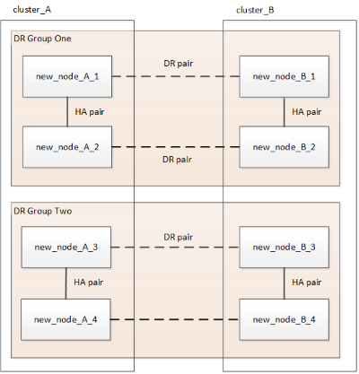

= 4노드 또는 8노드 MetroCluster IP 구성 업데이트(ONTAP 9.8 이상)
:allow-uri-read: 
:icons: font
:imagesdir: ../media/

[role="lead"]
이 절차를 사용하여 4노드 또는 8노드 구성으로 컨트롤러 및 스토리지를 업그레이드할 수 있습니다.

ONTAP 9.13.1 버전부터는 구성을 임시 12노드 구성으로 확장한 다음 이전의 DR(재해 복구) 그룹을 제거하여 8노드 MetroCluster IP 구성에서 컨트롤러 및 스토리지를 업그레이드할 수 있습니다.

ONTAP 9.8부터 구성을 임시 8노드 구성으로 확장한 다음 이전 DR 그룹을 제거하여 4노드 MetroCluster IP 구성에서 컨트롤러와 스토리지를 업그레이드할 수 있습니다.

.이 작업에 대해
* 8노드 구성의 경우 시스템에서 ONTAP 9.13.1 이상을 실행해야 합니다.
* 4노드 구성의 경우 시스템에서 ONTAP 9.8 이상을 실행해야 합니다.
* IP 스위치도 업그레이드하는 경우 이 새로 고침 절차를 수행하기 전에 IP 스위치를 업그레이드해야 합니다.
* 이 절차에서는 4노드 DR 그룹 하나를 새로 고치는 데 필요한 단계를 설명합니다. 8노드 구성(DR 그룹 2개)이 있는 경우 하나 또는 두 DR 그룹을 모두 새로 고칠 수 있습니다.
+
두 DR 그룹을 모두 업데이트하는 경우 한 번에 하나의 DR 그룹을 새로 고쳐야 합니다.

* "이전 노드"에 대한 참조는 바꾸려는 노드를 의미합니다.
* 8노드 구성의 경우 소스 및 타겟 8노드 MetroCluster 플랫폼 조합을 지원해야 합니다.
+

NOTE: 두 DR 그룹을 모두 새로 고치면 첫 번째 DR 그룹을 새로 고친 후 플랫폼 조합이 지원되지 않을 수 있습니다. 지원되는 8노드 구성을 달성하려면 두 DR 그룹을 모두 새로 고쳐야 합니다.

* MetroCluster IP 구성에서 이 절차를 사용하여 특정 플랫폼 모델만 새로 고칠 수 있습니다.
+
** 지원되는 플랫폼 업그레이드 조합에 대한 자세한 내용은 의 MetroCluster IP 새로 고침 표를 참조하십시오 link:../upgrade/concept_choosing_tech_refresh_mcc.html#supported-metrocluster-ip-tech-refresh-combinations["시스템 새로 고침 방법 선택"].

* 소스 및 타겟 플랫폼의 하한이 적용됩니다. 상위 플랫폼으로 전환할 경우 모든 DR 그룹의 기술 업데이트가 완료된 후에만 새 플랫폼의 제한이 적용됩니다.
* 소스 플랫폼보다 낮은 한계로 플랫폼에 대한 기술 업데이트를 수행할 경우 이 절차를 수행하기 전에 한계를 조정하고 대상 플랫폼 제한값 이하로 줄여야 합니다.

.단계
. 이전 노드에서 정보를 수집합니다.
+
이 단계에서는 다음 이미지와 같이 4노드 구성이 나타납니다.

+
image::../media/mcc_dr_group_a.png[MCC DR 그룹 A]

+
8노드 구성은 다음 이미지와 같이 나타납니다.

+
image::../media/mcc_dr_groups_8_node.gif[MCC DR 그룹 8개 노드]

. 자동 지원 케이스 생성을 방지하려면 업그레이드가 진행 중임을 알리는 AutoSupport 메시지를 보내십시오.
+
.. 다음 명령을 실행합니다. +'시스템 노드 AutoSupport invoke -node * -type all -message "MAINT=10h Upgrading_old-model_to_new-model"_"
+
다음 예에서는 10시간의 유지 보수 기간을 지정합니다. 계획에 따라 추가 시간을 허용할 수 있습니다.

+
시간이 경과하기 전에 유지 관리가 완료된 경우 유지 보수 기간이 종료되었음을 나타내는 AutoSupport 메시지를 호출할 수 있습니다.

+
'System node AutoSupport invoke-node * -type all-message maINT=end'

.. 파트너 클러스터에서 명령을 반복합니다.

. 전환을 시작할 수 있는 Tiebreaker, 중재자 또는 기타 소프트웨어에서 기존 MetroCluster 구성을 제거합니다.
+
[cols="2*"]
|===

| 사용 중인 경우... | 다음 절차를 사용하십시오. 

 a| 
Tiebreaker입니다
 a| 
.. MetroCluster 구성을 제거하려면 tiebreaker CLI monitor remove 명령을 사용합니다.
+
다음 예에서는 ""cluster_a""가 소프트웨어에서 제거됩니다.

+
[listing]
----

NetApp MetroCluster Tiebreaker :> monitor remove -monitor-name cluster_A
Successfully removed monitor from NetApp MetroCluster Tiebreaker
software.
----
.. Tiebreaker CLI를 사용하여 MetroCluster 구성이 올바르게 제거되었는지 확인합니다 `monitor show -status` 명령.
+
[listing]
----

NetApp MetroCluster Tiebreaker :> monitor show -status
----

 a| 
중재자
 a| 
ONTAP 프롬프트에서 다음 명령을 실행합니다.

'MetroCluster configuration-settings 중재자 제거

 a| 
타사 응용 프로그램
 a| 
제품 설명서를 참조하십시오.

|===
. 의 모든 단계를 수행합니다 link:../upgrade/task_expand_a_four_node_mcc_ip_configuration.html["MetroCluster IP 구성 확장"] 를 클릭하여 구성에 새 노드 및 스토리지를 추가합니다.
+
확장 절차가 완료되면 다음 이미지와 같이 임시 구성이 나타납니다.

+
.일시적인 8노드 구성
image::../media/mcc_dr_group_b.png[MCC DR 그룹 b]

+
.임시 12노드 구성
image::../media/mcc_dr_group_c4.png[MCC DR 그룹 C4]

. CRS 체적을 이동합니다.
+
의 단계를 수행합니다 link:../maintain/task_move_a_metadata_volume_in_mcc_configurations.html["MetroCluster 구성에서 메타데이터 볼륨 이동"].

. 의 다음 절차를 사용하여 이전 노드에서 새 노드로 데이터를 이동합니다 link:https://docs.netapp.com/us-en/ontap-systems-upgrade/index.html["AFF 및 FAS 시스템 업그레이드 설명서"^]
+
.. 의 모든 단계를 수행합니다 http://["Aggregate 생성 및 볼륨을 새 노드로 이동"^].
+

NOTE: Aggregate를 생성할 때나 생성한 후에 미러링할 수도 있습니다.

.. 의 모든 단계를 수행합니다 http://["SAN이 아닌 데이터 LIF 및 클러스터 관리 LIF를 새로운 노드로 이동"].

. 각 클러스터에 대해 전환된 노드의 클러스터 피어의 IP 주소를 수정합니다.
+
.. 를 사용하여 cluster_a 피어를 식별합니다 `cluster peer show` 명령:
+
[listing]
----
cluster_A::> cluster peer show
Peer Cluster Name         Cluster Serial Number Availability   Authentication
------------------------- --------------------- -------------- --------------
cluster_B         1-80-000011           Unavailable    absent
----
+
... cluster_a 피어 IP 주소를 수정합니다.
+
`cluster peer modify -cluster cluster_A -peer-addrs node_A_3_IP -address-family ipv4`

.. 를 사용하여 cluster_B 피어를 식별합니다 `cluster peer show` 명령:
+
[listing]
----
cluster_B::> cluster peer show
Peer Cluster Name         Cluster Serial Number Availability   Authentication
------------------------- --------------------- -------------- --------------
cluster_A         1-80-000011           Unavailable    absent
----
+
... cluster_B 피어 IP 주소를 수정합니다.
+
`cluster peer modify -cluster cluster_B -peer-addrs node_B_3_IP -address-family ipv4`

.. 각 클러스터에 대해 클러스터 피어 IP 주소가 업데이트되었는지 확인합니다.
+
... 를 사용하여 각 클러스터의 IP 주소가 업데이트되었는지 확인합니다 `cluster peer show -instance` 명령.
+
를 클릭합니다 `Remote Intercluster Addresses` 다음 예제의 필드는 업데이트된 IP 주소를 표시합니다.

+
cluster_A의 예:

+
[listing]
----
cluster_A::> cluster peer show -instance

Peer Cluster Name: cluster_B
           Remote Intercluster Addresses: 172.21.178.204, 172.21.178.212
      Availability of the Remote Cluster: Available
                     Remote Cluster Name: cluster_B
                     Active IP Addresses: 172.21.178.212, 172.21.178.204
                   Cluster Serial Number: 1-80-000011
                    Remote Cluster Nodes: node_B_3-IP,
                                          node_B_4-IP
                   Remote Cluster Health: true
                 Unreachable Local Nodes: -
          Address Family of Relationship: ipv4
    Authentication Status Administrative: use-authentication
       Authentication Status Operational: ok
                        Last Update Time: 4/20/2023 18:23:53
            IPspace for the Relationship: Default
Proposed Setting for Encryption of Inter-Cluster Communication: -
Encryption Protocol For Inter-Cluster Communication: tls-psk
  Algorithm By Which the PSK Was Derived: jpake

cluster_A::>

----
+
cluster_B의 예

+
[listing]
----
cluster_B::> cluster peer show -instance

                       Peer Cluster Name: cluster_A
           Remote Intercluster Addresses: 172.21.178.188, 172.21.178.196 <<<<<<<< Should reflect the modified address
      Availability of the Remote Cluster: Available
                     Remote Cluster Name: cluster_A
                     Active IP Addresses: 172.21.178.196, 172.21.178.188
                   Cluster Serial Number: 1-80-000011
                    Remote Cluster Nodes: node_A_3-IP,
                                          node_A_4-IP
                   Remote Cluster Health: true
                 Unreachable Local Nodes: -
          Address Family of Relationship: ipv4
    Authentication Status Administrative: use-authentication
       Authentication Status Operational: ok
                        Last Update Time: 4/20/2023 18:23:53
            IPspace for the Relationship: Default
Proposed Setting for Encryption of Inter-Cluster Communication: -
Encryption Protocol For Inter-Cluster Communication: tls-psk
  Algorithm By Which the PSK Was Derived: jpake

cluster_B::>
----

. 의 단계를 따릅니다 link:concept_removing_a_disaster_recovery_group.html["재해 복구 그룹 제거"] 기존 DR 그룹을 제거합니다.
. 8노드 구성에서 두 DR 그룹을 모두 새로 고치려면 각 DR 그룹에 대해 전체 절차를 반복해야 합니다.
+
이전 DR 그룹을 제거한 후 다음 이미지와 같이 구성이 나타납니다.

+
.4노드 구성
image::../media/mcc_dr_group_d.png[MCC DR 그룹 d]

+
.8노드 구성

. MetroCluster 구성의 운영 모드를 확인하고 MetroCluster 검사를 수행합니다.
+
.. MetroCluster 구성을 확인하고 운영 모드가 정상인지 확인합니다.
+
MetroCluster 쇼

.. 예상되는 모든 노드가 표시되는지 확인합니다.
+
'MetroCluster node show'

.. 다음 명령을 실행합니다.
+
'MetroCluster check run

.. MetroCluster 검사 결과를 표시합니다.
+
MetroCluster 체크 쇼

. 필요한 경우 구성 절차를 사용하여 모니터링을 복원합니다.
+
[cols="2*"]
|===

| 사용 중인 경우... | 이 절차를 사용합니다 

 a| 
Tiebreaker입니다
 a| 
link:../tiebreaker/concept_configuring_the_tiebreaker_software.html#adding-metrocluster-configurations["MetroCluster 구성 추가"] MetroCluster Tiebreaker 설치 및 구성 _.

 a| 
중재자
 a| 
link:https://docs.netapp.com/us-en/ontap-metrocluster/install-ip/concept_mediator_requirements.html["MetroCluster IP 구성에서 ONTAP 중재자 서비스 구성"] MetroCluster IP 설치 및 구성 _.

 a| 
타사 응용 프로그램
 a| 
제품 설명서를 참조하십시오.

|===
. 자동 지원 케이스 생성을 재개하려면 유지 관리가 완료되었음을 나타내는 AutoSupport 메시지를 보냅니다.
+
.. 다음 명령을 실행합니다.
+
'System node AutoSupport invoke-node * -type all-message maINT=end'

.. 파트너 클러스터에서 명령을 반복합니다.

