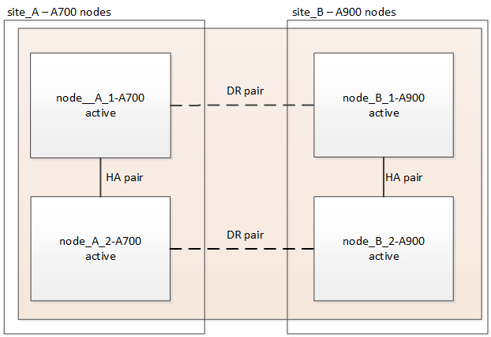

= 스위치오버 및 스위치백을 사용하여 MetroCluster IP 구성에서 AFF A700/FAS9000을 AFF A900/FAS9500으로 컨트롤러 업그레이드(ONTAP 9.10.1 이상)
:allow-uri-read: 

[role="lead"]
MetroCluster 스위치오버 운영을 사용하면 파트너 클러스터의 컨트롤러 모듈이 업그레이드되는 동안 클라이언트에 무중단 서비스를 제공할 수 있습니다. 이 절차의 일부로 다른 구성 요소(예: 스토리지 쉘프 또는 스위치)를 업그레이드할 수 없습니다.

.이 작업에 대해
* AFF A700 컨트롤러 모듈을 AFF A900으로 업그레이드하려면 컨트롤러에서 ONTAP 9.10.1 이상을 실행해야 합니다.
* FAS9000 컨트롤러 모듈을 FAS9500으로 업그레이드하려면 컨트롤러에 ONTAP 9.10.1P3 이상이 실행되고 있어야 합니다.
* 구성의 모든 컨트롤러는 동일한 유지보수 기간 동안 업그레이드해야 합니다.
+
AFF A700 및 AFF A900 또는 FAS9000 및 FAS9500 컨트롤러로 MetroCluster 구성을 작동하는 것은 이 유지보수 활동 외부에서는 지원되지 않습니다.

* IP 스위치는 지원되는 펌웨어 버전을 실행하고 있어야 합니다.
* 새 플랫폼에서는 원래 플랫폼의 IP 주소, 넷마스크 및 게이트웨이를 다시 사용합니다.
* 다음 예제 이름은 이 절차에서 예시와 그래픽 모두에 사용됩니다.
+
** 사이트_A
+
*** 업그레이드 전:
+
**** 노드_A_1-A700
**** 노드_A_2-A700

*** 업그레이드 후:
+
**** 노드_A_1-A900
**** 노드_A_2-A900

** 사이트_B
+
*** 업그레이드 전:
+
**** 노드 B_1-A700
**** 노드 B_2-A700

*** 업그레이드 후:
+
**** 노드_B_1-A900
**** 노드_B_2-A900

== 콘솔 로깅을 활성화합니다

NetApp은 사용 중인 장치에서 콘솔 로깅을 사용하도록 설정하고 이 절차를 수행할 때 다음 작업을 수행할 것을 적극 권장합니다.

* 유지 관리 중에는 AutoSupport를 활성화된 상태로 둡니다.
* 유지 관리 전후에 유지 관리 AutoSupport 메시지를 트리거하여 유지 관리 활동 기간 동안 케이스 생성을 비활성화합니다.
+
기술 자료 문서를 link:https://kb.netapp.com/Support_Bulletins/Customer_Bulletins/SU92["예약된 유지 보수 기간 동안 자동 케이스 생성을 억제하는 방법"^]참조하십시오.

* 모든 CLI 세션에 대해 세션 로깅을 설정합니다. 세션 로깅을 활성화하는 방법에 대한 지침은 기술 자료 문서의 "로깅 세션 출력" 섹션을 link:https://kb.netapp.com/on-prem/ontap/Ontap_OS/OS-KBs/How_to_configure_PuTTY_for_optimal_connectivity_to_ONTAP_systems["ONTAP 시스템에 대한 최적의 연결을 위해 PuTTY를 구성하는 방법"^]참조하십시오.

== MetroCluster IP 구성에서 컨트롤러를 업그레이드하기 위한 워크플로우

워크플로 다이어그램을 사용하여 업그레이드 작업을 계획할 수 있습니다.

image::../media/workflow_ip_upgrade.png[MetroCluster IP 구성에서 컨트롤러 업그레이드를 위한 워크플로]

== 업그레이드를 준비합니다

기존 MetroCluster 구성을 변경하기 전에 구성 상태를 확인하고, 새 플랫폼을 준비하고, 기타 작업을 수행해야 합니다.

=== AFF A700 또는 FAS9000 컨트롤러에서 슬롯 7을 지웁니다

AFF A900 또는 FAS9500의 MetroCluster 구성은 슬롯 5와 7에 있는 DR 카드의 각 포트 중 하나를 사용합니다. 업그레이드를 시작하기 전에 AFF A700 또는 FAS9000의 슬롯 7에 카드가 있는 경우 해당 카드를 클러스터의 모든 노드에 대한 다른 슬롯으로 이동해야 합니다.

=== 컨트롤러를 업그레이드하기 전에 MetroCluster 스위치 RCF 파일을 업데이트합니다

이 업그레이드를 수행할 때 MetroCluster 스위치에서 RCF 파일을 업데이트해야 합니다. 다음 표에는 AFF A900/FAS9500 MetroCluster IP 구성에서 지원되는 VLAN 범위가 나와 있습니다.

|===

| 플랫폼 모델 | 지원되는 VLAN ID입니다 

 a| 
* AFF A900 또는 FAS9500

 a| 
* 10
* 20
* 101 ~ 4096 범위의 모든 값

|===
* 스위치가 지원되는 최소 RCF 파일 버전으로 구성되지 않은 경우 RCF 파일을 업데이트해야 합니다. 사용 중인 스위치 모델에 맞는 RCF 파일 버전은 를 참조하십시오 link:https://mysupport.netapp.com/site/tools/tool-eula/rcffilegenerator["RcfFileGenerator 도구"^]. 다음 단계는 RCF 파일 애플리케이션을 위한 것입니다.

.단계
. 새로운 RCF 파일 적용을 위한 IP 스위치를 준비합니다.
+
해당 스위치 공급업체에 대한 섹션의 단계를 따릅니다.

+
** link:../install-ip/task_switch_config_broadcom.html#resetting-the-broadcom-ip-switch-to-factory-defaults["Broadcom IP 스위치를 출하 시 기본값으로 재설정합니다"]
** link:../install-ip/task_switch_config_cisco.html#resetting-the-cisco-ip-switch-to-factory-defaults["Cisco IP 스위치를 출하 시 기본값으로 재설정합니다"]
** link:../install-ip/task_switch_config_nvidia.html#reset-the-nvidia-ip-sn2100-switch-to-factory-defaults["NVIDIA IP 스위치를 출하 시 기본값으로 재설정합니다"]

. RCF 파일을 다운로드하고 설치합니다.
+
해당 스위치 공급업체에 대한 섹션의 단계를 따릅니다.

+
** link:../install-ip/task_switch_config_broadcom.html#downloading-and-installing-the-broadcom-rcf-files["Broadcom RCF 파일을 다운로드하여 설치합니다"]
** link:../install-ip/task_switch_config_cisco.html#downloading-and-installing-the-cisco-ip-rcf-files["Cisco IP RCF 파일을 다운로드하고 설치합니다"]
** link:../install-ip/task_switch_config_nvidia.html#download-and-install-the-nvidia-rcf-files["NVIDIA IP RCF 파일을 다운로드하고 설치합니다"]

=== 이전 노드의 포트를 새 노드로 매핑합니다

AFF A700에서 AFF A900 또는 FAS9000으로 업그레이드할 때 데이터 네트워크 포트, FCP SAN 어댑터 포트, SAS 및 NVMe 스토리지 포트는 변경하지 않습니다. 데이터 LIF는 업그레이드 도중과 이후에 계속 유지됩니다. 따라서 이전 노드의 네트워크 포트를 새 노드로 매핑할 필요가 없습니다.

=== 사이트 업그레이드 전에 MetroCluster 상태를 확인하십시오

업그레이드를 수행하기 전에 MetroCluster 구성의 상태와 연결성을 확인합니다.

CAUTION: 첫 번째 사이트에서 컨트롤러를 업그레이드한 후 두 번째 사이트를 업그레이드하기 전에 다음을 실행합니다.  `metrocluster check run` 이어서  `metrocluster check show` 오류가 반환됩니다  `config-replication` 필드. 이 오류는 각 사이트의 노드 간 NVRAM 크기 불일치를 나타내며, 두 사이트에 서로 다른 플랫폼 모델이 있는 경우 예상되는 동작입니다. DR 그룹의 모든 노드에 대한 컨트롤러 업그레이드가 완료될 때까지 이 오류를 무시해도 됩니다.

.단계
. ONTAP에서 MetroCluster 구성 작동을 확인합니다.
+
.. 노드 multipathed 여부 확인: + 'node run-node_node-name_sysconfig-a
+
MetroCluster 구성의 각 노드에 대해 이 명령을 실행해야 합니다.

.. 구성에서 손상된 디스크가 없는지 확인합니다. + '스토리지 디스크 표시 - 파손'
+
MetroCluster 구성의 각 노드에서 이 명령을 실행해야 합니다.

.. 상태 알림을 확인합니다.
+
'시스템 상태 경고 표시

+
각 클러스터에서 이 명령을 실행해야 합니다.

.. 클러스터의 라이센스를 확인합니다.
+
'시스템 사용권 프로그램'

+
각 클러스터에서 이 명령을 실행해야 합니다.

.. 노드에 연결된 디바이스를 확인합니다.
+
네트워크 디바이스 발견 쇼

+
각 클러스터에서 이 명령을 실행해야 합니다.

.. 두 사이트 모두에서 표준 시간대와 시간이 올바르게 설정되었는지 확인합니다.
+
'클러스터 날짜 표시'

+
각 클러스터에서 이 명령을 실행해야 합니다. 'cluster date' 명령을 사용하여 시간 및 시간대를 구성할 수 있습니다.

. MetroCluster 구성의 운영 모드를 확인하고 MetroCluster 검사를 수행합니다.
+
.. MetroCluster 설정을 확인하고 운영 모드가 정상 모드인지 확인한 후 MetroCluster show를 실행합니다
.. 예상되는 모든 노드가 표시되는지 확인합니다. + "MetroCluster node show"
.. 다음 명령을 실행합니다.
+
'MetroCluster check run

.. MetroCluster 검사 결과를 표시합니다.
+
MetroCluster 체크 쇼

. Config Advisor 도구를 사용하여 MetroCluster 케이블 연결을 확인합니다.
+
.. Config Advisor를 다운로드하고 실행합니다.
+
https://mysupport.netapp.com/site/tools/tool-eula/activeiq-configadvisor["NetApp 다운로드: Config Advisor"^]

.. Config Advisor를 실행한 후 도구의 출력을 검토하고 출력에서 권장 사항을 따라 발견된 문제를 해결하십시오.

=== 업그레이드하기 전에 정보를 수집합니다

업그레이드하기 전에 각 노드에 대한 정보를 수집하고, 필요한 경우 네트워크 브로드캐스트 도메인을 조정하고, VLAN 및 인터페이스 그룹을 제거하고, 암호화 정보를 수집해야 합니다.

.단계
. 각 노드의 물리적 케이블 연결을 기록하고 필요에 따라 새 노드의 올바른 케이블 연결을 허용하도록 케이블에 레이블을 지정합니다.
. 각 노드에 대해 다음 명령의 출력을 수집합니다.
+
** MetroCluster interconnect show
** 'MetroCluster configuration-settings connection show'를 선택합니다
** 네트워크 인터페이스 show-role cluster, node-mgmt
** 네트워크 포트 show-node node_name-type physical
** 'network port vlan show-node_node-name _'
** 'network port ifgrp show -node_node_name_-instance'
** 네트워크 포트 브로드캐스트 도메인 쇼
** 네트워크 포트 도달 가능성 세부 정보
** 네트워크 IPspace 쇼
** '볼륨 쇼'
** '스토리지 집계 쇼'
** 'system node run-node_node-name_sysconfig-a'
** 'vserver fcp initiator show'를 선택합니다
** 스토리지 디스크 쇼
** 'MetroCluster configuration-settings interface show'를 선택합니다

. Site_B(플랫폼을 현재 업그레이드 중인 사이트)의 UUID를 수집합니다. MetroCluster node show-fields node-cluster-uuid, node-uuuid
+
성공적으로 업그레이드하려면 새 site_B 컨트롤러 모듈에서 이러한 값을 정확하게 구성해야 합니다. 나중에 업그레이드 프로세스에서 올바른 명령으로 복사할 수 있도록 값을 파일에 복사합니다. +다음 예에서는 UUID를 사용한 명령 출력을 보여 줍니다.

+
[listing]
----
cluster_B::> metrocluster node show -fields node-cluster-uuid, node-uuid
   (metrocluster node show)
dr-group-id cluster     node   node-uuid                            node-cluster-uuid
----------- --------- -------- ------------------------------------ ------------------------------
1           cluster_A node_A_1-A700 f03cb63c-9a7e-11e7-b68b-00a098908039 ee7db9d5-9a82-11e7-b68b-00a098908039
1           cluster_A node_A_2-A700 aa9a7a7a-9a81-11e7-a4e9-00a098908c35 ee7db9d5-9a82-11e7-b68b-00a098908039
1           cluster_B node_B_1-A700 f37b240b-9ac1-11e7-9b42-00a098c9e55d 07958819-9ac6-11e7-9b42-00a098c9e55d
1           cluster_B node_B_2-A700 bf8e3f8f-9ac4-11e7-bd4e-00a098ca379f 07958819-9ac6-11e7-9b42-00a098c9e55d
4 entries were displayed.
cluster_B::*

----
+
UUID를 다음과 유사한 테이블에 기록하는 것이 좋습니다.

+
|===

| 클러스터 또는 노드 | UUID입니다 

 a| 
클러스터_B
 a| 
07958819-9ac6-11e7-9b42-00a098c9e55d

 a| 
노드 B_1-A700
 a| 
f37b240b-9ac1-11e7-9b42-00a098c9e55d

 a| 
노드 B_2-A700
 a| 
bf8e3f8f-9ac4-11e7-bd4e-00a098ca379f

 a| 
클러스터_A
 a| 
ee7db9d5-9a82-11e7-b68b-00a098908039

 a| 
노드_A_1-A700
 a| 
f03cb63c-9a7e-11e7-b68b-00a098908039

 a| 
노드_A_2-A700
 a| 
a9a7a7a-9a81-11e7-a4e9-00a098908c35

|===
. MetroCluster 노드가 SAN 구성에 있는 경우 관련 정보를 수집합니다.
+
다음 명령의 출력을 수집해야 합니다.

+
** FCP 어댑터 show-instance(FCP 어댑터 show-instance)
** FCP 인터페이스의 show-instance입니다
** iSCSI 인터페이스 쇼
** 'ucadmin 쇼'

. 루트 볼륨이 암호화된 경우 키 관리자에 사용되는 암호문 '보안 키 관리자 백업 표시'를 수집하여 저장합니다
. MetroCluster 노드가 볼륨 또는 애그리게이트에 암호화를 사용하는 경우 키 및 암호 문구를 복사합니다. 자세한 내용은 을 참조하십시오 https://docs.netapp.com/us-en/ontap/encryption-at-rest/backup-key-management-information-manual-task.html["온보드 키 관리 정보를 수동으로 백업합니다"^].
+
.. Onboard Key Manager가 설정된 경우 '보안 키 관리자 온보드 show-backup'+업그레이드 절차 후반부에 패스프레이즈가 필요합니다.
.. 엔터프라이즈 키 관리(KMIP)를 구성한 경우 다음 명령을 실행하십시오.
+
....
security key-manager external show -instance
security key-manager key query
....

. MetroCluster node show-fields node-systemid, ha-partner-systemid, dr-partner-systemid, dr-auxiliary-systemid 등 기존 노드의 시스템 ID를 수집한다
+
다음 출력은 재할당된 드라이브를 보여 줍니다.

+
[listing]
----
::> metrocluster node show -fields node-systemid,ha-partner-systemid,dr-partner-systemid,dr-auxiliary-systemid

dr-group-id cluster     node     node-systemid ha-partner-systemid dr-partner-systemid dr-auxiliary-systemid
----------- ----------- -------- ------------- ------------------- ------------------- ---------------------
1           cluster_A node_A_1-A700   537403324     537403323           537403321           537403322
1           cluster_A node_A_2-A700   537403323     537403324           537403322          537403321
1           cluster_B node_B_1-A700   537403322     537403321           537403323          537403324
1           cluster_B node_B_2-A700   537403321     537403322           537403324          537403323
4 entries were displayed.
----

=== 중재자 또는 타이차단기 모니터링을 제거합니다

플랫폼을 업그레이드하기 전에 Tiebreaker 또는 중재자 유틸리티를 사용하여 MetroCluster 구성을 모니터링하는 경우 모니터링을 제거해야 합니다.

.단계
. 다음 명령의 출력을 수집합니다.
+
'Storage iSCSI-initiator show'를 선택합니다

. 전환을 시작할 수 있는 Tiebreaker, 중재자 또는 기타 소프트웨어에서 기존 MetroCluster 구성을 제거합니다.
+
|===

| 사용 중인 경우... | 다음 절차를 사용하십시오. 

 a| 
Tiebreaker입니다
 a| 
link:../tiebreaker/concept_configuring_the_tiebreaker_software.html#removing-metrocluster-configurations["MetroCluster 구성 제거"] MetroCluster Tiebreaker 설치 및 구성 내용 _

 a| 
중재자
 a| 
ONTAP 프롬프트에서 다음 명령을 실행합니다.

'MetroCluster configuration-settings 중재자 제거

 a| 
타사 응용 프로그램
 a| 
제품 설명서를 참조하십시오.

|===

=== 유지 관리 전에 사용자 지정 AutoSupport 메시지를 보냅니다

유지 관리를 수행하기 전에 AutoSupport 메시지를 발행하여 유지 보수 작업이 진행 중임을 기술 지원 부서에 알려야 합니다. 유지 관리가 진행 중임을 기술 지원 부서에 알리는 것은 운영 중단이 발생했다는 가정 하에 사례가 열리지 않도록 방지합니다.

.이 작업에 대해
이 작업은 각 MetroCluster 사이트에서 수행해야 합니다.

.단계
. 클러스터에 로그인합니다.
. 유지 관리의 시작을 나타내는 AutoSupport 메시지를 호출합니다.
+
'시스템 노드 AutoSupport invoke-node * -type all-message maINT=__maintenance -window-in-hours_'

+
유지보수 윈도우 시간(main유지보수-window-in-hours) 매개변수는 유지보수 윈도우 길이를 최대 72시간으로 지정합니다. 시간이 경과하기 전에 유지 관리가 완료된 경우 유지 보수 기간이 종료되었음을 나타내는 AutoSupport 메시지를 호출할 수 있습니다.

+
'System node AutoSupport invoke-node * -type all-message maINT=end'

. 파트너 사이트에서 이 단계를 반복합니다.

== MetroCluster 구성을 전환합니다

site_B의 플랫폼을 업그레이드할 수 있도록 구성을 site_A로 전환해야 합니다.

.이 작업에 대해
이 작업은 site_A에서 수행해야 합니다

이 작업을 완료한 후 site_a가 활성화되어 두 사이트의 데이터를 제공합니다. Site_B가 비활성화되어 업그레이드 프로세스를 시작할 준비가 되었습니다.

image::../media/mcc_upgrade_cluster_a_in_switchover_A900.png[MetroCluster 전환 후 Site_B가 비활성화되어 업그레이드 준비가 되었습니다.]

.단계
. site_B의 노드를 업그레이드할 수 있도록 MetroCluster 구성을 site_A로 전환합니다.
+
.. site_a에서 다음 명령을 실행합니다.
+
'MetroCluster switchover - controller-replacement true'

+
작업을 완료하는 데 몇 분 정도 걸릴 수 있습니다.

.. 절체 동작 모니터링:
+
MetroCluster 동작쇼

.. 작업이 완료된 후 노드가 절체 상태에 있는지 확인합니다.
+
MetroCluster 쇼

.. MetroCluster 노드의 상태를 점검한다.
+
'MetroCluster node show'

+
컨트롤러 업그레이드 중에 협상된 전환 후 애그리게이트 자동 복구가 해제됩니다. site_B의 노드는 LOADER 프롬프트에서 정지되고 정지된다.

== AFF A700 또는 FAS9000 플랫폼 컨트롤러 모듈 및 NVS를 제거합니다

.이 작업에 대해
아직 접지되지 않은 경우 올바르게 접지하십시오.

.단계
. site_B:"printenv"에 있는 두 노드에서 bootarg 값을 수집합니다
. site_B에서 섀시의 전원을 끕니다

=== AFF A700 또는 FAS9000 컨트롤러 모듈을 제거합니다

다음 절차를 사용하여 AFF A700 또는 FAS9000 컨트롤러 모듈을 제거합니다

.단계
. 컨트롤러 모듈을 분리하기 전에 콘솔 케이블 및 컨트롤러 모듈에서 관리 케이블을 분리합니다.
. 섀시에서 컨트롤러 모듈을 잠금 해제하고 분리합니다.
+
.. 캠 핸들의 주황색 버튼을 잠금 해제할 때까지 아래로 밉니다.
+
image::../media/drw_9500_remove_PCM.png[섀시에서 컨트롤러 모듈 제거: 잠금 해제 및 슬라이드 아웃]

+
|===

| image:../media/number1.png["번호1"] | 캠 핸들 해제 버튼 

| image:../media/number2.png["숫자2"] | 캠 핸들 
|===
.. 캠 핸들을 돌려 컨트롤러 모듈을 섀시에서 완전히 분리한 다음 컨트롤러 모듈을 섀시 밖으로 밉니다. 컨트롤러 모듈 하단을 섀시 밖으로 밀어낼 때 지지하는지 확인합니다.

=== AFF A700 또는 FAS9000 NVS 모듈을 제거합니다

다음 절차를 사용하여 AFF A700 또는 FAS9000 NVS 모듈을 제거할 수 있습니다.

참고: NVS 모듈은 슬롯 6에 있으며 시스템의 다른 모듈에 비해 높이가 2배입니다.

.단계
. 슬롯 6에서 NVS의 잠금을 해제하고 제거합니다.
+
.. 문자 및 번호가 매겨진 '캠' 버튼을 누르십시오. 캠 버튼이 섀시에서 멀어져 있습니다.
.. 캠 래치가 수평 위치에 올 때까지 아래로 돌립니다. NVS는 섀시에서 분리되어 몇 인치 정도 이동합니다.
.. 모듈 면의 측면에 있는 당김 탭을 당겨 섀시에서 NVS를 제거합니다.
+
image::../media/drw_a900_move-remove_NVRAM_module.png[섀시에서 NVRAM 모듈 제거: 탭 잠금 해제 및 당기기]

+
|===

| image:../media/number1.png["1번"] | 문자 및 숫자 I/O 캠 래치 

| image:../media/number2.png["2번"] | I/O 래치가 완전히 잠금 해제되었습니다 
|===

. AFF A700 또는 FAS9000 NVS에서 코어 덤프 장치로 사용되는 애드온 모듈을 사용하는 경우 AFF A900 또는 FAS9500 NVS로 전송하지 마십시오. AFF A700 또는 FAS9000 컨트롤러 모듈 및 NVS의 부품을 AFF A900 또는 FAS9500 모듈로 전송하지 마십시오.

== AFF A900 또는 FAS9500 NVS 및 컨트롤러 모듈을 설치합니다

업그레이드 키트에서 받은 AFF A900 또는 FAS9500 NVS와 컨트롤러 모듈을 site_B의 두 노드에 모두 설치해야 합니다 코어 덤프 장치를 AFF A700 또는 FAS9000 NVS 모듈에서 AFF A900 또는 FAS9500 NVS 모듈로 이동하지 마십시오.

.이 작업에 대해
아직 접지되지 않은 경우 올바르게 접지하십시오.

=== AFF A900 또는 FAS9500 NVS를 설치합니다

다음 절차에 따라 site_B에서 두 노드의 슬롯 6에 AFF A900 또는 FAS9500 NVS를 설치합니다

.단계
. NVS를 슬롯 6의 섀시 입구 가장자리에 맞춥니다.
. 문자 및 번호가 매겨진 I/O 캠 래치가 I/O 캠 핀과 맞물릴 때까지 NVS를 슬롯에 부드럽게 밀어 넣은 다음 I/O 캠 래치를 끝까지 밀어 NVS를 제자리에 고정합니다.
+
image::../media/drw_a900_move-remove_NVRAM_module.png[섀시에 NVRAM 모듈 설치: 제자리에 정렬하고 잠금]

+
|===

| image:../media/number1.png["1번"] | 문자 및 숫자 I/O 캠 래치 

| image:../media/number2.png["2번"] | I/O 래치가 완전히 잠금 해제되었습니다 
|===

=== AFF A900 또는 FAS9500 컨트롤러 모듈을 설치합니다.

다음 절차에 따라 AFF A900 또는 FAS9500 컨트롤러 모듈을 설치합니다.

.단계
. 컨트롤러 모듈의 끝을 섀시의 입구에 맞춘 다음 컨트롤러 모듈을 반쯤 조심스럽게 시스템에 밀어 넣습니다.
. 컨트롤러 모듈이 중앙판과 만나 완전히 장착될 때까지 섀시 안으로 단단히 밀어 넣습니다. 컨트롤러 모듈이 완전히 장착되면 잠금 래치가 올라갑니다. 주의: 커넥터의 손상을 방지하려면 컨트롤러 모듈을 섀시에 밀어 넣을 때 과도한 힘을 가하지 마십시오.
. 컨트롤러 모듈에 관리 및 콘솔 포트를 연결합니다.
+
image::../media/drw_9500_remove_PCM.png[섀시에 컨트롤러 모듈 설치: 정렬, 좌석 및 케이블]

+
|===

| image:../media/number1.png["1번"] | 캠 핸들 해제 버튼 

| image:../media/number2.png["숫자2"] | 캠 핸들 
|===
. 각 노드의 슬롯 7에 두 번째 X91146A 카드를 설치합니다.
+
.. e5b 연결을 e7b로 이동합니다.
.. e5a 연결을 e5b로 이동합니다.
+

NOTE: 클러스터의 모든 노드에 있는 슬롯 7은 섹션에서 언급한 대로 비어 있어야 <<upgrade_a700_a900_ip_map,이전 노드의 포트를 새 노드로 매핑합니다>> 합니다.

. 섀시의 전원을 켜고 직렬 콘솔에 연결합니다.
. BIOS 초기화 후 노드가 자동 부팅을 시작한 경우 Control-C를 눌러 자동 부팅을 중단합니다
. 자동 부팅을 중단하고 나면 로더 프롬프트에서 노드가 중지됩니다. 시간에 자동 부팅을 중단하지 않고 노드 1이 부팅을 시작하는 경우 Ctrl-C를 눌러 부팅 메뉴로 이동하라는 메시지가 표시될 때까지 기다립니다. 부팅 메뉴에서 노드가 중지되면 옵션 8을 사용하여 노드를 재부팅하고 재부팅 중에 자동 부팅을 중단합니다.
. LOADER 프롬프트에서 기본 환경 변수 set-defaults를 설정합니다
. 기본 환경 변수 설정인 'aveenv'를 저장합니다

=== site_B의 netboot 노드

AFF A900 또는 FAS9500 컨트롤러 모듈과 NVS를 바꾼 후에는 AFF A900 또는 FAS9500 노드를 netboot에 설치하고 클러스터에서 실행 중인 것과 동일한 ONTAP 버전 및 패치 수준을 설치해야 합니다. netboot라는 용어는 원격 서버에 저장된 ONTAP 이미지에서 부팅됨을 의미합니다. netboot를 준비할 때 시스템이 액세스할 수 있는 웹 서버에 ONTAP 9 부트 이미지 사본을 추가해야 합니다. AFF A900 또는 FAS9500 컨트롤러 모듈의 부팅 미디어에 설치된 ONTAP 버전은 섀시에 설치되어 있고 전원이 켜져 있지 않으면 확인할 수 없습니다. AFF A900 또는 FAS9500 부팅 미디어의 ONTAP 버전은 업그레이드할 AFF A700 또는 FAS9000 시스템에서 실행되는 ONTAP 버전과 동일해야 하며 기본 부팅 이미지와 백업 부팅 이미지가 일치해야 합니다. 부팅 메뉴에서 netboot 다음에 'wipecononfig' 명령을 수행하여 이미지를 구성할 수 있습니다. 이전에 다른 클러스터에서 컨트롤러 모듈을 사용한 경우 "wipeconfig" 명령을 실행하면 부팅 미디어의 나머지 구성이 지워집니다.

.시작하기 전에
* 시스템에서 HTTP 서버에 액세스할 수 있는지 확인합니다.
* 시스템에 필요한 시스템 파일과 ONTAP의 올바른 버전을 NetApp Support 사이트에서 다운로드해야 합니다.

.이 작업에 대해
설치된 ONTAP 버전이 원래 컨트롤러에 설치된 버전과 동일하지 않은 경우, 새 컨트롤러를 netboot 해야 합니다. 각각의 새 컨트롤러를 설치한 후 웹 서버에 저장된 ONTAP 9 이미지에서 시스템을 부팅합니다. 그런 다음 부팅 미디어 장치에 올바른 파일을 다운로드하여 나중에 시스템을 부팅할 수 있습니다.

.단계
. 에 액세스합니다 https://mysupport.netapp.com/site/["NetApp Support 사이트"^] 시스템의 Netboot 수행에 사용되는 파일을 다운로드합니다.
. [[step2-download-software]] NetApp Support 사이트의 소프트웨어 다운로드 섹션에서 해당 ONTAP 소프트웨어를 다운로드하고 웹 액세스 가능한 디렉토리에 'ontap-version_image.tgz' 파일을 저장합니다.
. 웹 액세스 가능 디렉토리로 변경하고 필요한 파일을 사용할 수 있는지 확인합니다.
. 디렉토리 목록에는 <ONTAP_VERSION>\_IMAGE.tgz 가 포함되어야 합니다.
. 다음 작업 중 하나를 선택하여 netboot 연결을 구성합니다.
+

NOTE: 관리 포트와 IP를 netboot 연결로 사용해야 합니다. 업그레이드를 수행하는 동안 데이터 LIF IP를 사용하지 않거나 데이터 중단이 발생할 수 있습니다.

+
|===

| DCHP(동적 호스트 구성 프로토콜)가 다음과 같은 경우 | 그러면... 

 a| 
실행 중입니다
 a| 
부팅 환경 프롬프트에서 'ifconfig e0M-auto'를 사용하여 연결을 자동으로 구성합니다

 a| 
실행 중이 아닙니다
 a| 
부팅 환경 프롬프트에서 다음 명령을 사용하여 연결을 수동으로 구성합니다. 'ifconfig e0M -addr=<filer_addr> -mask=<netmask> -GW=<gateway> -DNS=<DNS_addr> domain=<DNS_domain>'

"<filer_addr>"은(는) 스토리지 시스템의 IP 주소입니다. "<netmask>"는 스토리지 시스템의 네트워크 마스크입니다. '<gateway>'는 스토리지 시스템의 게이트웨이입니다. "<dns_addr>"은 네트워크에 있는 이름 서버의 IP 주소입니다. 이 매개 변수는 선택 사항입니다. '<dns_domain>'은 DNS(Domain Name Service) 도메인 이름입니다. 이 매개 변수는 선택 사항입니다. 참고: 인터페이스에 다른 매개 변수가 필요할 수 있습니다. 펌웨어 프롬프트에 "help ifconfig"를 입력하여 세부 정보를 확인합니다.

|===
. node_B_1에서 netboot 수행:
`netboot` `\http://<web_server_ip/path_to_web_accessible_directory>/netboot/kernel`
+
"<path_to_the_web-Accessible_directory>"는 에서 "<ONTAP_version>\_image.tgz"를 다운로드한 위치로 이어져야 합니다 <<step2-download-software,2단계>>.

+

NOTE: 부팅을 중단하지 마십시오.

. AFF A900 또는 FAS9500 컨트롤러 모듈에서 지금 실행 중인 node_B_1이 부팅될 때까지 기다린 후 다음과 같이 부팅 메뉴 옵션을 표시합니다.
+
[listing]
----
Please choose one of the following:

(1)  Normal Boot.
(2)  Boot without /etc/rc.
(3)  Change password.
(4)  Clean configuration and initialize all disks.
(5)  Maintenance mode boot.
(6)  Update flash from backup config.
(7)  Install new software first.
(8)  Reboot node.
(9)  Configure Advanced Drive Partitioning.
(10) Set Onboard Key Manager recovery secrets.
(11) Configure node for external key management.
Selection (1-11)?
----
. 부팅 메뉴에서 ''(7) Install new software first(새 소프트웨어를 먼저 설치합니다)' 옵션을 선택합니다 이 메뉴 옵션은 새 ONTAP 이미지를 다운로드하여 부팅 장치에 설치합니다. 참고: "이 절차는 HA 쌍의 무중단 업그레이드를 지원하지 않습니다."라는 메시지는 무시하십시오 이 노트는 컨트롤러 업그레이드가 아닌 무중단 ONTAP 소프트웨어 업그레이드에 적용됩니다.
+
항상 netboot를 사용하여 새 노드를 원하는 이미지로 업데이트합니다. 다른 방법을 사용하여 새 컨트롤러에 이미지를 설치할 경우 잘못된 이미지가 설치될 수 있습니다. 이 문제는 모든 ONTAP 릴리스에 적용됩니다.

. 절차를 계속하라는 메시지가 나타나면 를 입력합니다 `y`, 패키지를 입력하라는 메시지가 나타나면 URL을 입력합니다.
`\http://<web_server_ip/path_to_web-accessible_directory>/<ontap_version>\_image.tgz`
. 컨트롤러 모듈을 재부팅하려면 다음 하위 단계를 완료하십시오.
+
.. "n"을 입력하여 백업 복구를 건너뛰십시오. "지금 백업 구성을 복구하시겠습니까?"라는 메시지가 표시되면 백업 복구를 건너뛰십시오. {y|n}'
.. 다음 프롬프트가 표시되면 ''y to reboot when you reboot:'를 입력하여 새로 설치된 소프트웨어를 사용하려면 노드를 재부팅해야 합니다. 지금 재부팅하시겠습니까? {y|n}""부팅 장치가 다시 포맷되어 컨트롤러 모듈이 재부팅되지만 부팅 메뉴에서 중지되므로 구성 데이터를 복원해야 합니다.

. 프롬프트에서 "wpeconmponfig" 명령을 실행하여 부팅 미디어의 이전 구성을 지웁니다.
+
.. 다음 메시지가 표시되면 Yes를 선택합니다. 그러면 클러스터 구성원을 포함한 중요한 시스템 구성이 삭제됩니다. 경고: 인계된 HA 노드에서 이 옵션을 실행하지 마십시오. 계속 하고 싶으세요
.. 노드가 재부팅되어 "wipeconfig"가 끝나면 부팅 메뉴에서 멈춥니다.

. 부팅 메뉴에서 유지보수 모드로 전환하려면 옵션 '5'를 선택합니다. 유지보수 모드에서 노드가 중지되고 명령 프롬프트 \ *>가 나타날 때까지 프롬프트에 "yes"를 선택합니다.
. netboot node_B_2에 이 단계를 반복합니다.

=== HBA 구성을 복구합니다

컨트롤러 모듈에 있는 HBA 카드의 존재 여부와 구성에 따라 사이트 용도에 맞게 HBA 카드를 올바르게 구성해야 합니다.

.단계
. 유지 관리 모드에서 시스템의 모든 HBA에 대한 설정을 구성합니다.
+
.. 포트의 현재 설정을 확인합니다.
+
'ucadmin 쇼'

.. 필요에 따라 포트 설정을 업데이트합니다.

+
|===

| 이 유형의 HBA와 원하는 모드가 있는 경우... | 이 명령 사용... 

 a| 
CNA FC
 a| 
'ucadmin modify -m fc -t initiator_adapter-name_'

 a| 
CNA 이더넷
 a| 
'ucadmin modify-mode CNA_adapter-name _'

 a| 
FC 타겟
 a| 
'fcadmin config -t target_adapter-name_'

 a| 
FC 이니시에이터
 a| 
'fcadmin config -t initiator_adapter-name_'

|===
. 유지 관리 모드 종료:
+
"중지"

+
명령을 실행한 후 LOADER 프롬프트에서 노드가 중지될 때까지 기다립니다.

. 노드를 유지보수 모드로 다시 부팅하여 구성 변경 사항이 적용되도록 합니다.
+
boot_ONTAP maint를 선택합니다

. 변경 사항을 확인합니다.
+
|===

| 이 유형의 HBA가 있는 경우... | 이 명령 사용... 

 a| 
CNA
 a| 
'ucadmin 쇼'

 a| 
FC
 a| 
fcadmin 쇼

|===

=== 새 컨트롤러 및 섀시에서 HA 상태를 설정합니다

컨트롤러 및 섀시의 HA 상태를 확인하고, 필요한 경우 시스템 구성에 맞게 상태를 업데이트해야 합니다.

.단계
. 유지보수 모드에서 컨트롤러 모듈 및 섀시의 HA 상태를 표시합니다.
+
하구성 쇼

+
모든 부품의 HA 상태는 'mcip'이어야 한다.

. 컨트롤러 또는 섀시의 시스템 상태가 표시되지 않으면 HA 상태를 설정합니다.
+
ha-config modify controller mcip.(컨트롤러 mccip 수정

+
ha-config modify chassis mccip.(섀시 mcip 수정

. 노드를 정지시킵니다
+
LOADER> 프롬프트에서 노드가 정지되어야 합니다.

. 각 노드에서 시스템 날짜, 시간 및 시간대를 '날짜 표시'로 확인합니다
. 필요한 경우 UTC 또는 GMT:'SET DATE<MM/dd/yyyy>'로 날짜를 설정합니다
. 부팅 환경 프롬프트에서 'show time'을 사용하여 시간을 확인한다
. 필요한 경우 시간을 UTC 또는 GMT:'설정 시간<hh:mm:ss>'로 설정합니다
. 'Saveenv' 설정을 저장합니다
. 환경 변수(printenv)를 수집합니다

== 새로운 플랫폼을 수용하기 위해 스위치 RCF 파일을 업데이트합니다

새 플랫폼 모델을 지원하는 구성으로 스위치를 업데이트해야 합니다.

.이 작업에 대해
현재 업그레이드 중인 컨트롤러가 포함된 사이트에서 이 작업을 수행합니다. 이 절차의 예에서는 먼저 site_B를 업그레이드하고 있습니다.

site_a의 컨트롤러가 업그레이드되면 site_a의 스위치가 업그레이드됩니다.

.단계
. 새 RCF의 적용을 위한 IP 스위치를 준비합니다.
+
해당 스위치 공급업체에 대한 섹션의 단계를 따릅니다.

+
** link:../install-ip/task_switch_config_broadcom.html#resetting-the-broadcom-ip-switch-to-factory-defaults["Broadcom IP 스위치를 출하 시 기본값으로 재설정합니다"]
** link:../install-ip/task_switch_config_cisco.html#resetting-the-cisco-ip-switch-to-factory-defaults["Cisco IP 스위치를 출하 시 기본값으로 재설정합니다"]
** link:../install-ip/task_switch_config_nvidia.html#reset-the-nvidia-ip-sn2100-switch-to-factory-defaults["NVIDIA IP SN2100 스위치를 출하 시 기본값으로 재설정합니다"]

. RCF를 다운로드하여 설치합니다.
+
해당 스위치 공급업체에 대한 섹션의 단계를 따릅니다.

+
** link:../install-ip/task_switch_config_broadcom.html#downloading-and-installing-the-broadcom-rcf-files["Broadcom RCFs를 다운로드하여 설치합니다"]
** link:../install-ip/task_switch_config_cisco.html#downloading-and-installing-the-cisco-ip-rcf-files["Cisco IP RCF를 다운로드하여 설치합니다"]
** link:../install-ip/task_switch_config_nvidia.html#download-and-install-the-nvidia-rcf-files["NVIDIA IP RCF를 다운로드하여 설치합니다"]

== 새 컨트롤러를 구성합니다

이때 새 컨트롤러를 준비하고 케이블로 연결해야 합니다.

=== MetroCluster IP bootarg 변수를 설정합니다

특정 MetroCluster IP bootarg 값은 새 컨트롤러 모듈에서 구성해야 합니다. 이 값은 이전 컨트롤러 모듈에 구성된 값과 일치해야 합니다.

.이 작업에 대해
이 작업에서는 의 업그레이드 절차에서 앞서 확인한 UUID 및 시스템 ID를 <<업그레이드하기 전에 정보를 수집합니다>>사용합니다.

.단계
. LOADER> 프롬프트에서 다음 boots를 site_B의 새 노드에 설정합니다.
+
'setenv bootarg.MCC.port_a_ip_config_local -ip-address/local-ip-mask, 0, HA-partner-ip-address, dr-partner-ip-address, dr-aux-partnerip-address, vlan-id_'

+
'setenv bootarg.MCC.port_b_ip_config_local -ip-address/local-ip-mask, 0, HA-partner-ip-address, dr-partner-ip-address, dr-aux-partnerip-address, vlan-id_'

+
다음 예에서는 첫 번째 네트워크에 VLAN 120을 사용하고 두 번째 네트워크에 대해 VLAN 130을 사용하는 node_B_1-A900에 대한 값을 설정합니다.

+
[listing]
----
setenv bootarg.mcc.port_a_ip_config 172.17.26.10/23,0,172.17.26.11,172.17.26.13,172.17.26.12,120
setenv bootarg.mcc.port_b_ip_config 172.17.27.10/23,0,172.17.27.11,172.17.27.13,172.17.27.12,130
----
+
다음 예에서는 첫 번째 네트워크에 VLAN 120을 사용하고 두 번째 네트워크에 대해 VLAN 130을 사용하는 node_B_2-A900에 대한 값을 설정합니다.

+
[listing]
----
setenv bootarg.mcc.port_a_ip_config 172.17.26.11/23,0,172.17.26.10,172.17.26.12,172.17.26.13,120
setenv bootarg.mcc.port_b_ip_config 172.17.27.11/23,0,172.17.27.10,172.17.27.12,172.17.27.13,130
----
. 새 노드의 'LOADER' 프롬프트에서 UUID를 설정합니다.
+
'setenv bootarg.mgwd.partner_cluster_uuuid_partner-cluster-UUID_'

+
'setenv bootarg.mgwd.cluster_uuuid_local-cluster-UUID_'

+
'setenv bootarg.mcc.pri_partner_uuuid_dr-partner-node-UUID_'

+
'setenv bootarg.mcc.aux_partner_uuid_dr-aux-partner-node-UUID_'

+
'setenv bootarg.mcc_iscsi.node_uuid_local-node-UUID_'

+
.. node_B_1-A900에서 UUID를 설정합니다.
+
다음 예에서는 node_B_1-A900에서 UUID를 설정하기 위한 명령을 보여 줍니다.

+
[listing]
----
setenv bootarg.mgwd.cluster_uuid ee7db9d5-9a82-11e7-b68b-00a098908039
setenv bootarg.mgwd.partner_cluster_uuid 07958819-9ac6-11e7-9b42-00a098c9e55d
setenv bootarg.mcc.pri_partner_uuid f37b240b-9ac1-11e7-9b42-00a098c9e55d
setenv bootarg.mcc.aux_partner_uuid bf8e3f8f-9ac4-11e7-bd4e-00a098ca379f
setenv bootarg.mcc_iscsi.node_uuid f03cb63c-9a7e-11e7-b68b-00a098908039
----
.. node_B_2-A900에서 UUID를 설정합니다.
+
다음 예에서는 node_B_2-A900에서 UUID를 설정하기 위한 명령을 보여 줍니다.

+
[listing]
----
setenv bootarg.mgwd.cluster_uuid ee7db9d5-9a82-11e7-b68b-00a098908039
setenv bootarg.mgwd.partner_cluster_uuid 07958819-9ac6-11e7-9b42-00a098c9e55d
setenv bootarg.mcc.pri_partner_uuid bf8e3f8f-9ac4-11e7-bd4e-00a098ca379f
setenv bootarg.mcc.aux_partner_uuid f37b240b-9ac1-11e7-9b42-00a098c9e55d
setenv bootarg.mcc_iscsi.node_uuid aa9a7a7a-9a81-11e7-a4e9-00a098908c35
----

. 원래 시스템이 ADP에 대해 구성된 경우 각 교체 노드의 LOADER 프롬프트에서 ADP를 활성화합니다.
+
'etenv bootarg.MCC.adp_enabled true'

. 다음 변수를 설정합니다.
+
'setenv bootarg.MCC.local_config_id_original-sys-id_'

+
'etenv boottar.MCC.dr_partner_dr-partner-sys-id_'

+

NOTE: 'setenv bootarg.MCC.local_config_id' 변수는 * original * controller module, node_B_1-A700의 sys-id로 설정되어야 합니다.

+
.. node_B_1-A900에 변수를 설정합니다.
+
다음 예는 node_B_1-A900의 값을 설정하는 명령을 보여 줍니다.

+
[listing]
----
setenv bootarg.mcc.local_config_id 537403322
setenv bootarg.mcc.dr_partner 537403324
----
.. node_B_2-A900에 변수를 설정합니다.
+
다음 예는 node_B_2-A900의 값을 설정하는 명령을 보여 줍니다.

+
[listing]
----
setenv bootarg.mcc.local_config_id 537403321
setenv bootarg.mcc.dr_partner 537403323
----

. 외부 키 관리자와 함께 암호화를 사용하는 경우 필요한 boots를 설정합니다.
+
세테네 bootarg.kmip.init.ipaddr`

+
세테네 bootarg.kmip.kmip.init.netmask`

+
세테네 bootarg.kmip.kmip.init.gateway`

+
세테네 bootarg.kmip.kmip.init.interface`

=== 루트 애그리게이트 디스크를 재할당합니다

앞에서 수집한 sysids를 사용하여 루트 애그리게이트 디스크를 새 컨트롤러 모듈에 다시 할당합니다.

.이 작업에 대해
이러한 단계는 유지 관리 모드에서 수행됩니다.

.단계
. 시스템을 유지보수 모드로 부팅합니다.
+
boot_ONTAP maint를 선택합니다

. 유지보수 모드 프롬프트에서 node_B_1-A900에 디스크를 표시합니다.
+
'디스크 쇼-A'

+
명령 출력에는 새 컨트롤러 모듈의 시스템 ID(1574774970)가 표시됩니다. 그러나 루트 애그리게이트 디스크는 여전히 이전 시스템 ID(537403322)가 소유합니다. 이 예는 MetroCluster 구성에서 다른 노드가 소유한 드라이브를 표시하지 않습니다.

+
[listing]
----
*> disk show -a
Local System ID: 1574774970
DISK                  OWNER                 POOL   SERIAL NUMBER   HOME                  DR HOME
------------          ---------             -----  -------------   -------------         -------------
prod3-rk18:9.126L44   node_B_1-A700(537403322)  Pool1  PZHYN0MD     node_B_1-A700(537403322)  node_B_1-A700(537403322)
prod4-rk18:9.126L49  node_B_1-A700(537403322)  Pool1  PPG3J5HA     node_B_1-A700(537403322)  node_B_1-700(537403322)
prod4-rk18:8.126L21   node_B_1-A700(537403322)  Pool1  PZHTDSZD     node_B_1-A700(537403322)  node_B_1-A700(537403322)
prod2-rk18:8.126L2    node_B_1-A700(537403322)  Pool0  S0M1J2CF     node_B_1-(537403322)  node_B_1-A700(537403322)
prod2-rk18:8.126L3    node_B_1-A700(537403322)  Pool0  S0M0CQM5     node_B_1-A700(537403322)  node_B_1-A700(537403322)
prod1-rk18:9.126L27   node_B_1-A700(537403322)  Pool0  S0M1PSDW     node_B_1-A700(537403322)  node_B_1-A700(537403322)
.
.
.
----
. 드라이브 쉘프의 루트 애그리게이트 디스크를 새 컨트롤러에 재할당합니다.
+
|===

| ADP를 사용하는 경우... | 다음 명령을 사용하십시오. 

 a| 
예
 a| 
"디스크 재할당 -s_old -sysid_ -d_new -sysid_ -r_dr -partner -sysid_"

 a| 
아니요
 a| 
"디스크 재할당 -s_old-sysid_-d_new-sysid_"

|===
. 드라이브 쉘프의 루트 애그리게이트 디스크를 새 컨트롤러에 재할당합니다.
+
'Disk reassign-s old-sysid-d new-sysid'

+
다음 예에서는 비 ADP 구성에서 드라이브 재할당을 보여 줍니다.

+
[listing]
----
*> disk reassign -s 537403322 -d 1574774970
Partner node must not be in Takeover mode during disk reassignment from maintenance mode.
Serious problems could result!!
Do not proceed with reassignment if the partner is in takeover mode. Abort reassignment (y/n)? n

After the node becomes operational, you must perform a takeover and giveback of the HA partner node to ensure disk reassignment is successful.
Do you want to continue (y/n)? y
Disk ownership will be updated on all disks previously belonging to Filer with sysid 537403322.
Do you want to continue (y/n)? y
----
. 루트 애그리게이트의 디스크가 올바르게 재할당되었는지 확인합니다. 기존 제거:
+
'디스크 쇼'

+
'스토리지 애그리게이션 상태

+
[listing]
----

*> disk show
Local System ID: 537097247

  DISK                    OWNER                    POOL   SERIAL NUMBER   HOME                     DR HOME
------------              -------------            -----  -------------   -------------            -------------
prod03-rk18:8.126L18 node_B_1-A900(537097247)  Pool1  PZHYN0MD        node_B_1-A900(537097247)   node_B_1-A900(537097247)
prod04-rk18:9.126L49 node_B_1-A900(537097247)  Pool1  PPG3J5HA        node_B_1-A900(537097247)   node_B_1-A900(537097247)
prod04-rk18:8.126L21 node_B_1-A900(537097247)  Pool1  PZHTDSZD        node_B_1-A900(537097247)   node_B_1-A900(537097247)
prod02-rk18:8.126L2  node_B_1-A900(537097247)  Pool0  S0M1J2CF        node_B_1-A900(537097247)   node_B_1-A900(537097247)
prod02-rk18:9.126L29 node_B_1-A900(537097247)  Pool0  S0M0CQM5        node_B_1-A900(537097247)   node_B_1-A900(537097247)
prod01-rk18:8.126L1  node_B_1-A900(537097247)  Pool0  S0M1PSDW        node_B_1-A900(537097247)   node_B_1-A900(537097247)
::>
::> aggr status
           Aggr          State           Status                Options
aggr0_node_B_1           online          raid_dp, aggr         root, nosnap=on,
                                         mirrored              mirror_resync_priority=high(fixed)
                                         fast zeroed
                                         64-bit
----

=== 새 컨트롤러를 부팅합니다

bootarg 변수가 올바른지 확인하고 필요한 경우 암호화 복구 단계를 수행하기 위해 새 컨트롤러를 부팅해야 합니다.

.단계
. 새 노드를 중단합니다.
+
"중지"

. 외부 키 관리자가 구성된 경우 관련 boots를 설정합니다.
+
'bootarg.kmip.init.ipaddr_ip-address_'

+
'셋틴 bootarg.kmip.init.netmask_netmask_'

+
'bootarg.kmip.init.gateway_gateway-address_'

+
'setenv bootarg.kmip.init.interface_interface-id_'

. partner-sysid가 현재인지 확인합니다.
+
'printenv partner-sysid

+
partner-sysid가 올바르지 않으면 다음을 설정합니다.

+
'setenv PARTNER-sysid_PARTNER-sysid_'

. ONTAP 부팅 메뉴를 표시합니다.
+
boot_ontap 메뉴

. 루트 암호화를 사용하는 경우 키 관리 구성에 대한 부팅 메뉴 옵션을 선택합니다.
+
|===

| 사용 중인 경우... | 이 부팅 메뉴 옵션을 선택합니다... 

 a| 
온보드 키 관리
 a| 
옵션 10을 선택하고 프롬프트에 따라 키 관리자 구성을 복구하거나 복원하는 데 필요한 입력을 제공합니다

 a| 
외부 키 관리
 a| 
옵션 11을 선택하고 프롬프트에 따라 키 관리자 구성을 복구하거나 복원하는 데 필요한 입력을 제공합니다

|===
. 부팅 메뉴에서 '(6) Update flash from backup config'를 선택합니다.
+

NOTE: 옵션 6은 완료하기 전에 노드를 두 번 재부팅합니다.

+
시스템 ID 변경 프롬프트에 y를 응답합니다. 두 번째 재부팅 메시지가 나타날 때까지 기다립니다.

+
[listing]
----
Successfully restored env file from boot media...

Rebooting to load the restored env file...
----
. 로더에서 컨트롤러를 중지하려면 자동 부팅을 중단합니다.
+

NOTE: 각 노드에서 boots를 확인하십시오 link:task_upgrade_controllers_in_a_four_node_ip_mcc_us_switchover_and_switchback_mcc_ip.html["MetroCluster IP bootarg 변수 설정"] 잘못된 값을 수정합니다. bootarg 값을 확인한 후에만 다음 단계로 이동하십시오.

. partner-sysid가 올바른지 다시 확인합니다.
+
'printenv partner-sysid

+
partner-sysid가 올바르지 않으면 다음을 설정합니다.

+
'setenv PARTNER-sysid_PARTNER-sysid_'

. 루트 암호화를 사용하는 경우 키 관리 구성에 대한 부팅 메뉴 옵션을 선택합니다.
+
|===

| 사용 중인 경우... | 이 부팅 메뉴 옵션을 선택합니다... 

 a| 
온보드 키 관리
 a| 
옵션 10을 선택하고 프롬프트에 따라 키 관리자 구성을 복구하거나 복원하는 데 필요한 입력을 제공합니다

 a| 
외부 키 관리
 a| 
옵션 11을 선택하고 프롬프트에 따라 키 관리자 구성을 복구하거나 복원하는 데 필요한 입력을 제공합니다

|===
+
키 관리자 설정에 따라 옵션 10 또는 옵션 11을 선택하고 부팅 메뉴 프롬프트에서 옵션 6을 선택하여 복구 절차를 수행해야 합니다. 노드를 완전히 부팅하려면 옵션 1(일반 부팅)에 의해 계속된 복구 절차를 수행해야 할 수 있습니다.

. 새 노드 node_B_1-A900 및 node_B_2-A900이 부팅될 때까지 기다립니다.
+
두 노드 중 하나가 Takeover 모드에 있으면 'storage failover 반환' 명령을 사용하여 Giveback을 수행합니다.

. 암호화가 사용되는 경우 키 관리 구성에 맞는 명령을 사용하여 키를 복원합니다.
+
|===

| 사용 중인 경우... | 이 명령 사용... 

 a| 
온보드 키 관리
 a| 
보안 키매니저 온보드 동기화

자세한 내용은 을 참조하십시오 https://docs.netapp.com/us-en/ontap/encryption-at-rest/restore-onboard-key-management-encryption-keys-task.html["온보드 키 관리 암호화 키를 복원하는 중입니다"^].

 a| 
외부 키 관리
 a| 
'Security key-manager external restore-vserver_SVM_-node_node_-key-server_host_name|ip_address:port_-key-id key_id-key-tag key_tag_node-name_'

자세한 내용은 을 참조하십시오 https://docs.netapp.com/us-en/ontap/encryption-at-rest/restore-external-encryption-keys-93-later-task.html["외부 키 관리 암호화 키 복원"^].

|===
. 모든 포트가 브로드캐스트 도메인에 있는지 확인합니다.
+
.. 브로드캐스트 도메인 보기:
+
네트워크 포트 브로드캐스트 도메인 쇼

.. 필요에 따라 브로드캐스트 도메인에 포트를 추가합니다.
+
https://docs.netapp.com/us-en/ontap/networking/add_or_remove_ports_from_a_broadcast_domain97.html["브로드캐스트 도메인에서 포트 추가 또는 제거"^]

.. 필요에 따라 VLAN 및 인터페이스 그룹을 다시 생성합니다.
+
VLAN 및 인터페이스 그룹 멤버쉽은 이전 노드의 멤버쉽과 다를 수 있습니다.

+
https://docs.netapp.com/us-en/ontap/networking/configure_vlans_over_physical_ports.html#create-a-vlan["VLAN을 생성하는 중입니다"^]

+
https://docs.netapp.com/us-en/ontap/networking/combine_physical_ports_to_create_interface_groups.html["물리적 포트를 결합하여 인터페이스 그룹을 생성합니다"^]

=== LIF 구성을 확인 및 복원합니다

업그레이드 절차를 시작할 때 LIF가 적절한 노드 및 포트에 매핑되어 있는지 확인합니다.

.이 작업에 대해
* 이 작업은 site_B에서 수행됩니다
* 에서 생성한 포트 매핑 계획을 참조하십시오 <<upgrade_a700_a900_ip_map,이전 노드의 포트를 새 노드로 매핑합니다>>

.단계
. 스위치백 이전에 해당 노드 및 포트에서 LIF가 호스팅되었는지 확인합니다.
+
.. 고급 권한 레벨로 변경:
+
세트 프리빌리지 고급

.. 포트 구성을 재정의하여 적절한 LIF 배치가 이루어지도록 합니다.
+
'vserver config override -command' network interface modify -vserver_vserver_name_-home-port_active_port_after_upgrade_-lif_lif_name_-home-node_new_node_name_'

+
'vserver config override' 명령 내에서 network interface modify 명령을 입력할 때는 tab autotcomplete 기능을 사용할 수 없습니다. 자동 완성 기능을 사용하여 네트워크 'interface modify'를 만든 다음 'vserver config override' 명령에 포함할 수 있습니다.

.. 관리자 권한 레벨로 돌아갑니다.
+
'Set-Privilege admin'입니다

. 인터페이스를 홈 노드로 되돌리기:
+
'네트워크 인터페이스 되돌리기 * - vserver_vserver-name_'

+
필요에 따라 모든 SVM에서 이 단계를 수행합니다.

== MetroCluster 구성을 다시 전환합니다

이 작업에서는 스위치백 작업을 수행하고 MetroCluster 구성을 정상 작동으로 되돌립니다. site_a의 노드가 아직 업그레이드를 기다리고 있습니다.

.단계
. site_B에서 'MetroCluster node show' 명령어를 실행하여 출력을 확인한다.
+
.. 새 노드가 올바르게 표시되는지 확인합니다.
.. 새 노드가 "스위치백 대기 중" 상태에 있는지 확인합니다.

. 액티브 클러스터의 모든 노드에서 필수 명령을 실행하여 복구 및 스위치백을 수행합니다(업그레이드를 받지 않는 클러스터).
+
.. 데이터 애그리게이트 수정: + 'MetroCluster 환원 Aggregate
.. 루트 애그리게이트 수정:
+
MetroCluster 환원 루트

.. 클러스터 스위치백:
+
MetroCluster 스위치백

. 스위치백 작업의 진행률을 확인합니다.
+
MetroCluster 쇼

+
출력물에 '대기 중-스위치백'이 표시되면 스위치백 작업이 진행 중입니다.

+
[listing]
----
cluster_B::> metrocluster show
Cluster                   Entry Name          State
------------------------- ------------------- -----------
 Local: cluster_B         Configuration state configured
                          Mode                switchover
                          AUSO Failure Domain -
Remote: cluster_A         Configuration state configured
                          Mode                waiting-for-switchback
                          AUSO Failure Domain -
----
+
출력이 정상(Normal)으로 표시되면 스위치백 작업이 완료된 것입니다.

+
[listing]
----
cluster_B::> metrocluster show
Cluster                   Entry Name          State
------------------------- ------------------- -----------
 Local: cluster_B         Configuration state configured
                          Mode                normal
                          AUSO Failure Domain -
Remote: cluster_A         Configuration state configured
                          Mode                normal
                          AUSO Failure Domain -
----
+
스위치백을 완료하는 데 시간이 오래 걸리는 경우 'MetroCluster config-replication resync resync-status show' 명령을 사용하여 진행 중인 기준선의 상태를 확인할 수 있습니다. 이 명령은 고급 권한 수준에 있습니다.

== MetroCluster 구성의 상태를 확인합니다

컨트롤러 모듈을 업그레이드한 후 MetroCluster 구성 상태를 확인해야 합니다.

.이 작업에 대해
이 작업은 MetroCluster 구성의 모든 노드에서 수행할 수 있습니다.

.단계
. MetroCluster 구성 작동을 확인합니다.
+
.. MetroCluster 설정을 확인하고 운영 모드가 정상인지 확인합니다. + 'MetroCluster show'
.. MetroCluster check 수행: + 'MetroCluster check run
.. MetroCluster 검사 결과를 표시합니다.
+
MetroCluster 체크 쇼

. MetroCluster 접속 상태와 상태를 확인합니다.
+
.. MetroCluster IP 연결을 확인합니다.
+
'Storage iSCSI-initiator show'를 선택합니다

.. 노드가 작동 중인지 확인합니다.
+
'MetroCluster node show'

.. MetroCluster IP 인터페이스가 작동하는지 확인합니다.
+
'MetroCluster configuration-settings interface show'를 선택합니다

.. 로컬 페일오버가 설정되었는지 확인합니다.
+
'스토리지 페일오버 쇼'

== site_a의 노드를 업그레이드합니다

site_A에서 업그레이드 작업을 반복해야 합니다

.단계
. 이 단계를 반복하여 부터 사이트_A의 노드를 업그레이드합니다. <<upgrade_a700_a900_ip_prepare,업그레이드를 준비합니다>>
+
작업을 수행할 때 사이트와 노드에 대한 모든 예제 참조는 반전됩니다. 예를 들어, 사이트_A에서 스위치오버로 예제를 제공할 경우 site_B에서 전환합니다

== Tiebreaker 또는 중재자 모니터링을 복원합니다

MetroCluster 구성 업그레이드를 완료한 후 Tiebreaker 또는 중재자 유틸리티를 사용하여 모니터링을 재개할 수 있습니다.

.단계
. 필요한 경우 구성 절차를 사용하여 모니터링을 복원합니다.
+
|===
| 사용 중인 경우... | 이 절차를 사용합니다 

 a| 
Tiebreaker입니다
 a| 
link:../tiebreaker/concept_configuring_the_tiebreaker_software.html#adding-metrocluster-configurations["MetroCluster 구성 추가"] MetroCluster Tiebreaker 설치 및 구성_섹션에서

 a| 
중재자
 a| 
link:../install-ip/concept_mediator_requirements.html["MetroCluster IP 구성에서 ONTAP Mediator 구성"] _MetroCluster IP 설치 및 구성_ 섹션에서.

 a| 
타사 응용 프로그램
 a| 
제품 설명서를 참조하십시오.

|===

== 유지 관리 후 사용자 지정 AutoSupport 메시지를 보냅니다

업그레이드를 완료한 후에는 유지 보수 종료를 알리는 AutoSupport 메시지를 보내야 자동 케이스 생성이 재개됩니다.

.단계
. 자동 지원 케이스 생성을 재개하려면 유지 관리가 완료되었음을 나타내는 AutoSupport 메시지를 보냅니다.
+
.. 'system node AutoSupport invoke -node * -type all-message maINT=end' 명령을 실행합니다
.. 파트너 클러스터에서 명령을 반복합니다.

