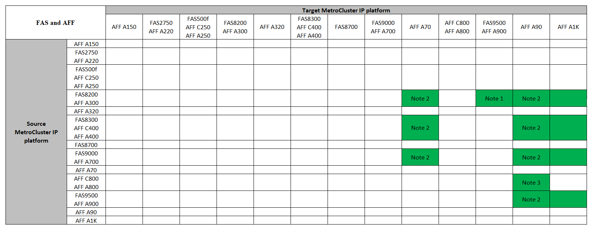

= 스위치오버 및 스위치백을 사용하여 4노드 MetroCluster IP 구성에서 "시스템 컨트롤러 교체" 명령(ONTAP 9.13.1 이상)으로 컨트롤러 업그레이드
:allow-uri-read: 
:icons: font
:imagesdir: ../media/

[role="lead"]
안내식 자동 MetroCluster 전환 작업을 사용하여 4노드 MetroCluster IP 구성에서 무중단 컨트롤러 업그레이드를 수행할 수 있습니다. 이 절차의 일부로 다른 구성 요소(예: 스토리지 쉘프 또는 스위치)를 업그레이드할 수 없습니다.

== "system controller replace" 명령을 사용하여 MetroCluster IP 컨트롤러 업그레이드를 지원했습니다

이 섹션의 MetroCluster 컨트롤러 업그레이드 표에서 * 소스 * 플랫폼을 찾습니다. 소스 * 플랫폼 행과 * 대상 * 플랫폼 열의 교차점이 비어 있으면 업그레이드가 지원되지 않습니다.

업그레이드를 시작하기 전에 다음 고려 사항을 검토하여 구성이 지원되는지 확인하십시오.

* 플랫폼이 나열되지 않은 경우 지원되는 컨트롤러 업그레이드 조합이 없습니다.
* 컨트롤러 업그레이드를 수행할 때 이전 플랫폼과 새 플랫폼 유형 * 이 다음과 일치해야 합니다 *.
+
** FAS 시스템을 FAS 시스템으로 업그레이드하거나 AFF A-Series를 AFF A-Series로 업그레이드할 수 있습니다.
** FAS 시스템을 AFF A-Series로 또는 AFF A-Series를 AFF C-Series로 업그레이드할 수 없습니다.
+
예를 들어, 업그레이드하려는 플랫폼이 FAS8200인 경우 FAS9000으로 업그레이드할 수 있습니다. FAS8200 시스템을 AFF A700 시스템으로 업그레이드할 수 없습니다.

* MetroCluster 구성의 모든 노드(이전 노드 및 새 노드)에서 동일한 ONTAP 버전을 실행해야 합니다.

.AFF 및 FAS MetroCluster IP 컨트롤러 업그레이드를 지원했습니다
다음 표는 "system controller replace" 명령을 사용하여 MetroCluster IP 구성에서 AFF 또는 FAS 시스템을 업그레이드하기 위해 지원되는 플랫폼 조합을 보여줍니다.

* 참고 1: 컨트롤러 업그레이드는 ONTAP 9.13.1 이상을 실행하는 시스템에서 지원됩니다.
* 참고 2: 컨트롤러 업그레이드가 완료될 때까지 대상 플랫폼에 내부 드라이브를 가질 수 없습니다. 업그레이드 후에 내부 드라이브를 추가할 수 있습니다.
* 참고 3: 컨트롤러 모듈을 교체해야 합니다.

.ASA MetroCluster IP 컨트롤러 업그레이드가 지원됩니다
ASA 시스템에서는 명령을 사용하여 컨트롤러를 업그레이드할 `system controller replace` 수 없습니다.

을 참조하십시오 link:https://docs.netapp.com/us-en/ontap-metrocluster/upgrade/concept_choosing_an_upgrade_method_mcc.html["업그레이드 또는 새로 고침 방법 선택"] 을 참조하십시오.

== 이 작업에 대해

* 이 절차는 컨트롤러 업그레이드에만 사용할 수 있습니다.
+
스토리지 쉘프 또는 스위치와 같은 구성의 다른 구성요소는 동시에 업그레이드할 수 없습니다.

* 업그레이드 구성에서 기존 컨트롤러 및 새 컨트롤러에서 MetroCluster IP 스위치(스위치 유형, 공급업체 및 모델) 및 펌웨어 버전을 지원해야 합니다.
+
link:https://hwu.netapp.com["NetApp Hardware Universe를 참조하십시오"^]지원되는 스위치 및 펌웨어 버전은 또는 를 link:https://imt.netapp.com/matrix/["IMT"^] 참조하십시오.

* MetroCluster 시스템은 두 사이트에서 동일한 ONTAP 버전을 실행해야 합니다.
* 이 절차를 사용하면 통계청 기반의 자동 전환 및 스위치백을 사용하여 4노드 MetroCluster IP 구성에서 컨트롤러를 업그레이드할 수 있습니다.
+

NOTE: 4노드 MetroCluster IP 구성에서는 ARL(Aggregate Relocation)을 사용하여 "system controller replace" 명령을 사용하여 업그레이드를 수행할 수 없습니다.

* 시스템에서 활성화되어 있는 link:../maintain/task-configure-encryption.html#disable-end-to-end-encryption["종단간 암호화를 비활성화합니다"] 경우 업그레이드를 수행하기 전에
* 자동 통계청 컨트롤러 업그레이드 절차를 사용하여 두 사이트의 컨트롤러를 순차적으로 업그레이드해야 합니다.
* 이 자동화된 통계청 기반의 컨트롤러 업그레이드 절차를 통해 MetroCluster 재해 복구(DR) 사이트로 컨트롤러 교체를 시작할 수 있습니다. 한 번에 한 사이트에서만 컨트롤러 교체를 시작할 수 있습니다.
* 사이트 A에서 컨트롤러 교체를 시작하려면 사이트 B에서 컨트롤러 교체 시작 명령을 실행해야 합니다 이 작업은 사이트 A에서만 두 노드의 컨트롤러를 교체할 수 있도록 안내합니다. 사이트 B에서 컨트롤러를 교체하려면 사이트 A에서 컨트롤러 교체 시작 명령을 실행해야 합니다 컨트롤러를 교체하는 사이트를 식별하는 메시지가 표시됩니다.

다음 예제 이름이 이 절차에 사용됩니다.

* 사이트_A
+
** 업그레이드 전:
+
*** 노드_A_1 - 이전
*** 노드_A_2 - 이전

** 업그레이드 후:
+
*** Node_A_1 - 신규
*** Node_A_2 - 신규

* 사이트_B
+
** 업그레이드 전:
+
*** 노드_B_1 - 이전
*** 노드_B_2 - 이전

** 업그레이드 후:
+
*** Node_B_1 - 신규
*** Node_B_2 - 신규

== 콘솔 로깅을 활성화합니다

NetApp은 사용 중인 장치에서 콘솔 로깅을 사용하도록 설정하고 이 절차를 수행할 때 다음 작업을 수행할 것을 적극 권장합니다.

* 유지 관리 중에는 AutoSupport를 활성화된 상태로 둡니다.
* 유지 관리 전후에 유지 관리 AutoSupport 메시지를 트리거하여 유지 관리 활동 기간 동안 케이스 생성을 비활성화합니다.
+
기술 자료 문서를 link:https://kb.netapp.com/Support_Bulletins/Customer_Bulletins/SU92["예약된 유지 보수 기간 동안 자동 케이스 생성을 억제하는 방법"^]참조하십시오.

* 모든 CLI 세션에 대해 세션 로깅을 설정합니다. 세션 로깅을 활성화하는 방법에 대한 지침은 기술 자료 문서의 "로깅 세션 출력" 섹션을 link:https://kb.netapp.com/on-prem/ontap/Ontap_OS/OS-KBs/How_to_configure_PuTTY_for_optimal_connectivity_to_ONTAP_systems["ONTAP 시스템에 대한 최적의 연결을 위해 PuTTY를 구성하는 방법"^]참조하십시오.

== 기존 시스템에서 필요한 부트문자를 설정합니다

AFF A70, AFF A90 또는 AFF A1K 시스템으로 업그레이드하려면 다음 단계에 따라 bootarg를 `hw.cxgbe.toe_keepalive_disable=1` 설정합니다.

CAUTION: AFF A70, AFF A90 또는 AFF A1K 시스템으로 업그레이드하려면 업그레이드를 수행하기 전에 * 이 작업을 완료해야 합니다. 이 작업 * 만 * 은 지원되는 시스템에서 AFF A70, AFF A90 또는 AFF A1K 시스템으로 업그레이드하는 경우에 적용됩니다. 다른 모든 업그레이드의 경우 이 작업을 건너뛰고 로 바로 이동할 수 있습니다 <<prepare_system_replace_upgrade,업그레이드를 준비합니다>>.

.단계
. 각 사이트에서 1개의 노드를 중지하고 HA 파트너가 노드의 스토리지 테이크오버를 수행하도록 합니다.
+
`halt  -node <node_name>`

.  `LOADER`중지된 노드의 프롬프트에서 다음을 입력합니다.
+
`setenv hw.cxgbe.toe_keepalive_disable 1`

+
'사베에프'

+
`printenv hw.cxgbe.toe_keepalive_disable`

. 노드를 부팅합니다.
+
부트 ONTAP

. 노드가 부팅되면 프롬프트에서 노드에 대해 반환 작업을 수행합니다.
+
`storage failover giveback -ofnode <node_name>`

. 업그레이드 중인 DR 그룹의 각 노드에서 단계를 반복합니다.

== 업그레이드를 준비합니다

컨트롤러 업그레이드를 준비하려면 시스템 사전 점검을 수행하고 구성 정보를 수집해야 합니다.

사전 점검을 시작하기 전에 ONTAP 중재자가 설치된 경우 자동으로 감지되어 제거됩니다. 제거를 확인하려면 사용자 이름과 암호를 입력하라는 메시지가 표시됩니다. 업그레이드를 완료하거나 사전 점검을 통과하지 못하거나 업그레이드를 진행하지 않도록 선택하는 경우 반드시 다음을 수행해야 합니다 <<man_reconfig_mediator,ONTAP 중재자를 수동으로 재구성합니다>>.

업그레이드 중 어느 단계에서든 사이트 A에서 'system controller replace show' 또는 'system controller replace show-details' 명령을 실행하여 상태를 확인할 수 있습니다. 명령이 빈 출력을 반환하는 경우 몇 분 정도 기다린 후 명령을 다시 실행합니다.

.단계
. 사이트 A에서 자동 컨트롤러 교체 절차를 시작하여 사이트 B에서 컨트롤러를 교체합니다.
+
`system controller replace start -nso true`

+
자동 작업으로 사전 점검을 실행합니다. 문제가 발견되지 않으면 작업이 일시 중지되므로 수동으로 구성 관련 정보를 수집할 수 있습니다.

+
[NOTE]
====
** 를 실행하지 않는 경우 `system controller replace start -nso true` 명령, 컨트롤러 업그레이드 절차는 MetroCluster IP 시스템의 기본 절차로 통계청 기반의 자동 전환 및 스위치백을 선택합니다.
** 현재 소스 시스템 및 호환되는 모든 타겟 시스템이 표시됩니다. 소스 컨트롤러를 다른 ONTAP 버전 또는 호환되지 않는 플랫폼으로 교체한 경우 자동화 작업이 중단되고 새 노드가 부팅된 후 오류가 보고됩니다. 클러스터를 정상 상태로 전환하려면 수동 복구 절차를 따라야 합니다.
+
'system controller replace start' 명령을 실행하면 다음과 같은 사전 검사 오류가 보고될 수 있습니다.

+
[listing]
----
Cluster-A::*>system controller replace show
Node        Status         Error-Action
----------- -------------- ------------------------------------
Node-A-1    Failed         MetroCluster check failed. Reason : MCC check showed errors in component aggregates
----
+
미러링되지 않은 애그리게이트가 있거나 다른 애그리게이트 문제로 인해 이 오류가 발생했는지 확인합니다. 미러링된 모든 애그리게이트가 정상 상태이고 성능이 저하되거나 미러 성능이 저하되지 않았는지 확인합니다. 이 오류가 미러링되지 않은 애그리게이트에만 기인하는 경우, '시스템 컨트롤러 교체 시작' 명령에서 '-skip-MetroCluster-check TRUE' 옵션을 선택하면 이 오류를 덮어쓸 수 있습니다. 원격 스토리지에 액세스할 수 있는 경우 미러링되지 않은 애그리게이트는 전환 후 온라인 상태로 전환됩니다. 원격 스토리지 링크에 장애가 발생하면 미러링되지 않은 애그리게이트가 온라인 상태가 되지 않습니다.

====
. 사이트 B에 로그인하고 'system controller replace show' 또는 'system controller replace show-details' 명령 아래 콘솔 메시지에 나열된 명령어를 수행하여 수동으로 구성정보를 수집한다.

=== 업그레이드하기 전에 정보를 수집합니다

업그레이드하기 전에 루트 볼륨이 암호화된 경우 백업 키 및 기타 정보를 수집하여 이전에 암호화된 루트 볼륨으로 새 컨트롤러를 부팅해야 합니다.

.이 작업에 대해
이 작업은 기존 MetroCluster IP 구성에서 수행됩니다.

.단계
. 새 컨트롤러를 설정할 때 케이블을 쉽게 식별할 수 있도록 기존 컨트롤러의 케이블에 레이블을 지정합니다.
. 백업 키 및 기타 정보를 캡처하는 명령을 표시합니다.
+
'시스템 컨트롤러 교체 쇼

+
파트너 클러스터의 'show' 명령 아래에 나열된 명령을 실행합니다.

+
를 클릭합니다 `show` 명령 출력에는 MetroCluster 인터페이스 IP, 시스템 ID 및 시스템 UUID가 포함된 세 개의 테이블이 표시됩니다. 이 정보는 나중에 새 노드를 부팅할 때 boots를 설정하는 절차에 필요합니다.

. MetroCluster 구성에서 노드의 시스템 ID를 수집합니다.
+
--
'MetroCluster node show-fields node-systemid, dr-partner-systemid

업그레이드 절차 중에 이러한 이전 시스템 ID를 새 컨트롤러 모듈의 시스템 ID로 교체합니다.

이 예에서 4노드 MetroCluster IP 구성의 경우 다음과 같은 이전 시스템 ID가 검색됩니다.

** NODE_A_1 - 이전: 4068741258
** NODE_A_2 - 이전: 4068741260
** NODE_B_1 - 이전: 4068741254
** NODE_B_2 - 이전: 4068741256

[listing]
----
metrocluster-siteA::> metrocluster node show -fields node-systemid,ha-partner-systemid,dr-partner-systemid,dr-auxiliary-systemid
dr-group-id        cluster           node            node-systemid     ha-partner-systemid     dr-partner-systemid    dr-auxiliary-systemid
-----------        ---------------   ----------      -------------     -------------------     -------------------    ---------------------
1                    Cluster_A       Node_A_1-old    4068741258        4068741260              4068741256             4068741256
1                    Cluster_A       Node_A_2-old    4068741260        4068741258              4068741254             4068741254
1                    Cluster_B       Node_B_1-old    4068741254        4068741256              4068741258             4068741260
1                    Cluster_B       Node_B_2-old    4068741256        4068741254              4068741260             4068741258
4 entries were displayed.
----
이 예에서는 2노드 MetroCluster IP 구성의 경우 다음과 같은 이전 시스템 ID가 검색됩니다.

** 노드_A_1:4068741258
** 노드_B_1:4068741254

[listing]
----
metrocluster node show -fields node-systemid,dr-partner-systemid

dr-group-id cluster    node          node-systemid dr-partner-systemid
----------- ---------- --------      ------------- ------------
1           Cluster_A  Node_A_1-old  4068741258    4068741254
1           Cluster_B  node_B_1-old  -             -
2 entries were displayed.
----
--
. 이전 각 노드에 대한 포트 및 LIF 정보를 수집합니다.
+
각 노드에 대해 다음 명령의 출력을 수집해야 합니다.

+
** 네트워크 인터페이스 show-role cluster, node-mgmt
** `network port show -node <node-name> -type physical`
** `network port vlan show -node <node-name>`
** `network port ifgrp show -node <node-name> -instance`
** 네트워크 포트 브로드캐스트 도메인 쇼
** 네트워크 포트 도달 가능성 세부 정보
** 네트워크 IPspace 쇼
** '볼륨 쇼'
** '스토리지 집계 쇼'
** `system node run -node <node-name> sysconfig -a`
** `aggr show -r`
** '디스크 쇼'
** `system node run <node-name> disk show`
** `vol show -fields type`
** `vol show -fields type , space-guarantee`
** 'vserver fcp initiator show'를 선택합니다
** 스토리지 디스크 쇼
** 'MetroCluster configuration-settings interface show'를 선택합니다

. MetroCluster 노드가 SAN 구성에 있는 경우 관련 정보를 수집합니다.
+
다음 명령의 출력을 수집해야 합니다.

+
** FCP 어댑터 show-instance(FCP 어댑터 show-instance)
** FCP 인터페이스의 show-instance입니다
** iSCSI 인터페이스 쇼
** 'ucadmin 쇼'

. 루트 볼륨이 암호화된 경우 키 관리자에 사용되는 암호를 수집하여 저장합니다.
+
보안 키 관리자 백업 쇼

. MetroCluster 노드가 볼륨 또는 애그리게이트에 암호화를 사용하는 경우 키 및 암호 문구를 복사합니다.
+
자세한 내용은 을 참조하십시오 https://docs.netapp.com/ontap-9/topic/com.netapp.doc.pow-nve/GUID-1677AE0A-FEF7-45FA-8616-885AA3283BCF.html["온보드 키 관리 정보를 수동으로 백업합니다"^].

+
.. Onboard Key Manager가 구성된 경우:
+
보안 키 관리자 온보드 쇼 백업

+
나중에 업그레이드 절차에서 암호가 필요합니다.

.. 엔터프라이즈 키 관리(KMIP)를 구성한 경우 다음 명령을 실행하십시오.
+
'보안 키 관리자 외부 쇼 인스턴스'

+
보안 키 관리자 키 쿼리

. 구성 정보 수집을 마친 후 작업을 다시 시작합니다.
+
시스템 컨트롤러 교체 재개

=== Tiebreaker 또는 기타 모니터링 소프트웨어에서 기존 구성을 제거합니다

전환을 시작할 수 있는 MetroCluster Tiebreaker 구성 또는 기타 타사 애플리케이션(예: ClusterLion)으로 기존 구성을 모니터링하는 경우, 이전 컨트롤러를 교체하기 전에 Tiebreaker 또는 다른 소프트웨어에서 MetroCluster 구성을 제거해야 합니다.

.단계
. link:../tiebreaker/concept_configuring_the_tiebreaker_software.html#removing-metrocluster-configurations["기존 MetroCluster 구성을 제거합니다"] Tiebreaker 소프트웨어
. 전환을 시작할 수 있는 타사 애플리케이션에서 기존 MetroCluster 구성을 제거합니다.
+
응용 프로그램 설명서를 참조하십시오.

== 이전 컨트롤러를 교체하고 새 컨트롤러를 부팅합니다

정보를 수집하고 작업을 재개한 후에는 전환 작업을 계속 진행합니다.

.이 작업에 대해
자동화 작업이 전환 작업을 시작합니다. 이러한 작업이 완료되면 * paused for user intervention * 에서 작업이 일시 중지되므로 컨트롤러를 랙에 설치하고 파트너 컨트롤러를 부팅한 다음 를 사용하여 플래시 백업에서 루트 애그리게이트 디스크를 새 컨트롤러 모듈에 다시 할당할 수 있습니다 `sysids` 앞서 모였습니다.

.시작하기 전에
전환을 시작하기 전에 자동화 작업이 일시 중지되므로 사이트 B에서 모든 LIF가 ""가동""인지 수동으로 확인할 수 있습니다 필요한 경우 'down'인 LIF를 'up'으로 가져가 'system controller replace resume' 명령을 사용하여 자동화 작업을 다시 시작합니다.

=== 이전 컨트롤러의 네트워크 구성을 준비합니다

새 컨트롤러에서 네트워킹을 처음 재개하려면 LIF 배치가 올바른지 확인하고 이전 컨트롤러의 네트워킹 구성을 제거합니다.

.이 작업에 대해
* 이 작업은 각 이전 노드에서 수행해야 합니다.
* 에서 수집한 정보를 <<prepare_system_replace_upgrade,업그레이드를 준비합니다>>사용합니다.

.단계
. 이전 노드를 부팅하고 노드에 로그인합니다.
+
부트 ONTAP

. 새 컨트롤러의 HA 인터커넥트 또는 MetroCluster IP DR 인터커넥트에 사용되는 포트와 다른 홈 포트를 사용하도록 이전 컨트롤러의 인터클러스터 LIF를 수정합니다.
+

NOTE: 이 단계는 성공적인 업그레이드를 위해 필요합니다.

+
이전 컨트롤러의 인터클러스터 LIF는 새 컨트롤러의 HA 인터커넥트 또는 MetroCluster IP DR 인터커넥트에 사용되는 포트와 다른 홈 포트를 사용해야 합니다. 예를 들어, AFF A90 컨트롤러로 업그레이드할 때 HA 인터커넥트 포트는 e1A와 e7a이고, MetroCluster IP DR 인터커넥트 포트는 e2b와 e3b입니다. 이전 컨트롤러가 포트 E1A, e7a, e2b 또는 e3b에서 호스팅되는 경우 인터클러스터 LIF를 이동해야 합니다.

+
새 노드에서의 포트 분배 및 할당은 를 https://hwu.netapp.com["NetApp Hardware Universe를 참조하십시오"]참조하십시오.

+
.. 이전 컨트롤러에서 인터클러스터 LIF를 확인하십시오.
+
`network interface show  -role intercluster`

+
이전 컨트롤러의 인터클러스터 LIF가 새 컨트롤러의 MetroCluster IP DR 인터커넥트에 사용되는 포트와 동일한 포트를 사용하는지 여부에 따라 다음 작업 중 하나를 수행합니다.

+
[cols="2*"]
|===
| 클러스터 간 LIF가 필요한 경우... | 이동... 

| 동일한 홈 포트를 사용합니다 | <<controller_replace_upgrade_prepare_network_ports_2b,하위 단계 b>> 

| 다른 홈 포트를 사용합니다 | <<controller_replace_upgrade_prepare_network_ports_3,3단계>> 
|===
.. [[controller_replace_upgrade_prepare_network_ports_2b]] 다른 홈 포트를 사용하도록 인터클러스터 LIF를 수정합니다.
+
`network interface modify -vserver <vserver> -lif <intercluster_lif> -home-port <port-not-used-for-ha-interconnect-or-mcc-ip-dr-interconnect-on-new-nodes>`

.. 모든 인터클러스터 LIF가 새 홈 포트에 설정되었는지 확인합니다.
+
`network interface show -role intercluster -is-home  false`

+
명령 출력은 모든 인터클러스터 LIF가 각 홈 포트에 있어야 한다는 것을 나타내는 비워 두어야 합니다.

.. 홈 포트에 없는 LIF가 있는 경우 다음 명령을 사용하여 되돌립니다.
+
`network interface revert -lif <intercluster_lif>`

+
홈 포트에 있지 않은 각 인터클러스터 LIF에 대해 명령을 반복하십시오.

. [[controller_replace_upgrade_prepare_network_ports_3]] 이전 컨트롤러에 있는 모든 데이터 LIF의 홈 포트를 이전 컨트롤러 모듈과 새 컨트롤러 모듈에서 모두 동일한 공통 포트에 할당합니다.
+

CAUTION: 이전 컨트롤러와 새 컨트롤러에 공통 포트가 없는 경우 데이터 LIF를 수정할 필요가 없습니다. 이 단계를 건너뛰고 바로 로 이동합니다<<upgrades_assisted_without_matching_ports,4단계>>.

+
.. LIF 표시:
+
네트워크 인터페이스 쇼

+
SAN 및 NAS를 포함한 모든 데이터 LIF는 전환 사이트(cluster_a)에 설치되므로 "가동" 및 "운영"으로 관리"됩니다.

.. 출력을 검토하여 클러스터 포트로 사용되지 않는 이전 컨트롤러와 새 컨트롤러 모두에서 동일한 일반적인 물리적 네트워크 포트를 찾습니다.
+
예를 들어, ""e0d""는 이전 컨트롤러의 물리적 포트이며 새 컨트롤러에도 존재합니다. ""e0d""는 클러스터 포트로 사용하거나 새 컨트롤러에서 사용되지 않습니다.

+
플랫폼 모델의 포트 사용은 를 참조하십시오 link:https://hwu.netapp.com/["NetApp Hardware Universe를 참조하십시오"^]

.. 공통 포트를 홈 포트로 사용하도록 모든 데이터 LIF를 수정합니다.
+
`network interface modify -vserver <svm-name> -lif <data-lif> -home-port <port-id>`

+
다음 예에서는 ""e0d""입니다.

+
예를 들면 다음과 같습니다.

+
[listing]
----
network interface modify -vserver vs0 -lif datalif1 -home-port e0d
----

. [[upgrades_assisted_without_matching_ports]] 브로드캐스트 도메인을 수정하여 삭제해야 하는 VLAN 및 물리적 포트를 제거합니다.
+
`broadcast-domain remove-ports -broadcast-domain <broadcast-domain-name>-ports <node-name:port-id>`

+
모든 VLAN 및 물리적 포트에 대해 이 단계를 반복합니다.

. 클러스터 포트를 구성원 포트로 사용하고 클러스터 포트를 구성원 포트로 사용하는 인터페이스 그룹을 사용하여 VLAN 포트를 제거합니다.
+
.. VLAN 포트 삭제:
+
`network port vlan delete -node <node-name> -vlan-name <portid-vlandid>`

+
예를 들면 다음과 같습니다.

+
[listing]
----
network port vlan delete -node node1 -vlan-name e1c-80
----
.. 인터페이스 그룹에서 물리적 포트를 제거합니다.
+
`network port ifgrp remove-port -node <node-name> -ifgrp <interface-group-name> -port <portid>`

+
예를 들면 다음과 같습니다.

+
[listing]
----
network port ifgrp remove-port -node node1 -ifgrp a1a -port e0d
----
.. 브로드캐스트 도메인에서 VLAN 및 인터페이스 그룹 포트 제거:
+
`network port broadcast-domain remove-ports -ipspace <ipspace> -broadcast-domain <broadcast-domain-name>-ports <nodename:portname,nodename:portname>,..`

.. 필요에 따라 다른 물리적 포트를 구성원으로 사용하도록 인터페이스 그룹 포트를 수정합니다.
+
`ifgrp add-port -node <node-name> -ifgrp <interface-group-name> -port <port-id>`

. 노드 중단:
+
`halt -inhibit-takeover true -node <node-name>`

+
이 단계는 두 노드에서 모두 수행해야 합니다.

. 노드가 프롬프트에 있는지 `LOADER` 확인하고 현재 환경 변수를 수집 및 유지합니다.
. bootarg 값을 수집합니다.
+
'printenv'

. 컨트롤러가 업그레이드되는 사이트에서 노드 및 쉘프의 전원을 끕니다.

=== 새 컨트롤러를 설정합니다

새 컨트롤러를 랙에 장착하고 케이블을 연결해야 합니다.

.단계
. 필요에 따라 새 컨트롤러 모듈 및 스토리지 쉘프를 포지셔닝합니다.
+
랙 공간은 컨트롤러 모듈의 플랫폼 모델, 스위치 유형 및 구성의 스토리지 쉘프 수에 따라 다릅니다.

. 적절하게 접지합니다.
. 업그레이드를 통해 컨트롤러 모듈을 교체해야 하는 경우(예: AFF 800에서 AFF A90 시스템으로 업그레이드), 컨트롤러 모듈을 교체할 때 섀시에서 컨트롤러 모듈을 분리해야 합니다. 다른 모든 업그레이드의 경우 로 <<ip_upgrades_replace_4,4단계>>건너뜁니다.
+
섀시 앞면에서 엄지 손가락으로 각 드라이브를 단단히 눌러 정지가 느껴질 때까지 밀어넣습니다. 이렇게 하면 드라이브가 섀시 중앙판에 단단히 장착되어 있음을 확인할 수 있습니다.

+
image::../media/drw_a800_drive_seated.png[는 섀시에서 컨트롤러 모듈을 분리하는 것을 보여 줍니다]

. [[IP_UPGRADE_REPLACE_4]] 컨트롤러 모듈을 설치합니다.
+

NOTE: AFF 800에서 AFF A90 시스템으로 업그레이드하는 것과 같은 컨트롤러 모듈을 교체해야 하는지 여부에 따라 설치 단계가 달라집니다.

+
[role="tabbed-block"]
====
.컨트롤러 모듈을 교체해야 하는 업그레이드
--
새 컨트롤러를 별도로 설치하는 것은 예를 들어, AFF A800 시스템에서 AFF A90 시스템으로 전환하는 것과 같이 동일한 섀시에 있는 디스크 및 컨트롤러가 있는 통합 시스템을 업그레이드하는 경우에는 적용되지 않습니다. 아래 이미지와 같이 이전 컨트롤러의 전원을 끈 후에는 새 컨트롤러 모듈과 I/O 카드를 교체해야 합니다.

다음 예제 이미지는 설명을 위한 것이며 컨트롤러 모듈과 I/O 카드는 시스템마다 다를 수 있습니다.

image::../media/a90_a70_pcm_swap.png[컨트롤러 모듈 스왑을 표시합니다]

--
.기타 모든 업그레이드
--
랙 또는 캐비닛에 컨트롤러 모듈을 설치합니다.

--
====
. 에 설명된 대로 컨트롤러의 전원, 직렬 콘솔 및 관리 연결을 케이블로 연결합니다 link:../install-ip/using_rcf_generator.html["MetroCluster IP 스위치 케이블 연결"]
+
현재 이전 컨트롤러에서 분리된 다른 케이블을 연결하지 마십시오.

+
https://docs.netapp.com/us-en/ontap-systems/index.html["ONTAP 하드웨어 시스템 설명서"^]

. 새 노드의 전원을 켜고 프롬프트가 표시되면 Ctrl-C를 누릅니다 `LOADER` .

=== 새 컨트롤러를 netboot합니다

새 노드를 설치한 후에는 Netboot를 사용하여 새 노드가 원래 노드와 동일한 버전의 ONTAP를 실행 중인지 확인해야 합니다. netboot라는 용어는 원격 서버에 저장된 ONTAP 이미지에서 부팅됨을 의미합니다. netboot를 준비할 때 시스템이 액세스할 수 있는 웹 서버에 ONTAP 9 부트 이미지 사본을 넣어야 합니다.

이 작업은 각각의 새 컨트롤러 모듈에서 수행됩니다.

.단계
. 에 액세스합니다 link:https://mysupport.netapp.com/site/["NetApp Support 사이트"^] 시스템의 Netboot 수행에 사용되는 파일을 다운로드합니다.
. NetApp Support 사이트의 소프트웨어 다운로드 섹션에서 해당 ONTAP 소프트웨어를 다운로드하고 웹 액세스 가능한 디렉토리에 ONTAP-version_image.tgz 파일을 저장합니다.
. 웹 액세스 가능 디렉터리로 이동하여 필요한 파일을 사용할 수 있는지 확인합니다.
+
디렉토리 목록에는 커널 파일 ONTAP-version_image.tgz가 있는 netboot 폴더가 포함되어야 합니다

+
ONTAP-version_image.tgz 파일은 추출할 필요가 없습니다.

.  `LOADER`프롬프트에서 관리 LIF에 대한 NetBoot 연결을 구성합니다.
+
** IP 주소 지정이 DHCP인 경우 자동 연결을 구성합니다.
+
ifconfig e0M-auto를 선택합니다

** IP 주소 지정이 정적이면 수동 연결을 구성합니다.
+
ifconfig e0M-addr=ip_addr-mask=netmask"-GW=gateway입니다

. netboot 수행
+
"netboot\http://web_server_ip/path_to_web-accessible_directory/ontap-version_image.tgz`

. 부팅 메뉴에서 옵션 * (7) 새 소프트웨어를 먼저 설치 * 를 선택하여 새 소프트웨어 이미지를 다운로드하여 부팅 장치에 설치합니다.
+
 Disregard the following message: "This procedure is not supported for Non-Disruptive Upgrade on an HA pair". It applies to nondisruptive upgrades of software, not to upgrades of controllers.
. 절차를 계속하라는 메시지가 나타나면 y를 입력하고 패키지를 입력하라는 메시지가 나타나면 이미지 파일의 URL('\http://web_server_ip/path_to_web-accessible_directory/ontap-version_image.tgz` )을 입력합니다
+
....
Enter username/password if applicable, or press Enter to continue.
....
. 다음과 유사한 프롬프트가 표시되면 백업 복구를 건너뛰려면 "n"을 입력해야 합니다.
+
....
Do you want to restore the backup configuration now? {y|n}
....
. 다음과 유사한 프롬프트가 나타나면 y를 입력하여 재부팅합니다.
+
....
The node must be rebooted to start using the newly installed software. Do you want to reboot now? {y|n}
....

=== 컨트롤러 모듈의 구성을 지웁니다

[role="lead"]
MetroCluster 구성에서 새 컨트롤러 모듈을 사용하기 전에 기존 구성을 지워야 합니다.

.단계
. 필요한 경우 노드를 중지하고 로더 프롬프트를 표시합니다.
+
"중지"

. LOADER 프롬프트에서 환경 변수를 기본값으로 설정합니다.
+
세트 기본값

. 환경 저장:
+
'사베에프'

. LOADER 프롬프트에서 부팅 메뉴를 시작합니다.
+
boot_ontap 메뉴

. 부팅 메뉴 프롬프트에서 구성을 지웁니다.
+
휘폰무화과

+
확인 프롬프트에 yes로 응답합니다.

+
노드가 재부팅되고 부팅 메뉴가 다시 표시됩니다.

. 부팅 메뉴에서 옵션 * 5 * 를 선택하여 시스템을 유지보수 모드로 부팅합니다.
+
확인 프롬프트에 yes로 응답합니다.

=== HBA 구성을 복구합니다

컨트롤러 모듈에 있는 HBA 카드의 존재 여부와 구성에 따라 사이트 용도에 맞게 HBA 카드를 올바르게 구성해야 합니다.

.단계
. 유지 관리 모드에서 시스템의 모든 HBA에 대한 설정을 구성합니다.
+
.. 포트의 현재 설정을 확인합니다. 'ucadmin show'
.. 필요에 따라 포트 설정을 업데이트합니다.

+
|===

| 이 유형의 HBA와 원하는 모드가 있는 경우... | 이 명령 사용... 

 a| 
CNA FC
 a| 
`ucadmin modify -m fc -t initiator <adapter-name>`

 a| 
CNA 이더넷
 a| 
`ucadmin modify -mode cna <adapter-name>`

 a| 
FC 타겟
 a| 
`fcadmin config -t target <adapter-name>`

 a| 
FC 이니시에이터
 a| 
`fcadmin config -t initiator <adapter-name>`

|===
. 유지 관리 모드 종료:
+
"중지"

+
명령을 실행한 후 프롬프트에서 노드가 멈출 때까지 `LOADER` 기다립니다.

. 노드를 유지보수 모드로 다시 부팅하여 구성 변경 사항이 적용되도록 합니다.
+
boot_ONTAP maint를 선택합니다

. 변경 사항을 확인합니다.
+
|===

| 이 유형의 HBA가 있는 경우... | 이 명령 사용... 

 a| 
CNA
 a| 
'ucadmin 쇼'

 a| 
FC
 a| 
fcadmin 쇼

|===

=== 새 컨트롤러 및 섀시에서 HA 상태를 설정합니다

컨트롤러 및 섀시의 HA 상태를 확인하고, 필요한 경우 시스템 구성에 맞게 상태를 업데이트해야 합니다.

.단계
. 유지보수 모드에서 컨트롤러 모듈 및 섀시의 HA 상태를 표시합니다.
+
하구성 쇼

+
모든 부품의 HA 상태는 'mcip'이어야 한다.

. 컨트롤러 또는 섀시의 시스템 상태가 표시되지 않으면 HA 상태를 설정합니다.
+
ha-config modify controller mcip.(컨트롤러 mccip 수정

+
ha-config modify chassis mccip.(섀시 mcip 수정

. NS224 쉘프 또는 스토리지 스위치에 연결된 이더넷 포트를 확인하고 수정합니다.
+
.. NS224 쉘프 또는 스토리지 스위치에 연결된 이더넷 포트를 확인합니다.
+
`storage port show`

.. 스토리지 및 클러스터의 공유 스위치를 포함하여 이더넷 쉘프 또는 스토리지 스위치에 연결된 모든 이더넷 포트를 모드로 설정합니다 `storage` .
+
`storage port modify -p <port> -m storage`

+
예:

+
[listing]
----
*> storage port modify -p e5b -m storage
Changing NVMe-oF port e5b to storage mode
----
+

NOTE: 업그레이드를 성공적으로 수행하려면 영향을 받는 모든 포트에 이 설정을 설정해야 합니다.

+
이더넷 포트에 연결된 쉘프의 디스크는 출력에 보고됩니다. `sysconfig -v`

+
업그레이드할 시스템의 스토리지 포트에 대한 자세한 내용은 을 link:https://hwu.netapp.com["NetApp Hardware Universe를 참조하십시오"^] 참조하십시오.

.. 모드가 설정되어 있는지 `storage` 확인하고 포트가 온라인 상태인지 확인합니다.
+
`storage port show`

. 노드를 정지시킵니다
+
LOADER> 프롬프트에서 노드가 정지되어야 합니다.

. 각 노드에서 시스템 날짜, 시간 및 시간대를 '날짜 표시'로 확인합니다
. 필요한 경우 UTC 또는 GMT:'SET DATE<MM/dd/yyyy>'로 날짜를 설정합니다
. 부팅 환경 프롬프트에서 'show time'을 사용하여 시간을 확인한다
. 필요한 경우 시간을 UTC 또는 GMT:'설정 시간<hh:mm:ss>'로 설정합니다
. 'Saveenv' 설정을 저장합니다
. 환경 변수(printenv)를 수집합니다

=== 새로운 플랫폼을 수용하기 위해 스위치 RCF 파일을 업데이트합니다

새 플랫폼 모델을 지원하는 구성으로 스위치를 업데이트해야 합니다.

.이 작업에 대해
현재 업그레이드 중인 컨트롤러가 포함된 사이트에서 이 작업을 수행합니다. 이 절차의 예에서는 먼저 site_B를 업그레이드하고 있습니다.

site_a의 컨트롤러가 업그레이드되면 site_a의 스위치가 업그레이드됩니다.

.단계
. 새로운 RCF 파일 적용을 위한 IP 스위치를 준비합니다.
+
해당 스위치 공급업체에 대한 섹션의 단계를 따릅니다.

+
** link:../install-ip/task_switch_config_broadcom.html#resetting-the-broadcom-ip-switch-to-factory-defaults["Broadcom IP 스위치를 출하 시 기본값으로 재설정합니다"]
** link:../install-ip/task_switch_config_cisco.html#resetting-the-cisco-ip-switch-to-factory-defaults["Cisco IP 스위치를 출하 시 기본값으로 재설정합니다"]
** link:../install-ip/task_switch_config_nvidia.html#reset-the-nvidia-ip-sn2100-switch-to-factory-defaults["NVIDIA IP SN2100 스위치를 출하 시 기본값으로 재설정합니다"]

. RCF 파일을 다운로드하고 설치합니다.
+
해당 스위치 공급업체에 대한 섹션의 단계를 따릅니다.

+
** link:../install-ip/task_switch_config_broadcom.html#downloading-and-installing-the-broadcom-rcf-files["Broadcom RCF 파일을 다운로드하여 설치합니다"]
** link:../install-ip/task_switch_config_cisco.html#downloading-and-installing-the-cisco-ip-rcf-files["Cisco IP RCF 파일을 다운로드하고 설치합니다"]
** link:../install-ip/task_switch_config_nvidia.html#download-and-install-the-nvidia-rcf-files["NVIDIA IP RCF 파일을 다운로드하고 설치합니다"]

=== MetroCluster IP bootarg 변수를 설정합니다

특정 MetroCluster IP bootarg 값은 새 컨트롤러 모듈에서 구성해야 합니다. 이 값은 이전 컨트롤러 모듈에 구성된 값과 일치해야 합니다.

.이 작업에 대해
이 작업에서는 의 업그레이드 절차에서 앞서 확인한 UUID 및 시스템 ID를 <<gather_info_system_replace,업그레이드하기 전에 정보를 수집합니다>>사용합니다.

.단계
. LOADER> 프롬프트에서 다음 boots를 site_B의 새 노드에 설정합니다.
+
`setenv bootarg.mcc.port_a_ip_config <local-IP-address/local-IP-mask,0,HA-partner-IP-address,DR-partner-IP-address,DR-aux-partnerIP-address,vlan-id>`

+
`setenv bootarg.mcc.port_b_ip_config <local-IP-address/local-IP-mask,0,HA-partner-IP-address,DR-partner-IP-address,DR-aux-partnerIP-address,vlan-id>`

+
다음 예에서는 첫 번째 네트워크에 VLAN 120을 사용하고 두 번째 네트워크에 대해 VLAN 130을 사용하여 node_B_1에 대한 값을 설정합니다.

+
[listing]
----
setenv bootarg.mcc.port_a_ip_config 172.17.26.10/23,0,172.17.26.11,172.17.26.13,172.17.26.12,120
setenv bootarg.mcc.port_b_ip_config 172.17.27.10/23,0,172.17.27.11,172.17.27.13,172.17.27.12,130
----
+
다음 예에서는 첫 번째 네트워크에 VLAN 120을 사용하고 두 번째 네트워크에 대해 VLAN 130을 사용하여 node_B_2에 대한 값을 설정합니다.

+
[listing]
----
setenv bootarg.mcc.port_a_ip_config 172.17.26.11/23,0,172.17.26.10,172.17.26.12,172.17.26.13,120
setenv bootarg.mcc.port_b_ip_config 172.17.27.11/23,0,172.17.27.10,172.17.27.12,172.17.27.13,130
----
+
다음 예에서는 모든 MetroCluster IP DR 연결에 기본 VLAN을 사용하여 node_B_1의 값을 설정합니다.

+
[listing]
----
setenv bootarg.mcc.port_a_ip_config
172.17.26.10/23,0,172.17.26.11,172.17.26.13,172.17.26.12
setenv bootarg.mcc.port_b_ip_config
172.17.27.10/23,0,172.17.27.11,172.17.27.13,172.17.27.12
----
+
다음 예에서는 모든 MetroCluster IP DR 연결에 기본 VLAN을 사용하여 node_B_2의 값을 설정합니다.

+
[listing]
----
setenv bootarg.mcc.port_a_ip_config
172.17.26.11/23,0,172.17.26.10,172.17.26.12,172.17.26.13
setenv bootarg.mcc.port_b_ip_config
172.17.27.11/23,0,172.17.27.10,172.17.27.12,172.17.27.13
----
. 새 노드의 'LOADER' 프롬프트에서 UUID를 설정합니다.
+
`setenv bootarg.mgwd.partner_cluster_uuid <partner-cluster-UUID>`

+
`setenv bootarg.mgwd.cluster_uuid <local-cluster-UUID>`

+
`setenv bootarg.mcc.pri_partner_uuid <DR-partner-node-UUID>`

+
`setenv bootarg.mcc.aux_partner_uuid <DR-aux-partner-node-UUID>`

+
`setenv bootarg.mcc_iscsi.node_uuid <local-node-UUID>`

+
.. node_B_1에서 UUID를 설정합니다.
+
다음 예에서는 node_B_1에서 UUID를 설정하기 위한 명령을 보여 줍니다.

+
[listing]
----
setenv bootarg.mgwd.cluster_uuid ee7db9d5-9a82-11e7-b68b-00a098908039
setenv bootarg.mgwd.partner_cluster_uuid 07958819-9ac6-11e7-9b42-00a098c9e55d
setenv bootarg.mcc.pri_partner_uuid f37b240b-9ac1-11e7-9b42-00a098c9e55d
setenv bootarg.mcc.aux_partner_uuid bf8e3f8f-9ac4-11e7-bd4e-00a098ca379f
setenv bootarg.mcc_iscsi.node_uuid f03cb63c-9a7e-11e7-b68b-00a098908039
----
.. node_B_2에서 UUID 설정:
+
다음 예에서는 node_B_2에서 UUID를 설정하기 위한 명령을 보여 줍니다.

+
[listing]
----
setenv bootarg.mgwd.cluster_uuid ee7db9d5-9a82-11e7-b68b-00a098908039
setenv bootarg.mgwd.partner_cluster_uuid 07958819-9ac6-11e7-9b42-00a098c9e55d
setenv bootarg.mcc.pri_partner_uuid bf8e3f8f-9ac4-11e7-bd4e-00a098ca379f
setenv bootarg.mcc.aux_partner_uuid f37b240b-9ac1-11e7-9b42-00a098c9e55d
setenv bootarg.mcc_iscsi.node_uuid aa9a7a7a-9a81-11e7-a4e9-00a098908c35
----

. 가동 중인 사이트에서 다음 명령을 실행하여 원래 시스템이 ADP(Advanced Drive Partitioning)용으로 구성되었는지 확인합니다.
+
'디스크 쇼'

+
ADP가 구성된 경우 "컨테이너 유형" 열에 출력에 "공유"가 `disk show` 표시됩니다. "컨테이너 유형"에 다른 값이 있으면 ADP가 시스템에 구성되지 않습니다. 다음 출력 예는 ADP로 구성된 시스템을 보여 줍니다.

+
[listing]
----
::> disk show
                    Usable               Disk    Container   Container
Disk                Size       Shelf Bay Type    Type        Name      Owner

Info: This cluster has partitioned disks. To get a complete list of spare disk
      capacity use "storage aggregate show-spare-disks".
----------------    ---------- ----- --- ------- ----------- --------- --------
1.11.0              894.0GB    11    0   SSD      shared     testaggr  node_A_1
1.11.1              894.0GB    11    1   SSD      shared     testaggr  node_A_1
1.11.2              894.0GB    11    2   SSD      shared     testaggr  node_A_1
----
. 원래 시스템이 ADP용으로 구성된 경우 교체 노드의 각 `LOADER` 프롬프트에서 ADP를 사용하도록 설정합니다.
+
'etenv bootarg.MCC.adp_enabled true'

. 다음 변수를 설정합니다.
+
`setenv bootarg.mcc.local_config_id <original-sys-id>`

+
`setenv bootarg.mcc.dr_partner <dr-partner-sys-id>`

+

NOTE: 를 클릭합니다 `setenv bootarg.mcc.local_config_id` 변수를 * Original * 컨트롤러 모듈 node_B_1의 sys-id로 설정해야 합니다.

+
.. node_B_1에서 변수를 설정합니다.
+
다음 예제는 node_B_1에서 값을 설정하는 명령을 보여 줍니다.

+
[listing]
----
setenv bootarg.mcc.local_config_id 537403322
setenv bootarg.mcc.dr_partner 537403324
----
.. node_B_2에서 변수를 설정합니다.
+
다음 예제는 node_B_2에서 값을 설정하는 명령을 보여 줍니다.

+
[listing]
----
setenv bootarg.mcc.local_config_id 537403321
setenv bootarg.mcc.dr_partner 537403323
----

. 외부 키 관리자와 함께 암호화를 사용하는 경우 필요한 boots를 설정합니다.
+
세테네 bootarg.kmip.init.ipaddr`

+
세테네 bootarg.kmip.kmip.init.netmask`

+
세테네 bootarg.kmip.kmip.init.gateway`

+
세테네 bootarg.kmip.kmip.init.interface`

=== 루트 애그리게이트 디스크를 재할당합니다

앞에서 수집한 'sids'를 사용하여 루트 애그리게이트 디스크를 새 컨트롤러 모듈에 다시 할당합니다

.이 작업에 대해
이 작업은 유지보수 모드에서 수행됩니다.

이전 시스템 ID는 에서 식별되었습니다. <<gather_info_system_replace,업그레이드하기 전에 정보를 수집합니다>>

이 절차의 예는 다음과 같은 시스템 ID가 있는 컨트롤러를 사용합니다.

|===

| 노드 | 이전 시스템 ID입니다 | 새 시스템 ID입니다 

 a| 
노드_B_1
 a| 
4068741254)를 참조하십시오
 a| 
1574774970

|===
.단계
. 다른 모든 연결을 새 컨트롤러 모듈(FC-VI, 스토리지, 클러스터 인터커넥트 등)에 케이블로 연결합니다.
. 시스템을 중지하고 "Loader(로더)" 프롬프트에서 유지보수 모드로 부팅합니다.
+
boot_ONTAP maint를 선택합니다

. node_B_1-old가 소유한 디스크를 표시합니다.
+
'디스크 쇼-A'

+
명령 출력에는 새 컨트롤러 모듈의 시스템 ID(1574774970)가 표시됩니다. 그러나 루트 애그리게이트 디스크는 여전히 이전 시스템 ID(4068741254)가 소유합니다. 이 예는 MetroCluster 구성에서 다른 노드가 소유한 드라이브를 표시하지 않습니다.

+

CAUTION: 디스크 재할당을 진행하기 전에 노드의 루트 애그리게이트에 속한 pool0 및 pool1 디스크가 출력에 표시되는지 확인해야 `disk show` 합니다. 다음 예제에서 출력에는 node_B_1-old가 소유한 pool0 및 pool1 디스크가 나열됩니다.

+
[listing]
----
*> disk show -a
Local System ID: 1574774970

  DISK         OWNER                     POOL   SERIAL NUMBER    HOME                      DR HOME
------------   -------------             -----  -------------    -------------             -------------
...
rr18:9.126L44 node_B_1-old(4068741254)   Pool1  PZHYN0MD         node_B_1-old(4068741254)  node_B_1-old(4068741254)
rr18:9.126L49 node_B_1-old(4068741254)   Pool1  PPG3J5HA         node_B_1-old(4068741254)  node_B_1-old(4068741254)
rr18:8.126L21 node_B_1-old(4068741254)   Pool1  PZHTDSZD         node_B_1-old(4068741254)  node_B_1-old(4068741254)
rr18:8.126L2  node_B_1-old(4068741254)   Pool0  S0M1J2CF         node_B_1-old(4068741254)  node_B_1-old(4068741254)
rr18:8.126L3  node_B_1-old(4068741254)   Pool0  S0M0CQM5         node_B_1-old(4068741254)  node_B_1-old(4068741254)
rr18:9.126L27 node_B_1-old(4068741254)   Pool0  S0M1PSDW         node_B_1-old(4068741254)  node_B_1-old(4068741254)
...
----
. 드라이브 쉘프의 루트 애그리게이트 디스크를 새 컨트롤러에 재할당합니다.
+
`disk reassign -s <old-sysid> -d <new-sysid>`

+

NOTE: MetroCluster IP 시스템에 고급 디스크 파티셔닝이 구성되어 있는 경우 을 실행하여 DR 파트너 시스템 ID를 포함해야 합니다 `disk reassign -s old-sysid -d new-sysid -r dr-partner-sysid` 명령.

+
다음 예는 드라이브 재할당을 보여 줍니다.

+
[listing]
----
*> disk reassign -s 4068741254 -d 1574774970
Partner node must not be in Takeover mode during disk reassignment from maintenance mode.
Serious problems could result!!
Do not proceed with reassignment if the partner is in takeover mode. Abort reassignment (y/n)? n

After the node becomes operational, you must perform a takeover and giveback of the HA partner node to ensure disk reassignment is successful.
Do you want to continue (y/n)? Jul 14 19:23:49 [localhost:config.bridge.extra.port:error]: Both FC ports of FC-to-SAS bridge rtp-fc02-41-rr18:9.126L0 S/N [FB7500N107692] are attached to this controller.
y
Disk ownership will be updated on all disks previously belonging to Filer with sysid 4068741254.
Do you want to continue (y/n)? y
----
. 모든 디스크가 예상대로 재할당되었는지 확인합니다.
+
'디스크 쇼'

+
[listing]
----
*> disk show
Local System ID: 1574774970

  DISK        OWNER                      POOL   SERIAL NUMBER   HOME                      DR HOME
------------  -------------              -----  -------------   -------------             -------------
rr18:8.126L18 node_B_1-new(1574774970)   Pool1  PZHYN0MD        node_B_1-new(1574774970)  node_B_1-new(1574774970)
rr18:9.126L49 node_B_1-new(1574774970)   Pool1  PPG3J5HA        node_B_1-new(1574774970)  node_B_1-new(1574774970)
rr18:8.126L21 node_B_1-new(1574774970)   Pool1  PZHTDSZD        node_B_1-new(1574774970)  node_B_1-new(1574774970)
rr18:8.126L2  node_B_1-new(1574774970)   Pool0  S0M1J2CF        node_B_1-new(1574774970)  node_B_1-new(1574774970)
rr18:9.126L29 node_B_1-new(1574774970)   Pool0  S0M0CQM5        node_B_1-new(1574774970)  node_B_1-new(1574774970)
rr18:8.126L1  node_B_1-new(1574774970)   Pool0  S0M1PSDW        node_B_1-new(1574774970)  node_B_1-new(1574774970)
*>
----
. 집계 상태를 표시합니다.
+
'기정 상태'입니다

+
[listing]
----
*> aggr status
           Aggr            State       Status           Options
aggr0_node_b_1-root        online      raid_dp, aggr    root, nosnap=on,
                           mirrored                     mirror_resync_priority=high(fixed)
                           fast zeroed
                           64-bit
----
. 파트너 노드에서 위 단계를 반복합니다(node_B_2 - new).

=== 새 컨트롤러를 부팅합니다

컨트롤러 플래시 이미지를 업데이트하려면 부팅 메뉴에서 컨트롤러를 재부팅해야 합니다. 암호화가 구성된 경우 추가 단계가 필요합니다.

VLAN 및 인터페이스 그룹을 재구성할 수 있습니다. 필요한 경우 'system controller replace resume' 명령을 사용하여 작업을 재개하기 전에 클러스터 LIF의 포트를 수동으로 수정하고 도메인 세부 정보를 브로드캐스트합니다.

.이 작업에 대해
이 작업은 모든 새 컨트롤러에 대해 수행해야 합니다.

.단계
. 노드 중단:
+
"중지"

. 외부 키 관리자가 구성된 경우 관련 boots를 설정합니다.
+
`setenv bootarg.kmip.init.ipaddr <ip-address>`

+
`setenv bootarg.kmip.init.netmask <netmask>`

+
`setenv bootarg.kmip.init.gateway <gateway-address>`

+
`setenv bootarg.kmip.init.interface <interface-id>`

. 부팅 메뉴를 표시합니다.
+
boot_ontap 메뉴

. 루트 암호화를 사용하는 경우 키 관리 구성에 대한 부팅 메뉴 옵션을 선택합니다.
+
|===

| 사용 중인 경우... | 이 부팅 메뉴 옵션을 선택합니다... 

 a| 
온보드 키 관리
 a| 
옵션 "'10'"

프롬프트에 따라 키 관리자 구성을 복구 및 복원하는 데 필요한 입력을 제공합니다.

 a| 
외부 키 관리
 a| 
옵션 "'11'"

프롬프트에 따라 키 관리자 구성을 복구 및 복원하는 데 필요한 입력을 제공합니다.

|===
. 부팅 메뉴에서 ""6"" 옵션을 실행합니다.
+

NOTE: 옵션 ""6"은 완료되기 전에 노드를 두 번 재부팅합니다.

+
시스템 ID 변경 프롬프트에 ""y""를 응답합니다. 두 번째 재부팅 메시지가 나타날 때까지 기다립니다.

+
[listing]
----
Successfully restored env file from boot media...

Rebooting to load the restored env file...
----
+
옵션 ""6"" 후 재부팅 중 하나가 진행되는 동안 확인 메시지가 표시됩니다 `Override system ID? {y|n}` 나타납니다. 를 입력합니다 `y`.

. 루트 암호화를 사용하는 경우 키 관리 구성에 대해 부팅 메뉴 옵션을 다시 선택합니다.
+
|===

| 사용 중인 경우... | 이 부팅 메뉴 옵션을 선택합니다... 

 a| 
온보드 키 관리
 a| 
옵션 "'10'"

프롬프트에 따라 키 관리자 구성을 복구 및 복원하는 데 필요한 입력을 제공합니다.

 a| 
외부 키 관리
 a| 
옵션 "'11'"

프롬프트에 따라 키 관리자 구성을 복구 및 복원하는 데 필요한 입력을 제공합니다.

|===
+
키 관리자 설정에 따라 첫 번째 부팅 메뉴 프롬프트에서 옵션 ""10"" 또는 옵션 ""11", 옵션 ""6""을 차례로 선택하여 복구 절차를 수행합니다. 노드를 완전히 부팅하려면 옵션 ""1"(일반 부팅)에서 계속 진행하는 복구 절차를 반복해야 할 수 있습니다.

. 노드를 부팅합니다.
+
부트 ONTAP

. 교체된 노드가 부팅될 때까지 기다립니다.
+
두 노드 중 하나가 Takeover 모드에 있으면 'storage failover 반환' 명령을 사용하여 Giveback을 수행합니다.

. 모든 포트가 브로드캐스트 도메인에 있는지 확인합니다.
+
.. 브로드캐스트 도메인 보기:
+
네트워크 포트 브로드캐스트 도메인 쇼

.. 새로 업그레이드된 컨트롤러의 데이터 포트에 대해 새 브로드캐스트 도메인이 생성된 경우 브로드캐스트 도메인을 삭제합니다.
+

NOTE: 새 브로드캐스트 도메인만 삭제합니다. 업그레이드를 시작하기 전에 있던 브로드캐스트 도메인을 삭제하지 마십시오.

+
`broadcast-domain delete -broadcast-domain <broadcast_domain_name>`

.. 필요에 따라 브로드캐스트 도메인에 포트를 추가합니다.
+
https://docs.netapp.com/ontap-9/topic/com.netapp.doc.dot-cm-nmg/GUID-003BDFCD-58A3-46C9-BF0C-BA1D1D1475F9.html["브로드캐스트 도메인에서 포트 추가 또는 제거"^]

.. 인터클러스터 LIF를 호스팅할 물리적 포트를 해당 브로드캐스트 도메인에 추가합니다.
.. 새 물리적 포트를 홈 포트로 사용하도록 인터클러스터 LIF를 수정합니다.
.. 인터클러스터 LIF가 가동된 후 클러스터 피어 상태를 확인하고 필요에 따라 클러스터 피어링을 다시 설정합니다.
+
클러스터 피어링을 다시 구성해야 할 수 있습니다.

+
link:../install-ip/task_sw_config_configure_clusters.html#peering-the-clusters["클러스터 피어 관계 생성"]

.. 필요에 따라 VLAN 및 인터페이스 그룹을 다시 생성합니다.
+
VLAN 및 인터페이스 그룹 멤버쉽은 이전 노드의 멤버쉽과 다를 수 있습니다.

+
https://docs.netapp.com/ontap-9/topic/com.netapp.doc.dot-cm-nmg/GUID-8929FCE2-5888-4051-B8C0-E27CAF3F2A63.html["VLAN을 생성하는 중입니다"^]

+
https://docs.netapp.com/ontap-9/topic/com.netapp.doc.dot-cm-nmg/GUID-DBC9DEE2-EAB7-430A-A773-4E3420EE2AA1.html["물리적 포트를 결합하여 인터페이스 그룹을 생성합니다"^]

.. 파트너 클러스터에 연결할 수 있고 구성이 파트너 클러스터에서 성공적으로 재동기화되었는지 확인합니다.
+
`metrocluster switchback -simulate true`

. 암호화가 사용되는 경우 키 관리 구성에 맞는 명령을 사용하여 키를 복원합니다.
+
|===

| 사용 중인 경우... | 이 명령 사용... 

 a| 
온보드 키 관리
 a| 
보안 키매니저 온보드 동기화

자세한 내용은 을 참조하십시오 https://docs.netapp.com/ontap-9/topic/com.netapp.doc.pow-nve/GUID-E4AB2ED4-9227-4974-A311-13036EB43A3D.html["온보드 키 관리 암호화 키를 복원하는 중입니다"^].

 a| 
외부 키 관리
 a| 
`security key-manager external restore -vserver <svm-name> -node <node-name> -key-server <host_name|IP_address:port> -key-id <key_id> -key-tag key_tag <node-name>`

자세한 내용은 을 참조하십시오 https://docs.netapp.com/ontap-9/topic/com.netapp.doc.pow-nve/GUID-32DA96C3-9B04-4401-92B8-EAF323C3C863.html["외부 키 관리 암호화 키 복원"^].

|===
. MetroCluster가 올바르게 구성되어 있는지 확인합니다. 노드 상태 확인:
+
'MetroCluster node show'

+
새 노드(site_B)가 site_A에서 스위치백 상태 * 를 기다리는 * 상태인지 확인합니다

=== LIF 구성을 확인 및 복원합니다

자동 스위치백 작업을 진행하기 전에 LIF가 적절한 노드에 호스팅되는지 확인하십시오.

.이 작업에 대해
* 이 작업은 site_B에서 수행됩니다

CAUTION: 스위치백을 수행하기 전에 데이터 LIF 위치가 새 노드에서 올바른지 확인해야 합니다. 구성을 다시 전환하면 ONTAP은 LIF에서 사용하는 홈 포트에서 트래픽을 다시 시작하려고 합니다. 스위치 포트 및 VLAN에 대한 홈 포트 연결이 잘못되면 I/O 장애가 발생할 수 있습니다.

.단계
. 스위치백 전에 LIF가 적절한 노드 및 포트에서 호스팅되는지 확인합니다.
+
.. 고급 권한 레벨로 변경:
+
세트 프리빌리지 고급

.. LIF를 표시하고 각 데이터 LIF가 올바른 홈 포트를 사용 중인지 확인합니다.
+
네트워크 인터페이스 쇼

.. 올바른 홈 포트를 사용하고 있지 않은 LIF를 수정합니다.
+
`network interface modify -vserver <svm-name> -lif <data-lif> -home-port <port-id>`

+
명령에서 오류가 반환되면 포트 구성을 재정의할 수 있습니다.

+
`vserver config override -command "network interface modify -vserver <svm-name> -home-port <active_port_after_upgrade> -lif <lif_name> -home-node <new_node_name>"`

+
'vserver config override' 명령 내에서 network interface modify 명령을 입력할 때는 tab autotcomplete 기능을 사용할 수 없습니다. 자동 완성 기능을 사용하여 네트워크 'interface modify'를 만든 다음 'vserver config override' 명령에 포함할 수 있습니다.

.. 모든 데이터 LIF가 이제 올바른 홈 포트에 있는지 확인합니다.
+
네트워크 인터페이스 쇼

.. 관리자 권한 레벨로 돌아갑니다.
+
'Set-Privilege admin'입니다

. 인터페이스를 홈 노드로 되돌리기:
+
`network interface revert * -vserver <svm-name>`

+
필요에 따라 모든 SVM에서 이 단계를 수행합니다.

. 작업을 다시 시작합니다.
+
시스템 컨트롤러 교체 재개

== 업그레이드를 완료합니다

자동화 작업은 검증 시스템 검사를 실행한 다음 일시 중지하여 네트워크 연결 상태를 확인할 수 있습니다. 확인 후 리소스 다시 찾기 단계가 시작되고 자동화 작업이 사이트 A에서 스위치백을 실행하고 업그레이드 후 확인 시 일시 중지됩니다. 자동화 작업을 다시 시작하면 업그레이드 후 검사가 수행되고 오류가 발견되지 않으면 업그레이드가 완료된 것으로 표시됩니다.

.단계
. 콘솔 메시지를 따라 네트워크 연결 상태를 확인합니다.
. 검증을 완료한 후 작업을 다시 시작합니다.
+
시스템 컨트롤러 교체 재개

. 자동화 작업이 수행됩니다 `heal-aggregate`, `heal-root-aggregate`사이트 A의 스위치백 작업과 업그레이드 후 점검 작업을 수행할 수 있습니다. 작업이 일시 중지되면 SAN LIF 상태를 수동으로 확인하고 콘솔 메시지에 따라 네트워크 구성을 확인합니다.
. 검증을 완료한 후 작업을 다시 시작합니다.
+
시스템 컨트롤러 교체 재개

. 업그레이드 후 점검 상태 확인:
+
'시스템 컨트롤러 교체 쇼

+
업그레이드 후 검사에서 오류가 보고되지 않으면 업그레이드가 완료된 것입니다.

. 컨트롤러 업그레이드를 완료한 후 사이트 B에 로그인하여 교체된 컨트롤러가 올바르게 구성되었는지 확인합니다.

=== ONTAP 중재자를 재구성합니다

업그레이드를 시작하기 전에 자동으로 제거된 ONTAP 중재자를 수동으로 구성합니다.

. 의 단계를 사용합니다 link:../install-ip/task_configuring_the_ontap_mediator_service_from_a_metrocluster_ip_configuration.html["MetroCluster IP 구성에서 ONTAP 중재자 서비스를 구성합니다"].

=== Tiebreaker 모니터링을 복원합니다

이전에 Tiebreaker 소프트웨어를 통해 모니터링하도록 MetroCluster 구성을 구성한 경우 Tiebreaker 연결을 복원할 수 있습니다.

. 의 단계를 사용합니다 http://docs.netapp.com/ontap-9/topic/com.netapp.doc.hw-metrocluster-tiebreaker/GUID-7259BCA4-104C-49C6-BAD0-1068CA2A3DA5.html["MetroCluster 구성 추가"].

=== 엔드 투 엔드 암호화 구성

시스템에서 지원되는 경우, nvlog 및 스토리지 복제 데이터와 같은 백엔드 트래픽을 MetroCluster IP 사이트 간에 암호화할 수 있습니다. 을 참조하십시오 link:../maintain/task-configure-encryption.html["엔드 투 엔드 암호화 구성"] 를 참조하십시오.
