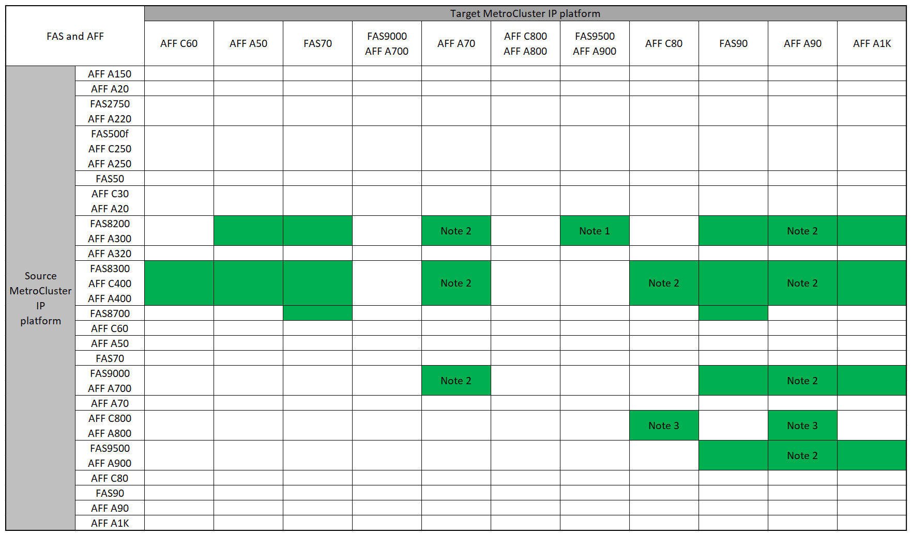

= "system controller replace" 명령을 사용하여 MetroCluster IP 컨트롤러 업그레이드를 지원했습니다
:allow-uri-read: 
:icons: font
:imagesdir: ../media/

[role="lead"]
MetroCluster IP 컨트롤러 업그레이드를 시작하기 전에 업그레이드 조합이 지원되는지 확인해야 합니다.

이 섹션의 MetroCluster 컨트롤러 업그레이드 표에서 * 소스 * 플랫폼을 찾습니다. 소스 * 플랫폼 행과 * 대상 * 플랫폼 열의 교차점이 비어 있으면 업그레이드가 지원되지 않습니다.

업그레이드를 시작하기 전에 다음 고려 사항을 검토하여 구성이 지원되는지 확인하십시오.

* 플랫폼이 나열되지 않은 경우 지원되는 컨트롤러 업그레이드 조합이 없습니다.
* 컨트롤러 업그레이드를 수행할 때 이전 플랫폼과 새 플랫폼 유형 * 이 다음과 일치해야 합니다 *.
+
** FAS 시스템을 FAS 시스템으로 업그레이드하거나 AFF A-Series를 AFF A-Series로 업그레이드할 수 있습니다.
** FAS 시스템을 AFF A-Series로 또는 AFF A-Series를 AFF C-Series로 업그레이드할 수 없습니다.
+
예를 들어, 업그레이드하려는 플랫폼이 FAS8200인 경우 FAS9000으로 업그레이드할 수 있습니다. FAS8200 시스템을 AFF A700 시스템으로 업그레이드할 수 없습니다.

* MetroCluster 구성의 모든 노드(이전 노드 및 새 노드)에서 동일한 ONTAP 버전을 실행해야 합니다. 해당 조합에 대해 지원되는 최소 ONTAP 버전은 를 link:https://hwu.netapp.com["Hardware Universe"^]참조하십시오.

== AFF 및 FAS MetroCluster IP 컨트롤러 업그레이드를 지원했습니다

다음 표는 두 그룹으로 나뉘어 "system controller replace" 명령을 사용하여 MetroCluster IP 구성에서 AFF 또는 FAS 시스템을 업그레이드하기 위해 지원되는 플랫폼 조합을 보여줍니다.

* * 그룹 1 * 은 AFF A150, AFF A20, FAS2750, AFF A220, FAS500f, AFF C250, FAS8200, FAS50, AFF C400 C30, AFF A400 A30, AFF A250, AFF A300, AFF A320, FAS8300, AFF, AFF 및 FAS8700 시스템으로의 업그레이드를 위한 조합을 보여줍니다.
* * 그룹 2 * 는 AFF C60, AFF A50, FAS70, FAS9000, AFF A700, AFF A70, AFF A900, AFF, AFF A90, AFF C800, AFF A800 C80, FAS90, FAS9500 및 AFF A1K 시스템으로의 업그레이드를 위한 조합을 보여줍니다.

다음 참고 사항은 두 그룹에 모두 적용됩니다.

* 참고 1: 컨트롤러 업그레이드는 ONTAP 9.13.1 이상을 실행하는 시스템에서 지원됩니다.
* 참고 2: 컨트롤러 업그레이드가 완료될 때까지 대상 플랫폼에 내부 드라이브를 가질 수 없습니다. 업그레이드 후에 내부 드라이브를 추가할 수 있습니다.
* 참고 3: 컨트롤러 모듈을 교체해야 합니다.
* 참고 4: IOM 모듈이 이전 컨트롤러를 외부 SAS 쉘프로 변환해야 합니다. 지원되는 IOM 모듈은 을 link:https://hwu.netapp.com/["Hardware Universe"^]참조하십시오.

[role="tabbed-block"]
====
.AFF 및 FAS 조합 그룹 1
--
FAS8700, AFF A20, FAS2750, AFF A220, FAS500f, AFF C250, AFF A250, FAS50, AFF C30, AFF A400 A30, FAS8200, AFF C400, AFF A320, FAS8300, AFF A300, AFF, AFF A150 시스템으로의 업그레이드에 대해 지원되는 조합을 검토합니다.

image:../media/assisted-group-1.png["AFF 및 FAS 업그레이드 조합 그룹 1을 보여줍니다."]

--
.AFF 및 FAS 조합 그룹 2
--
AFF C60, AFF A50, FAS70, FAS9000, AFF A700, AFF A70, AFF C800, AFF, AFF A90, AFF A900, AFF A800 C80, FAS90, FAS9500 및 AFF A1K 시스템으로의 업그레이드에 대해 지원되는 조합을 검토합니다.

--
====

== ASA MetroCluster IP 컨트롤러 업그레이드가 지원됩니다

ASA 시스템에서는 명령을 사용하여 컨트롤러를 업그레이드할 `system controller replace` 수 없습니다.

추가 절차는 을 link:https://docs.netapp.com/us-en/ontap-metrocluster/upgrade/concept_choosing_an_upgrade_method_mcc.html["업그레이드 또는 새로 고침 방법을 선택합니다"]참조하십시오.

.다음 단계
를 검토합니다. link:upgrade-mcc-ip-system-controller-replace-requirements.html["이 업그레이드 절차를 사용하기 위한 요구 사항"]
